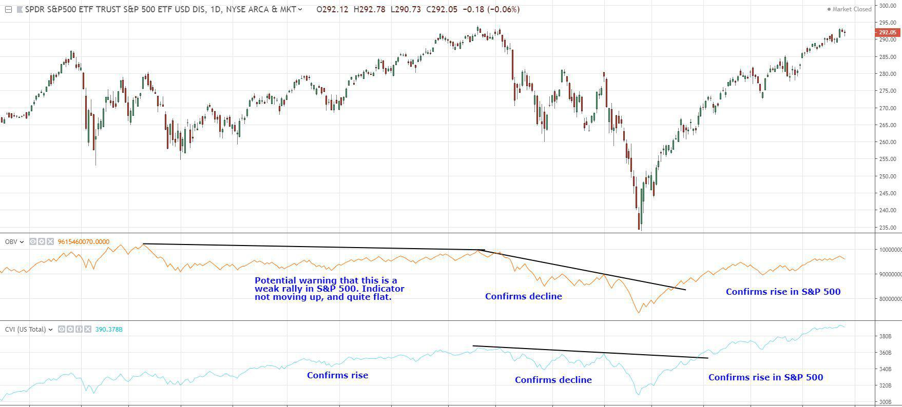

In the ever-evolving landscape of financial markets, gaining insights through diverse analytical approaches is crucial for traders and investors. Among these analytical tools, breadth indicators stand out for providing a comprehensive view of the market's health and direction. Unlike traditional indicators that focus on individual stocks or specific sectors, breadth indicators evaluate the overall participation in market movements, making them invaluable for assessing market sentiment and potential reversals.

This article explores the concept of breadth indicators in financial analysis, their significance, and their application in market breadth and algorithmic trading. By examining a range of stocks or their trading volumes, these indicators offer a broader perspective on market dynamics, empowering traders to anticipate changes and tailor their strategies accordingly. Whether you are navigating the complexities of algorithmic trading or seeking a deeper understanding of market participation, breadth indicators enrich your analytical toolkit.



We aim to demystify the use of these indicators, helping you make informed trading decisions. With a grasp of how they function and an understanding of their applications, traders can better interpret market signals and align their investments with emerging trends. By uncovering the potential within market breadth, it becomes possible to identify opportunities and risks with greater precision.

Join us as we explore the world of market breadth, focusing on the implications and benefits for modern-day traders. From enhancing market analyses to informing algorithmic strategies, breadth indicators play a crucial role in navigating the financial landscape with confidence and agility.

## Table of Contents

## Understanding Breadth Indicators

Breadth indicators are essential mathematical tools in financial analysis, designed to evaluate the level of participation among advancing and declining stocks or their corresponding volumes. By examining these parameters, breadth indicators provide invaluable insights into the current health and future direction of stock indices.

These indicators are particularly effective in confirming prevailing market trends or in signaling potential reversals. Traditional trade signals often focus on specific stocks or commodities, but breadth indicators take a broader perspective. By capturing the overall market conditions, they offer a snapshot of investor sentiment, which can complement the more focused insights offered by traditional signals.

A notable characteristic of breadth indicators is their ability to highlight the degree of participation in market movements. For instance, if a breadth indicator is rising, it suggests that there is strong participation in price movements, indicating robustness in the current trend. Conversely, if these indicators diverge from the trend indicated by the stock index, it may suggest a potential reversal. This divergence happens when the index continues to move in an upward direction, but the breadth indicator shows fewer stocks advancing, which can be a warning of an impending downturn.

Thus, by measuring broad market participation, breadth indicators provide a clearer and more comprehensive view of overall market strength. For traders and investors, understanding these signals is crucial. It enables them to make informed decisions that consider not just isolated metrics, but also the broader market dynamics that can affect asset performance.

## Types of Market Breadth Indicators

Breadth indicators are essential tools in financial analysis, providing a nuanced understanding of market dynamics through quantitative assessments. Several types of market breadth indicators, each with unique calculations and applications, stand out for their ability to gauge market sentiment and trends.

The Advance/Decline Line (A/D Line) is a popular cumulative indicator that tracks the net number of advancing stocks minus declining stocks within a given market index. It provides insights into market direction by highlighting whether a majority of stocks are participating in upward or downward movements. A consistently rising A/D Line indicates broad-based strength, suggesting a bullish trend, while a declining line may signal a bearish trend. The A/D Line is calculated as:

$$
\text{A/D Line}_t = \text{A/D Line}_{t-1} + (\text{Advancing Stocks}_t - \text{Declining Stocks}_t)
$$

On Balance Volume (OBV) is another powerful tool that emphasizes buying and selling pressure by adding the day's [volume](/wiki/volume-trading-strategy) to a cumulative total when the market closes up and subtracting it when the market closes down. OBV provides insight into volume flow, which can precede price changes. The OBV is calculated as follows:

$$
\text{OBV} = \begin{cases} 
\text{OBV}_{\text{prev}} + \text{Volume}, & \text{if Close}_t > \text{Close}_{t-1} \\
\text{OBV}_{\text{prev}} - \text{Volume}, & \text{if Close}_t < \text{Close}_{t-1} \\
\text{OBV}_{\text{prev}}, & \text{if Close}_t = \text{Close}_{t-1}
\end{cases}
$$

The McClellan Summation Index (MSI) is a long-term market breadth indicator derived from the cumulative sum of the McClellan Oscillator values. It provides a smoothed representation of market breadth, offering a longer-term view of market [momentum](/wiki/momentum) and trend direction. The McClellan Oscillator is calculated by using exponential moving averages of advancing and declining issues, and the MSI is the cumulative total of these oscillator readings.

The Arms Index, also known as the Trading Index (TRIN), offers a contrasting perspective by focusing on the relationship between advancing and declining issues and their respective volumes. A TRIN value of less than 1.0 indicates strong buying pressure (bullish), whereas values greater than 1.0 suggest selling pressure (bearish). It is calculated as:

$$
\text{TRIN} = \frac{\left(\frac{\text{Advancing Stocks}}{\text{Declining Stocks}}\right)}{\left(\frac{\text{Advancing Volume}}{\text{Declining Volume}}\right)}
$$

Each of these indicators presents specific advantages and situations where they excel, making them versatile tools in a trader's toolkit. The Advance/Decline Line provides a straightforward view of market participants, while On Balance Volume offers insights into volume trends. The McClellan Summation Index is valuable for assessing medium to long-term trends, and the Arms Index helps gauge immediate buying or selling pressure. Their applications extend across various trading strategies, each enhancing the trader's ability to interpret market conditions accurately.

## Implementing Breadth Indicators in Market Analysis

Utilizing breadth indicators effectively can significantly enhance decision-making by providing valuable insights into market sentiment, productivity, and overall investor psychology. These indicators excel at identifying potential opportunities and risks within the market. For example, a positive breadth signal—where a significant number of stocks in an index are advancing compared to those declining—can suggest strong market sentiment and the likelihood of a rising trend. Conversely, a negative breadth signal may indicate underlying weaknesses, even if the index appears stable.

Integrating breadth indicators with other technical analysis tools creates a comprehensive market analysis framework. Technical indicators like moving averages, Relative Strength Index (RSI), or Bollinger Bands can be paired with breadth indicators to provide a more robust signal confirmation. For example, using a breadth indicator such as the Advance/Decline Line in conjunction with a moving average crossover strategy can help filter out false signals and strengthen the predictive capability of the analysis.

The versatility of breadth indicators allows traders to apply them across various asset classes, including individual stocks or broader indexes like the S&P 500. This adaptability is beneficial because it permits the assessment of both micro trends within individual equities and macro trends across entire markets. By analyzing the breadth of an index, traders can discern whether the movement of the index is supported by a majority of its constituent stocks or driven by a few large-cap stocks, impacting investment decisions accordingly.

Recognizing the appropriate context and situational application of breadth indicators is crucial for maximizing their benefits. For instance, in bullish markets, breadth indicators can confirm the strength of the upward trend, while in bearish markets, they might highlight the potential for a reversal or continued decline. Traders must also acknowledge market conditions, such as low volume trading days, that might distort breadth readings and adjust their strategies accordingly.

In practical applications, traders can programmatically incorporate breadth indicators into their trading platforms using Python. By utilizing libraries like Pandas and NumPy for data manipulation and Matplotlib for visualization, a trader can automate the process of analyzing breadth indicators alongside other metrics. Here is a simple Python snippet to calculate the Advance/Decline Line:

```python
import pandas as pd

# Sample data
data = {'advancing_stocks': [30, 40, 35, 50, 45],
        'declining_stocks': [20, 10, 25, 15, 20]}

df = pd.DataFrame(data)

# Calculate net advances
df['net_advances'] = df['advancing_stocks'] - df['declining_stocks']

# Compute the Advance/Decline Line
df['advance_decline_line'] = df['net_advances'].cumsum()

print(df)
```

This code calculates the Advance/Decline Line, a prevalent market breadth indicator, by taking the cumulative sum of net advances (advancing stocks minus declining stocks). Such analytical tools empower traders to form a clearer understanding of market dynamics, enhance their risk management strategies, and make informed trading decisions.

## Market Breadth Indicators in Algorithmic Trading

Algorithmic trading utilizes market breadth indicators to enhance data-driven decision-making and automate the execution of trades. These indicators are instrumental in identifying trends, breakouts, and reversals with minimal human intervention. By integrating breadth indicators into trading algorithms, market participants can gain a nuanced understanding of market conditions, thereby optimizing risk management strategies and accurately timing entry and [exit](/wiki/exit-strategy) points.

In practice, market breadth indicators can be incorporated into algorithms to continuously monitor the health of a stock index. This continuous analysis allows the algorithm to detect shifts in investor sentiment and market conditions swiftly. For example, a divergence between a stock index and a breadth indicator, like the Advance/Decline Line, can be programmed to trigger automated trade signals, allowing the algorithm to capitalize on potential reversals.

Combining breadth indicators with other technical and [fundamental analysis](/wiki/fundamental-analysis) tools can significantly boost the efficacy of [algorithmic trading](/wiki/algorithmic-trading) strategies. Technical indicators like moving averages or Relative Strength Index (RSI) can complement the insights obtained from breadth indicators, offering a more robust view of the market landscape. The amalgamation of these tools can be structured within an algorithm as follows:

```python
import numpy as np

def trading_signal(index_values, breadth_values, ma_period=50):
    # Calculate moving average
    moving_avg = np.convolve(index_values, np.ones(ma_period)/ma_period, mode='valid')

    # Check for divergence between index and breadth
    divergence_indicator = breadth_values[len(breadth_values)-len(moving_avg):] - moving_avg

    # Generate trade signals
    buy_signals = (divergence_indicator > 0) & (np.diff(index_values) > 0)
    sell_signals = (divergence_indicator < 0) & (np.diff(index_values) < 0)

    return buy_signals, sell_signals
```

This synergy creates a competitive advantage in the fast-paced environment of financial markets, allowing for timely responses to market dynamics. By enabling algorithms to react instantaneously to market fluctuations, traders can enhance their trading performance and improve overall portfolio management. However, while market breadth indicators offer powerful insights, their integration should be carefully adjusted and continuously refined to adapt to evolving market conditions and ensure sustainable effectiveness.

## Limitations of Breadth Indicators

Breadth indicators, while powerful tools in assessing market dynamics, are not without their limitations and should be integrated with caution in financial analysis. One major challenge is their potential for misinterpretations. Anomalies or unusual market conditions can lead to divergences between what the breadth indicators suggest and the actual market behavior. For instance, during extreme market euphoria or panic, traditional volume norms might not be observed, resulting in false signals that could mislead traders.

Another significant limitation occurs when there is a decline in market participation, which can notably affect the predictive accuracy of these indicators. For example, if fewer stocks contribute to an index's movement, a breadth indicator might present an overly optimistic or pessimistic view of market health, hence offering insights that do not align with the reality of underlying market conditions.

To mitigate these issues, it is essential for traders to consider a broader market context. This involves corroborating the signals from breadth indicators with other technical and fundamental analysis tools, ensuring a more balanced and reliable market interpretation. Traders should remain vigilant about the context in which these indicators are applied and be willing to discard signals that contradict broader market trends.

Moreover, continuous refinement and adaptation of trading strategies are crucial to maintaining the effectiveness of breadth indicators. The dynamic nature of financial markets demands that traders consistently update their analytical frameworks to accommodate new data, market conditions, and technological advancements. This adaptability helps in ensuring that breadth indicators remain a relevant and potent tool amidst shifting market environments, enhancing the overall decision-making process.

## Conclusion

Breadth indicators represent an invaluable component in financial analysis and market breadth evaluation. By offering insights into market participation and sentiment, they contribute to more informed trading decisions. These indicators measure the number and volume of advancing and declining stocks, providing a snapshot of market momentum. For traders seeking to optimize performance, breadth indicators help identify potential entry and exit points by gauging overall market strength.

Incorporating breadth indicators in algorithmic trading enhances predictive capabilities, optimizing trading performance. Algorithms can utilize these indicators to recognize patterns and trends without human bias, allowing for more timely and effective trade execution. This integration not only improves risk management but also supports adaptive trading strategies that can respond swiftly to market changes.

Recognizing their limitations is crucial for accurate interpretation and application in diverse market scenarios. While breadth indicators are highly informative, they are not foolproof. External factors, unusual market conditions, or misinterpretations can lead to discrepancies in analysis. Traders must supplement these indicators with other analytical tools and remain vigilant to changing market dynamics to maintain effectiveness.

Embracing these indicators within a balanced analytical framework empowers traders to navigate financial markets with confidence and precision. By leveraging a combination of technical analysis tools, including breadth indicators, investors can better understand market trends and investor behavior. This holistic approach facilitates a more comprehensive market evaluation, ultimately aiding in achieving consistent trading success.

## References & Further Reading

[1]: ["Technical Analysis of Stock Trends"](https://www.investopedia.com/terms/t/technical-analysis-of-stocks-and-trends.asp) by Robert D. Edwards and John Magee

[2]: Pring, M. J. (2002). ["Technical Analysis Explained."](https://www.amazon.com/Technical-Analysis-Explained-Fifth-Successful/dp/0071825177) McGraw-Hill.

[3]: Murphy, J. J. (1999). ["Technical Analysis of the Financial Markets."](https://archive.org/details/technicalanalysi0000murp) New York Institute of Finance.

[4]: Fabozzi, F. J., Focardi, S., & Kolm, P. N. (2010). ["Quantitative Equity Investing: Techniques and Strategies."](https://www.semanticscholar.org/paper/Quantitative-Equity-Investing%3A-Techniques-and-Fabozzi-Focardi/1c49a2a53919f7e65cb96f16691b8ff726fd3cd7) Wiley.

[5]: ["Market Breadth Indicators"](https://www.investopedia.com/terms/m/market_breadth.asp) by Gregory L. Morris