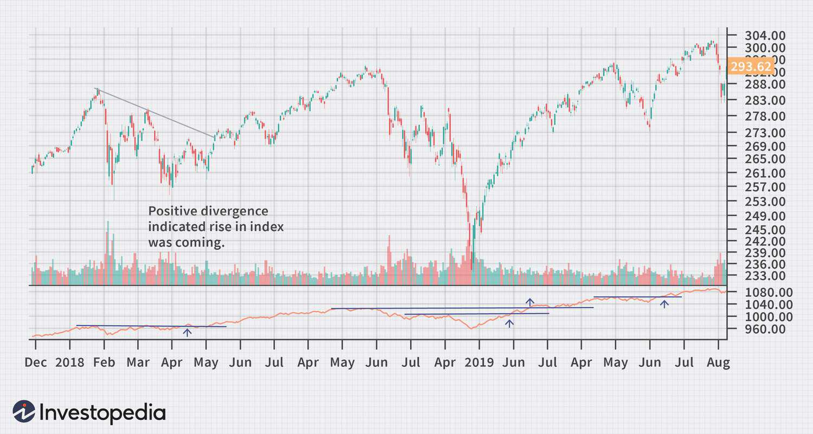

In today's fast-paced financial environment, market theory and investment analysis have become essential tools for investors seeking to navigate complex markets. Market theory provides a structured understanding of financial market dynamics, aiding investors in making informed decisions. Investment analysis, on the other hand, focuses on evaluating the potential profitability, risk, and growth opportunities of various financial instruments. Together, these frameworks form the bedrock of strategic investment decision-making.

The breadth of the market concept is particularly significant as it helps in assessing overall market dynamics and gauging investor sentiment. By examining the number of securities advancing versus those declining, market breadth measures the strength or weakness of market trends. Indicators such as the Advance-Decline Line and the McClellan Oscillator offer valuable insights into market health, enabling investors to make more accurate predictions about future market movements.



Algorithmic trading, often referred to as algo trading, has transformed the investment landscape by introducing automated processes into trading strategies. By utilizing algorithms to execute trades based on predetermined criteria and real-time market conditions, investors can process large volumes of data and make rapid trading decisions. This shift not only reduces transaction costs and improves accuracy but also allows investors to capitalize on market inefficiencies that may otherwise go unnoticed.

This article explores how market theory, investment analysis, market breadth, and algorithmic trading intertwine to enhance investment strategies and decision-making processes. By understanding and effectively integrating these elements, investors can improve their approach to trading and portfolio management. The focus is on practical insights for utilizing market breadth analysis in conjunction with algorithmic strategies to refine trading signals and optimize performance.

## Table of Contents

## Understanding Market Theory

Market theory is a foundational element in financial market analysis, providing essential principles that guide investment decisions. The key theories include the Efficient Market Hypothesis (EMH), Modern Portfolio Theory (MPT), and Behavioral Finance, each offering a distinct perspective on market behavior and asset valuation.

The Efficient Market Hypothesis (EMH) posits that financial markets are "informationally efficient," meaning that asset prices fully reflect all available information at any given time. According to EMH, it is impossible to consistently achieve returns that exceed average market returns on a risk-adjusted basis, merely by using information that the market already knows. This hypothesis is usually tested using three forms: weak, semi-strong, and strong, each differing in the level of information assumed to be reflected in prices.

Modern Portfolio Theory (MPT), developed by Harry Markowitz, focuses on optimizing portfolios to maximize return for a given level of risk through diversification. The core principle of MPT is that by combining assets in a portfolio that are not perfectly correlated, investors can achieve higher returns and lower risk than investing in individual assets. The mathematical foundation of MPT is the efficient frontier, which represents a set of optimal portfolios that offer the highest expected return for a defined level of risk. The optimization process generally involves solving the following equation to minimize portfolio variance:

$$
\min_{\mathbf{w}} \left( \mathbf{w}^T \mathbf{\Sigma} \mathbf{w} \right)
$$
$$
\text{subject to } \sum_{i=1}^N w_i = 1
$$

where $\mathbf{w}$ is the weight vector of assets in the portfolio and $\mathbf{\Sigma}$ is the covariance matrix of asset returns.

Behavioral Finance challenges the assumptions of EMH by considering psychological factors in investor behavior and decision-making. It suggests that cognitive biases, such as overconfidence and herd behavior, can lead to irrational financial decisions and result in market anomalies. These insights have added depth to understanding asset valuation and market dynamics, improving traditional investment models.

Market theory is crucial in developing investment strategies, including those used in [algorithmic trading](/wiki/algorithmic-trading), where understanding these theories can inform the selection and refinement of trading algorithms. For instance, if markets are not perfectly efficient, algorithms can be designed to exploit detected inefficiencies, leading to potential profits.

For investors, a sound understanding of market theory enables anticipation of market movements and identification of profitable opportunities. By applying these theories, investors can enhance their market analysis and ultimately make more informed decisions in both traditional and algorithmic trading environments.

## Investment Analysis Fundamentals

Investment analysis is a fundamental aspect of evaluating financial instruments, focusing on profitability, risk, and growth potential to make informed investment decisions. This process employs both quantitative and qualitative approaches to assess assets, which are instrumental for both traditional and algorithmic trading.

### Quantitative and Qualitative Approaches

Quantitative analysis involves applying mathematical and statistical methods to evaluate financial data. This might include techniques such as regression analysis, which is used to model relationships between different variables and predict future outcomes. For instance, an investor might use regression to analyze historical stock prices to forecast future movements. Quantitative analysis often relies on financial metrics like earnings per share (EPS), price-to-earnings (P/E) ratio, and return on equity (ROE) to assess the value and performance of an investment.

Qualitative analysis, on the other hand, focuses on non-numeric factors and provides a broader view of an investment's potential. It includes evaluating a company's management quality, brand strength, competitive position, and industry conditions. For example, understanding a company’s management strategy or corporate governance can provide insights into future performance that are not evident in financial statements.

### Common Methods of Analysis

1. **Fundamental Analysis**: This method assesses a security's intrinsic value by examining related economic, financial, and other qualitative and quantitative factors. Investors analyze a company's financial statements, overall economy, and industry conditions to determine whether a stock is over or undervalued. Commonly used metrics include net income, revenue growth, debt levels, and cash flow.

2. **Technical Analysis**: Unlike fundamental analysis, technical analysis studies past market data, principally price and volume, to forecast future price movements. It is based on the idea that historical trading activity and price changes reflect all relevant information and can indicate future market behavior. Tools such as moving averages, candlestick patterns, and the Relative Strength Index (RSI) are frequently used.

3. **Quantitative Analysis**: This method involves creating mathematical models to predict price changes and optimize portfolios. An example is using machine learning algorithms to analyze large datasets, identifying patterns and anomalies for strategic decision-making. Python, with libraries like Pandas and NumPy, is widely used in quantitative finance for data analysis and financial modeling.

```python
import pandas as pd
import numpy as np

# Example: Calculating Simple Moving Average (SMA) using Python
data = pd.Series([105, 98, 100, 102, 107, 110])
sma = data.rolling(window=3).mean()
print(sma)
```

### Importance in Decision-Making

Investment analysis is crucial for developing sound investment strategies and optimizing portfolios. By leveraging accurate data and financial metrics, investors can identify undervalued stocks and predict market trends, enhancing their decision-making processes. In algorithmic trading, investment analysis provides the foundation for developing trading algorithms that execute trades based on rigorous data analysis.

The integration of investment analysis allows investors to mitigate risks and improve return potential, adapting to changing market conditions. Whether through detailed balance sheet scrutiny or advanced algorithmic models, investment analysis remains vital for achieving long-term investment success. By continuously refining these techniques, investors can better navigate the complexities of financial markets.

## The Breadth of the Market: An Overview

Market breadth is a critical concept in financial analysis, providing a measure of the overall health and strength of a market by examining the number of securities that advance relative to those that decline. This analysis is key for understanding investor sentiment and can help predict market trends.

Among the primary indicators used in market breadth analysis are the Advance-Decline Line and the McClellan Oscillator. The Advance-Decline Line is a cumulative indicator that reflects the difference between the number of advancing and declining stocks over a specific period. It is computed as follows:

$$
\text{A-D Line} = \sum_{i=1}^{n} (A_i - D_i)
$$

where $A_i$ is the number of advancing stocks and $D_i$ is the number of declining stocks at time $i$.

The McClellan Oscillator, on the other hand, is a [momentum](/wiki/momentum) oscillator derived from the difference between a short-term and a long-term exponential moving average (EMA) of net advances (advancing stocks minus declining stocks). It helps in assessing the market's direction and strength. The McClellan Oscillator is calculated using the formula:

$$
\text{McClellan Oscillator} = EMA_{19}(A-D) - EMA_{39}(A-D)
$$

where $A-D$ is the net advances.

A strong market breadth, evidenced by a rising Advance-Decline Line and a positive McClellan Oscillator, indicates robust investor participation and potential bullish trends, signaling market strength. Conversely, weak breadth, characterized by a declining Advance-Decline Line or negative McClellan Oscillator, often suggests underlying market weaknesses and possible bearish trends.

Integrating market breadth analysis into investment strategies can serve as an early warning system, allowing investors to adjust their positions preemptively. By monitoring these indicators, investors can make informed decisions to navigate potential market downturns and capitalize on upward trends.

Understanding market breadth dynamics is crucial for effective risk management. It allows investors to assess the consistency of price movements, ensuring strategic planning that aligns with market conditions. By paying attention to these analyses, investors are better equipped to manage their portfolios, mitigating risks while optimizing returns.

Incorporating market breadth analysis not only enhances strategic planning but also provides investors with a broader perspective on market activity, enabling more adaptive and responsive investment strategies.

## Algorithmic Trading: Transforming Investment Strategies

Algorithmic trading utilizes sophisticated automated systems that execute orders based on predefined criteria and real-time market conditions. These systems are designed to process vast quantities of data and execute trades at speeds unattainable by human traders, thereby offering a significant competitive advantage. At its core, algorithmic trading is about leveraging computational power to make informed and timely trading decisions.

**Efficiency and Speed**

The primary advantage of algorithmic trading lies in its ability to analyze massive datasets and execute trades at [high frequency](/wiki/high-frequency-trading). This capability significantly reduces the time taken from data analysis to trade execution, ensuring more accurate and timely decisions. By automating routine trading decisions, algorithmic systems minimize the potential for human error and facilitate the execution of complex strategies with precision.

**Cost Reduction and Accuracy**

Another benefit of algorithmic trading is the reduction in transaction costs. By executing trades at optimal prices and minimizing the market impact, algorithms can significantly reduce trading costs compared to manual trading processes. Furthermore, automation ensures higher accuracy in trade execution, eliminating issues such as miscalculations or delayed entries that can occur with manual trading.

**Exploiting Market Inefficiencies**

Algorithmic trading exploits market inefficiencies by identifying price discrepancies or [arbitrage](/wiki/arbitrage) opportunities that can be profitably leveraged. Strategies like [statistical arbitrage](/wiki/statistical-arbitrage) involve using complex mathematical models to predict price movements and capitalize on temporary mispricings in the market. Market-making strategies, on the other hand, involve providing [liquidity](/wiki/liquidity-risk-premium) by simultaneously buying and selling a security to capture the spread between bid and ask prices.

**Diverse Strategies**

One of the distinct characteristics of algorithmic trading is its adaptability to various strategies. Trend-following algorithms, for example, focus on identifying and following market trends to capture momentum. Conversely, mean-reversion strategies assume that asset prices will revert to their historical mean over time, thus profiting from trades based on deviations from this mean. This versatility enables traders to deploy a wide range of trading strategies optimized for different market conditions.

**AI and Machine Learning**

The integration of Artificial Intelligence (AI) and [machine learning](/wiki/machine-learning) techniques is transforming algorithmic trading systems into more predictive and adaptive tools. By employing machine learning algorithms, trading systems can identify hidden patterns in complex financial data that might be missed by traditional analysis methods. Machine learning models can continuously learn and adapt to new data, enhancing their predictive accuracy and reducing risks associated with model overfitting or regime changes in the market.

In summary, algorithmic trading represents a paradigm shift in investment strategies, allowing traders to capitalize on computational power and advanced algorithms to optimize their trading performance. By incorporating AI and machine learning, these systems continue to evolve, offering increasingly sophisticated tools for navigating the complexities of financial markets.

## Linking Market Theory, Analysis, Breadth, and Algo Trading

Combining market theory, investment analysis, market breadth, and algorithmic trading offers investors a comprehensive strategy for navigating modern financial ecosystems. Market breadth indicators, such as the Advance-Decline Line and McClellan Oscillator, are integral to this holistic approach. By incorporating these metrics into algorithmic frameworks, trading systems can refine their signals and enhance strategy performance. For instance, an algorithm that accounts for a strong market breadth signal can adjust its parameters to increase trade frequency during times of broad market participation, while reducing exposure when signals indicate market weakness.

Thematic insights derived from market theories such as Efficient Market Hypothesis and Behavioral Finance aid in the development of robust trading algorithms. By understanding the market's inherent efficiency levels, algorithms can be tailored to exploit potential inefficiencies. For example, a statistical arbitrage algorithm may integrate behavioral finance insights to anticipate irrational market movements, thereby improving its predictive accuracy.

Aligning theoretical understanding with algorithmic precision allows traders to better navigate complex markets. Algorithms can process vast datasets and execute trades at speeds unattainable by manual trading, but they require sophisticated models. By leveraging investment analysis techniques, traders can enhance algorithm design, ensuring it captures comprehensive insights into asset valuations and market dynamics. For example, integrating [fundamental analysis](/wiki/fundamental-analysis) into an algorithm can provide a valuation baseline, while technical analysis can identify optimal entry and [exit](/wiki/exit-strategy) points.

Case studies highlight successful implementations of these integrations. A noteworthy example is Renaissance Technologies, whose Medallion Fund employs advanced quantitative models that combine market theories with algorithmic trading strategies to consistently outperform benchmark indices. Through continuous adaptation and enhancement of these models, the fund effectively aligns theoretical insights with practical trading applications.

These integrations underscore the necessity for continuous evaluation and refinement of algorithmic strategies. As markets evolve due to technological advances and changing economic landscapes, maintaining a competitive edge requires the ongoing incorporation of cutting-edge techniques and insights into algorithmic structures. By doing so, investors can optimize performance and align their strategies with both current market and anticipated future conditions.

## Challenges and Considerations

Algorithmic trading, despite its transformative influence on financial markets, presents several challenges that must be carefully managed. System failures and market anomalies are common hurdles. These failures can occur due to hardware malfunctions, software bugs, or network issues, potentially resulting in significant financial losses. Market anomalies, such as flash crashes, can also arise, undermining the reliability of automated trading systems.

Regulatory concerns and ethical considerations are critical aspects to address in algorithmic trading practices. With the rapid execution of trades, there is a risk of manipulative trading behaviors, such as spoofing, where false orders are placed to influence market prices. Regulatory bodies, including the U.S. Securities and Exchange Commission (SEC) and the European Securities and Markets Authority (ESMA), have established guidelines to mitigate such risks, but continuous compliance remains a challenge for traders.

Ensuring data integrity and system security is paramount to prevent exploitation and errors in algorithmic trading. High-frequency traders rely on accurate and timely data, making them vulnerable to data breaches and cyber-attacks. Implementing robust cybersecurity measures and regular audits of trading systems can help safeguard data and maintain the integrity of trading operations.

Investors must maintain awareness of market conditions and adapt strategies to retain a competitive advantage. Markets are inherently dynamic, influenced by various factors such as economic indicators, geopolitical events, and investor sentiment. Thus, algorithmic strategies must be versatile and adaptive. This requires constant monitoring and potential recalibration of algorithms to suit changing market conditions.

Continuous evaluation and adjustment of algorithms are vital in rapidly evolving markets. Algorithmic models can become obsolete as they may be based on outdated assumptions or data. Regular [backtesting](/wiki/backtesting) and stress testing of algorithms, alongside the integration of new data and machine learning techniques, can help refine and enhance trading strategies. This iterative process ensures that algorithms remain effective and responsive to emerging market trends and anomalies.

## Conclusion

Understanding and integrating market theory, investment analysis, market breadth, and algorithmic trading is pivotal for modern investors. These components create a comprehensive framework that allows investors to navigate and make informed decisions in the complex landscape of financial markets. By synthesizing these elements, investors can not only anticipate market trends but also identify and capitalize on potential investment opportunities.

The integration of market theory provides a foundation for understanding market dynamics and behavioral patterns. Investment analysis, on the other hand, equips investors with the tools to evaluate the profitability, risk, and growth potential of financial instruments, enabling more effective portfolio management. By incorporating market breadth indicators, investors gain insights into the strength and direction of market trends, enhancing their ability to anticipate market shifts.

Algorithmic trading adds an additional layer of sophistication, allowing for the automation of trading strategies based on precise mathematical models and large-scale data processing. The use of algorithms, enhanced by machine learning, enables investors to optimize trade execution, minimize transaction costs, and exploit market inefficiencies. A simple Python snippet for a basic trend-following algorithm might look like this:

```python
import numpy as np

def moving_average(prices, window_size):
    """Calculate the moving average for a given window size."""
    return np.convolve(prices, np.ones(window_size)/window_size, mode='valid')

def generate_signals(prices, short_window, long_window):
    """Generate buy/sell signals based on moving averages."""
    short_ma = moving_average(prices, short_window)
    long_ma = moving_average(prices, long_window)
    signals = np.where(short_ma > long_ma, 1, 0)  # 1: Buy, 0: Sell
    return signals

# Example usage
prices = [50, 52, 54, 53, 58, 60, 59, 61]  # Example price data
signals = generate_signals(prices, 3, 5)
print(signals)  # Output the buy/sell signals
```

As financial markets continue to evolve, continuous learning and innovation remain essential for investors seeking to maintain a competitive edge. Keeping abreast of the latest developments and technological advancements in the investment field is crucial. By doing so, investors can refine their strategies, adapt to changes, and ultimately optimize their investment performance.

Investors are encouraged to remain informed and leverage cutting-edge techniques to harness the full potential of their investment strategies. By staying agile and adaptable, investors can better navigate the ever-changing financial environment and achieve successful outcomes.

## References & Further Reading

[1]: Bergstra, J., Bardenet, R., Bengio, Y., & Kégl, B. (2011). ["Algorithms for Hyper-Parameter Optimization."](https://dl.acm.org/doi/10.5555/2986459.2986743) Advances in Neural Information Processing Systems 24.

[2]: ["Advances in Financial Machine Learning"](https://www.amazon.com/Advances-Financial-Machine-Learning-Marcos/dp/1119482089) by Marcos Lopez de Prado

[3]: ["Evidence-Based Technical Analysis: Applying the Scientific Method and Statistical Inference to Trading Signals"](https://www.amazon.com/Evidence-Based-Technical-Analysis-Scientific-Statistical/dp/0470008741) by David Aronson

[4]: ["Machine Learning for Algorithmic Trading"](https://github.com/stefan-jansen/machine-learning-for-trading) by Stefan Jansen

[5]: ["Quantitative Trading: How to Build Your Own Algorithmic Trading Business"](https://books.google.com/books/about/Quantitative_Trading.html?id=j70yEAAAQBAJ) by Ernest P. Chan