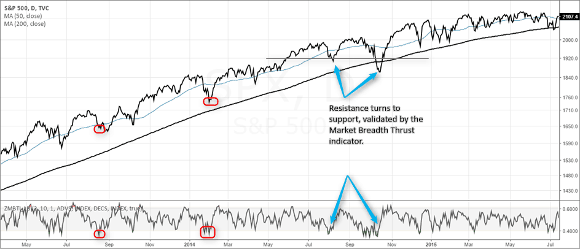

## Table of Contents

## What is the Breadth Thrust Indicator?

The Breadth Thrust Indicator is a tool used in the stock market to measure how strong the market's movement is. It looks at the number of stocks that are going up compared to the total number of stocks traded. When a lot of stocks start moving up quickly, it might mean the market is about to have a big change. This indicator helps investors see if the market is getting stronger or if it might be time to be careful.

The indicator works by calculating a ratio of advancing stocks to the total stocks traded over a certain period, usually 10 days. If this ratio jumps from a low level to a high level very quickly, it signals a "breadth thrust." This can be a sign that the market is gaining strength and might keep going up. Investors watch this indicator to help them decide when to buy or sell stocks, but it's just one tool among many they use to make their decisions.

## How is the Breadth Thrust Indicator calculated?

The Breadth Thrust Indicator is calculated by looking at how many stocks are going up compared to all the stocks that are traded. You start by finding the number of stocks that went up in price on a certain day. Then, you divide that number by the total number of stocks that were traded that day. This gives you a ratio, which you do every day for 10 days in a row. After you have these 10 daily ratios, you take the average of them to get the Breadth Thrust Indicator value.

When this average ratio moves from a low level to a high level very quickly, it's called a "breadth thrust." For example, if the average ratio was low but then suddenly jumps to over 60% in a short time, it signals that the market might be getting stronger. This quick change is what investors watch for because it can mean the market is about to have a big move upward.

## What does a Breadth Thrust signal indicate in the stock market?

A Breadth Thrust signal in the stock market means that a lot of stocks are starting to go up all at once. It happens when the average number of stocks going up over 10 days jumps from a low level to a high level very quickly. This quick change shows that the market might be getting a lot stronger. When investors see this signal, they think it could be a good time to buy stocks because the market might keep going up.

This signal is important because it shows that the market's upward movement is not just from a few big stocks, but from many stocks across the market. When lots of different stocks are going up, it can mean that the market's strength is more solid and likely to last. However, even though a Breadth Thrust signal can be a good sign, investors should still look at other things too before they decide what to do with their money.

## Who developed the Breadth Thrust Indicator and when?

The Breadth Thrust Indicator was developed by Martin Zweig, a famous investor and financial analyst. He came up with this tool to help people understand how strong the stock market's movements are. Martin Zweig wanted to find a way to see if the market was getting stronger or weaker by looking at how many stocks were going up compared to all the stocks being traded.

He introduced the Breadth Thrust Indicator in the late 1960s. Since then, many investors have used it to help them decide when to buy or sell stocks. The indicator looks at the average number of stocks going up over 10 days and signals a "breadth thrust" when this average jumps from a low level to a high level very quickly. This signal can mean the market is about to have a big move upward.

## Can you explain the significance of the thresholds used in the Breadth Thrust Indicator?

The Breadth Thrust Indicator uses certain numbers, called thresholds, to show when the market might be getting stronger. A big jump in the average number of stocks going up over 10 days is what investors watch for. If this average goes from below 40% to above 60% in a short time, it's called a "breadth thrust." This quick change is important because it means a lot of stocks are starting to go up all at once, which can be a sign that the market is about to have a big move upward.

These thresholds are important because they help investors see when the market's strength is not just from a few big stocks, but from many stocks across the market. When the average goes from below 40% to above 60%, it shows that the market's upward movement is more solid and likely to last. This can be a good time for investors to think about buying stocks because the market might keep going up. However, even though these thresholds can be a good sign, investors should still look at other things too before they decide what to do with their money.

## How does the Breadth Thrust Indicator differ from other market indicators?

The Breadth Thrust Indicator is different from other market indicators because it looks at how many stocks are going up compared to all the stocks traded over a certain time. Most other indicators might focus on just the price of stocks or the total value of the market. The Breadth Thrust Indicator shows the strength of the market by seeing if the upward movement is coming from many stocks, not just a few. This makes it a good tool to see if the market's strength is real and likely to last.

Another way the Breadth Thrust Indicator is different is that it uses specific numbers, or thresholds, to signal when the market might be getting stronger. When the average number of stocks going up over 10 days jumps from below 40% to above 60% quickly, it's called a "breadth thrust." This is a clear signal that many investors can watch for. Other indicators might not have such clear signals and can be harder to understand. The Breadth Thrust Indicator helps investors see big changes in the market more easily, but it's still just one tool among many they use to make decisions.

## What are the historical examples where the Breadth Thrust Indicator accurately predicted market movements?

One famous time the Breadth Thrust Indicator worked well was in 1975. The stock market had been going down for a while, and many people were worried. Then, in the middle of April, the Breadth Thrust Indicator showed a big jump from below 40% to above 60% in just a few days. This signal meant that the market was getting stronger. After this signal, the stock market started to go up and kept going up for a long time. This showed that the Breadth Thrust Indicator was right about the market getting stronger.

Another good example was in 2009, right after the big financial crisis. The market had been going down a lot, and many people were scared. In early March, the Breadth Thrust Indicator again showed a big jump from below 40% to above 60% in a short time. This signal told investors that the market might start to go up again. After this signal, the market did start to go up and kept going up for a long time. This showed again that the Breadth Thrust Indicator can be a good tool to see when the market is about to get stronger.

## How can the Breadth Thrust Indicator be used in conjunction with other technical analysis tools?

The Breadth Thrust Indicator can be used with other technical analysis tools to help investors make better decisions about the stock market. For example, an investor might look at the Breadth Thrust Indicator along with moving averages. Moving averages show the average price of a stock over time, and if the Breadth Thrust Indicator signals a strong market and the moving averages start to go up, it can be a good sign to buy stocks. Another tool that can be used with the Breadth Thrust Indicator is the Relative Strength Index (RSI). The RSI shows if stocks are being bought too much or sold too much. If the Breadth Thrust Indicator shows a strong market and the RSI is not too high, it might mean the market can keep going up for a while.

Another way to use the Breadth Thrust Indicator with other tools is to look at market [volume](/wiki/volume-trading-strategy). Volume is how many stocks are being traded, and if the Breadth Thrust Indicator signals a strong market and the volume is also going up, it can mean the market's strength is real. Investors might also use the Breadth Thrust Indicator with chart patterns, like head and shoulders or double tops and bottoms. These patterns show where the market might go next. If the Breadth Thrust Indicator shows a strong market and the chart patterns also suggest the market will go up, it can give investors more confidence in their decisions.

## What are the potential pitfalls or limitations of relying on the Breadth Thrust Indicator?

One problem with using the Breadth Thrust Indicator is that it can give false signals. Sometimes, the indicator might show that the market is getting stronger, but the market might not go up as expected. This can happen because the indicator looks at how many stocks are going up, but it doesn't tell you why they are going up. If the market goes up because of something that won't last, like a short-term event, the Breadth Thrust Indicator might still signal a strong market, but the market might not keep going up after that.

Another limitation is that the Breadth Thrust Indicator should not be used alone. It's just one tool among many that investors use to make decisions. Relying only on the Breadth Thrust Indicator can be risky because it might not give you the full picture of what's happening in the market. Investors need to look at other things, like the economy, news events, and other technical indicators, to make smart choices. Using the Breadth Thrust Indicator along with other tools can help investors make better decisions, but using it by itself can lead to mistakes.

## How frequently does a Breadth Thrust signal occur, and what does this frequency suggest about market conditions?

A Breadth Thrust signal does not happen very often. It might only happen a few times in many years. This means that when it does happen, it can be a big deal for the stock market. The signal shows that a lot of stocks are starting to go up all at once, which can mean the market is about to get stronger and might keep going up for a while.

Because the Breadth Thrust signal is rare, it tells investors that something important is happening in the market. When the signal happens, it means the market is changing a lot and might be getting ready for a big move upward. But, even though it's a strong sign, investors should still look at other things too before they decide what to do with their money.

## Can the Breadth Thrust Indicator be applied to markets other than the stock market, such as forex or commodities?

The Breadth Thrust Indicator is mainly used for the stock market, but some people try to use it in other markets like [forex](/wiki/forex-system) or commodities. In the forex market, where people trade different currencies, the indicator could look at how many currency pairs are going up compared to all the pairs being traded. For commodities, like gold or oil, the indicator could measure how many different commodities are going up compared to all the commodities traded. But, these markets are different from the stock market, so the Breadth Thrust Indicator might not work the same way.

Using the Breadth Thrust Indicator in forex or commodities can be tricky because these markets don't have as many different things to trade as the stock market does. In the stock market, there are thousands of stocks, but in forex, there are only a few major currency pairs, and in commodities, there are fewer types of commodities. This means the indicator might not give as clear a signal in these markets. Still, some traders might find it helpful to see if there's a big change happening in these markets, but they should be careful and use other tools too.

## What advanced strategies can traders employ using the Breadth Thrust Indicator to optimize their trading decisions?

Traders can use the Breadth Thrust Indicator along with other tools to make smarter trading decisions. For example, they might look at the Breadth Thrust Indicator and see a signal that the market is getting stronger. Then, they could check if the moving averages, which show the average price of stocks over time, are also going up. If both the Breadth Thrust Indicator and the moving averages suggest the market is strong, traders might decide it's a good time to buy stocks. They could also look at the Relative Strength Index (RSI) to see if stocks are being bought too much or sold too much. If the RSI is not too high when the Breadth Thrust Indicator signals a strong market, it might mean the market can keep going up for a while.

Another strategy is to use the Breadth Thrust Indicator to find the right time to enter or [exit](/wiki/exit-strategy) the market. When the indicator shows a big jump from below 40% to above 60% in a short time, traders might see this as a signal to buy stocks because the market could be about to have a big move upward. But, they should also watch for signs that the market might be getting too high. If the Breadth Thrust Indicator signals a strong market but other signs, like high volume or overbought conditions, show the market might be too high, traders might decide to sell some of their stocks to take profits. Using the Breadth Thrust Indicator along with other tools helps traders make better decisions about when to buy or sell.

## What is the Breadth Thrust Indicator and how does it work?

The Breadth Thrust Indicator, developed by the prominent market analyst Martin Zweig, is a technical indicator designed to measure the momentum of the stock market. Zweig's indicator focuses on identifying market transitions from oversold to overbought conditions, indicating potential bullish market phases. The Breadth Thrust Indicator is calculated using advancing and declining issues in a stock market over a specific period.

### Mechanics of Calculation

The calculation of the Breadth Thrust Indicator involves determining the percentage of advancing stocks relative to the total number of advancing and declining stocks in the market. The indicator is calculated over a ten-day period. The formula is as follows:

$$
\text{Breadth Thrust} = \left( \frac{\sum \text{Advancing Issues}}{\sum \text{Advancing Issues} + \sum \text{Declining Issues}} \right)
$$

To identify a Breadth Thrust event, the calculated ratio must move from below 0.40 to above 0.615 within a ten-day period. This rapid shift from oversold to overbought is considered a precursor to a bullish market.

### Historical Significance

The Breadth Thrust Indicator holds significant historical importance due to its ability to predict rare occurrences in market trends. Notably, it has been associated with precursors to some of the most significant bull markets. According to Zweig, these events are rare, typically occurring only a few times each decade. The rarity of these signals underlines their importance and the intensity of market shifts they often predict.

### Key Thresholds

The indicator's primary thresholds are essential for interpreting market conditions. A Breadth Thrust condition is confirmed when the market transitions from a deeply oversold level (below 0.40 ratio) to an overbought level (above 0.615) within ten trading days. Such a shift indicates a robust upward market [momentum](/wiki/momentum), suggesting a potentially strong bullish phase.

The Breadth Thrust Indicator continues to be a relevant tool for technical analysts and traders who seek to identify early signs of market momentum shifts and capitalize on emerging bull markets.

## References & Further Reading

[1]: Zweig, M. (1986). ["Winning on Wall Street."](https://www.amazon.com/Martin-Zweigs-Winning-Wall-Street/dp/0446512346) Warner Books.

[2]: Pring, M. J. (2002). ["Technical Analysis Explained"](https://www.amazon.com/Technical-Analysis-Explained-Fifth-Successful/dp/0071825177). McGraw-Hill Education.

[3]: Aronson, D. R. (2006). ["Evidence-Based Technical Analysis: Applying the Scientific Method and Statistical Inference to Trading Signals"](https://www.amazon.com/Evidence-Based-Technical-Analysis-Scientific-Statistical/dp/0470008741). Wiley.

[4]: Chan, E. P. (2008). ["Quantitative Trading: How to Build Your Own Algorithmic Trading Business"](https://github.com/egorpe/EPChan-QuantitativeTrading/blob/master/example7_6.m). Wiley.

[5]: Lopez de Prado, M. (2018). ["Advances in Financial Machine Learning"](https://www.amazon.com/Advances-Financial-Machine-Learning-Marcos/dp/1119482089). Wiley.

[6]: Murphy, J. J. (1999). ["Technical Analysis of the Financial Markets: A Comprehensive Guide to Trading Methods and Applications"](https://archive.org/details/technicalanalysi0000murp). New York Institute of Finance.