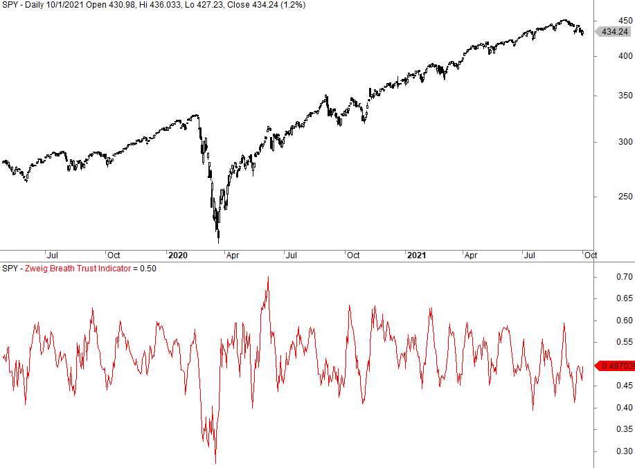

Technical indicators have become pivotal in modern trading strategies, functioning as tools that traders and analysts use to interpret market data and make informed decisions. These indicators utilize historical price, volume data, or a combination of both, to predict future price movements and identify potential buy and sell signals. Among a plethora of technical indicators, the Breadth Thrust Indicator holds a distinct position due to its unique approach in assessing market momentum and predicting potential bull markets.

The Breadth Thrust Indicator was developed by financial analyst Martin Zweig. It measures the market's breadth by evaluating the ratio of advancing stocks to the total number of stocks over a specific period, typically ten days. When this ratio rises sharply from below 40% to above 60% in less than ten days, it signals a breadth thrust, potentially indicating a transition from an oversold market to an overbought market—a sign that a new bull market may be on the horizon. The rarity and historical significance of these signals make the Breadth Thrust Indicator a valuable tool in market analysis.



The scope of this article encompasses a detailed examination of the Breadth Thrust Indicator, exploring its origins, mechanics, and implications in technical analysis. This introduction will lay the groundwork for understanding how this indicator functions and how it can be integrated into advanced trading strategies.

Modern trading is characterized by the proliferation of algorithmic trading (algo trading), where pre-programmed algorithms execute trades at speeds and frequencies that would be impossible for a human trader. These algorithms often incorporate technical indicators to enhance trading efficiency and accuracy. By integrating the Breadth Thrust Indicator into algo trading systems, traders can potentially improve performance by exploiting the indicator's ability to signal significant market moves.

As the financial markets continue to evolve, the integration of sophisticated market indicators into algorithmic trading systems highlights the necessity for comprehensive analysis. This article aims to provide insights into the use of the Breadth Thrust Indicator in modern trading strategies, illustrating its potential in maximizing trading efficacy and predicting major market shifts.

## Table of Contents

## Understanding the Breadth Thrust Indicator

The Breadth Thrust Indicator, developed by the prominent market analyst Martin Zweig, is a technical indicator designed to measure the momentum of the stock market. Zweig's indicator focuses on identifying market transitions from oversold to overbought conditions, indicating potential bullish market phases. The Breadth Thrust Indicator is calculated using advancing and declining issues in a stock market over a specific period.

### Mechanics of Calculation

The calculation of the Breadth Thrust Indicator involves determining the percentage of advancing stocks relative to the total number of advancing and declining stocks in the market. The indicator is calculated over a ten-day period. The formula is as follows:

$$
\text{Breadth Thrust} = \left( \frac{\sum \text{Advancing Issues}}{\sum \text{Advancing Issues} + \sum \text{Declining Issues}} \right)
$$

To identify a Breadth Thrust event, the calculated ratio must move from below 0.40 to above 0.615 within a ten-day period. This rapid shift from oversold to overbought is considered a precursor to a bullish market.

### Historical Significance

The Breadth Thrust Indicator holds significant historical importance due to its ability to predict rare occurrences in market trends. Notably, it has been associated with precursors to some of the most significant bull markets. According to Zweig, these events are rare, typically occurring only a few times each decade. The rarity of these signals underlines their importance and the intensity of market shifts they often predict.

### Key Thresholds

The indicator's primary thresholds are essential for interpreting market conditions. A Breadth Thrust condition is confirmed when the market transitions from a deeply oversold level (below 0.40 ratio) to an overbought level (above 0.615) within ten trading days. Such a shift indicates a robust upward market [momentum](/wiki/momentum), suggesting a potentially strong bullish phase.

The Breadth Thrust Indicator continues to be a relevant tool for technical analysts and traders who seek to identify early signs of market momentum shifts and capitalize on emerging bull markets.

## The Breadth Thrust Indicator in Technical Analysis

The Breadth Thrust Indicator is a significant tool in technical analysis, particularly for detecting shifts in market momentum and the potential onset of bull markets. Developed by Martin Zweig, it is designed to discern periods when the market transitions from oversold to overbought conditions within a short timeframe, often an indicator of a robust market trend.

The indicator is calculated by measuring the proportion of advancing stocks to the total number of issues in the market. Specifically, a Breadth Thrust occurs when the 10-day moving average of this ratio advances from below 40% to above 61.5% within a span of ten days. Such occurrences are relatively rare and tend to precede substantial bullish market movements.

### Comparison with Other Technical Indicators

The Breadth Thrust Indicator stands out among an array of technical indicators due to its focus on the breadth of market participation. Unlike momentum indicators like the Relative Strength Index (RSI) or Moving Average Convergence Divergence (MACD) that primarily measure price movements, the Breadth Thrust captures the underlying strength by accounting for the number of advancing stocks. This broad measure can provide an early warning system for detecting potential reversals or new trends, often before price-based indicators confirm the trend.

For instance, while an RSI might suggest overbought conditions leading to a potential sell-off, a concurrent Breadth Thrust signal could indicate a strengthening market where upward momentum can be sustained.

### Case Studies of Previous Market Predictions

Historical analysis reveals notable instances where the Breadth Thrust Indicator effectively signaled the onset of major bull markets. One prominent example is the signal on August 3, 1982, which preceded a prolonged bull market lasting nearly five years. During this period, the U.S. stock market experienced unprecedented growth, underscoring the predictive efficacy of the Breadth Thrust.

Similarly, the indicator flashed a signal in early 2009, accurately preceding the market recovery from the global financial crisis. These case studies exemplify the indicator’s capacity to identify pivotal market turns well in advance.

### Challenges and Limitations

Despite its historical successes, the Breadth Thrust Indicator is not without challenges. One limitation is its rarity; genuine Breadth Thrust signals occur infrequently, which can lead to extended periods of silence where the indicator provides no actionable insights. Additionally, false triggers can occur, particularly in volatile markets where temporary bursts of breadth do not translate into sustained trends.

Traders utilizing this indicator must consider these limitations and often incorporate additional metrics to confirm signals and mitigate the risk of false signals. Employing a multifactor analysis approach, where the Breadth Thrust Indicator is combined with other indicators such as [volume](/wiki/volume-trading-strategy) analysis or sentiment measures, can enhance its reliability and effectiveness in practical trading scenarios.

In conclusion, while the Breadth Thrust Indicator is a powerful tool in technical analysis for identifying potential bull markets, traders must be cautious of its limitations and complement it with other analytical tools to confirm market trends.

## Algorithmic Trading and the Breadth Thrust Indicator

Algorithmic trading systems have become increasingly prevalent in financial markets, offering the ability to execute complex trading strategies at minimal latency. The integration of the Breadth Thrust Indicator (BTI) within these systems allows traders to capitalize on the indicator's unique market analysis capabilities. The BTI, developed by Martin Zweig, utilizes the ratio of advancing to declining stocks to identify shifts from oversold to overbought conditions, pinpointing potential upswings in market momentum.

### Programmatic Calculation and Real-Time Application

To incorporate the Breadth Thrust Indicator into [algorithmic trading](/wiki/algorithmic-trading) strategies, its calculation must be automated. The BTI is computed by analyzing the cumulative breadth of a market over ten consecutive trading days. If the indicator rises above the threshold of 0.40, it signals a market poised for a bullish surge.

```python
def calculate_bti(advancing_issues, declining_issues):
    total_issues = advancing_issues + declining_issues
    return sum(advancing_issues / total_issues) / len(advancing_issues)

# Example usage with dummy data
advancing_issues = [300, 400, 350, 450, 500, 550, 600, 650, 700, 750]
declining_issues = [200, 100, 150, 100, 50, 100, 100, 50, 100, 50]

breadth_thrust = calculate_bti(advancing_issues, declining_issues)

if breadth_thrust > 0.40:
    print("Bullish Alert: The market is poised for a potential upswing.")
```

Real-time application involves feeding live market data into this algorithm, allowing traders to respond rapidly to bullish indicators suggested by the BTI.

### Combining With Other Metrics for Enhanced Performance

Integrating the BTI with additional metrics can bolster trading performance by mitigating the risks of false signals. Common complementary indicators include the Relative Strength Index (RSI) and Moving Average Convergence Divergence (MACD), which provide insights into price momentum and trend direction. By layering these metrics, traders can derive a more nuanced view of market conditions, improving decision accuracy.

For instance, combining BTI with RSI can provide confirmation of bullish momentum. If the BTI exceeds 0.40 concurrent with an RSI above 70, the likelihood of a sustained upward movement increases.

### Example Algorithms and Code Snippets

Below is an example Python algorithm that combines BTI with MACD to signal trading opportunities:

```python
import talib

# Load price data
prices = [...]  # Assuming historical price data here
adv_issues = [...]  # Historical advancing market issues
dec_issues = [...]  # Historical declining market issues

# Calculate Breadth Thrust Indicator
bti_value = calculate_bti(adv_issues, dec_issues)

# Calculate MACD
macd, macd_signal, _ = talib.MACD(prices, fastperiod=12, slowperiod=26, signalperiod=9)

# Identify trading signals
if bti_value > 0.40 and macd[-1] > macd_signal[-1]:
    print("Buying Opportunity: Bullish indicators align with market momentum.")
```

This script calculates the BTI and MACD, generating a buy signal when both indicators demonstrate bullish conditions. Such algorithmic strategies, refined through robust [backtesting](/wiki/backtesting), exemplify how the Breadth Thrust Indicator can be adeptly harnessed within modern trading systems to identify and exploit market opportunities.

## Backtesting the Breadth Thrust Indicator

Backtesting is a crucial component in the evaluation of any trading strategy, including those utilizing the Breadth Thrust Indicator (BTI). Backtesting involves simulating a trading strategy using historical data to estimate its potential performance and assess its reliability. By applying backtesting methods to the Breadth Thrust Indicator, traders can analyze how effective the indicator might have been in different market conditions.

Several methodologies can be applied in the backtesting process of the Breadth Thrust Indicator. One common approach involves using historical market data to create a timeline of trades based on the signals generated by the BTI. The indicator, developed by Martin Zweig, measures the speed and extent of market advances. A Breadth Thrust occurs when the indicator moves from below 40% to above 61.5% within a span of 10 trading days.

To backtest this, one could use Python to automate the process. Historical data on market advances and declines are fed into a program that computes the BTI over time and identifies any periods where significant thrusts occur. An example backtesting script in Python could involve:

```python
import pandas as pd

def calculate_breath_thrust(data):
    advancing_issues = data['advancing']
    declining_issues = data['declining']
    bti = (advancing_issues / (advancing_issues + declining_issues)) * 100
    return bti

def identify_breadth_thrust_periods(bti_series):
    thrust_periods = []
    for i in range(len(bti_series)-10):
        if bti_series[i] < 40 and max(bti_series[i:i+10]) > 61.5:
            thrust_periods.append((i, i+10))
    return thrust_periods

# Example data frame with hypothetical market data
data = pd.DataFrame({'advancing': [...], 'declining': [...]})
bti = calculate_breath_thrust(data)
thrust_periods = identify_breadth_thrust_periods(bti)
print(thrust_periods)
```

Results from backtesting of the BTI can provide valuable insights. Historically, Breadth Thrusts have signaled strong bullish market phases, helping traders anticipate significant upward trends. An example might be the historical backtesting during major bull markets, where the occurrences of BTI thrusts preceded prolonged upward shifts, thus providing a predictive edge.

However, the reliability of the Breadth Thrust Indicator can be further enhanced by adopting multifactor approaches. This involves integrating additional market indicators and metrics into the analysis to filter out false signals and reduce the likelihood of erroneous trades. By combining the BTI with other technical indicators, such as moving averages or relative strength indices, traders can create more comprehensive algorithms that account for a wider array of market conditions.

In conclusion, backtesting maintains its significance as a foundational trading analysis tool, especially when applied to indicators like the Breadth Thrust Indicator. The practice not only underscores the historical value and potential effectiveness of the BTI but also encourages the development of robust, multifaceted trading strategies that incorporate various market metrics to enhance precision and reliability.

## Practical Applications and Future Perspectives

Traders can optimize their decision-making processes by integrating the Breadth Thrust Indicator into their strategies. This indicator, which evaluates market momentum by measuring the ratio of advancing to declining issues, is a powerful tool for identifying potential market shifts. Predominantly, it marks the transition from oversold to overbought conditions, which often precede significant bullish trends. This capability allows traders to anticipate and capitalize on emerging market opportunities by positioning themselves ahead of a potential upward momentum.

The Breadth Thrust Indicator is particularly effective in predicting major market shifts. Historical data has shown that when the indicator reaches certain thresholds, it can signal the onset of a substantial market rally. These rare occurrences can be pivotal moments for traders, providing an early warning sign of impending market movements. The indicator’s ability to highlight these moments stems from its mathematical foundation, which captures the broad market sentiment and momentum.

Future advancements in trading algorithms and market indicators are likely to enhance the utility of the Breadth Thrust Indicator. As [machine learning](/wiki/machine-learning) and [artificial intelligence](/wiki/ai-artificial-intelligence) continue to evolve, they offer the potential to augment the predictive power of this indicator through enhanced data analysis capabilities. With increased computational power, algorithms can process vast quantities of market data, spot patterns that are not immediately apparent to human analysts, and refine their predictive accuracy. By incorporating additional technical indicators and market variables, future trading systems could further refine the predictions made by the Breadth Thrust Indicator, improving its effectiveness in dynamic market conditions.

To conclude, the Breadth Thrust Indicator is a valuable tool for traders looking to enhance their strategic analysis and decision-making. By leveraging its ability to signal potential market shifts, traders can position themselves to capitalize on emerging trends. As trading technology continues to advance, integrating comprehensive analysis tools like the Breadth Thrust Indicator will be crucial in maximizing trading efficacy. The continual refinement of trading algorithms and the introduction of more sophisticated analysis techniques promise a future where market indicators will become increasingly accurate and insightful, helping traders navigate complex market environments with greater confidence.

## References & Further Reading

[1]: Zweig, M. (1986). ["Winning on Wall Street."](https://www.amazon.com/Martin-Zweigs-Winning-Wall-Street/dp/0446512346) Warner Books.

[2]: Pring, M. J. (2002). ["Technical Analysis Explained"](https://www.amazon.com/Technical-Analysis-Explained-Fifth-Successful/dp/0071825177). McGraw-Hill Education.

[3]: Aronson, D. R. (2006). ["Evidence-Based Technical Analysis: Applying the Scientific Method and Statistical Inference to Trading Signals"](https://www.amazon.com/Evidence-Based-Technical-Analysis-Scientific-Statistical/dp/0470008741). Wiley.

[4]: Chan, E. P. (2008). ["Quantitative Trading: How to Build Your Own Algorithmic Trading Business"](https://github.com/egorpe/EPChan-QuantitativeTrading/blob/master/example7_6.m). Wiley.

[5]: Lopez de Prado, M. (2018). ["Advances in Financial Machine Learning"](https://www.amazon.com/Advances-Financial-Machine-Learning-Marcos/dp/1119482089). Wiley.

[6]: Murphy, J. J. (1999). ["Technical Analysis of the Financial Markets: A Comprehensive Guide to Trading Methods and Applications"](https://archive.org/details/technicalanalysi0000murp). New York Institute of Finance.