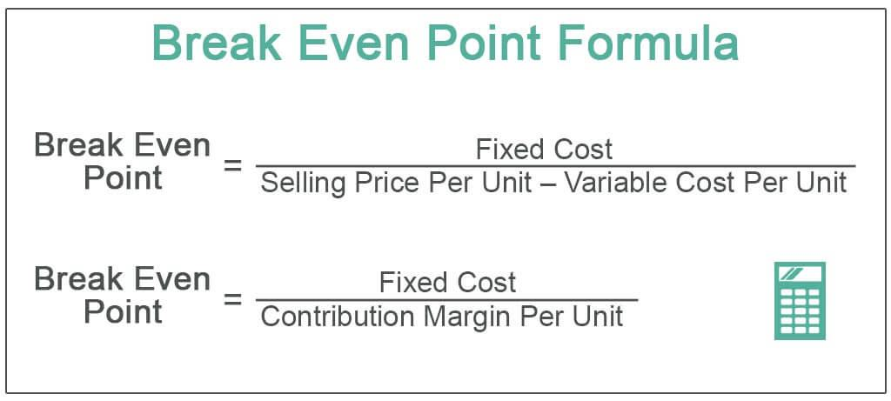

## Table of Contents

## What is break-even analysis?

Break-even analysis is a way to figure out how much you need to sell to start making a profit. It helps business owners understand at what point their total sales will cover all their costs, so they don't lose money. This point is called the break-even point. To find this, you add up all the fixed costs, like rent and salaries, and all the variable costs, like materials and shipping, which change with how much you produce.

Once you know your total costs, you divide them by the price you charge per item to see how many items you need to sell to break even. For example, if your fixed costs are $1,000 and your variable costs are $5 per item, and you sell each item for $10, you would need to sell 200 items to cover your costs. This analysis is useful for making decisions about pricing, setting sales goals, and planning for the future of the business.

## Why is break-even analysis important for businesses?

Break-even analysis is important for businesses because it helps them understand how much they need to sell to avoid losing money. By figuring out the break-even point, a business owner can see how many products or services they need to sell to cover all their costs, like rent, salaries, and materials. This is really helpful for planning because it shows the minimum amount of sales needed to keep the business running without losing money.

It also helps in making smart decisions about pricing and setting sales targets. If a business knows its break-even point, it can set prices that will help reach that point faster or adjust costs to make it easier to break even. This analysis can guide a business in planning for growth and making sure they have enough money coming in to support new projects or expansions. Overall, break-even analysis is a key tool for managing a business's finances and ensuring its long-term success.

## What are the basic components needed to perform a break-even analysis?

To do a break-even analysis, you need to know three main things: your fixed costs, your variable costs, and your selling price. Fixed costs are the costs that stay the same no matter how much you sell, like rent or salaries. Variable costs change depending on how much you produce or sell, like the cost of materials or shipping. The selling price is how much you charge for each item you sell.

Once you have these numbers, you can figure out your break-even point. This is the point where your total sales equal your total costs, so you're not losing money but you're not making a profit either. To find this point, you add up all your fixed costs and then divide that number by the profit you make on each item, which is the selling price minus the variable cost per item. Knowing your break-even point helps you plan how much you need to sell to start making a profit.

## How do you calculate the break-even point in units?

To find out how many items you need to sell to break even, you first need to know your fixed costs and your variable costs. Fixed costs are things like rent or salaries that don't change no matter how much you sell. Variable costs are costs that change depending on how many items you make or sell, like materials or shipping. 

Once you know these costs, you can figure out your break-even point in units. You do this by taking your total fixed costs and dividing them by the profit you make on each item. The profit per item is what you sell it for minus the variable cost per item. For example, if your fixed costs are $1,000 and you make a profit of $5 on each item, you would need to sell 200 items to break even. This tells you the minimum number of items you need to sell to cover all your costs and not lose money.

## What is the formula for calculating the break-even point in sales dollars?

To find the break-even point in sales dollars, you need to know your fixed costs and your contribution margin ratio. Fixed costs are things like rent or salaries that don't change no matter how much you sell. The contribution margin ratio is how much of each dollar of sales is left after you pay for the variable costs, like materials or shipping. You can find this ratio by dividing the contribution margin (which is the selling price minus the variable cost per unit) by the selling price.

Once you have these numbers, you can calculate the break-even point in sales dollars by dividing your total fixed costs by the contribution margin ratio. For example, if your fixed costs are $1,000 and your contribution margin ratio is 0.5, you would need to have $2,000 in sales to break even. This tells you the minimum amount of sales you need to cover all your costs and not lose money.

## Can you explain the concept of contribution margin in relation to break-even analysis?

The contribution margin is a key part of break-even analysis. It's the money left over from each sale after you pay for the variable costs, like materials or shipping. For example, if you sell a product for $10 and it costs $6 in variable costs to make, your contribution margin is $4. This $4 is what helps cover your fixed costs, like rent or salaries, which stay the same no matter how much you sell.

In break-even analysis, the contribution margin is important because it shows how much money from each sale is available to pay off your fixed costs. To find out how many items you need to sell to break even, you divide your total fixed costs by the contribution margin per item. For instance, if your fixed costs are $1,000 and your contribution margin is $4 per item, you need to sell 250 items to break even. This helps you understand how much you need to sell to start making a profit.

## How does fixed costs versus variable costs affect the break-even calculation?

Fixed costs and variable costs are both important in figuring out the break-even point for a business. Fixed costs are things like rent or salaries that you have to pay no matter how much you sell. They don't change. Variable costs, on the other hand, go up or down depending on how many items you make or sell. These are costs like materials or shipping. When you're calculating the break-even point, you need to know both kinds of costs because they affect how much you need to sell to cover everything.

To find the break-even point, you add up all your fixed costs and then divide that by the profit you make on each item. The profit per item is what you sell it for minus the variable cost for that item. If your fixed costs are high, you'll need to sell more to break even because you have more to cover. But if your variable costs are high, it means less profit per item, so you also need to sell more to reach the break-even point. Understanding how these costs work together helps a business set the right prices and sales goals to make sure they don't lose money.

## What are some common mistakes to avoid when performing a break-even analysis?

One common mistake when doing a break-even analysis is not including all the costs. People sometimes forget about some fixed costs like insurance or utilities, or they might miss some variable costs like shipping or extra materials. If you don't include all your costs, you won't know the real break-even point and you might think you're making money when you're not. It's important to be very careful and make sure you count every cost that affects your business.

Another mistake is using the wrong numbers for sales prices or costs. Sometimes, businesses guess or use old numbers instead of the current ones. If your costs go up or your selling prices change, you need to update your break-even analysis. Using old or guessed numbers can lead to wrong decisions about how much you need to sell to break even. Always use the most up-to-date and accurate numbers to make sure your break-even analysis is correct.

Lastly, some people forget that the break-even point can change over time. Things like new products, changes in the market, or different costs can all change where your break-even point is. It's not a one-time thing; you should keep checking and updating your break-even analysis to make sure it still fits your business. Regularly looking at your break-even point helps you stay on top of your business's financial health and make smart decisions.

## How can break-even analysis be used for decision making in pricing strategies?

Break-even analysis helps businesses decide on the best prices for their products or services. By knowing the break-even point, a business can see how much they need to sell to cover all their costs. If the price is too low, they might sell a lot but still lose money because they can't cover their costs. If the price is too high, they might not sell enough to reach the break-even point. By doing a break-even analysis, a business can find the right balance. They can see if they need to lower costs, raise prices, or change how much they sell to make a profit.

Using break-even analysis for pricing can also help a business understand how different prices affect their profits. For example, if they lower the price, they might need to sell more to break even, but it could attract more customers. If they raise the price, they might sell less, but each sale brings in more profit. By playing with different prices in their break-even analysis, a business can figure out the best price that helps them reach their break-even point quickly and start making a profit. This helps them make smart choices about how to price their products to be successful.

## What are the limitations of break-even analysis?

Break-even analysis is a helpful tool, but it has some limits. One big limit is that it assumes everything stays the same. It thinks that the costs and the prices won't change, but in real life, they often do. For example, the cost of materials might go up, or you might have to lower your prices to sell more. If these things change, the break-even point you figured out might not be right anymore. Also, break-even analysis doesn't think about how much money you might make after you break even. It just tells you when you stop losing money, not how much profit you could make.

Another limit is that break-even analysis doesn't look at other important things that can affect your business. It doesn't think about things like how much people want your product, what your competitors are doing, or how the economy is doing. These things can all change how well your business does. For example, if a new competitor comes in and takes away your customers, you might not sell enough to reach your break-even point. So, while break-even analysis is good for understanding your costs and sales, it's not the only thing you should look at when making decisions for your business.

## How can break-even analysis be integrated with other financial analysis tools?

Break-even analysis can be used together with other financial tools to get a better picture of a business's health. One way to do this is by using it with a cash flow analysis. Break-even analysis tells you how many products you need to sell to cover your costs, but cash flow analysis shows how money moves in and out of your business over time. By combining these, you can see if you'll have enough money to keep going until you reach your break-even point. This is really helpful for planning because it shows if you might run out of money before you start making a profit.

Another way to use break-even analysis is with profit and loss statements. A profit and loss statement shows all your income and expenses over a period of time, helping you see if you're making or losing money. By looking at your break-even point alongside your profit and loss statement, you can understand how close you are to breaking even and what you need to do to improve. For example, if your profit and loss statement shows you're not making enough sales to cover costs, break-even analysis can help you figure out if you need to change your prices or cut costs to reach that point. Together, these tools give you a fuller view of your business's financial situation and help you make better decisions.

## Can you provide a real-world example of how a company used break-even analysis to make a strategic decision?

A small bakery, let's call it Sweet Treats, used break-even analysis to decide if they should start selling a new type of cupcake. They knew their fixed costs, like rent and salaries, were $2,000 a month. The variable costs for making each cupcake, like ingredients and packaging, were $1 per cupcake. They wanted to sell the cupcakes for $3 each. By doing a break-even analysis, they found out they needed to sell 1,000 cupcakes a month to cover all their costs. This helped them see if it was realistic to sell that many cupcakes and if it was worth trying out the new product.

After figuring out their break-even point, Sweet Treats decided to go ahead with the new cupcakes. They used the break-even analysis to set a sales goal and to make sure they priced the cupcakes right. They also kept an eye on their costs and sales to see if they were getting close to breaking even. Thanks to the break-even analysis, Sweet Treats was able to launch the new product confidently, knowing exactly how many cupcakes they needed to sell to start making a profit.

## What is break-even analysis?

Break-even analysis is an essential financial tool used to assess the point where a business neither makes a profit nor incurs a loss. This point, known as the break-even point (BEP), is critical for businesses to understand as it highlights the sales volume necessary to cover all incurred costs. At this juncture, the total revenue generated from sales matches the sum of fixed and variable costs, resulting in zero net profit or loss.

Fixed costs are those expenses that remain constant regardless of the level of production or sales volume, such as rent, salaries, and insurance. On the other hand, variable costs fluctuate in direct proportion to production output, including raw materials and direct labor costs. Revenue, generated from sales, should be sufficient to cover these costs to reach the break-even point.

A key concept integral to break-even analysis is the contribution margin. The contribution margin is calculated by subtracting the variable cost per unit from the selling price per unit. It represents the portion of sales revenue that exceeds total variable costs and contributes towards covering fixed costs.

Mathematically, the break-even point can be determined using the formula:

$$
\text{BEP (in units)} = \frac{\text{Total Fixed Costs}}{\text{Price Per Unit} - \text{Variable Cost Per Unit}}
$$

This equation helps businesses determine the minimum quantity of units they must sell to avoid a financial loss. For calculation in sales dollars, the break-even point is determined using:

$$
\text{BEP (in sales dollars)} = \frac{\text{Total Fixed Costs}}{\text{Contribution Margin Ratio}}
$$

The contribution margin ratio is derived by dividing the contribution margin by the selling price per unit. These calculations assist businesses in setting accurate sales targets, pricing strategies, and overall financial planning.

Understanding the core components of break-even analysis facilitates informed decision-making, allowing companies to project realistic profit goals and organize their cost structures efficiently. As a result, businesses can strategically plan for growth and sustainability by recognizing the importance of reaching and exceeding their break-even point.

## What is the Break-Even Point and How Can It Be Understood?

The break-even point (BEP) is a fundamental concept in financial analysis, representing the stage at which a business's total revenues are exactly equal to its total costs. At this juncture, the business neither profits nor incurs losses, marking a critical threshold for operational viability.

To calculate the BEP accurately, a company must delineate its fixed and variable costs. Fixed costs, such as rent, salaries, and insurance, remain invariant regardless of production or sales [volume](/wiki/volume-trading-strategy). These are the expenses that a company incurs irrespective of its operational activities. On the other hand, variable costs, which include raw materials, direct labor, and sales commissions, vary directly with the level of production or service delivery. The distinction between these cost types is crucial for precise BEP determination.

$$
\text{BEP (units)} = \frac{\text{Total Fixed Costs}}{\text{Price Per Unit} - \text{Variable Cost Per Unit}}
$$

This formula allows businesses to ascertain the minimum number of units that must be sold to cover all costs. Alternatively, the BEP can be expressed in terms of sales revenue, using the contribution margin ratio:

$$
\text{BEP (sales dollars)} = \frac{\text{Total Fixed Costs}}{\text{Contribution Margin Ratio}}
$$

Understanding the BEP enables companies to set informed sales targets and make strategic decisions about production levels. By knowing the minimum sales volume required to sidestep losses, businesses can optimize their cost management and predict their financial sustainability more effectively.

## What is the Break-Even Analysis Formula?

The break-even analysis formula is a fundamental tool for businesses aiming to establish pricing strategies and predict sales and profit outcomes accurately. The break-even point (BEP) can be calculated in two primary ways: in units and in sales dollars.

To ascertain the BEP in units, use the following formula:

$$
\text{BEP (units)} = \frac{\text{Total Fixed Costs}}{\text{Price Per Unit} - \text{Variable Cost Per Unit}}
$$

This equation determines the number of units a business must sell to cover all fixed and variable costs, achieving a net profit of zero. It highlights the importance of understanding total fixed costs and the contribution margin per unit, which is the difference between the sale price of an item and its variable cost.

For calculating the BEP in sales dollars, the formula is:

$$
\text{BEP (sales dollars)} = \frac{\text{Total Fixed Costs}}{\text{Contribution Margin Ratio}}
$$

The contribution margin ratio plays a critical role here. It is calculated as:

$$
\text{Contribution Margin Ratio} = \frac{\text{Item Price} - \text{Variable Cost Per Unit}}{\text{Item Price}}
$$

This ratio reflects the portion of sales revenue that exceeds variable costs and contributes to covering fixed costs. Understanding these formulas allows businesses to effectively set pricing strategies and make informed forecasts about sales and profit potential. By manipulating these numbers, businesses can evaluate different pricing scenarios, making strategic decisions that align with their financial goals.

## What is the Role of Contribution Margin?

The contribution margin is a fundamental metric in financial analysis, serving as the difference between sales revenue and variable costs. It quantifies the amount available to cover fixed costs and contribute to profits once variable expenses have been accounted for. Businesses utilize the contribution margin to assess how individual products or services impact overall profitability.

Understanding the contribution margin is essential for businesses aiming to make informed pricing and production decisions. By analyzing this metric, companies can determine the portion of sales that is attributable to covering fixed expenses and generating profit. This insight allows businesses to refine pricing models and optimize their cost structure. For example, the contribution margin ratio, which is the contribution margin divided by sales revenue, helps indicate the proportion of revenue that contributes to none-variable cost recovery and profit. Mathematically, it is expressed as:

$$
\text{Contribution Margin Ratio} = \frac{\text{Sales Revenue} - \text{Variable Costs}}{\text{Sales Revenue}}
$$

A strong understanding of the contribution margin further enables businesses to forecast profitability more accurately. It provides a clear picture of the impact on profit from changes in sales volume, costs, or pricing strategies. By integrating contribution margin analysis with financial forecasting, businesses can enhance their ability to plan for and achieve financial targets. This approach ensures that operational decisions are aligned with the overall strategic goals of maintaining and improving profit margins.

## References & Further Reading

[1]: Brealy, R., Myers, S., & Allen, F. (2020). ["Principles of Corporate Finance."](https://www.mheducation.com/highered/product/principles-corporate-finance-brealey-myers/M9781264080946.html) McGraw-Hill Education.

[2]: ["Break-Even Analysis"](https://www.investopedia.com/terms/b/breakevenanalysis.asp) on Investopedia.

[3]: Gitman, L. J., & Zutter, C. J. (2015). ["Principles of Managerial Finance."](https://archive.org/details/principlesofmana13edgitm_l9n6) Pearson Education.

[4]: De Prado, M. L. (2018). ["Advances in Financial Machine Learning."](https://www.amazon.com/Advances-Financial-Machine-Learning-Marcos/dp/1119482089) John Wiley & Sons.

[5]: Fabozzi, F. J., Focardi, S. M., & Rachev, S. T. (2014). ["The Basics of Financial Econometrics: Tools, Concepts, and Asset Management Applications."](https://onlinelibrary.wiley.com/doi/book/10.1002/9781118856406) Wiley Finance.