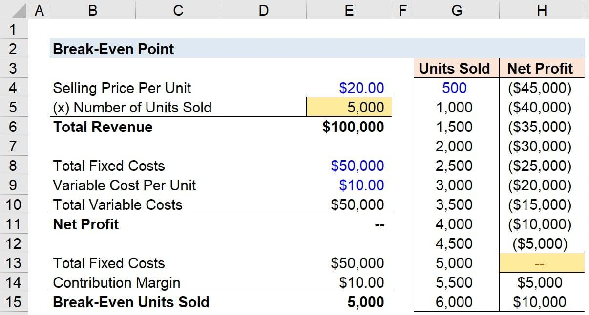

## Table of Contents

## What is the break-even price?

The break-even price is the point where the cost of making something equals the money you get from selling it. It's important for businesses because it shows the minimum price they need to charge to not lose money. If they sell above this price, they start making a profit. If they sell below it, they lose money.

To find the break-even price, you add up all the costs of making the product, like materials, labor, and overhead. Then, you divide that total by the number of units you plan to sell. This calculation helps businesses set prices that will cover their costs and help them plan for profitability.

## Why is the break-even price important for businesses?

The break-even price is really important for businesses because it tells them the lowest price they can charge for their product without losing money. If they sell their product for less than the break-even price, they will lose money on each sale. This helps businesses figure out if they can make money with their current costs and prices. It's like a safety line that shows them how much they need to sell to start making a profit.

Knowing the break-even price also helps businesses make smart decisions. For example, if their costs go up, they can use the break-even price to see if they need to raise their prices or find ways to lower their costs. It's a useful tool for planning and making sure the business stays healthy. By understanding the break-even price, business owners can set goals and work towards making more money.

## How do you calculate the break-even price?

To calculate the break-even price, you need to know all the costs of making your product. This includes the cost of materials, labor, and any other expenses like rent or utilities. These are called your total costs. Once you have your total costs, you divide that number by the number of units you plan to sell. The result is your break-even price. This is the lowest price you can charge for your product without losing money.

For example, if it costs you $1000 to make 100 units of a product, your total costs are $1000. If you divide $1000 by 100 units, your break-even price is $10 per unit. This means you need to sell each unit for at least $10 to cover your costs. If you sell for more than $10, you start making a profit. If you sell for less, you lose money. Knowing this helps you set your prices right and plan for your business's future.

## What are the key components needed to calculate the break-even price?

To find the break-even price, you need to know two main things: your total costs and how many units you plan to sell. Total costs include everything you spend to make your product, like materials, labor, and other expenses such as rent or utilities. These are the costs that you can't avoid if you want to make your product.

Once you have your total costs, you divide that number by the number of units you plan to sell. This gives you the break-even price, which is the lowest price you can charge without losing money. For example, if it costs $1000 to make 100 units, your break-even price is $10 per unit. You need to sell each unit for at least $10 to cover your costs. If you sell for more, you make a profit; if you sell for less, you lose money.

## Can you provide a simple example of calculating the break-even price for a product?

Let's say you want to make and sell homemade candles. You figure out that the total cost to make 50 candles is $250. This includes the cost of wax, wicks, scents, and any other expenses like electricity or rent for your workspace.

To find the break-even price, you take your total costs of $250 and divide it by the number of candles you plan to sell, which is 50. So, $250 divided by 50 equals $5. This means you need to sell each candle for at least $5 to cover your costs. If you sell them for more than $5, you start making a profit. If you sell them for less, you'll lose money.

## How does the break-even price vary across different industries?

The break-even price can be very different across industries because each industry has its own costs and ways of doing things. For example, making a car is a lot more expensive than making a t-shirt. The car industry has high costs for materials, labor, and big machines. So, the break-even price for a car is much higher than for a t-shirt, which might just need fabric and a sewing machine.

Even within the same industry, the break-even price can change. Think about restaurants: a fancy restaurant with expensive ingredients and a big staff will have a higher break-even price for their dishes than a small, simple diner. The fancy restaurant needs to charge more to cover their costs, while the diner can keep prices lower because their costs are not as high. So, knowing your industry and your own costs is key to figuring out the right break-even price for your business.

## What factors can affect the break-even price?

The break-even price can change because of many things. One big thing is the cost of making the product. If the price of materials goes up, or if you need to pay workers more, then the total cost to make your product goes up too. This means you have to sell your product for more money to cover these higher costs. Another thing that can change the break-even price is how many products you plan to sell. If you think you can sell a lot more, you might be able to spread out your costs over more items, which could lower your break-even price.

Other things that can affect the break-even price include things like taxes, rent, and utilities. If these go up, your total costs go up, and you need to charge more to break even. Also, if you can find ways to make your product cheaper, like using less expensive materials or making things more efficiently, you can lower your break-even price. Knowing all these factors helps you set a price that will cover your costs and help you make a profit.

## How can changes in fixed and variable costs influence the break-even price?

Changes in fixed costs, like rent or salaries, can really change the break-even price. Fixed costs are things you have to pay no matter how many products you make. If your rent goes up, or you hire more staff, your total costs go up too. This means you need to sell your product for more money to cover these higher costs. For example, if your fixed costs go up by $1000 and you make 1000 products, you might need to add $1 to the price of each product to break even.

Variable costs, like the cost of materials or electricity used to make each product, can also affect the break-even price. These costs change depending on how many products you make. If the price of materials goes up, it costs more to make each product. This means you have to charge more to cover these higher costs. For example, if the cost of materials for each product goes up by $2, you need to add $2 to the price of each product to break even. Knowing how both fixed and variable costs can change helps you set the right break-even price for your business.

## What are some common mistakes to avoid when calculating the break-even price?

One common mistake people make when figuring out the break-even price is not including all their costs. Sometimes, they forget about little things like electricity or rent, which can add up. If you don't count all your costs, you might think you're making a profit when you're really losing money. It's important to write down every expense, even the small ones, to get a true picture of your costs.

Another mistake is not updating the break-even price when costs change. Costs can go up or down over time, and if you don't keep track, your break-even price might be wrong. For example, if the price of materials goes up, you need to raise your break-even price to cover the extra cost. If you don't, you could end up selling your product for less than it costs to make, which means you lose money.

Lastly, some people make the mistake of not thinking about how many products they can actually sell. If you think you can sell a lot more than you really can, your break-even price might be too low. You need to be realistic about how many products you can sell so you can set a price that will cover your costs and help you make a profit.

## How can a business use the break-even price to make strategic pricing decisions?

A business can use the break-even price to make smart choices about how much to charge for their products. By knowing the break-even price, a business can see the lowest price they can sell their product for without losing money. If they want to make a profit, they need to charge more than this price. For example, if a business finds out that the break-even price for their product is $10, they might decide to sell it for $12 to make a profit. This helps them set a price that not only covers their costs but also helps them earn money.

The break-even price also helps businesses plan for the future. If costs go up, like if the price of materials increases, the business can use the break-even price to figure out if they need to raise their prices. Or, if they find a way to make their product cheaper, they can lower the break-even price and maybe sell their product for less to attract more customers. By keeping an eye on the break-even price, a business can make sure they're always charging enough to cover their costs and make a profit, no matter what changes happen in their costs or the market.

## Can you explain how to use break-even analysis for multiple products?

Break-even analysis for multiple products is a bit trickier than for just one product, but it's still doable. You need to figure out the break-even price for each product separately, just like you would for a single product. You add up all the costs for making each product, including materials, labor, and other expenses. Then, you divide those total costs by the number of units you plan to sell for each product to find the break-even price for each one. After you have the break-even prices, you can see how they all fit together to help you make decisions about pricing and selling your products.

Once you know the break-even prices for all your products, you can look at how they work together. For example, if one product has a high break-even price but you think you can sell a lot of it, you might decide to keep selling it because the high volume will help you cover the costs. On the other hand, if another product has a low break-even price but you don't think you'll sell many, you might decide to focus on other products instead. By understanding the break-even prices for all your products, you can make smart choices about which products to focus on, how to price them, and how to plan for making a profit with your whole product line.

## How does break-even price analysis help in forecasting and long-term planning?

Break-even price analysis helps businesses see into the future and plan for the long term. By knowing the break-even price, a business can figure out how many products they need to sell to start making money. This helps them set goals and make plans for growing their business. For example, if they want to expand and make more products, they can use break-even analysis to see if it's a good idea. They can look at how much it will cost and how many more products they need to sell to cover those costs.

This kind of analysis also helps businesses stay ready for changes. If the cost of materials goes up, or if they need to pay workers more, they can use break-even analysis to see how it affects their prices. They might decide to raise their prices a little to cover the extra costs, or they might look for ways to make their products cheaper. By keeping an eye on the break-even price, businesses can make smart choices that help them stay profitable and grow over time.

## What is the Break-Even Point in Financial Contexts?

The break-even point in financial contexts represents the juncture at which a company's total revenues equal its total costs, resulting in neither profit nor loss. Identifying this threshold is essential for understanding the minimum output or sales required for a business to sustain its operations without incurring losses. This analysis is especially crucial for businesses to strategically price their products or services.

To comprehend the break-even point, it is important to distinguish between fixed and variable costs. Fixed costs remain constant regardless of output levels or sales [volume](/wiki/volume-trading-strategy). These include expenses such as rent, salaries, and insurance that do not fluctuate with production levels. Variable costs, on the other hand, change in direct proportion to the level of output or sales. These costs can include raw materials, direct labor, and commissions.

The core computation of the break-even point is expressed as:

$$
\text{Break-Even Point (units)} = \frac{\text{Fixed Costs}}{\text{Selling Price per Unit} - \text{Variable Cost per Unit}}
$$

Where:
- Selling Price per Unit is the price at which each product is sold.
- Variable Cost per Unit is the cost incurred to produce each product.

The key to break-even analysis is understanding the contribution margin, which is the difference between the selling price per unit and the variable cost per unit. This margin contributes to covering fixed costs and any remaining margin contributes to profit once the break-even quantity is surpassed. The contribution margin ratio can be defined as:

$$
\text{Contribution Margin Ratio} = \frac{\text{Selling Price per Unit} - \text{Variable Cost per Unit}}{\text{Selling Price per Unit}}
$$

Analyzing cost structures and pricing strategies entails assessing how changes in costs or sales volume impact profitability. For instance, reducing variable costs increases the contribution margin, potentially lowering the break-even point, which is advantageous for achieving financial sustainability more swiftly.

From a financial planning perspective, understanding the interplay between these elements allows businesses to set informed and strategic pricing, forecast finances accurately, and achieve necessary sales targets to maintain healthy operations. This not only aids in day-to-day business management but also in long-term strategic decisions, aligning operational activities with financial goals.

## What is the Break-Even Analysis Formula and how are the calculations performed?

Break-even analysis serves as a critical tool in financial planning, enabling businesses to determine the minimum sales volume required to avoid losses. This analysis primarily revolves around two core formulas: the break-even point (BEP) in units and the break-even point in dollars.

The BEP in units calculates the number of units a company must sell at a given price to cover all costs. The basic formula is:

$$
\text{BEP (units)} = \frac{\text{Fixed Costs}}{\text{Selling Price per Unit} - \text{Variable Cost per Unit}}
$$

Here, fixed costs are expenses that remain constant regardless of production levels, such as rent and salaries. The selling price per unit and variable cost per unit are the price at which each product is sold and the cost directly associated with producing one additional unit, respectively.

The BEP in dollars, conversely, determines the amount of revenue required to break even and is calculated as:

$$
\text{BEP (dollars)} = \frac{\text{Fixed Costs}}{\text{Contribution Margin Ratio}}
$$

The contribution margin ratio is defined as the difference between the sales price and variable cost per unit, divided by the sales price per unit:

$$
\text{Contribution Margin Ratio} = \frac{\text{Selling Price per Unit} - \text{Variable Cost per Unit}}{\text{Selling Price per Unit}}
$$

Understanding the impacts of fixed costs, price adjustments, and the contribution margin ratio is crucial for businesses. For instance, if fixed costs increase due to higher administrative expenses or the purchase of new equipment, the break-even point also increases. Similarly, any change in the selling price or variable costs will adjust the BEP, thereby influencing strategic and operational decisions.

To demonstrate a practical example, consider a business with fixed costs of $100,000, a selling price per unit of $50, and a variable cost per unit of $30. Using the formula for BEP in units:

$$
\text{BEP (units)} = \frac{100,000}{50 - 30} = 5,000 \text{ units}
$$

This implies that the business must sell 5,000 units to cover its costs without making a profit. For the BEP in dollars:

$$
\text{Contribution Margin Ratio} = \frac{50 - 30}{50} = 0.4
$$

$$
\text{BEP (dollars)} = \frac{100,000}{0.4} = 250,000
$$

Therefore, the business needs to generate $250,000 in sales to break even.

To automate these calculations in Python, a simple script can be implemented. The script allows users to input fixed costs, selling prices, and variable costs, thereafter computing the break-even points:

```python
def calculate_break_even(fixed_costs, selling_price_per_unit, variable_cost_per_unit):
    contribution_margin_per_unit = selling_price_per_unit - variable_cost_per_unit
    contribution_margin_ratio = contribution_margin_per_unit / selling_price_per_unit

    bep_units = fixed_costs / contribution_margin_per_unit
    bep_dollars = fixed_costs / contribution_margin_ratio

    return bep_units, bep_dollars

# Example usage
fixed_costs = 100000
selling_price_per_unit = 50
variable_cost_per_unit = 30

bep_units, bep_dollars = calculate_break_even(fixed_costs, selling_price_per_unit, variable_cost_per_unit)
print(f"BEP in Units: {bep_units}")
print(f"BEP in Dollars: {bep_dollars}")
```

Through such calculations, businesses can make informed decisions about pricing, cost management, and sales targets, enhancing their ability to plan strategically and align budgeting efforts with financial objectives.

## What is the role of contribution margin in break-even analysis?

The contribution margin is a key financial metric used to evaluate the profitability of specific products or services. It serves as a crucial element in break-even analysis by helping businesses determine the amount available to cover fixed costs after variable costs have been deducted from sales. The basic formula for calculating the contribution margin is:

$$
\text{Contribution Margin} = \text{Sales Revenue} - \text{Variable Costs}
$$

This figure provides insight into how sales affect a company’s profitability by highlighting the portion of sales revenue that exceeds the variable costs associated with producing a product or service. The contribution margin ratio, expressed as a percentage, is calculated as follows:

$$
\text{Contribution Margin Ratio} = \left( \frac{\text{Contribution Margin}}{\text{Sales Revenue}} \right) \times 100
$$

In break-even analysis, understanding the contribution margin enables businesses to make informed pricing strategies. By knowing how much revenue from each sale contributes to covering fixed costs, managers can set prices that maximize profit potential while ensuring all costs are covered. This understanding helps in assessing the viability of pricing decisions, such as discounts or promotions, and forecasts how these adjustments might influence overall profitability.

For production decisions, the contribution margin aids in identifying the most profitable products or services, enabling companies to prioritize resources efficiently. For example, products with higher contribution margins are generally favored because they contribute more to fixed costs and profits relative to their variable costs, thereby providing greater financial stability.

Furthermore, the contribution margin is instrumental in financial forecasting. By analyzing historical contribution margins, managers can project future sales and profit scenarios, helping to devise strategies that align with financial goals. This analysis is particularly useful in budgeting, where estimating the contribution margin assists in determining the sales volume required to reach break-even points and achieve desired profit levels.

Strategic insights derived from contribution margin analysis can be invaluable for senior management. By examining contribution margin ratios, leaders gain an understanding of operational efficiency, enabling them to make adjustments that optimize financial outcomes. For instance, if a product's contribution margin is shrinking, it may signal the need to reassess cost structures or modify pricing strategies to enhance profitability.

In practice, leveraging tools and scripts can augment the analysis of contribution margins, particularly in complex financial models. For instance, using Python, a simple calculation of contribution margins for a list of products can be implemented as follows:

```python
def calculate_contribution_margin(sales, variable_costs):
    return sales - variable_costs

def calculate_contribution_margin_ratio(contribution_margin, sales):
    return (contribution_margin / sales) * 100

products = [
    {'name': 'Product A', 'sales': 10000, 'variable_costs': 4000},
    {'name': 'Product B', 'sales': 15000, 'variable_costs': 9000},
]

for product in products:
    cm = calculate_contribution_margin(product['sales'], product['variable_costs'])
    cmr = calculate_contribution_margin_ratio(cm, product['sales'])
    print(f"{product['name']} - Contribution Margin: ${cm}, Contribution Margin Ratio: {cmr:.2f}%")
```

In this example, the Python code calculates and outputs the contribution margin and contribution margin ratio for each product, providing an analytical tool for comparison and strategic decision making. Understanding and applying contribution margin analysis thus empowers businesses to refine their operations, optimize pricing, and ultimately enhance their financial sustainability.

## References & Further Reading

- Recommended Reading on Break-Even Analysis:
  - "Cost Accounting: A Managerial Emphasis" by Charles T. Horngren, Srikant M. Datar, and Madhav V. Rajan. This textbook provides comprehensive insights into managerial accounting principles, including a dedicated section on break-even analysis.
  - "Principles of Corporate Finance" by Richard A. Brealey, Stewart C. Myers, and Franklin Allen. It offers foundational concepts in finance, with a focus on decision-making frameworks like break-even analysis.

- Algorithmic Trading:
  - "Algorithmic Trading: Winning Strategies and Their Rationale" by Ernest P. Chan. This book focuses on designing and implementing trading strategies with quantitative techniques, offering case studies and practical coding examples.
  - "Quantitative Trading: How to Build Your Own Algorithmic Trading Business" by Ernie Chan. It serves as a guide to developing systematic trading strategies and understanding the nuances of financial data.

- Financial Management and Strategy:
  - "Financial Management: Theory and Practice" by Eugene F. Brigham and Michael C. Ehrhardt. This resource covers a broad spectrum of financial management topics, including strategy and analytics.
  - "Strategic Management: Concepts and Cases" by Fred R. David. Here, readers can explore strategic planning's role in corporate financial environments.

- Online Resources and Articles:
  - Investopedia (www.investopedia.com) offers detailed articles and tutorials on fundamental and advanced topics, including break-even analysis and trading strategies.
  - The Journal of Portfolio Management publishes peer-reviewed research focusing on quantitative finance and trading strategy development.

These resources provide a robust foundation for understanding the break-even point's crucial role in both business financial management and [algorithmic trading](/wiki/algorithmic-trading). They are suitable for both beginners seeking an introduction and practitioners looking to deepen their expertise.

