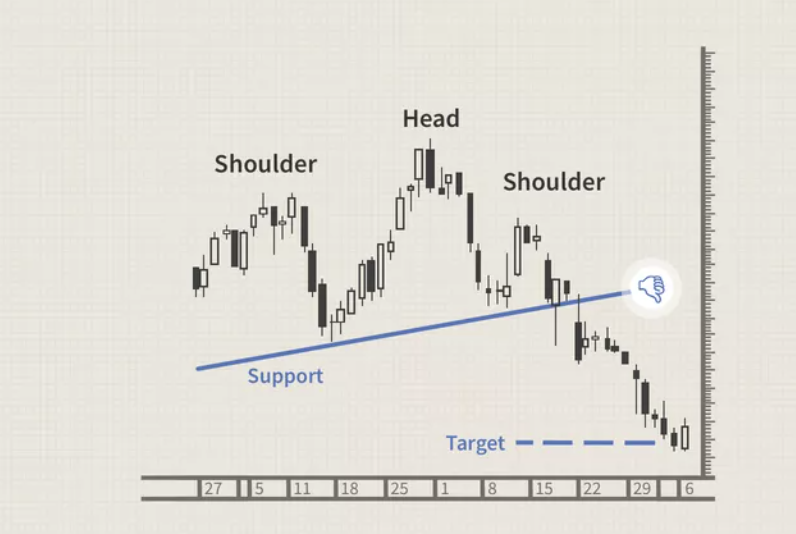

In the fast-paced world of trading, the ability to understand and anticipate market movements is vital for achieving success. Market breakdowns, which occur when the price of a security falls below a crucial support level, can lead to significant price declines. Recognizing these breakdowns is essential for traders, as they often signal a shift in market sentiment from bullish to bearish, impacting trading decisions and outcomes.

Trading breakdowns are not mere fluctuations in price; they represent a fundamental change in market dynamics that can have substantial implications. Identifying these occurrences requires using technical analysis tools, such as trendlines and moving averages, which enable traders to spot potential breakdowns early on. Additionally, volume plays a pivotal role in confirming a breakdown, indicating whether the movement is backed by strong market participation.



In the context of modern markets, algorithmic trading has revolutionized how traders manage and predict such market changes. These systems use pre-set rules involving price, volume, and timing to execute trades, reducing human error and allowing rapid response to market developments. Algorithmic trading's capacity to process extensive datasets means it can quickly adapt to new market conditions, offering an edge in navigating breakdowns.

For traders, understanding how to navigate breakdowns is crucial as it can mean the difference between profit and loss. By employing strategies, such as short selling and using stop-limit orders, traders can capitalize on breakdowns. Furthermore, the use of retracement techniques can aid in finding better entry points after a breakdown occurs.

Ultimately, mastering the art of trading breakdowns involves a combination of understanding these market mechanics, utilizing the right tools, and continuous learning. As markets evolve, traders must refine their strategies and practice with demo accounts to ensure readiness before making live trades. This article will explore these aspects further to equip traders with the necessary skills and knowledge to handle market breakdowns effectively.

## Table of Contents

## Understanding Market Breakdowns

A breakdown occurs when the price of a security or asset moves decisively below a key support level, often resulting in a sharp decline in price. Understanding the mechanics of breakdowns is important for traders as they attempt to differentiate these occurrences from typical price fluctuations in the market. 

Key support levels are price points where buying interest is sufficiently strong to prevent the price from falling further. When the price breaches these levels, it suggests a shift in the supply-demand balance, indicating increased selling pressure or diminished buying interest. This shift can lead to a rapid decline in price as the market sentiment turns bearish.

Technical analysis tools are crucial in identifying potential breakdowns. Trendlines, for instance, are frequently used to pinpoint these key support levels. A trendline is a straight line that connects two or more price points and then extends into the future to act as a line of support or resistance. When the price breaks below a trendline that has previously acted as support, a signal of a potential breakdown is given. Similarly, moving averages, which smooth out price data by creating constantly updated average prices, can also serve as dynamic support levels. The moving average crossover strategy, where a shorter-term moving average crosses below a longer-term moving average, can be a signal of potential breakdown.

Another critical [factor](/wiki/factor-investing) in confirming breakdowns is trading [volume](/wiki/volume-trading-strategy). Volume is a measure of how much of a given financial asset has been traded in a specific period. High volume during a price breakdown suggests that the move is supported by broad market participation, increasing the likelihood that it represents a genuine shift in market sentiment rather than a temporary fluctuation. Therefore, traders look for a volume spike accompanying a breakdown to confirm its validity.

Breakdowns are fundamentally the opposite of breakouts, which occur when prices move above a resistance level. While breakouts indicate a bullish sentiment as prices are expected to rise, breakdowns signal the onset of a bearish market sentiment, suggesting that prices may continue to decline. Recognizing these shifts helps traders make informed decisions, whether through selling holdings to avoid losses or employing strategies like short selling to profit from the anticipated downward price movement.

In summary, understanding market breakdowns involves recognizing when a price move below a support level is not just a fluctuation but a significant event likely to affect future market behavior. Key technical tools such as trendlines and moving averages are essential for identifying these supports, and volume analysis serves as a confirming factor. Recognizing the difference between breakdowns and breakouts can offer traders a strategic advantage in navigating bearish market conditions.

## The Role of Chart Patterns in Identifying Breakdowns

Chart patterns serve as crucial tools for traders aiming to identify potential market breakdowns. These visual representations of market behavior depict historical price movements and help predict future trends by highlighting specific patterns that suggest a change in market sentiment.

One of the primary patterns traders look for is the Descending Triangle, characterized by a series of lower highs converging towards a horizontal support line. This pattern signals a bearish market and often results in a breakdown when the price breaches the support level. Traders recognize this pattern by identifying at least two distinct lower highs and a steady support level. The pattern's reliability increases with higher volume during the eventual breakdown, confirming market participants' bearish sentiment.

Another key pattern is the Head and Shoulders formation, often regarded as a reversal pattern indicating a forthcoming decline in prices. This pattern consists of three peaks: a higher peak (head) flanked by two lower peaks (shoulders). The neckline, which connects the lows of the two troughs, acts as a support level. A breakdown occurs when the price falls below the neckline, signaling a potential bearish reversal. Recognizing this pattern involves careful observation of the symmetry between the shoulders and the volume decreasing as the pattern develops, followed by an increase as the breakdown happens.

Chart patterns are practical tools in [day trading](/wiki/day-trading-spy), allowing traders to make quick decisions based on observable trends. They are applicable across various market conditions, from trending markets to volatile scenarios, by adapting the interpretation of patterns to the specific context. In day trading, where quick reaction times are essential, familiarizing oneself with these patterns can help in anticipating market movements and positioning trades accordingly.

Understanding chart patterns not only aids in identifying potential breakdowns but also enhances a trader's overall strategy. By incorporating these patterns into analysis, traders can effectively gauge market sentiment and predict directional shifts, enabling them to formulate informed trading decisions. Whether a security is poised for a breakdown or a sustained trend, chart patterns provide indispensable insights into the forces driving market movements.

## Algorithmic Trading: Navigating Market Mechanisms

Algorithmic trading, often referred to as algo trading, utilizes computer algorithms to execute trades automatically based on a set of pre-defined parameters such as price, volume, and timing. This technological advancement offers several benefits, particularly in the context of managing and predicting market breakdowns.

One of the prime advantages of [algorithmic trading](/wiki/algorithmic-trading) is its ability to systematically manage market breakdowns. By employing algorithms, traders can set up strategies that automatically detect when market conditions signal a breakdown, allowing them to [exit](/wiki/exit-strategy) positions or execute defensive trades rapidly. For instance, during market breakdowns when the price of a security falls below key support levels, an algorithm can be programmed to trigger a sell order to prevent further losses.

Among the various algorithms employed, trend-following and statistical [arbitrage](/wiki/arbitrage) are frequently used in breakdown scenarios. Trend-following algorithms capitalize on the [momentum](/wiki/momentum) of asset prices by identifying and following trends as they develop. In scenarios where prices are rapidly declining as part of a breakdown, these algorithms can swiftly execute trades to either short sell or close existing positions.

Statistical arbitrage, on the other hand, relies on statistical methods and historical data to identify price discrepancies and market inefficiencies. During breakdowns, these algorithms can quickly analyze vast market data to spot temporary mispricing that could be exploited, thereby providing trading opportunities even in bearish market conditions.

A key advantage of algorithmic trading is its ability to minimize human error. Unlike manual trading, where emotional and cognitive biases can lead to suboptimal trading decisions, algorithms operate based purely on logic and pre-encoded rules. This systematic approach ensures that trades are executed precisely as intended, without the influence of fear or greed that often accompanies human trading.

Moreover, algorithmic trading can operate at speeds far beyond human capability. High-frequency trading ([HFT](/wiki/high-frequency-trading-strategies)), a subset of algorithmic trading, can execute thousands of transactions in fractions of a second, allowing traders to take advantage of even the smallest market movements. This speed is particularly advantageous during breakdowns when market conditions can change rapidly, necessitating quick decision-making to mitigate risks or secure profits.

The ability of algorithmic trading to process large datasets is another critical asset. Modern algorithms can handle vast amounts of market data, identifying patterns and trends that might not be visible to a human trader. This capacity for data processing allows algorithms to adapt quickly to changing market conditions and optimize trading strategies in real-time, an essential capability when navigating unpredictable breakdown scenarios.

In summary, algorithmic trading provides a sophisticated means to manage and predict market breakdowns by employing automated, systematic trading strategies. Its advantages include the elimination of human error, unmatched trading speed, and the capacity to process and act on extensive datasets, all of which equip traders with the tools needed to navigate the complexities of modern financial markets effectively.

## Practical Strategies for Trading Breakdowns

Successful trading during breakdowns requires a mix of proven techniques and adaptive strategies. This section explores practical strategies that traders employ to navigate breakdown scenarios effectively.

**Short Selling and Stop-Limit Orders**  
One of the most common strategies during a market breakdown is short selling. By selling securities that are borrowed with the intent to buy them back later at a lower price, traders can profit from declining prices. Short selling requires precision, as timing the entry and exit is crucial. Traders often rely on indicators and market signals to optimize their short-selling strategies during breakdowns. 

Stop-limit orders are another vital tool for traders, allowing them to set specific conditions for executing a trade. In a breakdown scenario, a trader might set a stop-limit order at a price just below a key support level, triggering a sale only when the market falls to that specified level. This approach helps in controlling entry points and managing market risks.

**Use of Retracement for Entry Points**  
Retracement refers to temporary price reversals that occur within a larger trend. After an initial breakdown, prices might retrace back towards the broken support level before continuing their downward trend. Traders can use retracement levels, often based on Fibonacci retracement principles, to find more advantageous entry points. By entering a trade during retracement, traders potentially achieve better risk-reward ratios.

Python Code Example for Fibonacci Retracement Calculation:

```python
def fibonacci_levels(price_start, price_end):
    diff = price_end - price_start
    levels = {
        '23.6%': price_end - 0.236 * diff,
        '38.2%': price_end - 0.382 * diff,
        '50.0%': price_end - 0.500 * diff,
        '61.8%': price_end - 0.618 * diff,
        '76.4%': price_end - 0.764 * diff
    }
    return levels

# Example usage:
start_price = 150
end_price = 100
print(fibonacci_levels(start_price, end_price))
```

**Managing Risk and Setting Stop-Loss Levels**  
Risk management is crucial in breakdown trading. Setting appropriate stop-loss levels can prevent significant losses if the market moves unexpectedly. Traders typically calculate stop-loss levels by considering market [volatility](/wiki/volatility-trading-strategies) and key technical indicators. A common approach is to set stop-loss orders above the broken support level to minimize potential losses if a breakdown fails.

An effective strategy includes setting stop-loss at a percentage risk level, e.g., 3% below or above the entry price, depending on whether it's a short or long position, respectively. This method ensures that potential losses align with the trader's risk tolerance.

**Contrarian Strategies for Failed Breakdown Attempts**  
Contrarian strategies entail trading against prevailing market trends, especially during failed breakdowns when prices recover instead of falling further. Traders implementing contrarian strategies monitor indicators of market exhaustion or divergence. For instance, if a breakdown fails, causing a bounce-back above the support level, contrarian traders might take long positions, anticipating a reversal rally.

Prospective contrarian traders assess the likelihood of a false breakdown using tools like Relative Strength Index (RSI) and Moving Average Convergence Divergence (MACD). These indicators help in spotting overbought or oversold conditions that suggest potential reversals.

By understanding and applying these strategies, traders can effectively manage trades during breakdowns, leveraging both technical analysis and informed risk management techniques to enhance their trading performance.

## Conclusion

Trading breakdowns represent critical junctures where prices fall below key support levels, often signaling a bearish market sentiment. Recognizing these breakdowns and employing the right tools and strategies can be the difference between profit and loss for traders. Tools such as trendlines, moving averages, and volume indicators are indispensable for identifying potential breakdowns, while chart patterns like the Descending Triangle and Head and Shoulders offer visual cues to anticipate such market movements.

Algorithmic trading has emerged as a vital component in navigating these complex market mechanisms, offering traders the ability to execute trades based on predefined parameters rapidly and efficiently. With algorithms capable of processing large datasets at speeds unmatched by manual trading, algo trading minimizes human error and adapts swiftly to market changes. Strategies such as trend-following and [statistical arbitrage](/wiki/statistical-arbitrage) have been particularly beneficial in managing market breakdowns.

As markets continue to evolve, traders must engage in continuous learning and adaptation. Practicing with demo accounts remains crucial in refining strategies and gaining confidence before engaging in live trading. Successfully navigating trading breakdowns demands a combination of skill, informed decision-making, and the appropriate use of available tools. The insights and methodologies discussed in this article provide a foundation for traders seeking to enhance their understanding of market dynamics and improve their trading outcomes.

## References & Further Reading

[1]: Bergstra, J., Bardenet, R., Bengio, Y., & Kégl, B. (2011). ["Algorithms for Hyper-Parameter Optimization."](https://dl.acm.org/doi/10.5555/2986459.2986743) Advances in Neural Information Processing Systems 24.

[2]: ["Advances in Financial Machine Learning"](https://www.amazon.com/Advances-Financial-Machine-Learning-Marcos/dp/1119482089) by Marcos Lopez de Prado

[3]: ["Evidence-Based Technical Analysis: Applying the Scientific Method and Statistical Inference to Trading Signals"](https://www.amazon.com/Evidence-Based-Technical-Analysis-Scientific-Statistical/dp/0470008741) by David Aronson

[4]: ["Machine Learning for Algorithmic Trading"](https://github.com/stefan-jansen/machine-learning-for-trading) by Stefan Jansen

[5]: ["Quantitative Trading: How to Build Your Own Algorithmic Trading Business"](https://www.amazon.com/Quantitative-Trading-Build-Algorithmic-Business/dp/1119800064) by Ernest P. Chan