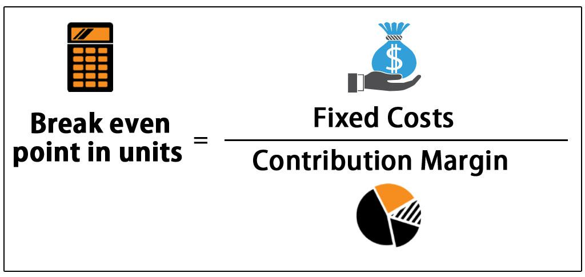

The profitability breakeven point is an essential metric in financial analysis, especially within algorithmic trading. As traders harness algorithms to make data-driven decisions, understanding when a strategy shifts from incurring losses to generating profits becomes critically important. This understanding allows traders to optimize their strategies for better financial performance.

This article seeks to clarify the breakeven point's role and significance in algorithmic trading, offering both novice and experienced traders insights that can be directly applied to their trading activities. It will provide an overview of the fundamental principles of breakeven analysis and outline its advantages, limitations, and the strategic insights it offers within financial markets.



Furthermore, we will present practical examples and scenarios where awareness of the breakeven point can lead to cost savings and improved decision-making. By knowing where the breakeven point lies, traders can better allocate resources, assess the viability of trading strategies, and make informed decisions that improve profitability and reduce risk. Understanding these concepts is crucial for algorithmic traders who aim to enhance their market strategies, ensuring they are not only competitive but also financially sustainable.

## Table of Contents

## Understanding the Breakeven Point

The breakeven point (BEP) is a critical concept in both trading and business. It is the stage at which a strategy or operation achieves a balance where total costs are equal to total revenues, resulting in neither profit nor loss. This point is fundamental for identifying the financial health and viability of a strategy, particularly in algorithmic trading environments. In such contexts, the breakeven point helps traders ascertain the number of trades or specific trade volume necessary to cover all operational expenses, thus avoiding losses.

To accurately calculate the BEP, one must consider fixed and variable costs, alongside revenue streams and contribution margin. Fixed costs in algorithmic trading could include expenses related to infrastructure, such as servers and trading software subscriptions. Variable costs typically encompass fees incurred through transactions, including brokerage commissions and exchange fees. The contribution margin is the difference between the revenue per trade and the variable cost per trade, reflecting the remainder available to cover fixed costs.

The formula for calculating the breakeven point in units is:

$$
\text{BEP (Units)} = \frac{\text{Fixed Costs}}{\text{Selling Price per Unit} - \text{Variable Cost per Unit}}
$$

In [algorithmic trading](/wiki/algorithmic-trading), this translates to determining how many trades are needed for the trading strategy to become profitable. Understanding the contribution margin is vital, as it directly affects how swiftly a strategy can achieve profitability after covering fixed expenses.

A breakeven analysis is an essential financial exercise that dictates the minimum performance metrics required for a trading strategy to remain viable. By establishing the minimum trade [volume](/wiki/volume-trading-strategy) or frequency needed to reach the breakeven point, traders can set realistic targets and effectively evaluate the strategies they employ. This analysis is integral for ensuring that trading activities are not only feasible but also aligned with overarching financial goals.

## Calculating the Breakeven Point in Algo Trading

Calculating the breakeven point in algorithmic trading involves understanding the interplay of fixed and variable costs against the revenue generated per trade. The fundamental formula used is:

$$
\text{BEP} = \frac{\text{Fixed Costs}}{\text{Selling Price per Unit} - \text{Variable Cost per Unit}}
$$

In the context of trading, fixed costs typically comprise expenses such as infrastructure and software fees. These costs are constant and do not vary with the number of trades. Variable costs, on the other hand, fluctuate according to the volume of trading and usually include transaction-related expenses such as brokerage fees.

### Contribution Margin

The contribution margin is crucial for calculating the breakeven point. It is defined as the difference between the selling price per unit and the variable cost per unit. This margin indicates how much of the revenue from each trade contributes to covering fixed costs after accounting for variable costs.

### Calculation Example

Consider a high-frequency trading scenario where fixed costs amount to $10,000 monthly, which includes server costs, subscription fees for trading platforms, and data feeds. Assume that each trade generates a revenue of $10, with variable costs such as brokerage fees and slippage amounting to $2 per trade. The contribution margin per trade is:

$$
\text{Contribution Margin} = \text{Revenue per Trade} - \text{Variable Cost per Trade} = 10 - 2 = 8
$$

Using the breakeven formula:

$$
\text{BEP} = \frac{10,000}{8} = 1,250 \text{ trades}
$$

This means that the trading strategy must execute at least 1,250 profitable trades per month to cover all fixed costs and start making a profit.

### Python Code for BEP Calculation

For those interested in automating this calculation, a simple Python code snippet could look like this:

```python
def calculate_bep(fixed_costs, revenue_per_trade, variable_cost_per_trade):
    contribution_margin = revenue_per_trade - variable_cost_per_trade
    bep = fixed_costs / contribution_margin
    return bep

# Example usage:
fixed_costs = 10000  # Fixed monthly costs
revenue_per_trade = 10
variable_cost_per_trade = 2

bep = calculate_bep(fixed_costs, revenue_per_trade, variable_cost_per_trade)
print(f'Breakeven point is {bep} trades')
```

### High-Frequency Trading Considerations

In high-frequency trading ([HFT](/wiki/high-frequency-trading-strategies)), the role of breakeven calculations becomes more critical due to the sheer volume of trades and the rapid accumulation of transaction costs. Traders in this field must ensure that their algorithms are efficient not only in executing trades but also in managing costs. Regularly updating breakeven calculations can help in adjusting strategies to shifting market conditions and dynamic pricing structures.

## Strategic Benefits of Breakeven Analysis

Breakeven analysis is a key tool for algorithmic traders, providing clear and objective data that aids in crafting more strategic decision-making. By identifying the breakeven point, traders set grounded profitability targets which help minimize risk exposure. Understanding these targets ensures that traders are informed about the minimum requirements their strategies must meet before incurring gains, thus avoiding unnecessary losses.

Breakeven analysis removes emotional influence from trading decisions. The financial markets can be volatile, often influenced by trader emotions such as fear and greed. By focusing on factual data provided by breakeven calculations, traders can maintain a rational approach. This rationality facilitates more strategic thinking, allowing traders to make decisions based on performance metrics rather than emotional responses to market fluctuations.

Furthermore, calculating the breakeven point allows investors and traders to assess the viability of trading strategies. Before committing substantial capital, traders can evaluate whether a strategy can potentially achieve profits given current cost structures and market conditions. This pre-emptive evaluation reduces the likelihood of significant financial losses associated with untested strategies.

The analysis is also beneficial in optimizing pricing strategies. By understanding the costs associated with each trade, traders can adjust their pricing models to ensure that they remain profitable. This insight helps traders determine when it is advantageous to enter or [exit](/wiki/exit-strategy) markets based on the calculated breakeven levels.

Overall, breakeven analysis equips traders with the necessary precision to enhance profitability and sustainability in their trading endeavors.

## Limitations and Challenges

Breakeven analysis serves as an essential tool in financial decision-making, yet it comes with notable limitations and challenges, especially in the context of algorithmic trading. One primary limitation involves the assumption of static costs and consistent market conditions. In reality, variable costs—such as transaction fees, slippage, and changes in [liquidity](/wiki/liquidity-risk-premium)—can fluctuate significantly. This variability complicates the calculation of the breakeven point (BEP), which requires precise and stable inputs to yield accurate outputs.

Dynamic market conditions present another significant challenge. Prices, [volatility](/wiki/volatility-trading-strategies), and trading volumes can change rapidly, affecting the relevancy and accuracy of any calculated BEP at a given time. These shifts mean that breakeven points need continual reassessment, potentially leading to a need for real-time or near-real-time recalculations rather than relying on static analysis.

A purely quantitative breakeven analysis often overlooks qualitative factors that can impact trading outcomes. For instance, increased market competition can compress profit margins, affecting the BEP. Similarly, changes in customer behavior, such as shifts in demand for certain trading instruments, are not typically accounted for in traditional BEP calculations. These qualitative elements can alter the landscape in which algorithmic trading operates, impacting profitability in ways a simple breakeven analysis might not capture.

Despite these challenges, recognizing the limitations of breakeven analysis allows traders to develop more adaptive and robust strategies. By understanding the pitfalls—such as fluctuating costs and dynamic market conditions—traders can incorporate a wider range of variables and scenarios into their models. This strategic awareness can lead to more resilient trading strategies, designed to withstand and adapt to the ever-changing conditions of financial markets. Advanced modeling techniques and sensitivity analyses, possibly aided by algorithmic tools, can provide a more comprehensive picture, enhancing the precision and utility of breakeven analysis in algorithmic trading.

## Practical Applications in Algorithmic Trading

Algorithmic trading leverages breakeven analysis to enhance the efficiency of trading strategies and ensure profitability. This financial technique assists in structuring execution protocols by identifying the precise point at which a trading strategy becomes profitable. A well-calculated breakeven point (BEP) equips traders with a clear threshold where trading becomes beneficial, thus optimizing decision-making.

One key application in algorithmic trading is the use of breakeven indicators to filter and optimize signals. In practice, seasoned traders apply breakeven analysis to manage entry and exit points more effectively. For instance, in high-frequency trading (HFT), where transaction volumes and speeds are extremely high, breakeven calculations help determine the exact number of profitable trades required to offset fixed infrastructure and variable transaction costs. This ensures that the algorithm remains profitable even with frequent trading activities that incur varying costs.

Sample scenarios illustrate how different algorithmic strategies yield different breakeven points. For trend-following strategies, the objective is to capitalize on sustained market movements. Here, the breakeven analysis assesses the expected duration and magnitude of trends required to cover costs. Conversely, in market-making strategies, the BEP focuses on the spread between bid and ask prices, determining the minimum spread necessary for profitability after accounting for transaction fees and other costs.

Python code can be used for calculating the breakeven point, providing a practical tool for traders to assess and adjust their strategies dynamically. For instance, a simple Python script can help in computing the BEP:

```python
# Example Python code to calculate the breakeven point in trading
def calculate_breakeven(fixed_costs, selling_price_per_unit, variable_cost_per_unit):
    if selling_price_per_unit <= variable_cost_per_unit:
        return float('inf')  # Breakeven point not achievable
    return fixed_costs / (selling_price_per_unit - variable_cost_per_unit)

# Sample values for a hypothetical strategy
fixed_costs = 10000  # e.g., infrastructure costs
selling_price_per_unit = 50  # e.g., average profit per trade
variable_cost_per_unit = 10  # e.g., average cost per trade

bep = calculate_breakeven(fixed_costs, selling_price_per_unit, variable_cost_per_unit)
print(f"The breakeven point is {bep} trades.")
```

This simple code snippet highlights how traders can quickly determine the breakeven point for any given trading strategy. Understanding the breakeven point enables algorithmic traders to refine their strategies, factoring in both quantitative and qualitative market changes, thus optimizing profitability and reducing risk exposure.

## Conclusion

Understanding and calculating the breakeven point is a fundamental skill for algorithmic traders committed to optimizing their financial outcomes. The breakeven point (BEP) provides a significant advantage by equipping traders with the ability to gauge when a strategy transitions from loss to profit. By calculating BEP, traders can map out clear financial objectives and allocate resources more efficiently, leading to strategic financial planning.

In-depth breakeven analysis empowers traders to make informed decisions that enhance profitability and reduce unnecessary risks. This analytical approach helps identify the minimum performance level required to maintain viability, ensuring that trading strategies are not only cost-effective but also capable of delivering desired outcomes in various market conditions. Incorporating BEP in trading algorithms allows for the adjustment of trade sizes, frequency, and markets targeted, optimizing returns and minimizing losses.

Despite certain limitations, such as dynamic market conditions and fluctuating costs that may affect the precision of breakeven calculations, traders who effectively leverage this analysis can test, tweak, and execute trading strategies with greater confidence. The ability to anticipate and react to market changes based on precise financial data positions traders to capitalize on market opportunities while safeguarding against potential downturns. This foresight ultimately contributes to a trader's success, highlighting the indispensable nature of breakeven analysis in algorithmic trading.

## References & Further Reading

[1]: Bergstra, J., Bardenet, R., Bengio, Y., & Kégl, B. (2011). ["Algorithms for Hyper-Parameter Optimization."](https://papers.nips.cc/paper/4443-algorithms-for-hyper-parameter-optimization) Advances in Neural Information Processing Systems 24.

[2]: ["Advances in Financial Machine Learning"](https://www.amazon.com/Advances-Financial-Machine-Learning-Marcos/dp/1119482089) by Marcos Lopez de Prado

[3]: ["Evidence-Based Technical Analysis: Applying the Scientific Method and Statistical Inference to Trading Signals"](https://www.amazon.com/Evidence-Based-Technical-Analysis-Scientific-Statistical/dp/0470008741) by David Aronson

[4]: ["Machine Learning for Algorithmic Trading"](https://github.com/stefan-jansen/machine-learning-for-trading) by Stefan Jansen

[5]: ["Quantitative Trading: How to Build Your Own Algorithmic Trading Business"](https://www.amazon.com/Quantitative-Trading-Build-Algorithmic-Business/dp/1119800064) by Ernest P. Chan