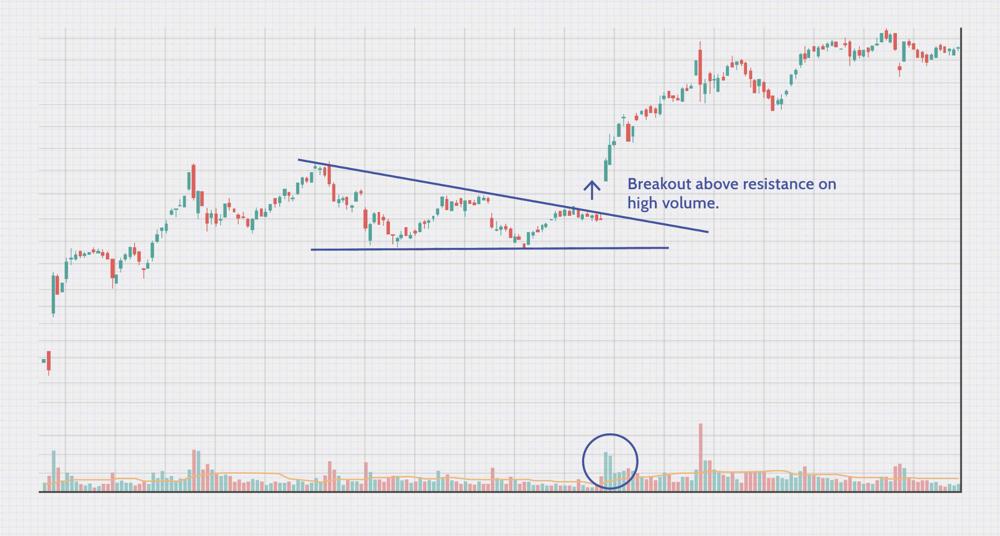

## Table of Contents

## What is a breakout in financial analysis?

A breakout in financial analysis happens when the price of a stock or any financial asset moves above a resistance level or below a support level. These levels are like boundaries that the price has had trouble moving past before. When the price finally breaks through one of these boundaries, it's called a breakout. This can be a sign that the price might keep moving in the same direction for a while.

Breakouts are important because they can signal new trends. For example, if a stock's price breaks above a resistance level, it might mean that more people want to buy the stock, pushing the price up even more. On the other hand, if the price breaks below a support level, it could mean that more people want to sell, which might make the price go down further. Traders and investors watch for breakouts to help them decide when to buy or sell.

## How can a breakout be identified on a price chart?

To spot a breakout on a price chart, you need to look for when the price moves past a clear line or level that it has bounced off of before. Imagine drawing a line across the highest points the price has reached in the past. If the price goes above this line, that's a breakout to the upside. On the other hand, if you draw a line across the lowest points and the price drops below it, that's a breakout to the downside.

It's helpful to use other tools along with the price chart to confirm a [breakout](/wiki/breakout-trading). For example, you might see a big jump in trading [volume](/wiki/volume-trading-strategy) when the price breaks through the line. This means more people are buying or selling, which makes the breakout more likely to continue. Also, looking at other indicators like moving averages can help you see if the breakout is part of a bigger trend. By combining these signs, you can feel more confident that what you're seeing is a real breakout and not just a temporary move.

## What are the common patterns associated with breakouts?

Breakouts often happen with certain patterns that traders look for. One common pattern is the "triangle." Imagine drawing lines that connect the highs and lows of the price, and these lines start to come together to form a triangle shape. When the price finally breaks out of this triangle, it can be a strong signal that the price is going to move in the direction of the breakout. Another pattern is the "rectangle," where the price moves between two parallel lines for a while. A breakout from this pattern can also show that the price is ready to start moving in a new direction.

Another pattern to watch for is the "head and shoulders." This pattern looks like three peaks, with the middle one (the head) being higher than the other two (the shoulders). A breakout happens when the price falls below the line that connects the lows of the two shoulders. This can signal that the price is going to keep going down. On the other hand, an "inverse head and shoulders" pattern, where the middle peak is lower than the other two, can signal a breakout to the upside when the price goes above the line connecting the highs of the shoulders.

These patterns help traders predict where the price might go next. But it's important to remember that breakouts don't always lead to big moves. Sometimes the price can break out and then quickly go back to where it was before. That's why it's good to use other tools, like volume and moving averages, to make sure the breakout is strong and likely to continue.

## What is the significance of volume during a breakout?

Volume is very important when a breakout happens. It tells us how many people are buying or selling when the price moves past a key level. If the volume is high during a breakout, it means a lot of people are interested in the stock or asset. This can make the breakout more likely to keep going in the same direction. For example, if the price breaks above a resistance level with lots of volume, it's a good sign that the price might keep going up.

On the other hand, if the volume is low during a breakout, it might mean that not many people are interested. This can make the breakout less reliable. The price might break out but then quickly go back to where it was before. So, traders often look for high volume to confirm that a breakout is strong and likely to continue. By paying attention to volume, traders can make better decisions about when to buy or sell.

## How does a breakout differ from a false breakout?

A breakout happens when the price of a stock or asset moves past a key level, like breaking through a resistance or support line. It's like the price has been stuck in a range and then suddenly jumps out of it. If the breakout is strong and lots of people are buying or selling, shown by high volume, it's more likely that the price will keep moving in that direction. Traders see this as a signal that a new trend might be starting.

A false breakout, on the other hand, is when the price moves past a key level but then quickly goes back to where it was before. It's like the price tries to break out but doesn't have enough strength to keep going. Often, the volume is low during a false breakout, which means not many people are interested. This can trick traders into thinking a new trend is starting when it's not. That's why it's important to look at other signs, like volume, to tell the difference between a real breakout and a false one.

## What are the key technical indicators used to confirm a breakout?

When looking to confirm a breakout, one key technical indicator is volume. If the price breaks through a resistance or support level with a lot of volume, it's a good sign that the breakout is strong and likely to continue. High volume shows that many people are interested in the stock or asset, which can push the price further in the direction of the breakout. On the other hand, if the volume is low during a breakout, it might be a false one, meaning the price could soon return to its previous range.

Another important indicator is the moving average. A moving average smooths out price data to show the trend over time. If the price breaks out and stays above or below a moving average, it can confirm that the breakout is part of a new trend. For example, if the price breaks above a resistance level and also stays above a key moving average like the 50-day or 200-day moving average, it's a strong sign that the breakout is real. Traders often use these moving averages to help them decide if a breakout is worth acting on.

Lastly, other indicators like the Relative Strength Index (RSI) and the Moving Average Convergence Divergence (MACD) can also help confirm a breakout. The RSI measures how fast the price is moving and can show if a stock is overbought or oversold. If the RSI supports the direction of the breakout, it adds more confidence to the move. The MACD looks at the relationship between two moving averages and can signal when a trend is gaining or losing strength. When these indicators align with the breakout, it gives traders more evidence that the price is likely to keep moving in the breakout direction.

## Can fundamental analysis enhance the reliability of a breakout signal?

Yes, [fundamental analysis](/wiki/fundamental-analysis) can help make a breakout signal more reliable. Fundamental analysis looks at things like a company's earnings, how much it's growing, and other important numbers. If these numbers are good, it can make a breakout more likely to be real and not just a short-term move. For example, if a company just reported great earnings and then the stock price breaks out, it's more likely that the breakout will continue because the company is doing well.

On the other hand, if the fundamentals are weak, a breakout might not be as trustworthy. If a company is struggling or not growing, a breakout in its stock price could be a false signal. Traders who use both technical and fundamental analysis can make better decisions. They look at the price charts to spot breakouts, but they also check the company's fundamentals to see if the breakout makes sense. This way, they can feel more confident about their trading choices.

## How do traders typically set up entry and exit points around a breakout?

Traders usually set up entry points right after a breakout happens. They wait for the price to break above a resistance level or below a support level. Once it does, they might buy or sell the stock, hoping the price will keep moving in the same direction. They often look for high volume to confirm the breakout is strong. For example, if a stock breaks above a resistance level with a lot of people buying, a trader might enter a buy order just above that level to catch the upward move.

Exit points are set to protect profits or limit losses. Traders often use stop-loss orders to get out of a trade if the price goes against them. For example, if they bought a stock after a breakout, they might set a stop-loss just below the breakout level. This way, if the breakout turns out to be false and the price drops back down, they won't lose too much money. They also set take-profit levels to sell the stock when it reaches a certain price, locking in their gains. This helps them decide when to get out of the trade and keep the money they made.

## What are the psychological factors influencing breakouts?

When a stock breaks out, it's not just about numbers and charts. People's feelings play a big role too. Imagine a lot of people watching a stock and seeing it hit a high point again and again but never going past it. When the price finally does break through that high point, everyone gets excited. They think, "Wow, this stock is going up!" So they start buying more, which pushes the price even higher. It's like a crowd getting hyped up and jumping on the bandwagon.

But sometimes, the excitement can lead to mistakes. If people get too excited and buy a stock just because it broke out, without checking if the company is actually doing well, they might get caught in a false breakout. That's when the price goes up for a bit but then falls back down. Also, if people are scared and sell their stocks quickly after a breakout, it can make the price drop. So, understanding how people feel and react can help traders make better choices about when to buy or sell during a breakout.

## How do different market conditions affect the success rate of breakouts?

Different market conditions can really change how well breakouts work. When the market is going up and everyone is feeling good about investing, breakouts are more likely to succeed. In a bull market, more people are buying stocks, which can help push the price higher after a breakout. If a stock breaks through a resistance level during a strong bull market, there's a good chance it will keep going up because so many people want to buy it. On the other hand, if the market is shaky or going down, breakouts can be riskier. In a bear market, people might be scared and selling their stocks, which can make it hard for a breakout to keep going. If a stock breaks out but the overall market is not doing well, it might quickly fall back down.

Another thing that affects breakouts is how much the market is moving around. In a market with a lot of ups and downs, called high [volatility](/wiki/volatility-trading-strategies), breakouts can happen more often but they can also be less reliable. The price might break out because of all the movement, but it could just as easily drop back down. Traders need to be careful and look at other signs, like volume, to see if the breakout is real. In a calmer market with less volatility, breakouts might be slower to happen, but when they do, they can be more trustworthy. The price is more likely to keep going in the direction of the breakout because there's less random movement pushing it back.

## What advanced strategies can be employed to trade breakouts more effectively?

One advanced strategy for trading breakouts more effectively is to use multiple time frames. Instead of just looking at one chart, traders can check the same stock on different time frames, like daily, hourly, and 15-minute charts. This helps them see if the breakout is strong on all levels. If the price breaks out on a longer time frame and also on shorter ones, it's a good sign that the breakout is real and likely to continue. Another part of this strategy is to wait for a retest. After a breakout, the price often comes back to the breakout level before moving further. If it holds above the breakout level during the retest, it's a good time to enter the trade.

Another strategy is to combine technical indicators with fundamental analysis. Traders can use technical indicators like moving averages, RSI, and MACD to confirm a breakout, but they should also check the company's fundamentals. If the company is doing well and the stock breaks out, it's more likely to keep going up. This helps traders avoid false breakouts that might happen because of short-term excitement. Also, using stop-loss orders and setting clear take-profit levels can help manage risk. By setting these levels based on both technical and fundamental analysis, traders can protect their money and make the most out of successful breakouts.

## How can algorithmic trading be optimized for breakout strategies?

Algorithmic trading can be optimized for breakout strategies by using real-time data and setting up rules that the computer follows to make trades. The algorithm can be programmed to watch for when the price moves past a key level, like a resistance or support line. It can also check if there's a lot of volume during the breakout, which means many people are buying or selling. This helps the algorithm decide if the breakout is strong and likely to keep going. The algorithm can then enter a trade right after the breakout, using stop-loss orders to limit losses if the price goes back down. By using these rules, the algorithm can make quick decisions based on the latest information, which can lead to better trading results.

Another way to optimize [algorithmic trading](/wiki/algorithmic-trading) for breakouts is to use multiple time frames and combine technical and fundamental analysis. The algorithm can look at different time frames, like daily and hourly charts, to see if the breakout is happening on all levels. If it is, the algorithm can be more confident that the breakout is real. The algorithm can also check the company's fundamentals, like its earnings and growth, to make sure the breakout makes sense. If the company is doing well, the algorithm might decide to enter the trade. By using both technical and fundamental data, the algorithm can make smarter choices and avoid false breakouts. This can help the algorithm trade breakouts more effectively and make more money.

## References & Further Reading

[1]: Bergstra, J., Bardenet, R., Bengio, Y., & Kégl, B. (2011). ["Algorithms for Hyper-Parameter Optimization."](https://papers.nips.cc/paper/4443-algorithms-for-hyper-parameter-optimization) Advances in Neural Information Processing Systems 24.

[2]: ["Advances in Financial Machine Learning"](https://www.amazon.com/Advances-Financial-Machine-Learning-Marcos/dp/1119482089) by Marcos Lopez de Prado

[3]: ["Evidence-Based Technical Analysis: Applying the Scientific Method and Statistical Inference to Trading Signals"](https://www.amazon.com/Evidence-Based-Technical-Analysis-Scientific-Statistical/dp/0470008741) by David Aronson

[4]: ["Machine Learning for Algorithmic Trading"](https://github.com/stefan-jansen/machine-learning-for-trading) by Stefan Jansen

[5]: ["Quantitative Trading: How to Build Your Own Algorithmic Trading Business"](https://www.amazon.com/Quantitative-Trading-Build-Algorithmic-Business/dp/1119800064) by Ernest P. Chan