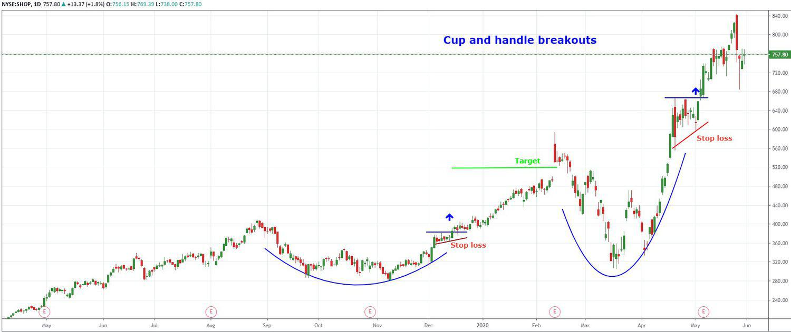

Trading strategies are systematic methods employed by traders to guide their decision-making processes within financial markets. These strategies are developed based on a variety of factors such as historical data analysis, market trends, and specific financial instruments. Among the array of trading strategies, breakout trading stands out for its simplicity and potential profitability, especially when market volatility is heightened. Breakout trading involves identifying key support and resistance levels and entering trades when the price breaks through these levels. This strategy capitalizes on the momentum following a breakout, when traders anticipate significant price movement in the direction of the break.

Breakout trading holds particular significance due to its straightforward approach and adaptability across various markets, including stocks, commodities, and forex. Its appeal lies in the concept of capturing large price movements shortly after they begin, offering traders the opportunity to enter and exit positions swiftly. Furthermore, breakout trading is often considered a low-risk strategy when implemented correctly, as it involves predefined levels for entry and exit points.



The rise of algorithmic trading, also known as algo trading, has revolutionized the way trading strategies are executed. Algorithmic trading utilizes computer algorithms to automatically place trades based on predetermined criteria, which can include timing, price, and volume. This method of trading has gained popularity due to its ability to operate at high speeds and execute trades with precision, thereby reducing human error and increasing efficiency.

As financial markets have become more complex and data-driven, the integration of breakout trading strategies with algorithmic trading systems has emerged as a potent combination. Algorithms can quickly analyze extensive datasets, process complex calculations, and execute breakout trading strategies faster than any human trader could. This integration not only enhances the performance of breakout strategies but also aligns them with modern technological advancements in trading.

The purpose of this article is to provide comprehensive insights into breakout trading and algorithmic trading strategies. Through detailed exploration, readers will gain an understanding of how these strategies function independently and in conjunction, as well as their application in real-world trading scenarios. By examining the principles and practices of these popular trading strategies, traders can better equip themselves to leverage both breakout and algorithmic trading for potentially higher returns.

## Table of Contents

## Understanding Breakout Trading

Breakout trading is a strategy that focuses on capturing potential price movements when a security's price moves beyond a previously established resistance or support level. This trading strategy is grounded in the principle that once a price 'breaks out' from these levels, it tends to exhibit increased volatility and directional momentum. 

In [breakout](/wiki/breakout-trading) trading, several patterns and indicators are commonly deployed. Classic patterns include rectangles, triangles, and head-and-shoulders, each suggesting potential breakout opportunities. Rectangles signal a breakout when the price moves beyond a consistent horizontal resistance or support. Triangles, whether ascending, descending, or symmetrical, indicate a breakout depending on the direction in which the price breaks the converging trend lines. The head-and-shoulders pattern is used to predict reversals, with breakouts occurring when the neckline is crossed.

Indicators play a pivotal role, with the Moving Average Convergence Divergence (MACD) and the Relative Strength Index (RSI) being particularly popular. The MACD helps signal [momentum](/wiki/momentum) changes, while the RSI identifies overbought or oversold conditions that might precede a price breakout.

Breakout trading involves two distinct breakout types: upward and downward. An upward breakout occurs when the price exceeds the resistance level, suggesting potential for further price increase. Conversely, a downward breakout is identified when the price falls below the support level, indicating potential for further decline.

Timing and [volume](/wiki/volume-trading-strategy) are critical elements in confirming breakouts. Volume is particularly significant; a breakout accompanied by high volume is often seen as more credible, as it suggests strong trader commitment. Conversely, breakouts on low volume might indicate a false breakout, where the price momentarily moves beyond a resistance or support level but then retracts.

Examples of breakout trading strategies vary across different markets. In the equity market, traders often use earnings announcements to anticipate breakout opportunities, as these events can cause significant price movements. In the foreign exchange market, economic news releases can trigger breakouts, with traders looking to capitalize on sudden market reactions. In commodities trading, inventory reports or geopolitical events might lead to breakout scenarios.

Breakout trading requires a keen understanding of market conditions and a disciplined approach to managing risk, often employing stop-loss orders to protect against false breakouts. By adhering to these principles and leveraging patterns and indicators, traders aim to harness the momentum generated during breakouts to achieve significant returns.

## Algorithmic Trading: An Overview

Algorithmic trading, commonly referred to as algo trading, involves using computer programs and systems to execute trades in the financial markets. These systems are based on a complex set of rules and parameters, enabling them to make decisions about buying or selling financial instruments. The primary aim of [algorithmic trading](/wiki/algorithmic-trading) is to leverage computational power to identify and capitalize on profitable trading opportunities more efficiently than human traders.

The evolution of algorithmic trading has been marked by rapid technological advancements and the increasing availability of data. In the 1970s and 1980s, electronic communication networks (ECNs) began to replace traditional trading floors, paving the way for more automated trading processes. By the early 2000s, with the advent of high-frequency trading ([HFT](/wiki/high-frequency-trading-strategies)), algorithmic trading started dominating the financial markets. Algorithms began to handle a substantial portion of the trading volume in major exchanges, utilizing speed and data processing capabilities that human traders could not match.

Algorithms can be programmed to execute a wide array of trading strategies, including breakout trading. In breakout trading, algorithms can monitor market data to identify when prices break through predefined support or resistance levels, signaling potential trading opportunities. By automatically executing trades at these points, algorithms can achieve more consistent results by taking advantage of real-time market dynamics and minimizing human reaction times.

The advantages of algorithmic trading are numerous. The speed at which algorithms can operate allows them to exploit minute price discrepancies that last only milliseconds. Precision is another key benefit; algorithms can execute trades at exact moments and specified quantities, reducing slippage and ensuring compliance with the defined trading strategy. Furthermore, algorithms can process massive volumes of data and operate across multiple markets, offering a level of diversification and risk management that is difficult to achieve manually.

However, algorithmic trading is not without its challenges and risks. One of the main challenges is the development of robust algorithms capable of adapting to rapidly changing market conditions. The market's [volatility](/wiki/volatility-trading-strategies) can lead to significant losses if the algorithms are not properly designed to handle various market scenarios. There is also the risk of technological failures or outages, which could result in missed opportunities or unintended trades. Additionally, the complexity of these systems often requires continuous monitoring and adjustments by skilled professionals to ensure optimal performance. Regulatory concerns also play a role, as increased scrutiny has been placed on algorithmic trading practices to prevent unethical behavior and market manipulation.

In conclusion, while algorithmic trading offers remarkable advantages in terms of speed, precision, and efficiency, it requires careful consideration of the inherent risks and constant optimization to maintain profitability. As technology continues to evolve, the role of algo trading in financial markets is likely to expand, necessitating a deeper understanding of both its capabilities and limitations.

## Integrating Breakout Trading with Algo Trading

Integrating breakout trading with algorithmic trading brings numerous advantages to traders seeking more efficient and precise execution of their strategies. Algorithms can significantly enhance the performance of breakout trading by automating decision-making processes, thus minimizing human error and emotional biases. This integration allows traders to capitalize on rapid market movements, which are often required in breakout scenarios, with increased speed and accuracy.

Algorithms improve the efficiency of breakout trading by continuously monitoring market conditions and executing trades at optimal moments, based on predefined criteria. This is particularly crucial in breakout trading, where timing is essential to capture the momentum of price movements. Algorithms can process vast amounts of data in real time, identifying breakout patterns across multiple assets and markets faster than any manual intervention could achieve.

For instance, traders can employ algorithms to automate breakout strategies by setting parameters such as price levels that signify a breakout, alongside volume thresholds that confirm the movement. Python, a popular language among quantitative traders, can be used to develop these algorithms. Below is an example of a simple Python script that monitors stock prices and executes a buy order once a specified breakout level is surpassed:

```python
import yfinance as yf

def breakout_trade(stock_symbol, breakout_level, volume_threshold):
    data = yf.download(stock_symbol, period='1d', interval='1m')
    current_price = data['Close'][-1]
    current_volume = data['Volume'][-1]

    if current_price > breakout_level and current_volume > volume_threshold:
        print(f"Breakout detected! Executing buy order for {stock_symbol}.")

# Example usage
breakout_trade('AAPL', 150.00, 100000)
```

Traders often use advanced algorithms such as moving averages crossovers or Bollinger Bands to refine breakout detection. More sophisticated software platforms, such as MetaTrader and TradingView, offer tools to customize and backtest algorithms, ensuring that they align with the trader's specific breakout strategy goals.

However, integrating algorithms into breakout trading is not without its challenges. One major consideration is latency, which refers to the time delay between signal generation and execution. In high-frequency trading environments, even milliseconds can impact the effectiveness of a breakout strategy. Additionally, market anomalies and unexpected events can lead to significant risks if algorithms are not robust enough or are poorly supervised.

Moreover, algorithmic trading systems require continuous monitoring and adjustment. Breakout conditions can change with market volatility, necessitating periodic reviews and modifications to the algorithm's parameters to maintain efficacy. Traders must also ensure that their algorithms comply with market regulations to avoid legal complications.

In summary, merging breakout trading strategies with algorithmic trading can lead to enhanced strategy performance by leveraging automation and precision. However, it is essential to be aware of the potential pitfalls, such as latency and the need for robust supervision, to effectively combine these approaches in modern trading environments.

## Real-World Examples and Case Studies

Breakout trading, when combined with algorithmic techniques, has showcased significant success in financial markets. This section presents real-world case studies that highlight the effectiveness of algorithmic breakout trading, the high returns achieved, lessons learned, and risk management strategies.

One notable example is the use of algorithmic breakout strategies in the foreign exchange market. A [hedge fund](/wiki/hedge-fund-trading-strategies) implemented an automated breakout system to capitalize on currency pair volatility around economic news releases. The algorithm was designed to identify and execute trades based on predefined breakout thresholds in specific currency pairs. This strategy harnessed the fast response time and precision of algorithmic trading, allowing the fund to capture substantial profits from sudden market movements triggered by news events.

The fund's success can be attributed to several factors. First, the algorithm was adept at processing real-time data, which ensured timely entry and [exit](/wiki/exit-strategy) points. The use of moving averages and Bollinger Bands as technical indicators helped in accurately identifying potential breakout points. Second, the algorithm incorporated risk management measures such as stop-loss orders to limit potential losses from false breakouts. This approach significantly reduced downside risks, enhancing the overall profitability of the strategy.

A valuable lesson learned from this case study is the importance of robust data analysis and [backtesting](/wiki/backtesting) in algorithmic trading. Before deploying the strategy in live markets, the algorithm underwent extensive testing against historical data, ensuring that it could cope with diverse market conditions. This thorough preparation allowed the trading system to perform effectively during live trading, highlighting the need for continuous evaluation and optimization of algorithmic models.

Another case study involves a proprietary trading firm utilizing algorithmic breakout strategies in equity markets. The firm designed a system that detected upward breakouts in stocks exhibiting strong momentum, complemented by high trading volume. The algorithm was programmed to execute trades once specific price patterns were identified, leading to substantial capital gains in a relatively short period.

In this scenario, the firm's success was reinforced by a meticulous risk management framework. The algorithm included features such as time-based exits for positions held, ensuring that trades were not exposed to overnight market risks. Additionally, diversification across multiple stocks reduced the overall risk, preventing the adverse impact of individual stock volatility on the portfolio.

These real-world examples underscore key takeaways for successful algorithmic breakout trading. Firstly, effective risk management is crucial; incorporating techniques like stop-loss orders, time-based exits, and diversification can significantly mitigate potential losses. Secondly, continuous learning and adaptation are vital for maintaining algorithmic strategies. Regular updates to the system based on market feedback and performance evaluations help in keeping the strategy optimized for changing market dynamics.

Finally, the successful integration of breakout methods with algorithmic systems highlights the importance of leveraging technology in trading. By combining breakout strategies with algorithmic precision, traders can achieve higher returns and more efficiently manage risks, paving the way for enhanced trading performance in financial markets.

## Tips and Best Practices

For traders embarking on breakout trading with algorithms, a structured approach is paramount to success. As you begin, consider these key tips and best practices:

1. **Starting with Backtesting**: Before deploying any algorithm in live markets, ensure thorough backtesting. This simulation process allows you to evaluate the historical performance of your breakout strategy across various market conditions. Use software like MetaTrader or NinjaTrader, which offer robust backtesting capabilities. Verify that your model can consistently identify breakouts without exposing the strategy to significant drawdowns.

2. **Optimizing Through Iteration**: Breakout trading requires continuous refinement. The process involves optimizing parameters such as entry and exit points and risk management thresholds. An evolutionary algorithm, like genetic algorithms, can systematically optimize these parameters. Here's a simple Python example using a genetic algorithm to optimize trade parameters:

   ```python
   from deap import base, creator, tools, algorithms
   import random

   # Create classes
   creator.create("FitnessMax", base.Fitness, weights=(1.0,))
   creator.create("Individual", list, fitness=creator.FitnessMax)

   # Attribute generator
   def attr_float():
       return random.uniform(0, 1)

   # Create individual and population
   toolbox = base.Toolbox()
   toolbox.register("attr_float", attr_float)
   toolbox.register("individual", tools.initRepeat, creator.Individual, toolbox.attr_float, n=2)
   toolbox.register("population", tools.initRepeat, list, toolbox.individual)

   # Example evaluating function
   def eval_strategy(individual):
       entry, exit = individual
       # Simplistic evaluation function as placeholder
       return entry - exit,

   toolbox.register("evaluate", eval_strategy)
   toolbox.register("mate", tools.cxBlend, alpha=0.5)
   toolbox.register("mutate", tools.mutGaussian, mu=0, sigma=0.1, indpb=0.2)
   toolbox.register("select", tools.selTournament, tournsize=3)

   # Genetic Algorithm
   def main():
       random.seed(42)
       pop = toolbox.population(n=50)
       algorithms.eaSimple(pop, toolbox, cxpb=0.5, mutpb=0.2, ngen=40, stats=None)
       return pop

   main()
   ```

3. **Embracing Continuous Learning**: Financial markets are dynamic, necessitating ongoing education and adaptation. Stay updated with industry trends and advancements. Platforms like Coursera, edX, and financial forums such as QuantConnect provide valuable learning resources ranging from basic algorithmic trading to advanced strategy development.

4. **Leveraging Professional Tools**: Utilize specialized software that enhances breakout trading. Trading platforms like TradingView offer customizable breakout indicators, while algorithmic trading platforms such as QuantConnect allow building and testing of algorithmic strategies in Python. These tools can facilitate strategy development and execution with greater efficiency and precision.

5. **Maintaining a Robust Risk Management Plan**: Effective risk management is crucial in algorithmic breakout trading. Consider implementing stop-loss and take-profit levels within your algorithms to prevent excessive loss and lock in profits. Additionally, always allocate only a portion of your capital to any single strategy, ensuring diversification.

6. **Feedback and Adjustment**: Regularly review trading results and adjust strategies based on performance data and market changes. The iterative feedback loop is vital for sustaining profitability and aligning strategies with prevailing market dynamics.

By adhering to these practices, traders can optimize their breakout trading strategies and effectively integrate algorithmic tools. The synergy of technical knowledge, constant learning, and innovative technology forms the foundation for success in algorithmic breakout trading.

## Conclusion

In summary, this article has explored the synergy between breakout trading and algorithmic trading, underscoring their pivotal roles in the modern financial markets. Breakout trading remains a favored strategy due to its focus on capitalizing on significant price movements, while algorithmic trading offers enhanced speed and precision that are invaluable in executing these strategies effectively. Together, they provide traders with powerful tools for maximizing potential returns.

The integration of breakout trading with algorithmic techniques presents numerous opportunities for both novice and experienced traders. By harnessing algorithms, traders can efficiently manage timing and volume, key factors crucial in verifying breakouts. This integration allows for the automation of strategies, potentially leading to more consistent and objective decision-making processes.

Looking ahead, the future of breakout and algorithmic trading is promising. As markets continue to evolve, the development of sophisticated algorithms and advances in technology, such as [machine learning](/wiki/machine-learning) and [artificial intelligence](/wiki/ai-artificial-intelligence), will likely lead to even more refined trading strategies. Innovations in data analysis and execution platforms will further enhance the accessibility and effectiveness of combining these trading approaches.

Embracing technology in trading strategies is not just a trend; it is a necessity for those looking to stay competitive. Traders are encouraged to continuously learn, adapt, and innovate, utilizing the wealth of resources and tools available today. By doing so, they can effectively navigate the complexities of financial markets and leverage the full potential of both breakout and algorithmic trading strategies.

## References & Further Reading

[1]: Bergstra, J., Bardenet, R., Bengio, Y., & Kégl, B. (2011). ["Algorithms for Hyper-Parameter Optimization."](https://papers.nips.cc/paper/4443-algorithms-for-hyper-parameter-optimization) Advances in Neural Information Processing Systems 24.

[2]: ["Advances in Financial Machine Learning"](https://www.amazon.com/Advances-Financial-Machine-Learning-Marcos/dp/1119482089) by Marcos Lopez de Prado

[3]: ["Evidence-Based Technical Analysis: Applying the Scientific Method and Statistical Inference to Trading Signals"](https://www.amazon.com/Evidence-Based-Technical-Analysis-Scientific-Statistical/dp/0470008741) by David Aronson

[4]: ["Machine Learning for Algorithmic Trading"](https://github.com/stefan-jansen/machine-learning-for-trading) by Stefan Jansen

[5]: ["Quantitative Trading: How to Build Your Own Algorithmic Trading Business"](https://www.amazon.com/Quantitative-Trading-Build-Algorithmic-Business/dp/1119800064) by Ernest P. Chan