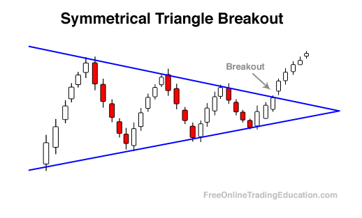

Breakout trading is a prominent strategy utilized in algorithmic trading, which involves identifying price levels that securities struggle to surpass, either on the upper or lower side. These critical price points are often referred to as resistance and support levels, respectively. In anticipation of a breakout, traders prepare to take action when the security's price breaks through these predetermined levels.

The essence of breakout trading is predicated on the principle that once a security breaches a specific price barrier, it is likely to continue moving in that direction, creating potential for significant profits. This concept is rooted in market psychology and the inherent momentum that accompanies breakouts, where a large number of orders are executed in a short period, often leading to a rapid price movement. 



Algorithmic trading, which involves the use of complex algorithms and automated systems, enhances the effectiveness of breakout trading strategies by allowing traders to execute trades with precision and speed that manual trading cannot match. These systems can be programmed to monitor multiple securities simultaneously, recognizing breakout signals and executing trades according to pre-defined criteria.

Furthermore, the integration of mathematical and statistical models aids in the identification of breakout signals, allowing for rigorous backtesting and refinement of strategies. For example, using Python, traders can employ libraries such as Pandas for data manipulation, and NumPy and SciPy for numerical computations, to evaluate historical price movements and identify recurring patterns conducive to profitable breakouts.

```python
import pandas as pd
import numpy as np

# Example of calculating moving averages to identify breakout signals
df = pd.read_csv('price_data.csv')  # Sample price data
df['Moving Average 20'] = df['Close'].rolling(window=20).mean()
df['Moving Average 50'] = df['Close'].rolling(window=50).mean()

# Signal if 20-day MA crosses above 50-day MA
df['Signal'] = np.where(df['Moving Average 20'] > df['Moving Average 50'], 1, 0)
```

Through the application of such mathematical analysis and technologies, [breakout](/wiki/breakout-trading) trading within algorithmic systems becomes not only a reactive measure but a proactive strategy aimed at maximizing trading margins. This introductory exploration sets a foundational understanding of how breakout trading is embedded within the broader scope of [algorithmic trading](/wiki/algorithmic-trading), elucidating the components essential for executing these strategies efficiently.

## Table of Contents

## What is a Breakout Trader?

A breakout trader employs specific strategies to capitalize on shifts in market dynamics by identifying and reacting to critical price levels known as support and resistance. These price levels are pivotal in determining the behavior of a security's price. The support level is a price point where buyers historically enter the market in sufficient numbers to halt or reverse a falling price. Conversely, the resistance level is where sellers have historically congregated to stop rising prices.

The fundamental strategy for breakout traders involves closely monitoring these predetermined levels. When the price moves beyond these thresholds, it signifies a breakout—the potential onset of a new price trend—and the breakout trader enters a position in the direction of the breakout. The underlying belief is that once these critical levels are breached, the security's price may continue moving in the direction of the breakout, thus presenting a lucrative opportunity.

Tools and indicators are crucial for breakout traders as they aid in identifying potential breakouts. Technical analysis is at the heart of this process. One commonly used tool is the moving average, which helps traders observe trends by smoothing out price data over a specified period. For instance, a moving average crossover can signal an impending breakout. Additionally, traders often utilize chart patterns such as triangles, rectangles, and head-and-shoulders, which naturally indicate areas of support and resistance.

Volume analysis serves as another critical component in breakout trading. Volume, the number of shares or contracts traded in a security or market, acts as a confirmation tool. A breakout accompanied by high [volume](/wiki/volume-trading-strategy) suggests greater conviction behind the price movement, thereby reducing the likelihood of a false breakout.

Indicators like the Relative Strength Index (RSI) and Bollinger Bands can also provide supplementary insights. The RSI measures the speed and change of price movements, helping traders identify potentially overbought or oversold conditions. Bollinger Bands, on the other hand, plot two standard deviations away from a simple moving average and are useful for visualizing [volatility](/wiki/volatility-trading-strategies) and potential breakouts.

By integrating these tools and continuously analyzing market conditions, breakout traders can improve their chances of identifying genuine breakouts and avoiding false signals, ultimately positioning themselves to exploit significant market shifts profitably.

## Core Principles of Breakout Trading

Breakout trading relies heavily on technical analysis to effectively identify key price thresholds that, once breached, might lead to significant price movements. A comprehensive understanding of technical analysis enables traders to discern these critical junctures, leveraging various tools to increase the probability of successful trades.

Traders commonly use chart patterns, such as triangles, flags, and rectangles, to visually represent potential breakout zones. These patterns are formed by connecting highs and lows, often signaling a consolidation points from which a breakout is likely. For instance, a symmetrical triangle often presages an impending breakout, with the direction determined by the direction of the breakout itself.

Technical indicators play a crucial role in breakout trading strategies by providing quantitative measurements of market conditions. Indicators such as moving averages, Bollinger Bands, and the Relative Strength Index (RSI) help traders gauge [momentum](/wiki/momentum) and volatility. These metrics can confirm breakouts by signaling increased momentum or significant shifts from equilibrium states. For example, a moving average crossover may signal a movement strong enough to sustain a breakout, while Bollinger Bands can indicate volatility contraction before expansion.

Volume analysis is a vital component in confirming breakouts. An increase in volume often accompanies a breakout, suggesting that the market supports the new price level. Conversely, a breakout on low volume might suggest a false breakout, lacking the necessary market enthusiasm. Traders frequently look for volume spikes coinciding with breakout points, which signal that market participants are actively engaging at the new price threshold.

Distinguishing between true breakouts and false signals requires a blend of patience, analysis, and experience. False breakouts, characterized by a price breaching a level only to retreat shortly after, can often lead to premature or failed trades. To mitigate risks associated with false signals, traders often set additional criteria for confirming breakouts, such as waiting for a security to close beyond a specific level or integrating additional indicators to cross-validate the breakout signal.

In practice, breakout trading strategies can be coded into algorithmic trading systems that automatically execute trades once specific conditions are met. Below is an example of a Python pseudocode implementing a simple breakout strategy using moving averages:

```python
import pandas as pd
import numpy as np

# Assume 'data' is a pandas DataFrame containing 'Close', 'High', and 'Low'.
# Calculate short and long moving averages
data['Short_MA'] = data['Close'].rolling(window=20).mean()
data['Long_MA'] = data['Close'].rolling(window=50).mean()

# Identify breakouts
data['Breakout_Signal'] = np.where(data['Short_MA'] > data['Long_MA'], 1, 0)

# Calculate volume spikes
data['Volume_Spike'] = data['Volume'] > data['Volume'].rolling(window=20).mean() * 1.5

# Confirm the breakout with a volume increase
data['Confirmed_Breakout'] = data['Breakout_Signal'] & data['Volume_Spike']

# Execute trades based on confirmed breakouts
data['Position'] = data['Confirmed_Breakout'].shift(1)

# Calculate returns
data['Returns'] = data['Position'] * (data['Close'].pct_change())

cumulative_return = (data['Returns'] + 1).cumprod().iloc[-1]
print(f'Cumulative Return: {cumulative_return}')
```

This strategy applies short-term and long-term moving averages to identify potential breakouts, using volume spikes to confirm signals, thus reducing the likelihood of acting on false breakouts. By combining technical analysis with algorithmic execution, traders can systematically approach breakout trading while maintaining disciplined risk management.

## Types of Breakout Patterns

Breakout patterns are essential components in identifying potential market movements and opportunities within algorithmic trading. These patterns, which include triangles, rectangles, and wedges, signal the possibility of a security's price breaking through predefined support or resistance levels. Recognizing and accurately interpreting these patterns can be instrumental in executing successful trades.

### Triangles

Triangles are among the more popular breakout patterns, categorized into ascending, descending, and symmetrical triangles. Each type presents a different potential market direction.

- **Ascending Triangle**: This pattern forms when a security's price encounters a horizontal resistance level while its lows progressively increase. Traders often expect a bullish breakout once the price breaches the resistance. The pattern is characterized by a series of higher lows converging into a single resistance level.

- **Descending Triangle**: Appearing during potential bearish trends, this pattern occurs when the price faces a horizontal support line, but the highs get progressively lower. Observers wait for bearish breakouts as the price is expected to fall below the support level.

- **Symmetrical Triangle**: In this pattern, neither the upper nor the lower trend is decisively dominant. The highs become lower, and the lows become higher, converging into an apex. Traders anticipate a breakout but are unsure of its direction initially, often waiting for confirmations via high trading volumes.

### Rectangles

Rectangle patterns occur when the price moves within a horizontal range, characterized by clear support and resistance lines. This creates a prolonged consolidation period, with traders expecting a breakout in the direction of the prevailing trend before the rectangle's formation.

- **Bullish Rectangle**: Is typically a continuation pattern, where the price consolidates within a range during an upward trend and breaks out in the direction of the original trend.

- **Bearish Rectangle**: This forms during a downtrend, with consolidation areas resulting in price correction before breaking lower, continuing the downward movement.

### Wedges

Wedges form as the price compresses within converging trend lines. This pattern anticipates potential reversals rather than continuation of current trends, with a clear breakout direction expected.

- **Rising Wedge**: Generally viewed as bearish, this wedge forms during an upward trend, with the price reaching higher highs and higher lows at a slowing pace. The anticipated breakout here is downward as the market momentum fades.

- **Falling Wedge**: Considered bullish, the falling wedge develops in a downtrend, where the price descends but at a decreasing rate. The expected breakout is upward, signaling a potential trend reversal.

### Patterns in Algo Trading

In algorithmic trading, these breakout patterns can be leveraged to automate trading decisions. By coding rules such as monitoring volume alongside price movements, algorithms can confirm the breakout strength and validity. Here is a simple Python pseudo-code for a triangle pattern recognition:

```python
def detect_symmetrical_triangle(prices):
    upper_trend_line = [max(prices[i], prices[i+1]) for i in range(len(prices)-1)]
    lower_trend_line = [min(prices[i], prices[i+1]) for i in range(len(prices)-1)]

    if upper_trend_line converges_to(lower_trend_line):
        return "Potential Symmetrical Triangle Pattern"

    return None
```

These patterns and their respective strategies must be applied contextually to market conditions. Whether employing continuation or reversal strategies, traders should incorporate complementary indicators and robust [backtesting](/wiki/backtesting) to fine-tune their algorithms for higher accuracy and profitability.

## Implementing Breakout Strategies in Algo Trading

Algorithmic trading offers a systematic approach to breakout strategies by automating the identification and execution of trades when specific price levels are breached. By setting pre-defined rules and conditions based on technical indicators, algorithms can efficiently track multiple markets and execute trades in real-time. Implementing these strategies begins with the accurate coding of conditions that define potential breakouts.

### Automating Breakout Strategies

The first step in automating breakout strategies is to precisely define the breakout conditions. These conditions often involve the price crossing above resistance or below support, confirmed by additional indicators such as moving averages or volume increases. Automation provides the advantage of consistently applying these conditions without the delay and emotional bias that can affect manual trading.

### Example Algorithm

Consider a basic breakout strategy automated using Python and a popular algorithmic trading library, such as `[backtrader](/wiki/backtrader)` or `zipline`. Here's a simplified example using Python pseudo-code:

```python
class BreakoutStrategy(bt.SignalStrategy):
    def __init__(self):
        self.data_close = self.datas[0].close
        self.sma = bt.indicators.SimpleMovingAverage(self.datas[0], period=20)

    def next(self):
        if self.data_close[0] > self.sma[0] and self.data_close[-1] <= self.sma[-1]:
            self.buy()
        elif self.data_close[0] < self.sma[0] and self.data_close[-1] >= self.sma[-1]:
            self.sell()
```

This example demonstrates a moving average breakout strategy. It signals a buy when the current closing price exceeds the moving average, while the previous close was below it, indicating a potential breakout above resistance.

### Backtesting for Optimization

Backtesting is a critical component of implementing breakout strategies in algorithmic trading. It involves testing the strategy against historical data to ensure its viability and effectiveness. This retrospective analysis can reveal the strategy's potential return, risk metrics, and likelihood of success under various market conditions. During backtesting, traders adjust parameters like stop-loss levels, breakout thresholds, and confirmation indicators to optimize strategy performance.

### Tools and Infrastructure

Implementing robust algorithmic breakout strategies requires a robust infrastructure that includes:

- **Data Feeds**: Access to real-time and historical market data is crucial for making informed decisions and backtesting strategies.
- **Computational Resources**: High-performance computing resources to handle large datasets and execute trades swiftly.
- **Cloud Platforms**: Services like AWS or Azure provide scalable resources and security, ensuring that trading systems run efficiently and reliably.
- **Risk Management Systems**: Automatic stop-loss orders and risk assessment tools are essential to safeguard capital from false breakouts and adverse market movements.

Algorithmic trading setups benefit significantly from integration with modern technologies and analytic tools to refine and adjust breakout strategies dynamically. As these systems evolve, they can incorporate [machine learning](/wiki/machine-learning) models to enhance their predictive accuracy and adaptability in volatile markets.

## Risk Management and Maximizing Wins

Effective risk management is crucial for successful breakout trading in algorithmic trading due to the high potential for false breakouts. False breakouts occur when a security's price moves beyond a key level, triggering traders to act, only to reverse suddenly, leading to potential losses. To manage these risks, traders must employ strategies that balance between capturing real breakouts and minimizing damage from false signals.

### Stop-Loss Orders

Setting appropriate stop-loss orders is a fundamental risk management technique. A stop-loss order automatically sells a security when it reaches a certain price, limiting potential losses. Traders can determine stop-loss levels by considering factors such as volatility, historical price movements, and their own risk tolerance. A common approach is to set stop-loss orders slightly below the breakout level to allow for minor fluctuations. This method prevents minor dips from prematurely closing positions, while still protecting against significant downturns.

**Example:**

```python
def calculate_stop_loss(entry_price, volatility, risk_factor=0.5):
    # Calculate stop loss as a function of volatility and risk tolerance
    stop_loss = entry_price - (volatility * risk_factor)
    return stop_loss

entry_price = 105
volatility = 2.5
stop_loss = calculate_stop_loss(entry_price, volatility)
print(f"Stop-loss set at: {stop_loss}")
```

### Disciplined Entry and Exit Strategies

Discipline in both entry and [exit](/wiki/exit-strategy) strategies is vital for maximizing wins. Traders should establish clear criteria for entering a trade, usually based on the confirmation of a breakout through volume spikes or technical indicators. Exiting the trade requires similar discipline, either setting profit targets or employing trailing stops to secure gains as the security's price moves in favor. A trailing stop is a dynamic stop-loss order that adjusts with favorable price movements, locking in profits while still allowing room for the trade to grow.

### Risk Management Techniques

1. **Position Sizing:** Determine the appropriate size of each trade based on the total trading capital and the percentage of that capital one is willing to risk on a single trade. This calculated approach prevents overexposure to a single trade that could lead to significant losses.

2. **Diversification:** Avoid concentrating funds in a single asset. Diversifying across different securities, sectors, or strategies can mitigate the impact of a single trade's failure.

3. **Backtesting and Optimization:** Algorithmic traders should conduct thorough backtesting on their strategies using historical data. This testing helps identify potential flaws and optimizes the strategy before deploying it in live markets. By doing so, traders can better predict how their strategies might perform under various market conditions.

4. **Psychological Preparedness:** Traders should prepare emotionally for losses and avoid the temptation to deviate from their strategy when faced with unexpected market events. Maintaining a clear mindset helps adhere to predefined rules and objectives, reducing the risk of emotional decision-making.

### Conclusion

In breakout trading, effective risk management is essential to counter the challenges posed by false breakouts and maximize potential wins. Implementing prudent stop-loss orders, maintaining disciplined trading strategies, employing diverse risk management techniques, and being psychologically prepared are all integral components to achieving long-term trading success. Risk management not only protects traders from potential downsides but also enhances the overall performance of breakout trading strategies.

## Real-World Applications and Examples

Examining real-world applications of breakout trading strategies offers valuable insights into their practical effectiveness across varying market conditions. A study of historical data, market events, and successful strategies by experienced traders can illuminate the nuances of employing breakout trading techniques.

### Case Study: Breakout Strategy During Volatile Markets

A noteworthy example of breakout trading's effectiveness occurred during periods of increased market volatility. For instance, during the Brexit vote announcement in 2016, several currency markets exhibited breakout opportunities as prices reacted sharply to unexpected news. Traders who had positioned themselves based on anticipated support and resistance levels were able to capitalize on these swift price movements.

#### Strategy Adaptation

Successful traders during this period were those who adapted their breakout strategies to account for heightened volatility. By widening stop-loss orders and adjusting their profit targets, these traders managed risk more effectively and maximized profit potential. This scenario underscores the importance of flexibility and real-time analysis in breakout trading.

### Algorithmic Breakout Trading

In algorithmic trading, breakout strategies can be automated to rapidly respond to market movements. Consider the use of a Moving Average Crossover strategy, where a short-term moving average crosses above a long-term moving average, signaling a potential breakout.

```python
import pandas as pd
import numpy as np

# Example setup for moving average crossover breakout strategy
data = pd.read_csv('market_data.csv')  # Load market data
short_window = 40
long_window = 100

# Calculate moving averages
data['short_mavg'] = data['Close'].rolling(window=short_window, min_periods=1).mean()
data['long_mavg'] = data['Close'].rolling(window=long_window, min_periods=1).mean()

# Generate signals
data['signal'] = 0.0
data['signal'][short_window:] = np.where(data['short_mavg'][short_window:] 
                                         > data['long_mavg'][short_window:], 1.0, 0.0)   

# Create positions
data['positions'] = data['signal'].diff()

# Print first few rows to check
print(data.head())
```

### Lessons from Failed Breakouts

Not all breakout attempts result in successful trades. A common pitfall occurs during false breakouts, where the price briefly moves beyond a key level only to reverse direction. For instance, in late 2020, a number of traders faced challenges with false breakouts in tech stocks. Such occurrences underscore the necessity of integrating confirmatory indicators, such as volume spikes or waiting for a daily close beyond certain levels to confirm a breakout.

### Continual Learning

To thrive in breakout trading, continuous learning and strategy refinement are essential. Traders often review past performance and adapt their algorithms by incorporating lessons from both successful and unsuccessful trades. The fast-paced nature of financial markets demands a proactive approach to strategy adjustment, ensuring traders are well-positioned to capitalize on future opportunities.

In conclusion, real-world applications and case studies of breakout trading highlight both the strategy's potential profitability and the critical need for risk management and adaptability. By studying past examples and employing algorithmic solutions, traders can improve their likelihood of capitalizing on market breakouts while mitigating risks associated with false signals.

## Conclusion

Breakout trading in algorithmic trading effectively merges technical analysis with advanced algorithmic systems to leverage market opportunities. This methodology focuses on identifying critical price thresholds and positions traders to capitalize on market momentum once these barriers are breached.

Despite the inherent complexities, breakout trading offers significant advantages when meticulously executed with robust risk management protocols. By automating breakout strategies, traders can systematically implement and manage positions, reducing emotional decision-making and enhancing consistency. Moreover, pseudo-code or programming languages like Python can be employed to write algorithms that efficiently detect breakouts and execute trades. For instance, a simple Python script using libraries such as pandas and NumPy can automate the detection of breakout patterns and execute trades based on predefined rules.

```python
import pandas as pd
import numpy as np

# Sample code to identify simple breakouts
def breakout_trading_strategy(data, price_column, breakout_level):
    data['Position'] = 0
    data['Position'][data[price_column] > breakout_level] = 1  # Buy signal
    data['Position'][data[price_column] < breakout_level] = -1  # Sell signal

    # Calculate returns
    data['Returns'] = data['Position'].shift(1) * (data[price_column].pct_change())

    # Cumulative returns
    cumulative_returns = np.exp(data['Returns'].cumsum())

    return cumulative_returns

# Example use with stock data
# stock_data = pd.read_csv('stock_data.csv')
# breakout_level = stock_data['Price'].max() * 1.01  # Set breakout level as 1% above previous max
# returns = breakout_trading_strategy(stock_data, 'Price', breakout_level)
```

In an ever-evolving financial environment, the adaptability and scalability of breakout strategies present distinct benefits. These strategies are flexible enough to be tailored to varying market conditions, offering a competitive edge when market volatility increases. The fast-paced nature of modern trading necessitates continuous improvement and adaptation of algorithms to navigate complex market dynamics successfully.

Ongoing education and refinement in algorithmic techniques remain vital. As new technologies and methodologies emerge, they provide traders with improved tools to enhance breakout trading strategies. Hence, continuous learning and adaptation are imperative to maintain a competitive advantage in algorithmic trading. Such an approach not only harnesses current technological advancements but also fosters resilience amidst the uncertainties that characterize the financial markets.

## References & Further Reading

[1]: Bergstra, J., Bardenet, R., Bengio, Y., & Kégl, B. (2011). ["Algorithms for Hyper-Parameter Optimization."](https://papers.nips.cc/paper/4443-algorithms-for-hyper-parameter-optimization) Advances in Neural Information Processing Systems 24.

[2]: ["Advances in Financial Machine Learning"](https://www.amazon.com/Advances-Financial-Machine-Learning-Marcos/dp/1119482089) by Marcos Lopez de Prado

[3]: ["Evidence-Based Technical Analysis: Applying the Scientific Method and Statistical Inference to Trading Signals"](https://www.amazon.com/Evidence-Based-Technical-Analysis-Scientific-Statistical/dp/0470008741) by David Aronson

[4]: ["Machine Learning for Algorithmic Trading"](https://github.com/stefan-jansen/machine-learning-for-trading) by Stefan Jansen

[5]: ["Quantitative Trading: How to Build Your Own Algorithmic Trading Business"](https://books.google.com/books/about/Quantitative_Trading.html?id=j70yEAAAQBAJ) by Ernest P. Chan