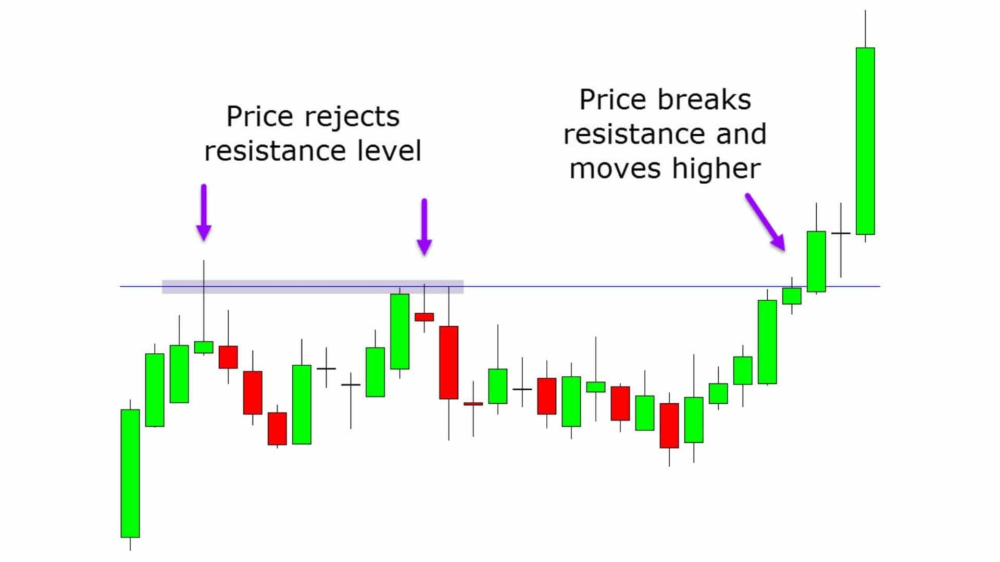

At its core, breakout trading is a strategy where investors look for significant activity above or below a defined price range, signifying the potential start of a strong directional move.

In today's fast-paced trading environment, where information is instantaneous and markets are more interconnected than ever, breakout trading has become a critical component in a trader's arsenal. This method thrives on volatility and liquidity, elements that are abundant in the modern trading landscape, making it a strategy well-suited for the contemporary trader who must navigate swiftly through waves of market sentiment and global economic events.

This guide is your compass through the tumultuous seas of breakout trading, providing an in-depth exploration of its strategies and nuanced analysis.

## Table of Contents

## Breakout Trading Decoded

Breakout trading is a tactical approach where traders seek to identify and capitalize on price moves as they break through a predefined resistance level or fall below a support level. These levels, often established through prior price history, are considered significant barriers that, when breached, signal a potential surge in trading activity and directional momentum. This strategy relies on the premise that once a stock or asset breaks through this barrier, significant volatility and price movement are likely to follow.

The strategy's historical roots trace back to the earliest days of trading, where traders would recognize patterns formed by price movements on physical ticker tapes. Over time, as markets evolved with electronic trading and instant global communication, breakout trading has adapted, becoming more sophisticated with the introduction of technical analysis tools. Yet, the core concept remains unchanged: identify the point of change and enter the market at the cusp of momentum.

Psychologically, breakout trading aligns with the human propensity to follow the crowd. It taps into the market's collective emotion, riding the wave of traders' reactions to news, earnings, and other market events. A breakout often triggers a herd mentality, enticing more traders to act, thus fueling the price movement further. Recognizing these psychological triggers is crucial as they often precede the technical confirmation of a breakout, giving astute traders an edge in anticipating market moves.

## Identifying Breakout Patterns and Signals

Identifying breakout patterns and signals is both an art and a science, requiring a blend of technical analysis and insight into market fundamentals. Chart patterns are the trader's map, marking the path that prices have traveled and suggesting where they might go next. Classic patterns like triangles, flags, and rectangles set the stage for breakouts by compressing price action into increasingly narrower ranges until the pent-up energy releases in a decisive move.

Technical indicators serve as the compass to navigate these patterns. Volume-based indicators like **On-Balance Volume (OBV)** can validate the strength of a breakout, while momentum oscillators such as the **Relative Strength Index (RSI)** or **Moving Average Convergence Divergence (MACD)** can signal whether the asset is overbought or oversold as it approaches critical levels. The break of a moving average can also act as a signal, with traders often looking for price action to move beyond a significant short-term moving average, such as the 20-day or 50-day, to confirm a breakout.

But chart patterns and technical indicators tell only part of the story. Breakouts often coincide with fundamental catalysts—earnings announcements, economic data releases, or sector-wide news that can shift the demand-supply equation. A savvy breakout trader will keep their finger on the pulse of the market, aligning technical setups with fundamental events to pinpoint the most opportune moments for a breakout[1].

## Advanced Breakout Strategies

Advanced breakout strategies elevate the basic concept of breakout trading by incorporating sophisticated entry and exit techniques, rigorous risk management, and a nuanced understanding of market sentiment.

Entry into a breakout trade is often predicated on **confirmation**. Traders may seek additional confirmation of a breakout by waiting for the price to retest the broken level—a process known as 'throwback'—which can act as a new support or resistance. This strategy reduces the likelihood of falling victim to a false breakout. Setting precise entry points through buy-stop orders just above resistance levels for long positions, or sell-stop orders just below support levels for short positions, enables traders to enter the market at the most advantageous moments.

Planning exits requires a balance between allowing profits to run and protecting gains already made. A common method is to set a target price at a level where previous price action has shown a reversal could occur, often using Fibonacci extensions or pivot point levels. Alternatively, a trailing stop-loss can be employed, which moves with the price, locking in profits while providing room for the trade to grow.

Risk management is the cornerstone of any successful trading strategy. Breakout traders often determine their risk exposure before entering a trade, setting stop-loss orders to a predetermined percentage below the entry point for long positions, or above for short positions. This tactic ensures that potential losses are capped and manageable.

Integrating **sentiment analysis** and market conditions means staying attuned to the emotional pulse of the market and broader economic indicators. Tools like the CBOE Volatility Index (VIX) can provide insights into market volatility, while sentiment indicators such as the Put/Call Ratio offer clues about the general mood of traders. Seasoned traders also keep an eye on news feeds and economic calendars to anticipate market-moving events.

## The Psychology of Breakout Trading

The psychology of breakout trading pivots on a trader's ability to maintain a disciplined mindset and emotional control amidst the markets' tumultuous behavior. Breakout traders must navigate the delicate balance between patience, waiting for the right breakout signal, and decisiveness, acting swiftly once the criteria for entry are met. Emotional discipline is especially tested during periods of market volatility, where the fear of missing out (FOMO) can tempt traders into premature entry, or the reluctance to realize a loss can lead to holding onto a falling position longer than one should.

Behavioral finance provides valuable insights into common psychological biases that can impair trading decisions. Breakout traders must be vigilant against confirmation bias, the tendency to favor information that confirms one's existing beliefs, which can lead to misinterpreting signals for a breakout. They must also guard against the disposition effect, which predisposes traders to sell winning positions too quickly and hold onto losing ones for too long.

## Limitations and Pitfalls

Breakout trading, while potent, is not without its limitations and inherent risks. A critical limitation is the occurrence of **false breakouts**, where price moves beyond a key level but then reverses direction, potentially leading to losses. This can result from low volume during the breakout, indicating a lack of commitment from the market, or from traders who are adept at recognizing and capitalizing on the patterns of behavior that indicate a false breakout.

Another pitfall is **market volatility**, which can be both a boon and a bane for breakout traders. Sudden price spikes can trigger stop-loss orders prematurely, exiting trades before the anticipated move materializes. Additionally, in highly volatile markets, the price can overshoot reasonable targets, only to reverse sharply, leaving profits on the table or turning potential gains into losses.

Common mistakes in breakout trading include **over-leveraging**, where traders take on excessive risk, hoping for larger gains from breakout moves. This can magnify losses when the market moves against the position. Another mistake is neglecting thorough backtesting of breakout strategies, which is essential to understand how a strategy might perform under various market conditions.

To avoid these pitfalls, traders should incorporate volume analysis to confirm breakouts, use volatility-adjusted stop losses to avoid being stopped out by normal market noise, and maintain discipline in following a well-tested trading plan. It's also recommended to continuously review and adapt strategies to align with current market conditions.

## Conclusion

In summary, mastering breakout trading is an ongoing journey that encompasses a deep understanding of market structures, a keen eye for technical analysis, and the agility to adapt to market dynamics. The key takeaways from this guide emphasize the importance of recognizing valid breakout patterns, employing robust risk management practices, and the necessity of emotional discipline in making informed trading decisions.

As markets evolve and new trends emerge, the successful breakout trader must remain a perpetual student of the market, continually refining their strategies and expanding their knowledge base. This requires diligence, a commitment to learning, and an understanding of the psychological nuances that can impact decision-making.

For those committed to excelling in breakout trading, the call to action is clear: seek out quality education and practical experience. Utilize simulation tools to hone your skills, engage with trading communities for shared insights, and stay abreast of regulatory changes that could impact your trading approach.

This guide is a foundation, but the real growth happens when you apply these principles in live markets. Resources such as the Chartered Market Technician (CMT) program offer structured learning on technical analysis, while online forums like TradingView provide platforms to discuss and develop trading ideas with peers.

Embrace the journey, stay disciplined, and remember that the path to breakout trading mastery is as much about personal development as it is about strategy.

💡 **Read more:**

- Trading strategies papers with code on [Equities](https://wiki.paperswithbacktest.com/trading-strategies/equities), [Cryptocurrencies](https://wiki.paperswithbacktest.com/trading-strategies/cryptocurrencies), [Commodities](https://wiki.paperswithbacktest.com/trading-strategies/commodities), [Currencies](https://wiki.paperswithbacktest.com/trading-strategies/currencies), [Bonds](https://wiki.paperswithbacktest.com/trading-strategies/bonds), [Options](https://wiki.paperswithbacktest.com/trading-strategies/options)
- [A curated list](https://github.com/paperswithbacktest/awesome-systematic-trading) of awesome libraries, packages, strategies, books, blogs, and tutorials for systematic trading
- [A bunch of datasets](https://huggingface.co/paperswithbacktest) for quantitative trading
- [A website to help you](https://paperswithbacktest.com/) become a quant trader and achieve financial independence

## References & Further Reading

[1]: ["Encyclopedia of Chart Patterns"](https://www.amazon.com/Encyclopedia-Chart-Patterns-Thomas-Bulkowski/dp/0471668265) by Thomas Bulkowski