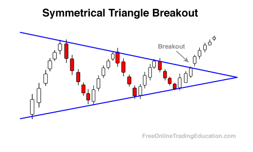

Algorithmic trading has transformed the landscape of financial markets by enabling traders to identify and exploit patterns with precision and speed, harmonizing data analysis and automated execution. Among such strategies, triangle breakout patterns serve as a significant element, assisting traders in anticipating market movements and optimizing trading decisions.

Triangle breakout patterns represent specific chart formations that signal potential shifts in market direction. These patterns are formed when price movements experience a converging trend, marked by the configuration of two converging trendlines. They can indicate either continuation or reversal, making them valuable for predicting future price movements. Crucial to algorithmic trading, understanding the detection and execution of trades based on these breakouts can lead to substantial financial benefits.



In this article, we will start by explaining the fundamental characteristics of triangle patterns. Various types, including symmetrical, ascending, and descending triangles, each offer unique insights into market behavior. For instance, an ascending triangle often suggests an upward breakout, aligning with a bullish market sentiment, while a descending triangle might indicate a possible downward breakout, reflecting bearish tendencies.

Furthermore, integrating triangle breakout patterns into algorithmic strategies involves intricate methodologies that require a balance of technical precision and trading acumen. Traders can develop algorithms to deploy automatic trades by recognizing these formations and responding to breakout signals. This introduces a layer of efficiency that minimizes human error and removes emotional bias from trading decisions.

For those intending to adopt these strategies in their trading routines, practical examples of backtesting will be discussed. Backtesting involves applying the strategy on historical data to validate its effectiveness and make necessary adjustments before real-time application. Detailed examples will guide traders on optimizing their algorithms for higher success rates and reduced exposure to market anomalies.

The article will conclude with essential tips and resources designed to enhance trading efficiency, providing a comprehensive understanding for traders aiming to integrate triangle breakout techniques into their algorithmic trading practices.

## Table of Contents

## Understanding Triangle Patterns

Triangle patterns are significant chart formations in technical analysis, marked by the convergence of two trend lines drawn from price peaks and troughs. These formations often suggest a pause in the existing market trend, possibly preceding a [breakout](/wiki/breakout-trading) in the same or opposite direction. There are three main types of triangle patterns: symmetrical, ascending, and descending triangles, each with distinct implications for future price movements.

Symmetrical triangles occur when there is a period of consolidation marked by lower highs and higher lows. This pattern forms a triangle shape as the price oscillates within these converging lines. Symmetrical triangles are neutral, often indicating that the market is poised for a breakout. The direction of the breakout typically follows the prevailing trend, although it can break either upward or downward, suggesting traders should await confirmation before entering positions.

Ascending triangles are generally considered bullish formations. They emerge during uptrends, where there is a flat upper trend line coupled with a series of higher lows, suggesting rising buying interest. The resistance level is consistently tested, whereas the higher lows indicate increasing bullish sentiment. A breakout from an ascending triangle often happens in the direction of the existing trend — upwards, marking a continuation of the bullish trend.

In contrast, descending triangles are indicative of bearish markets. These patterns display a flat lower trend line with a sequence of lower highs, showcasing waning buying pressure and sustained selling interest. Forming during downtrends, the descending triangle often signals a continuation of the bearish trend upon a downside breakout, as the support level is breached.

Overall, triangle patterns act as crucial indicators for technical traders, offering potential insights into market dynamics and guiding strategic trade decisions. Utilizing these patterns, traders can anticipate and react to possible breakout opportunities prompted by these distinctive chart formations.

## Triangle Breakout Strategies in Algo Trading

In [algorithmic trading](/wiki/algorithmic-trading), triangle breakout strategies involve developing trading algorithms that identify and leverage breakout opportunities from triangular chart formations. These strategies seek to capitalize on the price movements that often follow the breakouts from symmetrical, ascending, or descending triangles.

Algorithmically detecting a breakout requires monitoring price movements for penetrations beyond the triangle's boundaries. This is often done in conjunction with technical indicators such as [volume](/wiki/volume-trading-strategy) surges, which serve as confirmation. Volume is a critical [factor](/wiki/factor-investing), as a breakout accompanied by strong volume is generally regarded as more reliable. For instance, a trader might set a condition where the volume needs to exceed the 20-period moving average volume by a certain percentage for the breakout to be considered valid.

Python is a popular programming language for implementing these strategies due to its extensive libraries for financial data analysis and algorithmic trading. Libraries such as Pandas for data manipulation, NumPy for numerical operations, and Matplotlib for visualization are commonly used. Additionally, more specialized libraries like TA-Lib (Technical Analysis Library) provide functions for detecting and validating chart patterns, including triangle formations.

Here's a basic example of how one might programmatically detect a triangle pattern and subsequent breakout:

```python
import numpy as np
import pandas as pd
import matplotlib.pyplot as plt
from talib import abstract

# Sample function to detect triangle patterns
def detect_triangle(data, window=14):
    highs = data['High'].rolling(window).max()
    lows = data['Low'].rolling(window).min()
    is_triangle = (data['Close'] <= highs) & (data['Close'] >= lows)
    return is_triangle

data = pd.read_csv('historical_data.csv')

# Detect potential triangle patterns
data['Triangle'] = detect_triangle(data)

# Example breakout condition using volume
data['Breakout'] = (data['Close'] > data['High'].shift(1)) & (data['Volume'] > data['Volume'].rolling(20).mean())

# Plotting the results
plt.plot(data['Close'])
plt.plot(data[data['Triangle']]['Close'], 'go')
plt.plot(data[data['Breakout']]['Close'], 'ro')
plt.show()
```

In this code, the `detect_triangle` function identifies periods where a price might be within a triangle formation based on high and low price rolling windows. The breakout condition checks for a price breakout above the previous high with a concurrent volume spike.

Upon detection of a valid breakout, algorithms can automatically execute trading orders—either initiating long positions for upward breakouts or short positions for downward breakouts. This automation not only speeds up the execution process but also minimizes human error and emotional bias, which are significant factors in manual trading decisions.

The precision and timing offered by algorithmic trading are major advantages, as they can execute trades in milliseconds, crucial in fast-moving markets where breakout opportunities might be fleeting. As a result, algorithms enhance the likelihood of capitalizing effectively on market consolidations and subsequent breakouts.

## Backtesting Triangle Breakout Strategies

Backtesting is essential to evaluate the viability of triangle breakout strategies prior to their deployment in live trading environments. By leveraging historical data, traders can emulate the performance of their algorithmic strategies across various market conditions. This process aids in the identification of effective parameter settings, ultimately refining strategy execution.

The primary focus of [backtesting](/wiki/backtesting) lies in three critical domains: first, identifying false breakouts that could lead to premature or erroneous trade executions; second, optimizing entry and [exit](/wiki/exit-strategy) points to maximize potential gains and minimize losses; and third, managing risk-reward ratios to ensure sustainable trading performance.

A key reference in this space is the research conducted by Thomas Bulkowski, which indicates that successful ascending triangle breakouts typically result in an average price increase of 44%. Such [statistics](/wiki/bayesian-statistics) provide a benchmark against which traders can measure the efficacy of their backtested strategies. Employing comparable metrics, traders can analyze whether their backtested results align with or exceed these historical averages.

Backtesting can be conducted using various software tools that support historical market data analysis. Python, with libraries such as Pandas for data manipulation and matplotlib for visualization, is particularly effective for this purpose. Here's a simplified example of how such a backtesting process might look in Python:

```python
import pandas as pd
import numpy as np
import matplotlib.pyplot as plt

# Assume `data` is a DataFrame with 'Date', 'Open', 'High', 'Low', 'Close'
def backtest_triangle_breakout(data, lookback=20):
    # Identify triangle patterns
    data['Highs'] = data['Close'].rolling(window=lookback).max()
    data['Lows'] = data['Close'].rolling(window=lookback).min()

    breakouts = []

    for i in range(lookback, len(data)):
        if data['Close'][i] > data['Highs'][i-1]:  # Upward breakout
            breakouts.append((data['Date'][i], 'Buy'))
        elif data['Close'][i] < data['Lows'][i-1]:  # Downward breakout
            breakouts.append((data['Date'][i], 'Sell'))

    # Analyze outcomes and compute statistics
    results = analyze_breakouts(breakouts, data)

    return results

def analyze_breakouts(breakouts, data):
    total_return = 0
    for (date, action) in breakouts:
        # Simulate buy/sell action
        price = data.loc[data['Date'] == date, 'Close'].values[0]
        # Placeholder for logic to calculate profit/loss for each trade
        # Example logic would go here

    return total_return

# Visualizing breakouts and trades
plt.figure(figsize=(12,6))
plt.plot(data['Date'], data['Close'], label='Close Price')
plt.scatter(data['Date'], data['Highs'], label='Potential Breakouts', color='red', marker='^')
plt.scatter(data['Date'], data['Lows'], label='Potential Breakdowns', color='blue', marker='v')
plt.title('Triangle Breakouts Backtest')
plt.legend()
plt.show()
```

Through comprehensive backtesting, traders can refine their algorithms to achieve higher success rates and reduce exposure to market anomalies. This iterative process of testing and optimization ensures that the trading strategy is robust and able to adapt to varying market dynamics.

## Addressing False Breakouts

False breakouts occur when the price breaks through the boundaries of a triangle pattern only to revert back, often leading to potential trading losses. To address such scenarios in algorithmic trading, implementing secondary confirmations is crucial. One effective method involves analyzing trading volume, as genuine breakouts often accompany a surge in volume. When coding an algorithm, traders can include a condition to check if the volume exceeds a predefined moving average level at the time of breakout, thereby filtering out weaker signals.

Additionally, integrating technical filters such as moving averages or [momentum](/wiki/momentum) oscillators can help prevent premature entries. For example, a simple moving average (SMA) can be used to track price trends and confirm breakouts. If the price not only breaks out of the triangle but also crosses above or below a relevant SMA, this could strengthen the signal's validity. In Python, the talib library provides a set of functions for calculating such indicators with ease:

```python
import talib
import numpy as np

# Sample price and volume data
prices = np.random.rand(100)
volumes = np.random.rand(100)

# Calculate SMA and Bollinger Bands
sma = talib.SMA(prices, timeperiod=30)
upper_band, middle_band, lower_band = talib.BBANDS(prices, timeperiod=20)

# Example condition for breakout confirmation
is_breakout = (prices[-1] > upper_band[-1]) and (volumes[-1] > np.mean(volumes[-30:]))

print("Breakout confirmed:", is_breakout)
```

Implementing strategic stop-loss and take-profit levels in proportion to the triangle’s base size can help manage [volatility](/wiki/volatility-trading-strategies) and limit potential losses. This approach ensures that trades are exited automatically when the market moves unfavorably, based on the risk tolerance defined by the trader. For example, the distance between the highest and lowest points of the triangle can be used to set an optimal stop-loss level, ensuring that risk is kept in check.

By combining these techniques, traders can effectively navigate and mitigate the risks posed by false breakouts, leading to more reliable and profitable trading outcomes.

## Conclusion

Triangle breakout patterns provide significant insights for algorithmic traders who aim to exploit market consolidations leading to favorable breakouts. The potential for considerable price movements is inherent in these patterns, yet traders must remain cautious due to the possibility of false signals. False breakouts can result in suboptimal trade execution and financial losses, highlighting the need for precision and care when engaging with these patterns.

Integrating robust backtesting practices with technical validations is essential for enhancing the confidence and precision of your algorithmic trading strategies. Through backtesting, traders can simulate the performance of their strategies over historical data, allowing for the identification of optimal parameters and the refinement of their algorithms. This process helps in detecting and mitigating the impact of false signals, ensuring that entries and exits are well-timed and positions are properly managed.

Continuous refinement of algorithms is critical. As market conditions are dynamic, staying updated with changes and trends ensures that algorithmic strategies remain effective and adaptive. Adjustments may include recalibrating parameters such as stop-loss and take-profit levels or incorporating additional technical indicators that can enhance the reliability of breakout signals.

For further exploration and a deeper understanding of chart patterns, traders are encouraged to consult comprehensive resources. Notably, the works of Thomas Bulkowski offer valuable insights into chart patterns and their statistical probabilities. His research can serve as a foundational resource for traders seeking to improve their market forecasting and trading techniques. Thus, sustained learning and adaptation position traders to make informed decisions, leveraging triangle breakouts optimally within their algorithmic trading frameworks.

## References & Further Reading

[1]: Bulkowski, T. (2011). ["Encyclopedia of Chart Patterns"](https://books.google.com/books/about/Encyclopedia_of_Chart_Patterns.html?id=tIwlEAAAQBAJ) (2nd ed.). Wiley.

[2]: Lopez de Prado, M. (2018). ["Advances in Financial Machine Learning"](https://www.amazon.com/Advances-Financial-Machine-Learning-Marcos/dp/1119482089). Wiley.

[3]: Aronson, D. (2007). ["Evidence-Based Technical Analysis: Applying the Scientific Method and Statistical Inference to Trading Signals"](https://www.amazon.com/Evidence-Based-Technical-Analysis-Scientific-Statistical/dp/0470008741). Wiley.

[4]: Chan, E. P. (2009). ["Quantitative Trading: How to Build Your Own Algorithmic Trading Business"](https://github.com/ftvision/quant_trading_echan_book). Wiley.

[5]: Jansen, S. (2020). ["Machine Learning for Algorithmic Trading"](https://www.amazon.com/Machine-Learning-Algorithmic-Trading-alternative/dp/1839217715). Packt Publishing.

[6]: Fläschner, H., & Herff, C. (2016). ["Algorithmic Trading of Financial Strategies with Python"](https://home.tpq.io/books/py4at/). In Advances in Financial Machine Learning.