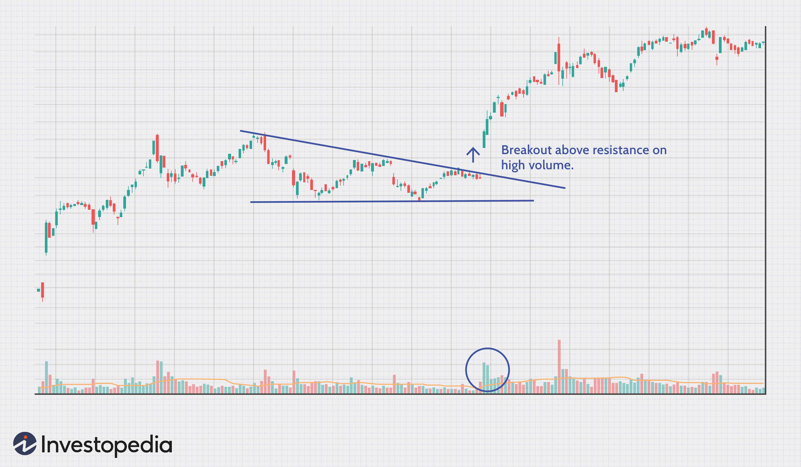

## Table of Contents

## What is a Breakout in the context of trading?

A breakout in trading happens when the price of a stock or other asset moves above a resistance level or below a support level. These levels are like invisible lines that the price has had trouble moving past before. When the price finally breaks through one of these lines, it's called a breakout. Traders watch for breakouts because they can signal that the price might keep moving in the same direction for a while.

Breakouts can be exciting for traders because they often lead to big price moves. If a stock breaks above its resistance level, traders might think it's going to keep going up, so they buy it. On the other hand, if a stock breaks below its support level, traders might think it's going to keep going down, so they sell it. But breakouts can also be risky because sometimes the price breaks through the level only to quickly come back inside it, which is called a false breakout. Traders need to be careful and use other tools to confirm if a breakout is real before making big decisions.

## How does a Breakout occur in financial markets?

A breakout in financial markets happens when the price of something, like a stock or a currency, moves past a point where it has been stuck before. Imagine the price is like a ball bouncing between two walls. One wall is called resistance, and it's the highest price the ball has reached but couldn't go past. The other wall is called support, and it's the lowest price the ball has dropped to but always bounced back from. When the ball finally gets enough energy to go over the resistance wall or drop through the support wall, that's a breakout.

Breakouts can happen for different reasons. Sometimes, there's big news or a change in the market that gives the price the push it needs to break out. Other times, it might just be that more and more people are buying or selling, slowly pushing the price until it finally breaks through. When a [breakout](/wiki/breakout-trading) happens, it can mean the price will keep moving in the same direction for a while. But it's not always certain, so traders have to watch carefully to see if the breakout is real or if the price might come back to where it was before.

## What are the common signs that indicate a potential Breakout?

One common sign of a potential breakout is when the price of a stock or asset gets close to its resistance or support level many times but can't break through. It's like the price is testing the strength of these levels. If it keeps coming back to the same level without breaking it, traders start to watch closely because it might mean a big move is coming soon. When the price finally does break through, it could be a real breakout.

Another sign is an increase in trading [volume](/wiki/volume-trading-strategy). This means more people are buying or selling the asset than usual. If the volume goes up as the price gets near the resistance or support level, it can be a clue that a breakout is about to happen. High volume shows that there's a lot of interest and energy behind the price movement, making it more likely to break through the level.

Sometimes, you can also see patterns on a price chart that hint at a breakout. These patterns, like triangles or flags, show that the price is getting squeezed into a smaller range. When the price finally breaks out of these patterns, it often moves strongly in the direction of the breakout. Traders use these patterns to get ready for a possible big move in the price.

## What is the difference between a true Breakout and a false Breakout?

A true breakout happens when the price of a stock or asset moves past its resistance or support level and keeps going in the same direction. It's like the price finally has enough power to break through the barrier and doesn't come back down or up quickly. When this happens, traders often believe the price will continue to move in the direction of the breakout, so they might buy more if it's going up or sell if it's going down. A true breakout is usually supported by high trading volume, which means lots of people are buying or selling, adding strength to the move.

A false breakout, on the other hand, is when the price seems to break through the resistance or support level but then quickly returns to its original range. It's like the price tricks everyone by breaking out, only to come back inside the old boundaries. False breakouts can be confusing and risky because traders might make decisions based on the breakout, only to find out it was not real. These often happen with lower trading volume, showing less energy behind the move. Traders need to be careful and use other tools, like watching the volume and waiting for confirmation, to tell the difference between true and false breakouts.

## What are some popular technical indicators used to identify Breakouts?

Some popular technical indicators used to identify breakouts include moving averages, Bollinger Bands, and the Relative Strength Index (RSI). Moving averages help traders see the overall trend by smoothing out price data over time. When the price moves above a moving average, it can signal a breakout to the upside, and when it moves below, it might signal a breakout to the downside. Bollinger Bands are like a channel that shows how much the price usually moves around its average. A breakout happens when the price moves outside the upper or lower band, suggesting a strong move in that direction.

Another useful indicator is the Relative Strength Index (RSI), which measures how fast and how much a price has changed recently. If the RSI goes above 70, it might mean the price is overbought and due for a breakout downwards. If it goes below 30, it might mean the price is oversold and ready for a breakout upwards. Traders often use these indicators together to get a better idea of when a breakout might happen and whether it's likely to be a true breakout or a false one. By watching these indicators, traders can make more informed decisions about when to buy or sell.

## How can volume be used to confirm a Breakout?

Volume is like the energy behind a price move. When a stock or asset is about to break out, you often see more people buying or selling than usual. This increase in volume can help confirm that a breakout is real. If the price breaks through a resistance or support level and the volume is high, it means a lot of people believe in the move. This makes it more likely that the price will keep going in the same direction after the breakout.

On the other hand, if the price breaks out but the volume is low, it might be a false breakout. Low volume means fewer people are interested in the move, so it might not have enough power to keep going. Traders watch volume closely because it helps them decide if a breakout is strong enough to trust. By looking at both the price and the volume, traders can make better choices about when to buy or sell.

## What are the best practices for setting entry points during a Breakout?

When setting entry points during a breakout, it's important to wait for confirmation that the breakout is real. This means you should look for a strong move in the price that's supported by high trading volume. If the price breaks through a resistance or support level and the volume is high, it's a good sign that the breakout is strong and likely to continue. You can enter a trade right after the breakout if the volume confirms it, but be careful not to jump in too early.

Another good practice is to use technical indicators like moving averages or Bollinger Bands to help you decide when to enter. For example, if the price breaks above a moving average with high volume, it might be a good time to buy. You can also set your entry point a little above the breakout level to make sure the price doesn't quickly fall back. This way, you avoid getting caught in a false breakout. Remember, patience is key, so take your time and wait for the right moment to enter the trade.

## How should stop-loss orders be managed in Breakout trading strategies?

When trading breakouts, it's smart to use stop-loss orders to protect your money. A stop-loss order is like a safety net that automatically sells your stock if the price goes down to a certain level. You should set your stop-loss just below the breakout level if you're buying, or just above it if you're selling. This way, if the breakout turns out to be false and the price goes back inside the old range, your stop-loss can help you avoid big losses.

Managing stop-loss orders during breakouts also means you might need to move them as the price moves. If the price keeps going up after a breakout, you can move your stop-loss up too. This is called trailing your stop-loss, and it helps you lock in some of your profits while still giving the price room to grow. Always keep an eye on the market and be ready to adjust your stop-loss to match what the price is doing.

## What are the key risk management techniques specific to Breakout trading?

When trading breakouts, one important risk management technique is to use stop-loss orders. A stop-loss order is like a safety button that automatically sells your stock if the price drops to a certain level. You should set your stop-loss just below the breakout level if you're buying, or just above it if you're selling. This helps you avoid big losses if the breakout turns out to be false and the price goes back to where it was before. Always keep an eye on the market and be ready to move your stop-loss up or down as the price moves, so you can lock in some profits while still giving the price room to grow.

Another key technique is to not put all your money into one trade. Instead, spread your money across different trades. This way, if one trade doesn't work out, you won't lose everything. It's also a good idea to only risk a small part of your money on each trade, like 1% or 2%. This helps you stay in the game even if you have a few losing trades. Remember, the goal is to protect your money while still giving yourself a chance to make profits from breakouts.

## How can historical data and backtesting improve Breakout trading strategies?

Historical data and [backtesting](/wiki/backtesting) can make breakout trading strategies better by letting traders see how their ideas would have worked in the past. Traders can look at old price charts and see if a breakout happened and what happened next. By using this data, they can find patterns and figure out what makes a breakout more likely to be real or fake. This helps them set better rules for when to buy or sell, and where to put their stop-loss orders to keep their money safe.

Backtesting is like practicing trading without using real money. Traders use computer programs to run their breakout strategies on past data and see how they would have done. This helps them find out if their strategy works well or if they need to change something. By testing different entry points, stop-loss levels, and other parts of their strategy, traders can make it stronger and more likely to make money when they use it for real.

## What advanced statistical methods can be applied to predict Breakouts more accurately?

To predict breakouts more accurately, traders can use advanced statistical methods like [machine learning](/wiki/machine-learning) and time series analysis. Machine learning can help by looking at lots of data, like price movements and trading volume, to find patterns that might signal a breakout. It can learn from past breakouts and use that knowledge to predict when a new one might happen. This can be really helpful because it can pick up on small details that a person might miss. Time series analysis, on the other hand, focuses on how prices change over time. It can use models like ARIMA (AutoRegressive Integrated Moving Average) to forecast future price movements based on past trends and patterns.

Another useful method is using [volatility](/wiki/volatility-trading-strategies) models, like the GARCH (Generalized Autoregressive Conditional Heteroskedasticity) model. These models look at how much prices tend to move around and can help predict when the price might break out of its usual range. By understanding the volatility, traders can better guess when a big move might happen. These advanced statistical methods can make breakout predictions more reliable, but they still need to be used carefully. Traders should always combine these methods with their own experience and other tools to make the best decisions.

## How do market psychology and trader behavior influence the success of Breakout strategies?

Market psychology and trader behavior play a big role in how well breakout strategies work. When lots of traders see a price getting close to a resistance or support level, they start to think the same way. They might all decide to buy or sell at the same time, pushing the price to break out. This is called herd behavior, and it can make breakouts stronger. But if traders are unsure or scared, they might not follow through on the breakout, causing the price to fall back. So, understanding what other traders are thinking and feeling can help you guess if a breakout will keep going or not.

Trader behavior also affects breakouts because of how they set their stop-loss orders. When many traders set their stop-losses just above or below a breakout level, it can create a self-fulfilling prophecy. If the price hits these stop-loss levels, it can cause a lot of automatic buying or selling, which pushes the price even further in the direction of the breakout. This can make a breakout more successful. But if traders set their stop-losses too close to the breakout level, they might get out of their trades too soon, leading to a false breakout. So, watching how other traders act and set their orders can give you clues about whether a breakout is likely to succeed or fail.

## What is the Role of Support and Resistance Levels?

Support and resistance levels play a crucial role in understanding market dynamics and are pivotal in forming various trading strategies. At their core, support levels are price points where a downtrend is expected to pause due to a concentration of buying interest. When the price of a tradable asset approaches a support level, buyers are typically more inclined to purchase, perceiving the asset as undervalued. This increased demand can halt the price decline or even reverse it. On the other hand, resistance levels are price points where an uptrend is expected to pause due to a concentration of selling interest. As prices reach resistance levels, sellers find the asset overvalued, leading to increased selling pressure, which can halt or reverse the upward movement.

Understanding these levels is grounded in basic supply and demand principles. A breakout—the event where price moves through a significant support or resistance level—indicates a major shift in these dynamics. A breakout above a resistance level suggests that buying interest has overwhelmed selling pressure, leading to a new upward trend. Mathematically, this could be seen as:

$$
P_{\text{new}} > P_{\text{resistance}}
$$

Conversely, a breakout below a support level indicates increasing selling pressure overpowering buying interest, possibly leading to a downward trend:

$$
P_{\text{new}} < P_{\text{support}}
$$

Successful identification of these levels can provide traders with strategic entry and [exit](/wiki/exit-strategy) points, as they assume a shift in price action when these levels are broken. However, it's important to be aware of false breakouts—situations where the price temporarily exceeds these levels but fails to maintain [momentum](/wiki/momentum). Therefore, traders often use confirmatory tools like volume indicators, which need to show increased activity to validate a breakout, ensuring it signifies a true shift rather than temporary price movement.

## What is the relationship between Algorithmic Trading and Breakouts?

Algorithmic trading has revolutionized the financial markets by allowing traders to execute strategies at lightning speed and with precision impossible for manual trading. Among various algorithmic strategies, breakout strategies are particularly popular because they capitalize on significant price shifts, potentially leading to substantial returns.

Breakout strategies in [algorithmic trading](/wiki/algorithmic-trading) are premised on identifying points where an asset's price moves beyond specific support or resistance levels. These points suggest a significant shift in market sentiment, often leading to strong price trends. The automated nature of algorithmic trading allows for the rapid identification and exploitation of these breakout points, providing traders a competitive edge in capturing price movements that might be missed in manual trading.

Incorporating breakouts into an algorithm involves the precise coding of support and resistance levels. This requires an in-depth analysis of historical price patterns to define these levels accurately. Traders often use technical indicators such as moving averages, Bollinger Bands, or historical price highs and lows to set these thresholds. For instance, a simple moving average (SMA) can be calculated to help determine potential breakout levels:

$$
\text{SMA} = \frac{\sum \text{Price}_{i}}{n}
$$

where $\text{Price}_{i}$ is the asset's price at time $i$, and $n$ is the number of time periods considered.

Once these levels are identified, traders program their algorithms to execute trades when price breaches these set thresholds. However, not all breakouts result in profitable trends; false breakouts are common. Therefore, rigorous back-testing on historical data is essential to test how the strategies would have performed in different market scenarios. Back-testing helps in optimizing the algorithm for better reliability and reducing the risk of losses from false signals.

Here’s a simple Python pseudocode snippet illustrating how an algorithm could be structured to execute a breakout strategy:

```python
def is_breakout(current_price, resistance_level):
    return current_price > resistance_level

def breakout_strategy(prices, resistance_level):
    for current_price in prices:
        if is_breakout(current_price, resistance_level):
            execute_trade(current_price)
```
This algorithm checks if the current price exceeds a pre-determined resistance level and executes a trade if a breakout is detected.

Algorithmic breakout strategies need to be dynamic, adjusting to evolving market conditions. Continuous development and optimization of the algorithm are crucial, including the integration of machine learning techniques to anticipate breakout patterns more effectively. By maintaining a robust algorithmic framework, traders can enhance their ability to profit from market volatility and trending opportunities.

## References & Further Reading

[1]: Bergstra, J., Bardenet, R., Bengio, Y., & Kégl, B. (2011). ["Algorithms for Hyper-Parameter Optimization."](https://papers.nips.cc/paper/4443-algorithms-for-hyper-parameter-optimization) Advances in Neural Information Processing Systems 24.

[2]: ["Advances in Financial Machine Learning"](https://www.amazon.com/Advances-Financial-Machine-Learning-Marcos/dp/1119482089) by Marcos Lopez de Prado

[3]: ["Evidence-Based Technical Analysis: Applying the Scientific Method and Statistical Inference to Trading Signals"](https://www.amazon.com/Evidence-Based-Technical-Analysis-Scientific-Statistical/dp/0470008741) by David Aronson

[4]: ["Machine Learning for Algorithmic Trading"](https://www.amazon.com/Machine-Learning-Algorithmic-Trading-alternative/dp/1839217715) by Stefan Jansen

[5]: ["Quantitative Trading: How to Build Your Own Algorithmic Trading Business"](https://books.google.com/books/about/Quantitative_Trading.html?id=j70yEAAAQBAJ) by Ernest P. Chan