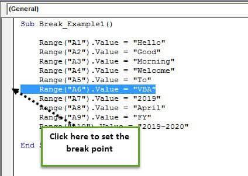

## Table of Contents

## What is a breakpoint in computing?

A breakpoint is a special place in a computer program where the program stops running. This helps programmers see what is happening inside the program at that moment. They can check the values of variables, see if the program is working correctly, and fix any problems they find.

When a programmer sets a breakpoint, they tell the computer to pause the program at a specific line of code. They can then use special tools, called debuggers, to look closely at what the program is doing. This makes it easier to find and fix mistakes in the code, making the program work better and faster.

## How do breakpoints help in debugging?

Breakpoints help in debugging by letting programmers stop their program at a specific spot. When the program stops at a breakpoint, it's like hitting a pause button. This gives programmers a chance to look around and see what's going on inside the program at that exact moment. They can check the values of different pieces of data, called variables, and see if they are what they expect them to be. If something looks wrong, they can figure out where the mistake is and fix it.

Using breakpoints also helps programmers understand how their program is working step by step. They can move through the code one line at a time, watching how the data changes. This is really helpful for finding tricky problems that are hard to see when the program is running quickly. By slowing things down and looking closely, programmers can find and fix issues that might cause the program to crash or give wrong results.

## What are the common ways to set a breakpoint in an IDE?

In an Integrated Development Environment (IDE), setting a breakpoint is easy and can be done in different ways. One common way is by clicking on the left side of the code editor, next to the line numbers. When you click there, a little marker or icon appears, showing that a breakpoint has been set on that line. This tells the program to stop running when it reaches that part of the code.

Another way to set a breakpoint is by using the keyboard. Many IDEs let you press a special key combination, like F9, to set a breakpoint on the current line where your cursor is. This is quick and handy, especially if you are used to using keyboard shortcuts. Some IDEs also let you set breakpoints through a menu or by right-clicking on a line of code and choosing an option to add a breakpoint.

These methods make it simple for programmers to control where their program stops, so they can check what's happening and fix any problems. By using breakpoints, programmers can make sure their code is working correctly and find any mistakes more easily.

## Can breakpoints be used in all programming languages?

Breakpoints can be used in many programming languages, but not all of them. Most popular languages like Python, Java, C++, and JavaScript support breakpoints through their IDEs or debugging tools. These languages have tools that let programmers set breakpoints easily, so they can stop their programs and check what's happening.

Some older or less common languages might not have good support for breakpoints. In these cases, programmers might need to use other ways to debug their code, like adding print statements or using special debugging commands. But for most modern programming, breakpoints are a helpful tool that makes finding and fixing problems easier.

## What is the difference between a hardware breakpoint and a software breakpoint?

A hardware breakpoint uses the computer's hardware, like the CPU, to stop a program. It's set by using special registers in the CPU that tell it to pause when a certain part of the program is reached. Hardware breakpoints are really good for watching specific pieces of memory or stopping at exact addresses. They are fast and don't change the program's code, but there are usually only a few of them available at a time.

A software breakpoint, on the other hand, works by changing the program's code. It does this by putting a special instruction, called a trap or interrupt, into the code. When the program reaches this instruction, it stops and lets the debugger take over. Software breakpoints are easier to use and you can set as many as you want, but they can slow down the program a bit because they change the code.

Both types of breakpoints help programmers find and fix problems in their code, but they work in different ways. Hardware breakpoints are better for looking at memory and are faster, while software breakpoints are more flexible and easier to set up.

## How do conditional breakpoints work?

Conditional breakpoints are a special kind of breakpoint that only stop the program if a certain condition is true. When you set a conditional breakpoint, you write a small piece of code, like a math problem or a question, that the program checks. If the answer to the question is "yes" or the math problem is true, the program stops at that point. This helps programmers only stop the program when something important is happening, so they don't have to stop it all the time.

For example, if you want to see what's happening in your program only when a variable reaches a certain number, you can set a conditional breakpoint to stop the program only when that number is reached. This way, you don't have to stop the program every time it goes through that part of the code. It makes debugging easier because you can focus on the parts of the program that might have problems, without stopping the program too much.

## What are the limitations of using breakpoints?

Breakpoints can slow down your program. When you use a lot of breakpoints, your program has to stop and start a lot. This can make it run much slower than normal. Sometimes, if you have too many breakpoints, it can even make the program take a very long time to run, which can be annoying and make it hard to find problems quickly.

Another limitation is that breakpoints might not work well with all types of programs. For example, if your program is running on many computers at the same time, it can be hard to set breakpoints that work for all of them. Also, some very fast programs or programs that need to keep running without stopping might not work well with breakpoints. In these cases, you might need to use other ways to find and fix problems in your code.

## How can breakpoints affect the performance of a program?

Breakpoints can make a program run slower. When you set a breakpoint, the program has to stop and wait for you to check things before it can keep going. If you have a lot of breakpoints, the program will stop a lot, which means it takes longer to finish what it's doing. This can be frustrating, especially if you're trying to see how your program works when it's running quickly.

Sometimes, breakpoints can also change how a program behaves. For example, if your program needs to keep running without stopping, using breakpoints might mess things up. Also, if your program is running on many computers at the same time, setting breakpoints can be tricky because you might not be able to stop all the parts at the same time. So, while breakpoints are helpful for finding problems, they can also make your program slower and might not work well in every situation.

## What are advanced features of breakpoints in modern debuggers?

Modern debuggers have some cool advanced features for breakpoints that make them even more helpful. One of these features is called a "conditional breakpoint." This lets you tell the program to stop only if something special happens, like when a number gets really big or a certain button is clicked. It's like setting a rule for when the program should pause, so you don't have to stop it all the time. Another neat feature is "hit counts," which means you can tell the program to stop only after it has gone through a certain part of the code a specific number of times. This is useful if you want to see what's happening after the program has done something a lot.

There are also "data breakpoints" that stop the program when a certain piece of information changes. This is really handy if you want to watch a special number or piece of data to see when and how it gets changed. Some debuggers even let you set "function breakpoints," which stop the program every time a certain part of the code, called a function, starts running. These advanced features help programmers find problems in their code more easily and quickly, without having to stop the program as much.

## How do you manage multiple breakpoints in a large codebase?

Managing multiple breakpoints in a large codebase can be tricky, but there are ways to make it easier. One good way is to use the debugger's tools to group and label your breakpoints. This means you can put similar breakpoints together and give them names, so it's easier to see what they're for. You can also turn breakpoints on and off without deleting them, which is helpful when you want to focus on different parts of your code at different times.

Another way to manage breakpoints is to use conditional breakpoints and hit counts. With conditional breakpoints, you can tell the program to stop only when something special happens, like when a number reaches a certain value. Hit counts let you stop the program after it has gone through a part of the code a specific number of times. These features help you focus on the parts of the code that might have problems, without stopping the program too much.

Sometimes, it's also helpful to use a debugger's search feature to find and manage breakpoints. You can search for breakpoints by their location or by the conditions you set for them. This makes it easier to find the ones you need to change or remove, especially in a big codebase with lots of breakpoints. By using these tools and features, you can keep your breakpoints organized and make debugging a large codebase much easier.

## What are some best practices for using breakpoints effectively?

When using breakpoints, it's a good idea to set them carefully. Only use breakpoints on parts of your code where you think there might be a problem. This way, you won't stop your program too much, and it will be easier to find where the issues are. It's also helpful to use conditional breakpoints. These let you stop your program only when something special happens, like when a number gets really big. This can save time because you won't have to stop your program all the time, just when it matters.

Another good practice is to keep your breakpoints organized. You can group them and give them names so it's easier to see what they're for. Also, turning breakpoints on and off without deleting them can help you focus on different parts of your code at different times. If you're working on a big project, using the debugger's search feature can make it easier to find and manage your breakpoints. By following these tips, you can use breakpoints to find and fix problems in your code more quickly and easily.

## How can breakpoints be used in conjunction with other debugging tools?

Breakpoints work well with other debugging tools to help you find problems in your code. One way to use them together is with a tool called a "watch window." This tool lets you keep an eye on certain pieces of information, like numbers or words, while your program is running. When your program stops at a breakpoint, you can check these pieces of information to see if they are what you expect. This helps you understand what's happening in your program and find any mistakes.

Another way to use breakpoints with other tools is by using a "call stack." The call stack shows you the path your program took to get to the breakpoint. It lists all the parts of your code that were running before it stopped. By looking at the call stack, you can see how your program got to that point and find out if something went wrong along the way. Using breakpoints with these other tools makes it easier to debug your code and fix any problems you find.

## References & Further Reading

[1]: ["Algorithms for Hyper-Parameter Optimization"](https://dl.acm.org/doi/10.5555/2986459.2986743) by Bergstra, J., Bardenet, R., Bengio, Y., & Kégl, B. (2011). Advances in Neural Information Processing Systems 24.

[2]: ["Advances in Financial Machine Learning"](https://www.amazon.com/Advances-Financial-Machine-Learning-Marcos/dp/1119482089) by Marcos Lopez de Prado

[3]: ["Evidence-Based Technical Analysis: Applying the Scientific Method and Statistical Inference to Trading Signals"](https://www.amazon.com/Evidence-Based-Technical-Analysis-Scientific-Statistical/dp/0470008741) by David Aronson

[4]: ["Machine Learning for Algorithmic Trading"](https://github.com/stefan-jansen/machine-learning-for-trading) by Stefan Jansen

[5]: ["Quantitative Trading: How to Build Your Own Algorithmic Trading Business"](https://www.amazon.com/Quantitative-Trading-Build-Algorithmic-Business/dp/1119800064) by Ernest P. Chan