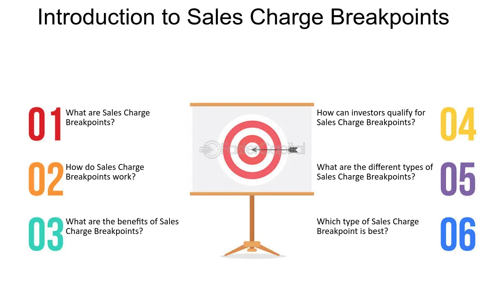

## Table of Contents

## What is a breakpoint sale?

A breakpoint sale is when a company sells a product at a lower price if you buy a lot of it at once. For example, if you buy 100 items, you might get a discount that you wouldn't get if you only bought 10 items. This encourages customers to buy more products in one go, which can be good for both the company and the customer.

These sales are common in places like grocery stores or electronics shops. They help businesses move large amounts of stock quickly and can attract customers who want to save money by buying in bulk. It's a win-win situation because the customer gets a better price, and the company sells more products.

## How does the breakpoint sale mechanism work?

A breakpoint sale works by offering a discount when you buy more of a product at one time. For example, if you buy one item, it might cost $10, but if you buy 10 items, the price per item might drop to $8. This encourages people to buy more because they can save money by buying in bulk. The exact point where the price drops is called the "breakpoint." So, if you buy enough to reach or pass this point, you get the lower price.

Companies use breakpoint sales to sell more products quickly. When customers see they can save money by buying more, they often choose to do so. This helps the company move a lot of stock at once. It's good for the customer too because they get a better deal. Both sides benefit: the company sells more, and the customer pays less per item.

## What are the common thresholds for breakpoint sales?

Common thresholds for breakpoint sales can vary a lot depending on the product and the company. For things like groceries, a common threshold might be buying 5 or 10 items to get a discount. For example, if you buy 5 packs of soda, you might get a dollar off each pack. For bigger items like electronics, the threshold might be higher, like buying 20 or 50 units to get a discount. The idea is to set a point where buying more makes sense for the customer because they save money.

These thresholds are chosen carefully by companies. They want to encourage customers to buy more without losing too much money on discounts. So, they might set the threshold at a point where they can still make a profit but also offer a good deal to the customer. This way, both the company and the customer can benefit from the sale.

## Who typically benefits from breakpoint sales?

Customers and companies both benefit from breakpoint sales. Customers get to save money by buying more of a product at once. For example, if you buy 10 packs of soda instead of just one, you might pay less per pack. This can be a good deal if you use a lot of the product or if you want to stock up for later.

Companies also benefit because they can sell more products quickly. When customers see they can save money by buying in bulk, they often buy more than they would have otherwise. This helps the company move a lot of stock and can increase their sales. So, breakpoint sales are a win-win situation for both customers and companies.

## What are the advantages of using breakpoint sales for investors?

Investors can benefit from breakpoint sales because they can help increase a company's sales and profits. When a company uses breakpoint sales, it encourages customers to buy more products at once. This means the company can sell more items quickly, which can lead to higher overall sales. If the company's sales go up, this can make the company's stock price go up too. So, investors who own the company's stock might see their investment grow in value.

Breakpoint sales can also help a company get rid of extra stock. Sometimes, companies have more products than they can sell at the regular price. By offering a discount for buying in bulk, they can move this extra stock faster. This helps the company save money on storage and other costs. When a company manages its stock well, it can be more profitable, which is good news for investors. So, breakpoint sales can help a company run more efficiently and make more money, which can lead to higher returns for investors.

## What are the potential drawbacks of breakpoint sales?

Breakpoint sales can sometimes cause problems for companies. If they give too big a discount, they might not make enough money to cover their costs. This can hurt their profits. Also, if a lot of customers buy in bulk, the company might run out of stock quickly. Then, they might not have enough products to sell to other customers who come later. This can make some customers unhappy and might hurt the company's reputation.

Another issue is that breakpoint sales might not work for all products. For example, if the product is something people don't need a lot of, like a special tool, customers might not want to buy in bulk even if there's a discount. Also, if customers buy a lot at once and then don't need to buy again for a long time, the company's regular sales might go down. This can make it hard for the company to predict how much they will sell and can affect their planning and profits.

## How do breakpoint sales affect mutual fund pricing?

Breakpoint sales can affect mutual fund pricing by offering discounts to investors who buy more shares at once. When someone invests a large amount of money in a mutual fund, they might reach a "breakpoint." This means they get to buy the shares at a lower price per share than someone who buys fewer shares. This encourages investors to put more money into the fund at one time, which can help the mutual fund company grow its assets faster.

However, there are some downsides to breakpoint sales in mutual funds. If too many investors take advantage of the discounts, the mutual fund company might have to manage a lot of money quickly. This can be hard because they need to find good investments for all that money. Also, if investors buy a lot of shares at a discount and then decide to sell them later, it could affect the price of the shares and make it harder for the mutual fund to manage its portfolio effectively.

## Can breakpoint sales be applied to all types of investment funds?

Breakpoint sales can be used for some types of investment funds, but not for all of them. Mutual funds often use breakpoint sales to offer discounts to investors who buy a large number of shares at once. This encourages people to invest more money in the fund, helping the mutual fund company grow its assets quickly. However, not all investment funds are set up to offer these kinds of discounts. For example, exchange-traded funds (ETFs) usually do not use breakpoint sales because their shares are traded on stock exchanges like individual stocks, and their prices are set by market demand and supply.

Another type of fund that might not use breakpoint sales is a hedge fund. Hedge funds often have high minimum investment requirements and are more focused on sophisticated investment strategies rather than offering discounts for bulk purchases. So, while breakpoint sales can be a useful tool for mutual funds to attract larger investments, they are not a one-size-fits-all solution for all types of investment funds. Each type of fund has its own way of managing investments and attracting investors.

## What is the role of financial advisors in managing breakpoint sales?

Financial advisors help people understand breakpoint sales in mutual funds. They explain how buying more shares at once can get you a discount. This can save you money if you want to invest a lot. Advisors look at how much money you have and help you decide if buying in bulk is a good idea for you. They make sure you know all the details so you can make a smart choice.

Sometimes, financial advisors also help with the paperwork and make sure you get the discount you're supposed to. They keep an eye on your investments and tell you if it's time to buy more shares to reach a breakpoint. This way, they help you get the best deal and make the most of your money.

## How do regulatory bodies oversee breakpoint sales?

Regulatory bodies like the Securities and Exchange Commission (SEC) in the United States make sure companies follow the rules when they offer breakpoint sales in mutual funds. They check that the discounts are fair and that investors get the discounts they're supposed to. If a company doesn't follow the rules, the SEC can make them fix it or even punish them. This helps keep the investing world honest and protects people who are putting their money into mutual funds.

The SEC also makes companies tell investors about breakpoint sales clearly. They have to put the information in the fund's prospectus, which is a document that explains everything about the fund. This way, investors know about the discounts before they decide to buy. By doing this, regulatory bodies help make sure that everyone gets a fair chance to save money when investing in mutual funds.

## What strategies can investors use to maximize benefits from breakpoint sales?

Investors can maximize the benefits from breakpoint sales by working closely with their financial advisors. Advisors can help investors understand when it makes sense to buy more shares at once to reach a breakpoint and get a discount. They can also help with the paperwork to make sure investors get the discount they're supposed to. By planning ahead and knowing when to invest more money, investors can save on costs and make their investments grow faster.

Another strategy is to keep an eye on the mutual fund's prospectus, which tells you about the breakpoints and discounts. By reading this document carefully, investors can know exactly how much they need to invest to get a lower price per share. This can help them decide when to put more money into the fund. Also, investors should think about their long-term goals and how breakpoint sales fit into their overall investment plan. This way, they can make smart choices and take full advantage of the discounts offered.

## What are the latest trends and developments in breakpoint sale mechanisms?

Lately, companies are using technology more to make breakpoint sales easier for customers. They are using apps and websites to show customers the discounts they can get if they buy more of a product. This way, customers can see right away how much they can save by buying in bulk. Also, some companies are using special deals and promotions to make breakpoint sales more exciting. For example, they might offer extra discounts or free gifts if you reach a certain breakpoint.

Another trend is that companies are being more flexible with their breakpoint sales. Instead of having fixed thresholds, they might change the breakpoints based on how much stock they have or what time of year it is. This helps them sell more products without losing too much money. Companies are also working harder to make sure customers know about breakpoint sales. They use social media and email to tell people about the deals, so more customers can take advantage of them.

## What are the Financial Mechanisms of Breakpoint Sales?

Breakpoint sales are integral to the strategic management of mutual fund investments, offering reduced sales charges based on investment thresholds. Understanding these financial mechanisms provides investors with opportunities to optimize their fund allocations and potentially enhance returns. 

### Breakpoint Discounts and Investment Strategies

Investors can benefit significantly from breakpoint discounts by structuring their investments strategically. Breakpoints are predetermined investment levels at which the sales charge, or load, is reduced, thus lowering the overall cost of investment. For instance, a mutual fund might offer a reduced sales charge for investments exceeding $50,000, providing financial incentives for investors to increase their investment size to meet this threshold.

Consider an example where a fund's sales charge decreases from 5% to 4% at the $50,000 breakpoint. For an investor with $49,000, adding an additional $1,000 would reduce the sales charge on the entire amount, leading to considerable savings. The financial benefit (B) can be calculated as follows:

$$
B = I \times (r_{\text{initial}} - r_{\text{breakpoint}})
$$

where $I$ is the investment amount, $r_{\text{initial}}$ is the initial sales charge rate, and $r_{\text{breakpoint}}$ is the reduced sales charge rate.

**Strategic Considerations:**

1. **Incremental Investments:** Investors often strategically time incremental investments to align with their financial goals and the associated breakpoint benefits. Incrementing investments strategically can ensure they fall within a lowered sales charge bracket, maximizing cost efficiency.

2. **Investment Aggregation:** Investors can aggregate investments across different accounts or family members to reach breakpoints, leveraging pooled resources for greater financial advantages. This strategy requires coordination and planning, often facilitated by financial intermediaries.

### Regulatory Considerations and Prohibited Practices

The structure of breakpoint sales necessitates adherence to regulatory standards to prevent malpractices. The Financial Industry Regulatory Authority (FINRA) mandates transparency in the offering of breakpoint discounts, ensuring investors are informed of the terms and conditions tied to reduced sales charges.

**Prohibited Practices:**

1. **Breakpoints Not Applied:** Failing to apply breakpoint discounts where applicable can result in regulatory action against the mutual fund company or financial intermediary. It is essential for financial service providers to disclose potential breakpoints to clients and apply the appropriate discounts.

2. **Improper Solicitation:** Encouraging investors to make unwarranted increases in investment solely to reach a breakpoint can lead to ethical and legal issues. It is crucial for financial advisers to ensure recommendations align with the investor’s financial strategy and risk tolerance.

### Role of Financial Intermediaries

Financial intermediaries play a key role in facilitating breakpoint sales by guiding investors toward optimal investment decisions that align with breakpoint levels. They are responsible for:

- **Educating Investors:** Providing detailed insights into breakpoint structures and benefits, ensuring that clients are aware of the potential savings and strategic advantages.
- **Compliance and Documentation:** Ensuring all transactions comply with regulatory standards and are thoroughly documented to protect both the investor and the firm.
- **Portfolio Management:** Advising on portfolio adjustments to meet breakpoint criteria, integrating these adjustments within the broader financial objectives of the investor.

In conclusion, breakpoint sales are a powerful tool within mutual fund strategies, offering tangible cost benefits through careful financial planning and alignment with regulatory frameworks. Investors and intermediaries must navigate these mechanisms with precision to maximize investment efficiency and maintain compliance with industry standards.

## References & Further Reading

[1]: Bergstra, J., Bardenet, R., Bengio, Y., & Kégl, B. (2011). ["Algorithms for Hyper-Parameter Optimization."](https://papers.nips.cc/paper/4443-algorithms-for-hyper-parameter-optimization) Advances in Neural Information Processing Systems 24.

[2]: ["Advances in Financial Machine Learning"](https://www.amazon.com/Advances-Financial-Machine-Learning-Marcos/dp/1119482089) by Marcos Lopez de Prado

[3]: Securities and Exchange Commission (2020). ["Investor Bulletin: Mutual Fund Breakpoints."](https://www.sec.gov/search-filings)

[4]: Financial Industry Regulatory Authority (FINRA). ["Understanding Mutual Fund Classes and Breakpoints."](https://www.finra.org/investors/investing/investment-products/mutual-funds)

[5]: ["Evidence-Based Technical Analysis: Applying the Scientific Method and Statistical Inference to Trading Signals"](https://www.amazon.com/Evidence-Based-Technical-Analysis-Scientific-Statistical/dp/0470008741) by David Aronson

[6]: ["Machine Learning for Algorithmic Trading"](https://github.com/stefan-jansen/machine-learning-for-trading) by Stefan Jansen

[7]: ["Quantitative Trading: How to Build Your Own Algorithmic Trading Business"](https://github.com/LucindaYa/quant-resources/blob/master/Quantitative%20Trading%20How%20to%20Build%20Your%20Own%20Algorithmic%20Trading%20Business.pdf) by Ernest P. Chan

[8]: BIS Committee on Payments and Market Infrastructures. ["Market Structure Studies: Role of automation in cash equities markets."](https://www.bis.org/cpmi/about/overview.htm) 

[9]: Johnson, B., Novikov, A., & Rutherford, N. (2013). ["The Flash Crash of 2010 - CFTC and SEC Findings"](https://www.researchgate.net/publication/320965956_The_flash_crash_a_review)