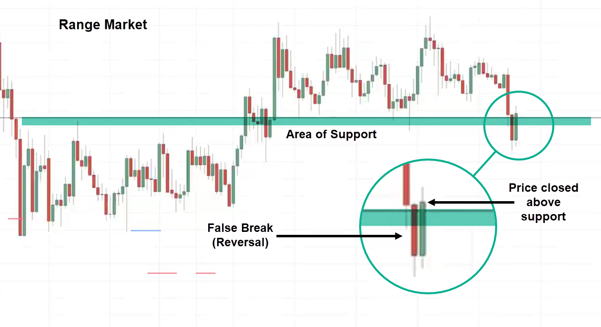

## Table of Contents

## What is a break in technical analysis?

A break in technical analysis is when a stock price moves past a certain level that it hadn't crossed before. This level could be a support level, which is the lowest price a stock usually goes to, or a resistance level, which is the highest price it usually reaches. When the price breaks through these levels, it's a big deal because it can mean the stock's trend is changing.

For example, if a stock always bounces back when it hits $50, that's its resistance level. If one day the stock price goes above $50 and keeps going up, that's a break. Traders watch for these breaks because they can signal it's time to buy or sell the stock. Breaks can help traders predict where the stock price might go next.

## Why are breaks important in technical analysis?

Breaks are important in technical analysis because they show when a stock's price is changing its usual pattern. Imagine a stock always going up to $50 and then dropping back down. That $50 is like a ceiling, or resistance level. If the stock suddenly breaks through that ceiling and keeps going up, it tells traders that something big might be happening. It could mean the stock is starting a new trend where it will keep going up, so traders might want to buy it.

Also, breaks can tell traders when to sell a stock. If a stock always stops dropping at $40, that's its floor, or support level. When the price breaks below $40 and keeps going down, it's a signal that the stock might keep falling. Traders might decide to sell the stock before it loses more value. By watching for breaks, traders can make better decisions about buying and selling, trying to make money from the stock's new direction.

## What are the different types of breaks in technical analysis?

In technical analysis, there are two main types of breaks: breakouts and breakdowns. A [breakout](/wiki/breakout-trading) happens when a stock's price goes above a resistance level. Imagine a stock always stopping at $50 and then going back down. If one day it goes past $50 and keeps going up, that's a breakout. It tells traders the stock might keep going up, so it could be a good time to buy.

A breakdown is the opposite. It happens when a stock's price goes below a support level. If a stock always stops dropping at $40 and then bounces back up, $40 is its support level. If the price goes below $40 and keeps going down, that's a breakdown. It tells traders the stock might keep falling, so it could be a good time to sell.

These breaks are important because they can show traders when a stock's trend is changing. By watching for breakouts and breakdowns, traders can make better decisions about when to buy or sell a stock, trying to make money from the new direction the stock is taking.

## How can breaks be identified on a chart?

To identify breaks on a chart, you need to look for when a stock's price moves past a certain level that it hasn't crossed before. These levels are called support and resistance. Support is like a floor where the price usually stops dropping and bounces back up. Resistance is like a ceiling where the price usually stops going up and falls back down. When the price goes above the resistance level, that's called a breakout. When it goes below the support level, that's called a breakdown.

To spot these breaks, you can draw lines on the chart to show where the support and resistance levels are. If you see the price going past these lines, that's a break. For example, if a stock always stops at $50 and then goes back down, you can draw a line at $50. If the price goes above $50 and keeps going up, that's a breakout. If the stock always stops dropping at $40 and then bounces back up, you can draw a line at $40. If the price goes below $40 and keeps going down, that's a breakdown. Watching for these breaks can help you decide when to buy or sell a stock.

## What are the common indicators used to confirm breaks?

To confirm breaks in technical analysis, traders often use [volume](/wiki/volume-trading-strategy) as a key indicator. When a stock breaks through a resistance or support level, it's more likely to be a true break if the trading volume is high. High volume means more people are buying or selling the stock, making the break more significant. If the volume is low, the break might not be as strong, and the price could go back to its old levels.

Another common indicator is the moving average. Traders use moving averages to smooth out price data and see the overall trend. If a stock breaks through a resistance level and stays above its moving average, it's a sign that the breakout might be real. On the other hand, if the stock breaks down below a support level and stays below its moving average, it suggests the breakdown is likely to continue. By using volume and moving averages, traders can feel more confident about the breaks they see on the chart.

## How do breaks influence trading decisions?

Breaks in a stock's price are important because they tell traders when the stock might be starting a new trend. If a stock always stops at $50 but then goes past that and keeps going up, it's a breakout. This tells traders that the stock could keep going up, so it might be a good time to buy it. On the other hand, if a stock always stops dropping at $40 but then goes below that and keeps going down, it's a breakdown. This tells traders that the stock might keep falling, so it might be a good time to sell it.

Traders use volume and moving averages to make sure the break is real. If a lot of people are trading the stock when it breaks through a level, it's a stronger signal. If the stock stays above or below its moving average after the break, it's another sign that the new trend might continue. By watching for these breaks and using these indicators, traders can decide when to buy or sell a stock to try to make money from the new direction the stock is going.

## What is the difference between a false break and a valid break?

A false break happens when a stock's price goes past a support or resistance level, but then it quickly goes back to where it was before. Imagine a stock always stopping at $50, and one day it goes above $50 but then drops back down below $50. That's a false break. It can trick traders into thinking the stock will keep going up when it actually doesn't. False breaks can happen because of short-term market changes or not enough people trading the stock.

A valid break is when a stock's price goes past a support or resistance level and keeps going in that direction. If a stock always stops at $50 but then goes above $50 and keeps going up, that's a valid break. It tells traders that the stock might start a new trend. To make sure a break is valid, traders look at things like how many people are trading the stock (volume) and if the stock stays above or below its moving average after the break. If these signs are strong, it's more likely to be a valid break.

## How can historical break data be used to predict future market movements?

Traders can use historical break data to predict future market movements by looking at how stocks have reacted in the past when they broke through support or resistance levels. If a stock often had a valid break and then kept going in that direction, it might do the same thing again. For example, if a stock broke above $50 many times before and then kept going up, traders might expect the same thing to happen if it breaks $50 again. By studying these patterns, traders can guess where the stock might go next and decide when to buy or sell.

However, it's important to remember that past performance doesn't guarantee future results. Historical break data can be a helpful tool, but it's not perfect. Traders also need to look at other things like the overall market conditions, news about the company, and other indicators like volume and moving averages. By combining historical break data with these other factors, traders can make more informed decisions about what might happen to a stock's price in the future.

## What are some advanced strategies for trading breaks?

One advanced strategy for trading breaks is to use multiple time frames. Traders can look at a stock's chart over different periods, like daily, weekly, or monthly, to see if the break is happening on all levels. If a stock breaks through a resistance level on the daily chart and also on the weekly chart, it's a stronger signal that the break is valid and the stock might keep going up. By checking different time frames, traders can be more confident about their trading decisions and avoid false breaks.

Another strategy is to combine breaks with other technical indicators. For example, traders might use the Relative Strength Index (RSI) to see if a stock is overbought or oversold when it breaks through a level. If a stock breaks above a resistance level and the RSI shows it's not overbought, it could be a good time to buy. Also, traders can use moving average convergence divergence (MACD) to confirm the break. If the MACD line crosses above the signal line right after a breakout, it's a sign that the upward trend might continue. By using these extra indicators, traders can make better decisions about when to enter or [exit](/wiki/exit-strategy) a trade based on breaks.

## How do market conditions affect the reliability of breaks?

Market conditions can make breaks more or less reliable. If the market is really strong and going up, a breakout might be more likely to be valid because more people are buying stocks. On the other hand, if the market is weak and going down, a breakdown might be more likely to be real because more people are selling stocks. When the market is calm and not moving much, breaks might not be as strong because there's less excitement and fewer big moves in stock prices.

Traders need to look at what's happening in the market to understand if a break is going to be reliable. For example, if there's good news about the economy or a company, it can push stock prices up and make breakouts more likely to be valid. But if there's bad news, it can push prices down and make breakdowns more likely. By keeping an eye on the market and understanding how it's affecting stock prices, traders can better judge if a break is something they should trust and act on.

## Can breaks be used effectively in algorithmic trading?

Breaks can be used in [algorithmic trading](/wiki/algorithmic-trading) by setting up rules in the computer program to watch for when a stock's price goes past a certain level. The program can be told to look for when a stock breaks through a support or resistance level and then do something like buy or sell the stock. For example, if a stock always stops at $50 but then goes above $50, the program can buy the stock because it thinks the price will keep going up. To make sure the break is real, the program can also check if a lot of people are trading the stock and if it stays above its moving average.

Using breaks in algorithmic trading can help traders make decisions faster than they could by watching the charts themselves. The computer can look at many stocks at the same time and find breaks as soon as they happen. But, traders need to be careful because sometimes breaks can be false, and the computer might make a mistake. To avoid this, traders can use other signs like volume and moving averages to make the program's decisions more accurate. By using breaks and other indicators together, algorithmic trading can be a powerful way to trade stocks.

## What are the psychological impacts of breaks on traders and how can they be managed?

Breaks can have a big impact on how traders feel. When a stock breaks through a resistance level, traders might get excited and think the stock will keep going up. This excitement can make them want to buy the stock quickly, sometimes without thinking about other important things like the overall market or the company's news. On the other hand, when a stock breaks below a support level, traders might get scared and think the stock will keep going down. This fear can make them want to sell the stock fast, even if it might go back up later. These strong feelings can lead traders to make quick decisions that they might regret later.

To manage these feelings, traders need to have a plan and stick to it. They should decide ahead of time what they will do if a stock breaks through a level, like how much they are willing to buy or sell and at what price. Using tools like stop-loss orders can help traders limit their losses if the stock goes the wrong way. It's also important for traders to take breaks and not watch the market all the time, so they don't get too caught up in the excitement or fear. By staying calm and following their plan, traders can make better decisions and handle the psychological impacts of breaks more effectively.

## References & Further Reading

[1]: Bergstra, J., Bardenet, R., Bengio, Y., & Kégl, B. (2011). ["Algorithms for Hyper-Parameter Optimization."](https://dl.acm.org/doi/10.5555/2986459.2986743) Advances in Neural Information Processing Systems 24.

[2]: ["Advances in Financial Machine Learning"](https://www.amazon.com/Advances-Financial-Machine-Learning-Marcos/dp/1119482089) by Marcos Lopez de Prado

[3]: ["Evidence-Based Technical Analysis: Applying the Scientific Method and Statistical Inference to Trading Signals"](https://www.amazon.com/Evidence-Based-Technical-Analysis-Scientific-Statistical/dp/0470008741) by David Aronson

[4]: ["Machine Learning for Algorithmic Trading"](https://github.com/stefan-jansen/machine-learning-for-trading) by Stefan Jansen

[5]: ["Quantitative Trading: How to Build Your Own Algorithmic Trading Business"](https://www.amazon.com/Quantitative-Trading-Build-Algorithmic-Business/dp/1119800064) by Ernest P. Chan