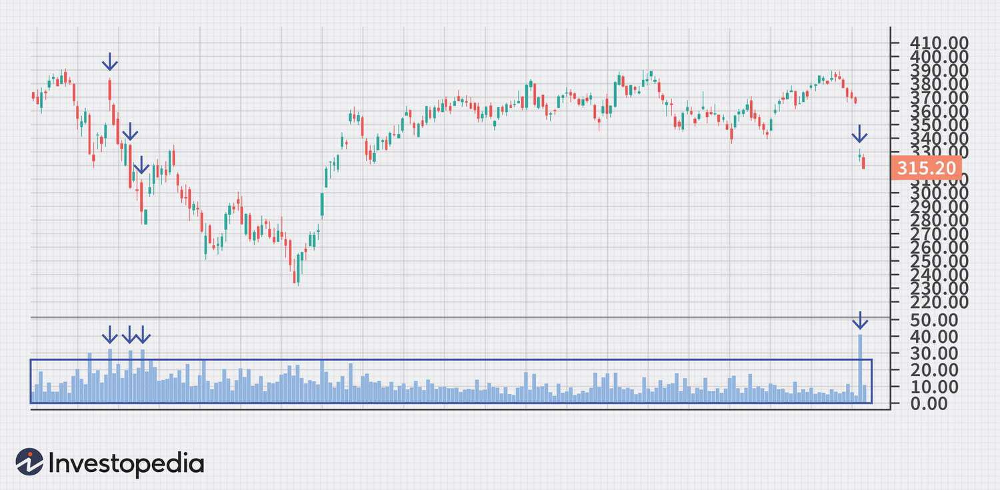

The financial markets are complex ecosystems where technical analysis plays a crucial role in guiding traders. Technical analysis involves the examination of past market data, primarily price and volume, to forecast future price movements. This approach relies on various indicators, patterns, and price movements to make informed trading decisions.

The rise of algorithmic trading, a process that employs computer programs and software to execute trades, has heightened the importance of understanding key technical analysis concepts such as 'breaks'. Algorithmic trading systems leverage sophisticated algorithms to make rapid and data-driven trading decisions, often surpassing human capabilities in terms of speed and precision.



'Breaks' in technical analysis refer to sharp and aggressive price moves that signify significant changes in market dynamics. These can occur either upwards or downwards and are crucial signals for traders. A price break often involves breaking through established resistance or support levels, triggering automatic buy or sell actions.

Incorporating technical analysis into algorithmic trading allows traders to automate complex decision-making processes. By programming trading algorithms to recognize and respond to 'breaks', traders can enhance their ability to execute trades at optimal times, thus maximizing gains or minimizing losses. Understanding the integration of these analyses is vital for developing effective trading strategies in today's fast-paced and ever-evolving financial markets.

This article aims to explore how technical analysis, particularly focusing on 'breaks', integrates with algorithmic trading, highlighting the implications of these combinations and their influence on trading decisions. As the financial markets continue to evolve, mastering these elements is essential for traders seeking to capture opportunities and mitigate risks.

## Table of Contents

## Understanding Technical Analysis in Financial Markets

Technical analysis is a method used in financial markets to evaluate historical market data, mainly price and volume, to forecast future price movements. This approach operates under the premise that past trading activity and price changes can be valuable indicators of future price behavior. Unlike fundamental analysis, which seeks to ascertain an asset's intrinsic value, technical analysis focuses solely on trend analysis, price action, and pattern recognition.

Technical indicators are essential tools within technical analysis. They facilitate the identification of trends, assist in signaling potential reversals, and aid in decision-making. Some of the most commonly used indicators include:

1. **Moving Averages**: Moving averages smooth out price data by creating a constantly updated average price. This makes it easier to identify the direction of the trend. The two most popular types of moving averages are the Simple Moving Average (SMA) and the Exponential Moving Average (EMA). They are distinguished by the weightage they assign to older vs. newer data points.

2. **Relative Strength Index (RSI)**: The RSI is a momentum oscillator that measures the speed and change of price movements on a scale of 0 to 100. It is used to identify overbought or oversold conditions in a market. An RSI above 70 often indicates that a security is overbought, while an RSI below 30 may suggest it is oversold.

3. **Moving Average Convergence Divergence (MACD)**: The MACD is a trend-following momentum indicator that shows the relationship between two moving averages of a security’s price. The MACD is calculated by subtracting the 26-period EMA from the 12-period EMA. A nine-day EMA of the MACD, called the "signal line," is then plotted on top of the MACD line, which can act as a trigger for buy and sell signals.

4. **Bollinger Bands**: Bollinger Bands consist of a middle band (SMA) and two outer bands that are standard deviations away from the middle band. These bands expand and contract based on market volatility, offering insights into the potential price range and volatility conditions.

Algorithmic traders frequently integrate technical indicators to develop automated trading strategies. These indicators assist in the creation of rules that govern entries and exits, aiming to exploit the predictive value of the technical patterns. For instance, an algorithm might be programmed to buy when the 50-day SMA crosses above the 200-day SMA, signaling a bullish trend, and sell when the opposite occurs, indicating a bearish trend. This automation allows for real-time data processing and execution without human intervention, potentially leading to more disciplined and timely decision-making.

Incorporating technical indicators into [algorithmic trading](/wiki/algorithmic-trading) requires rigorous testing to refine and validate strategies. Factors such as slippage, transaction costs, and market impact must be considered to ensure that the strategy is not only theoretically sound but also practically viable. Ultimately, the efficacy of technical analysis as a tool for predicting future price movements can vary, and it is most effective when used in conjunction with other analysis methods and risk management practices.

## Decoding Breaks in Technical Analysis

A 'break' represents a significant and abrupt price movement in financial markets, which can manifest in upward or downward trajectories. These breaks are crucial in technical analysis as they often signal substantial shifts in market dynamics. By crossing predetermined resistance or support levels, breaks can trigger potential buy or sell actions, thus playing an integral role in trading strategies.

Resistance and support levels are key concepts in technical analysis. Resistance is the price level at which an asset faces selling pressure, preventing the price from rising further. Conversely, support is the level where buying interest arises, preventing the price from declining further. When the price of a security breaks a resistance level, it may suggest an upward trend, encouraging traders to buy. Similarly, when the price breaks a support level, it may indicate a downward trend, prompting traders to sell.

Breaks can be classified into two main types: breakouts and breakdowns. A [breakout](/wiki/breakout-trading) occurs when the price moves above a resistance level, signifying potential bullish [momentum](/wiki/momentum). Conversely, a breakdown happens when the price falls below a support level, indicating potential bearish momentum. 

Technical analysts utilize various indicators and tools to identify and confirm breaks. For instance, [volume](/wiki/volume-trading-strategy) analysis can be essential, as a high volume accompanying a break often confirms the strength of the movement. Furthermore, candlestick patterns, such as bullish engulfing or bearish engulfing patterns, can provide additional confirmation of the break.

Algorithmically, breaks can be detected using specific criteria coded into trading systems. For example, a simple algorithm to detect a breakout could involve checking if the current close price exceeds a resistance level and is accompanied by a higher-than-average trading volume:

```python
def detect_breakout(prices, resistance, volume, avg_volume):
    current_price = prices[-1]
    current_volume = volume[-1]
    if current_price > resistance and current_volume > avg_volume:
        return True
    return False
```

Overall, understanding and identifying breaks in technical analysis is fundamental for traders aiming to capitalize on shifts in market sentiment and direction. Integrating these signals into trading strategies can significantly improve timing and execution for potential entry and [exit](/wiki/exit-strategy) points in the market.

## The Role of Breaks in Algorithmic Trading

In algorithmic trading, breaks can serve as pivotal signals that trigger automated trading actions based on predefined conditions. These occurrences mark significant deviations from established price levels, such as support or resistance, and are interpreted by trading algorithms as indicators of emerging trends or shifts in market sentiment.

Automated trading systems are designed to respond to these price breaks with speed and precision, capitalizing on market movements to optimize trade executions. By leveraging computational power, these systems monitor vast amounts of market data, identify break patterns, and execute trades within milliseconds, which is critical for capturing gains or avoiding losses during volatile conditions.

To program algorithms that react effectively to breaks, traders must integrate technical indicators that reflect their strategic objectives. Indicators such as the Moving Average Convergence Divergence (MACD), Relative Strength Index (RSI), and Bollinger Bands are commonly employed to filter noise and confirm break signals. For instance, a simple moving average crossover strategy might be configured to initiate a trade when a short-term moving average crosses above a long-term moving average, provided other confirming conditions are met.

Here is an example of a Python algorithm utilizing a moving average crossover strategy:

```python
import pandas as pd

# Function to calculate simple moving average
def simple_moving_average(prices, window):
    return prices.rolling(window=window).mean()

# Sample data loading
data = pd.read_csv('market_data.csv')
data['SMA_Short'] = simple_moving_average(data['Close'], window=50)
data['SMA_Long'] = simple_moving_average(data['Close'], window=200)

# Generating signals based on SMA crossovers
data['Signal'] = 0
data['Signal'][50:] = np.where(data['SMA_Short'][50:] > data['SMA_Long'][50:], 1, 0)
data['Position'] = data['Signal'].diff()
```

In this code, the algorithm reads market data from a CSV file, calculates short and long-term simple moving averages, and generates buy or sell signals based on crossover points.

Incorporating break detection algorithms requires a deep understanding of market mechanics and a clear definition of strategy goals. Traders must ensure that these systems are not only capable of identifying breaks but also equipped to evaluate the risks and opportunities associated with subsequent market movements.

Moreover, continuous [backtesting](/wiki/backtesting) on historical data is essential to refine these algorithms, ensuring they remain viable across different market environments. Optimization processes involve testing various parameters to find the most robust configurations that can endure market fluctuations and deliver consistent performance over time.

## Technical and Fundamental Analysis: A Dual Approach

Technical analysis and [fundamental analysis](/wiki/fundamental-analysis) serve as two pivotal pillars in the toolbox of traders aiming to navigate financial markets with precision. These methodologies, while differing in approach, can be integrated to form a cohesive strategy that enhances trading efficacy.

Technical analysis leans heavily on historical price data, utilizing charts and statistical indicators to identify trends and forecast future price movements. A variety of technical tools—such as moving averages, the Relative Strength Index (RSI), the Moving Average Convergence Divergence (MACD), and Bollinger Bands—assist in pinpointing entry and exit opportunities by highlighting overbought or oversold conditions, momentum, and [volatility](/wiki/volatility-trading-strategies).

Conversely, fundamental analysis investigates into the financial health of entities and the macroeconomic environment. It examines economic indicators such as GDP growth, interest rates, and employment figures, alongside company-specific metrics like earnings, revenue, and management effectiveness. This analysis seeks to determine the intrinsic value of assets, forming a basis for long-term investment decisions.

Merging these analyses allows traders to craft strategies that are both reactive and anticipatory. This dual approach enables the synchronization of short-term technical signals with long-term fundamental insights, enhancing decision making. For instance, a trader might identify a bullish technical pattern suggesting an upward price movement while concurrently analyzing fundamental data that confirms the asset's potential for growth. By balancing these elements, a trader can optimize timing for market entry, riding the wave of short-term price shifts while being anchored by a firm understanding of the asset's intrinsic value.

The fusion of technical and fundamental analysis also empowers traders to better respond to both micro and macroeconomic shifts. As markets are influenced by a myriad of factors, having a comprehensive strategy allows for adjustments based on minute chart patterns as well as overarching economic trends. This holistic viewpoint is crucial in a landscape where unexpected geopolitical events or sudden monetary policy changes can have immediate and profound impacts on market dynamics.

Overall, an integrated approach provides a robust framework for traders. By leveraging technical analysis for precision timing and fundamental analysis for strategic direction, traders can make more informed decisions that improve consistency and reduce exposure to risk. This synergy not only refines market entry and exit strategies but also builds resilience against the ebb and flow of economic conditions, paving the way for sustained trading success.

## Implementing Break-Responsive Algorithms

Developing break-sensitive algorithms requires a systematic approach to incorporating specific conditions that trigger buying or selling actions when certain price levels are surpassed. The MetaTrader 4 (MT4) platform, using the MQL4 programming language, is commonly employed for such tasks due to its flexibility and wide adoption in algorithmic trading. Here, we explore the key components and methodologies for implementing effective break-responsive algorithms.

### Programming Break Scenarios

Crafting algorithms to react to breaks involves defining precise conditions where a price crosses predetermined levels, either resistance or support. For instance, a basic moving average crossover strategy might serve as a foundational model: 

1. **Define Indicators**: Use two moving averages, a fast (short-term) and a slow (long-term). The crossover of the fast moving average above the slow moving average can be a signal to buy, while the opposite crossover can signal selling. 

   ```python
   def moving_average(prices, window):
       return sum(prices[-window:]) / window

   fast_window = 10  
   slow_window = 30  
   prices = get_historical_prices()

   fast_moving_avg = moving_average(prices, fast_window)
   slow_moving_avg = moving_average(prices, slow_window)

   if fast_moving_avg > slow_moving_avg:
       execute_trade('buy')
   elif fast_moving_avg < slow_moving_avg:
       execute_trade('sell')
   ```

2. **Economic Impact Strategies**: Incorporate economic indicators, such as GDP announcements or interest rate changes, triggering the algorithm to modify its trading activity upon significant moves that coincide with these events.

### Backtesting for Robustness

To ensure that these algorithms can adapt to changing market conditions, backtesting is a critical step. This involves applying the algorithm to historical market data to evaluate its performance and make necessary adjustments. Backtesting allows traders to gauge metrics like the Sharpe ratio, maximum drawdown, and profit [factor](/wiki/factor-investing), which are essential for assessing risk and return.

A basic backtesting framework might involve the following steps:

- **Historical Data Retrieval**: Pull historical price data for the assets of interest.

- **Simulate Trades**: Execute buy and sell signals based on the historical data using the defined algorithm rules.

- **Performance Assessment**: Analyze the results, focusing on key indicators such as rate of return, volatility, and drawdown.

The pseudo-code for a simple backtesting loop would be:

```python
def backtest(prices, algo):
    initial_investment = 10000
    current_position = 0
    balance = initial_investment

    for i in range(1, len(prices)):
        signal = algo(prices[:i])
        if signal == 'buy' and current_position == 0:
            current_position = balance / prices[i]
            balance = 0
        elif signal == 'sell' and current_position > 0:
            balance = current_position * prices[i]
            current_position = 0

    return balance + current_position * prices[-1] - initial_investment
```

### Optimization

Once an algorithm passes backtesting, optimization seeks to refine parameters for improved performance. Techniques such as grid search or genetic algorithms can explore various parameter combinations more efficiently. However, overfitting should be avoided, as excessive tailoring to historical data often undermines an algorithm’s effectiveness in live trading environments.

In conclusion, implementing break-responsive algorithms involves a blend of strategic coding, analytical rigor in testing, and continuous optimization. By carefully aligning technical indicators with market-moving events and employing robust testing frameworks, traders can build algorithms that not only respond to breaks efficiently but also enhance overall trading outcomes.

## Conclusion

Mastering technical analysis and understanding the concept of breaks provide traders with valuable insights into market trends and potential investment opportunities. Breaks, characterized by sharp price movements beyond established resistance or support levels, serve as vital indicators of market dynamics. By leveraging these insights, traders can better anticipate market changes and adapt their strategies accordingly.

When combined with algorithmic trading, which automates the execution of trades based on predefined criteria, the benefits of technical analysis and breaks become even more pronounced. Algorithms equipped with the ability to detect and respond to breaks can execute trades with precision, optimizing entry and exit points to enhance returns and manage risk effectively. This integration facilitates quick adaptation to market fluctuations and ensures that traders capitalize on opportunities as they arise.

As financial markets continuously evolve, traders must remain committed to continuous learning and strategy refinement. The integration of emerging technologies and techniques, alongside a robust understanding of market signals like breaks, is essential for maintaining a competitive edge. By regularly updating their approach to incorporate new insights from both technical and fundamental analysis, traders can position themselves to not only capture opportunities but also mitigate potential risks in an ever-changing market landscape.

## References & Further Reading

[1]: Bergstra, J., Bardenet, R., Bengio, Y., & Kégl, B. (2011). ["Algorithms for Hyper-Parameter Optimization."](https://dl.acm.org/doi/10.5555/2986459.2986743) Advances in Neural Information Processing Systems 24.

[2]: ["Advances in Financial Machine Learning"](https://www.amazon.com/Advances-Financial-Machine-Learning-Marcos/dp/1119482089) by Marcos Lopez de Prado

[3]: ["Evidence-Based Technical Analysis: Applying the Scientific Method and Statistical Inference to Trading Signals"](https://www.amazon.com/Evidence-Based-Technical-Analysis-Scientific-Statistical/dp/0470008741) by David Aronson

[4]: ["Machine Learning for Algorithmic Trading"](https://github.com/stefan-jansen/machine-learning-for-trading) by Stefan Jansen

[5]: ["Quantitative Trading: How to Build Your Own Algorithmic Trading Business"](https://www.amazon.com/Quantitative-Trading-Build-Algorithmic-Business/dp/1119800064) by Ernest P. Chan