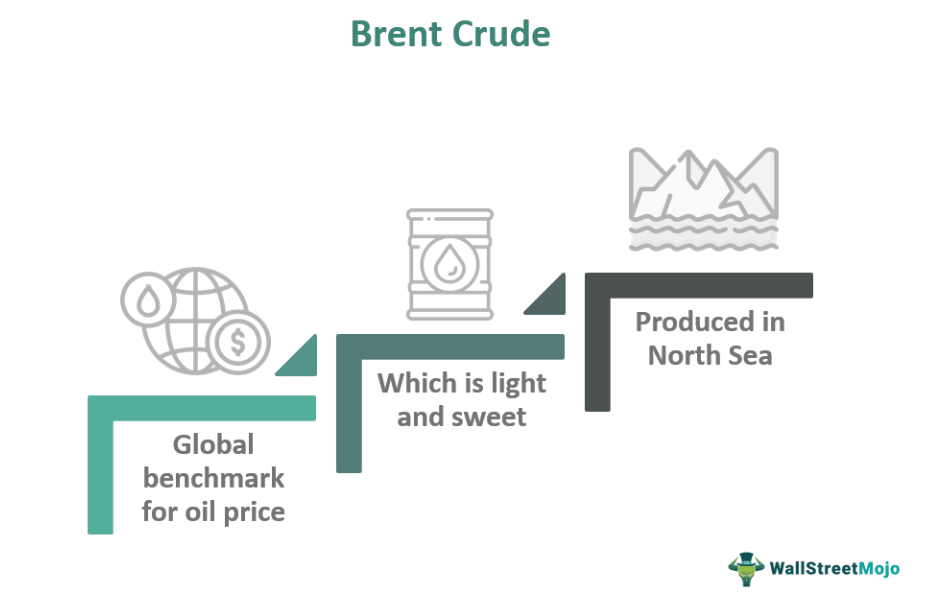

Brent Crude Oil is a principal benchmark heavily utilized by traders and speculators within the global oil market. Known for its lightness and low sulfur content, or "sweetness," Brent Crude is a favored option for refining into valuable end products like diesel and gasoline. Extracted from the North Sea, it plays a crucial role in setting prices for two-thirds of the world's internationally traded crude oil supplies, alongside other major benchmarks like West Texas Intermediate (WTI) and Dubai/Oman.

The trading landscape of crude oil has transformed dramatically with the rise of algorithmic trading, which uses sophisticated computer programs to execute trades based on predefined criteria. This technological advancement has significantly altered the interaction between traders and oil benchmarks such as Brent Crude. Algorithmic trading allows for the rapid execution of trades and the processing of vast amounts of market data, leading to more efficient market operations. It has also introduced new complexities in understanding market dynamics and the pricing of oil futures and derivatives.



In this article, we will examine the basics of Brent Crude as a market index, its critical role as a global oil benchmark, and the influence of algorithmic trading on contemporary financial markets. Grasping these concepts is vital for traders and investors as they engage in the intricate world of crude oil trading, where prices are subject to rapid fluctuations due to a multitude of factors, including geopolitical tensions, economic indicators, and natural disasters.

Furthermore, knowledge of Brent Crude’s properties and its strategic importance will enable market participants to better anticipate pricing trends and make informed trading decisions. As we progress, it is important to consider both the opportunities and challenges presented by the technological integration in trading practices. Understanding Brent Crude and the impact of algorithmic trading is essential for successfully navigating the volatile environment of global oil markets.

## Table of Contents

## Understanding Brent Crude Oil

Brent Crude is extracted from the North Sea and is among the three primary benchmarks within the global oil market, alongside West Texas Intermediate (WTI) and Dubai/Oman. Its significance arises from its widespread use in pricing approximately two-thirds of the world's internationally traded crude oil supplies. The distinguishing attributes of Brent Crude stem from its 'light and sweet' nature—characterized by low sulfur content and lower density—making it a preferred choice for refining into high-quality products like diesel and gasoline.

The geographical location of the North Sea oilfields contributes to Brent Crude's logistical advantage. Being offshore, the oil can be transported more easily and economically than landlocked oil sources, which often require costly pipeline or freight transportation. This logistical efficiency enhances Brent's appeal as a trade commodity in global markets.

Oil benchmarks such as Brent Crude are crucial in standardizing oil trading, facilitating simplified valuations and transactions across various markets. By providing a consistent reference point, Brent Crude assists in stabilizing the market dynamics, allowing traders and investors to make informed decisions based on a unified pricing structure.

## Brent Crude as a Market Index and Benchmark

Brent Crude serves as a crucial market index and benchmark within the global oil industry, heavily influencing oil pricing. As one of the primary benchmarks, its value is pivotal in derivatives markets, including futures and options. These financial instruments allow investors and traders to hedge against the often volatile nature of oil prices, thereby minimizing risk and stabilizing returns.

The significance of Brent Crude as a benchmark stems from its widespread acceptance and high [liquidity](/wiki/liquidity-risk-premium). It is extensively leveraged within the oil trading community, both for its physical qualities and strategic location. Due to this broad usage, Brent Crude provides a standardized pricing mechanism that simplifies the valuation process in oil trading.

Contracts based on Brent Crude are predominantly traded on major financial exchanges such as the Intercontinental Exchange (ICE) and the Chicago Mercantile Exchange (CME). These exchanges facilitate a wide array of derivative products, allowing for robust participation from various market participants, including speculators, hedgers, and arbitrageurs.

Understanding the dynamics of Brent Crude as a market index encompasses several factors. Firstly, its liquidity and widespread use make it a reliable reference price in the international oil market. The supply and demand for Brent Crude are influenced by numerous global factors, including geopolitical tensions, economic policies, and natural events, all of which contribute to its price [volatility](/wiki/volatility-trading-strategies).

Traders benefit from this index through the ability to make more informed decisions. By analyzing Brent Crude's price movements, market participants can gauge overall market sentiment and potential future trends. Moreover, due to its role in hedging, traders can mitigate exposure to adverse price shifts thus ensuring a more balanced trading strategy.

In conclusion, Brent Crude's position as a market index and benchmark is integral to oil market operations. Its influence extends to both conventional trading mechanisms and sophisticated financial derivatives, maintaining its status as a cornerstone in the global oil pricing architecture.

## The Role of Algorithmic Trading in Crude Oil Markets

Algorithmic trading, often referred to as 'algo trading,' represents a significant shift in the methodology of executing trades, utilizing complex computer algorithms to perform transactions at speeds and frequencies unattainable by human traders. In the context of [crude oil](/wiki/crude-oil) markets, [algorithmic trading](/wiki/algorithmic-trading) empowers traders with the ability to efficiently process vast amounts of data that influence oil prices. These data include geopolitical events, economic indicators, supply and demand dynamics, and even weather patterns—each playing a crucial role in the volatile pricing of oil commodities.

A pivotal benefit of algorithmic trading in crude oil markets is the enhancement of market liquidity. By facilitating a higher [volume](/wiki/volume-trading-strategy) of transactions, algo trading contributes to narrowed bid-ask spreads, resulting in more competitive pricing for market participants. This increased liquidity is crucial in futures markets, where trades pertain to the purchase or sale of oil at predetermined future dates and prices.

The strategies employed in algorithmic trading are diverse and sophisticated. They often involve the use of historical data to forecast future price movements, leveraging statistical models and [machine learning](/wiki/machine-learning) algorithms. For example, a mean reversion strategy might identify when crude oil prices deviate significantly from historical averages, signaling a potential opportunity to buy or sell. Similarly, [arbitrage](/wiki/arbitrage) strategies could detect price discrepancies between different oil benchmarks, such as Brent Crude and West Texas Intermediate (WTI), allowing traders to exploit these differences for profit.

Consider Python, a widely used programming language in algorithmic trading, for developing a simple moving average crossover strategy as an example:

```python
import pandas as pd

def simple_moving_average(data, window):
    return data.rolling(window=window).mean()

def generate_signals(data, short_window, long_window):
    signals = pd.DataFrame(index=data.index)
    signals['price'] = data
    signals['short_mavg'] = simple_moving_average(data, short_window)
    signals['long_mavg'] = simple_moving_average(data, long_window)
    signals['signal'] = 0.0
    signals['signal'][short_window:] = np.where(
        signals['short_mavg'][short_window:] > signals['long_mavg'][short_window:], 1.0, 0.0)

    return signals

# Example usage
# data = pd.Series([...]) # Crude oil price time series
# signals = generate_signals(data, short_window=40, long_window=100)
```

The mathematical foundation of such strategies involves various predictive models ranging from simple moving averages to more advanced models like regression analysis and neural networks, aimed at identifying profitable trade opportunities.

However, the rise of algorithmic trading also presents challenges. The potential for market manipulation and the occurrence of flash crashes—sudden, drastic price drops due to rapid trading—pose significant risks. These challenges necessitate the establishment of rigorous regulatory frameworks to monitor and manage the market's integrity. Institutions such as the Commodity Futures Trading Commission (CFTC) in the United States play a pivotal role in overseeing these markets and ensuring that the implementation of algorithmic trading adheres to legal and ethical standards.

In summary, algorithmic trading has revolutionized crude oil markets by enhancing transaction efficiency, liquidity, and pricing accuracy. Its continued evolution is expected to further integrate advanced technologies such as [artificial intelligence](/wiki/ai-artificial-intelligence), [deep learning](/wiki/deep-learning), and big data analytics, pushing the boundaries of what is possible in financial markets. Nevertheless, as the technology advances, maintaining robust regulations will be imperative to safeguard market stability and fairness.

## Conclusion

Brent Crude Oil remains a crucial benchmark in global oil markets, primarily due to its advantageous properties and strategic geographical location in the North Sea. These characteristics have cemented its role not just as a preferred option for refiners but also as a key reference point in the estimation of crude oil prices worldwide. As markets advance with technological innovations, algorithmic trading is becoming increasingly integral to crude oil trading. The combination of algorithmic trading with traditional oil benchmarks like Brent Crude introduces both new opportunities for efficiency and precision in trading, as well as challenges such as potential market volatility and the need for stringent regulatory oversight.

For traders and investors, staying abreast of these developments is essential to effectively manage the complexities of trading in oil markets, which are continually influenced by a host of variables ranging from geopolitical factors to technological advancements. Mastery of Brent Crude's market dynamics provides a competitive edge, enabling market participants to construct more effective trading strategies and optimize their portfolios. Moreover, leveraging algorithmic trading, with its capacity to analyze large datasets and execute trades at lightning speed, can offer significant advantages.

In this evolving landscape, adaptability and continual learning are paramount. As the market continues to fluctuate, incorporating technology-driven approaches with a deep understanding of market fundamentals will be the hallmark of successful traders and investors. Making informed, strategic decisions based on comprehensive analysis and technological tools will remain key in navigating and succeeding in the competitive and swiftly changing oil markets.

## References & Further Reading

[1]: Fattouh, B., Poudineh, R., & Sen, A. (2018). ["The Dynamics of Oil Prices: A Survey."](https://scholar.google.com/citations?user=9g_M808AAAAJ) Oxford Institute for Energy Studies.

[2]: MacKenzie, D. (2018). ["Material Signals: A Historical Sociology of Algorithmic Trading."](https://www.semanticscholar.org/paper/Material-Signals%3A-A-Historical-Sociology-of-MacKenzie/a3347764ea03c35bddbc703940a907c6e52f6f6b) American Journal of Sociology.

[3]: Hull, J. (2018). ["Options, Futures, and Other Derivatives."](https://www.pearson.com/nl/en_NL/higher-education/subject-catalogue/finance/Options-Futures-and-Other-Derivatives-Hull.html) Pearson.

[4]: Lopez de Prado, M. (2018). ["Advances in Financial Machine Learning."](https://www.amazon.com/Advances-Financial-Machine-Learning-Marcos/dp/1119482089) Wiley.

[5]: Geman, H. (2005). ["Commodities and Commodity Derivatives: Modeling and Pricing for Agriculturals, Metals, and Energy."](https://www.wiley.com/en-us/Commodities+and+Commodity+Derivatives%3A+Modeling+and+Pricing+for+Agriculturals%2C+Metals+and+Energy-p-9780470012185) Wiley.