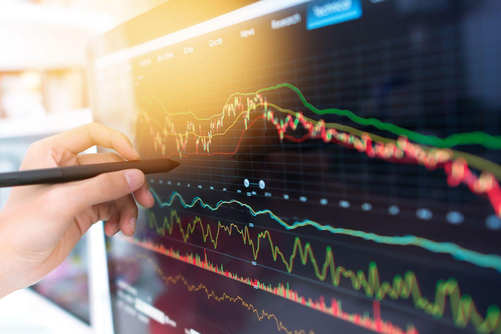

The world of trading has undergone a significant transformation with the integration of traditional trading methods and advanced algorithmic strategies. This evolution reflects a shift from manual decision-making to a more systematic, data-driven approach. Within this context, Brett Steenbarger, a leading figure in trading psychology, provides critical insights into the psychological aspects of algorithmic trading. Steenbarger emphasizes the importance of understanding psychological principles to improve trading outcomes by enhancing both performance and the decision-making process.

This article explores the intersection between trading psychology and algorithmic trading through the perspectives of Brett Steenbarger. It addresses the significance of developing strategies to break detrimental trading habits and encourages adaptability in response to the ever-shifting market dynamics. This adaptability is not only crucial for enduring success but also for personal growth within the trading discipline.



Understanding trading psychology equips traders with a substantial advantage in navigating the complexities of the financial markets. By leveraging these psychological insights, traders can refine their approach, ultimately leading to improved performance and more informed decision-making. Thus, recognizing the role of psychology in trading is pivotal for maintaining a competitive edge in modern financial environments.

## Table of Contents

## Brett Steenbarger's Philosophy on Trading Psychology

Brett Steenbarger, a notable figure in trading psychology, has significantly influenced how traders understand and leverage their psychological profiles to enhance performance in financial markets. As a trading psychology coach with experience collaborating with major financial institutions, Steenbarger emphasizes the importance of cultivating mental resilience and adaptability in traders.

In his numerous publications, including well-regarded [books](/wiki/algo-trading-books) such as "The Psychology of Trading" and "Enhancing Trader Performance," Steenbarger explores the critical role of psychological self-awareness. He suggests that traders should harness an understanding of their psychological strengths and weaknesses to improve their trading outcomes. By being aware of their emotional and cognitive biases, traders can better navigate the unpredictable nature of financial markets.

Steenbarger's approach to trading psychology is grounded in evidence-based techniques. He advocates for the implementation of psychological best practices that are geared towards performance enhancement. This includes the use of structured self-reflection methods and the development of personalized strategies that help traders stay focused and disciplined.

One of Steenbarger's key tenets is the need for traders to maintain a growth mindset. This involves continuously learning from both successes and failures, and being open to feedback and change. Such mental flexibility allows traders to adapt to dynamic market conditions and refine their strategies over time.

Through his work, Steenbarger has profoundly impacted the way traders perceive and incorporate psychological principles into their trading activities. By fostering self-awareness and adaptability, traders can not only enhance their technical skills but also significantly improve their decision-making processes in the financial markets.

## The Role of Psychology in Algorithmic Trading

Algorithmic trading, often characterized by precision and automation, is not immune to the influence of human psychology. While machines execute trades based on data-driven algorithms, traders are responsible for designing, monitoring, and adjusting these systems. Herein lies the critical interplay between psychology and [algorithmic trading](/wiki/algorithmic-trading). Human psychological factors can both bolster and hinder the efficacy of algorithmic strategies.

Behavioral biases are intrinsic to human traders, and they can inadvertently affect algorithmic execution. Common biases include overconfidence, where traders may place too much trust in their algorithms, and confirmation bias, where they may favor information that confirms their existing beliefs about market trends. These biases can lead to suboptimal decision-making, such as making premature modifications to algorithms that initially deviate from expected outcomes but are designed to perform well over the long term.

Brett Steenbarger, an expert in trading psychology, underscores the importance of recognizing and mitigating these biases. He advocates for a level of psychological discipline that allows traders to adhere strictly to the data-driven rules set by their algorithms. This discipline involves cultivating a mindset that remains consistent and objective, thereby minimizing subjective variations that could skew trading results.

It's crucial for traders to establish protocols that safeguard against emotional interference. For instance, they might implement automated alerts or checks that enforce strategy compliance, particularly when experiencing emotional distress or market [volatility](/wiki/volatility-trading-strategies). Regular psychological self-assessments can also help traders recognize patterns of emotional influence, facilitating adjustments to both mindset and strategy.

Moreover, the integration of psychological insights into algorithmic development can further fortify trading strategies. By incorporating an understanding of how emotional states influence market perceptions, traders can design algorithms that account for and exploit these human tendencies. Such algorithms can, for example, capitalize on typical behavioral responses to price movements, thereby enhancing profitability.

Ultimately, psychological awareness is not merely an adjunct to technical skill but a foundational component of cohesive trading strategy. In a domain dominated by logic and quantifiable metrics, recognizing the subtle yet potent impact of human emotion and cognition is key to constructing robust and resilient trading systems.

## Breaking Bad Trading Habits

Brett Steenbarger emphasizes the importance of recognizing and eliminating detrimental trading habits to enhance performance. Fundamental to overcoming these habits is the process of self-reflection and discipline. By consciously identifying the underlying causes of poor trading behaviors, traders can take steps to mitigate them and shift towards more productive patterns.

One of the key strategies Steenbarger proposes is setting specific, achievable goals. This involves defining clear objectives for what a trader wishes to accomplish and establishing metrics to track progress. By continuously measuring their performance against these goals, traders maintain focus and are able to make informed adjustments to their strategies.

Habitual trading errors often arise from emotional reactions to market fluctuations. When traders let emotions dictate their decisions, they risk deviating from sound strategies and making impulsive moves. To counteract this, Steenbarger advises the implementation of structured trading plans. These plans serve as a roadmap, helping traders remain disciplined and adhere to well-founded rules, even when faced with volatile markets.

Moreover, Steenbarger suggests maintaining a trading journal to document trades, thoughts, and emotional states. This practice fosters a deeper understanding of personal behavioral patterns, allowing traders to pinpoint specific triggers for poor decisions. By analyzing this information, traders can devise strategies to counteract these emotional cues, leading to more consistent and rational decision-making processes.

In summary, breaking bad trading habits requires a deliberate approach centered on self-awareness and structured planning. By setting goals, measuring progress, and managing emotional responses through disciplined trading plans, traders can enhance their decision-making capabilities and improve their overall trading outcomes.

## Adapting to Market Changes

Adapting to new market conditions is a critical skill for success in algorithmic trading. Brett Steenbarger, a distinguished expert in trading psychology, underscores the importance of adaptability by recommending the frequent updating and revising of trading strategies. In the fast-paced world of financial markets, strategies that may have been successful in the past can quickly become obsolete due to changing market dynamics, technological advancements, and evolving investor behavior. 

To successfully navigate these shifts, traders are encouraged to utilize historical data and market patterns as fundamental tools in their decision-making process. Historical data provides invaluable insights into how markets have reacted to different stimuli over time, allowing traders to identify trends and anomalies that could signal potential shifts in market conditions. By analyzing past market behavior, traders can develop robust strategies that are better equipped to handle future uncertainties.

For instance, employing quantitative models that [factor](/wiki/factor-investing) in statistical measures such as moving averages, volatility indices, and regression analysis can enhance the prediction accuracy of algorithmic strategies. Python, with its extensive libraries like Pandas for data manipulation and Matplotlib for data visualization, can serve as a powerful tool for traders. Here's an example of how Python can be used to analyze moving averages:

```python
import pandas as pd
import matplotlib.pyplot as plt

# Load historical market data
data = pd.read_csv('historical_market_data.csv')

# Calculate moving averages
data['SMA_50'] = data['Close'].rolling(window=50).mean()
data['SMA_200'] = data['Close'].rolling(window=200).mean()

# Plotting the moving averages and market data
plt.figure(figsize=(12,6))
plt.plot(data['Close'], label='Close Price')
plt.plot(data['SMA_50'], label='50-day SMA')
plt.plot(data['SMA_200'], label='200-day SMA')
plt.title('Moving Averages of Market Prices')
plt.xlabel('Date')
plt.ylabel('Price')
plt.legend()
plt.show()
```

This code calculates and plots the 50-day and 200-day simple moving averages (SMA) for a given historical dataset, which can help identify potential trend reversals or continuations.

Adapting trading strategies should not be solely reactionary but rather anticipatory, leveraging insights drawn from comprehensive data analysis. Steenbarger advocates for the incorporation of such adaptive mechanisms into trading strategies to ensure they remain effective and relevant. This proactive approach not only enhances the robustness of trading algorithms but also empowers traders to maintain a competitive edge in an ever-evolving market landscape.

## Goal Setting and Measuring Progress

Effective goal setting is a critical component in the arsenal of any successful trader, particularly in the milieu of algorithmic trading. Brett Steenbarger, a leading voice in trading psychology, emphasizes that the establishment of achievable and measurable targets is essential for maintaining motivation and focus among traders.

To achieve this, traders should develop clear and structured goals that align with their overall trading strategy. A well-defined goal might include specific parameters such as achieving a certain percentage return on investment, reducing drawdowns by a specified amount, or increasing the win rate of trades executed by a particular algorithm.

Steenbarger suggests that these goals should be revisited periodically to assess progress. This review process aids traders in identifying their areas of strength and those in need of improvement. By engaging in a continuous cycle of goal-setting and review, traders can ensure that they remain agile and responsive to both market changes and personal growth.

Measuring progress involves the use of clear and quantifiable metrics. For example, a trader might track metrics such as the Sharpe Ratio, which measures risk-adjusted returns, or the Sortino Ratio, which focuses on downside risk. These metrics provide valuable insights into trading performance, allowing traders to map their progress over time and make necessary adjustments to their strategies.

Moreover, Steenbarger encourages traders to leverage technology to automate and streamline the tracking of these metrics. For instance, Python can be employed to calculate and analyze trading performance metrics, providing traders with immediate and actionable insights. Below is a simple Python code snippet using pandas and numpy libraries to compute the Sharpe Ratio:

```python
import pandas as pd
import numpy as np

# Assuming 'df' is a DataFrame containing daily returns

def calculate_sharpe_ratio(df, risk_free_rate=0.01):
    # Mean of daily returns
    mean_returns = np.mean(df['returns'])

    # Standard deviation of daily returns
    std_dev = np.std(df['returns'])

    # Sharpe Ratio
    sharpe_ratio = (mean_returns - risk_free_rate) / std_dev
    return sharpe_ratio

# Example usage
df = pd.read_csv('trading_data.csv')  # Assuming the file contains a column 'returns'
sharpe_ratio = calculate_sharpe_ratio(df)
print(f'Sharpe Ratio: {sharpe_ratio}')
```

This systematic approach, advocated by Steenbarger, is vital for refining trading strategies in the fast-paced world of algorithmic trading. It promotes a disciplined mindset where traders set realistic goals, measure their effectiveness, and iterate upon their strategies for ongoing improvement. Through this process, traders are better positioned to achieve sustained success and personal development in the financial markets.

## Conclusion

Trading psychology, as advocated by Brett Steenbarger, is fundamentally important for the success of algorithmic trading. Understanding and implementing psychological best practices allows traders to improve both their technical skills and psychological resilience. This synergy provides a comprehensive edge in the highly competitive trading landscape.

Algorithmic trading, characterized by its reliance on data and precise execution, must also accommodate human emotional influences and behavioral biases. Steenbarger's insights into trading psychology equip traders to recognize and manage these factors, ensuring that emotional or cognitive biases do not disrupt the execution of algorithmically-driven strategies. This level of psychological discipline supports consistency in adhering to market rules and enhances overall performance.

Moreover, the interplay between psychology and algorithmic trading fosters a dynamic environment of continuous learning and adaptation. Steenbarger emphasizes the importance of adaptability—a crucial trait for navigating ever-changing market conditions. Regularly updating and revising strategies based on historical data and market patterns help traders stay relevant and competitive. This iterative process not only refines trading strategies but also contributes to personal growth by developing resilience and a deeper understanding of market behavior.

Harnessing the synergy between trading psychology and algorithmic proficiency can lead to sustained trading success. It equips traders with a robust framework for decision-making under pressure, reducing the risk of emotional trading and enabling data-driven efficiency. Ultimately, this holistic approach benefits traders by fostering sustainable performance and personal development, ensuring they remain effective and competitive in the evolving world of trading.

## References & Further Reading

[1]: Steenbarger, B. (2002). ["The Psychology of Trading: Tools and Techniques for Minding the Markets."](https://www.amazon.com/Psychology-Trading-Techniques-Minding-Markets/dp/0471267619) John Wiley & Sons.

[2]: Steenbarger, B. (2006). ["Enhancing Trader Performance: Proven Strategies From the Cutting Edge of Trading Psychology."](https://www.amazon.com/Enhancing-Trader-Performance-Strategies-Psychology/dp/0470038667) John Wiley & Sons.

[3]: Kahneman, D. (2011). ["Thinking, Fast and Slow."](https://link.springer.com/article/10.1007/s00362-013-0533-y) Farrar, Straus and Giroux.

[4]: Tversky, A., & Kahneman, D. (1974). ["Judgment under Uncertainty: Heuristics and Biases."](https://www2.psych.ubc.ca/~schaller/Psyc590Readings/TverskyKahneman1974.pdf) Science, 185(4157), 1124-1131.

[5]: Tharp, V. (1998). ["Trade Your Way to Financial Freedom."](https://books.google.com/books/about/Trade_Your_Way_to_Financial_Freedom.html?id=_hLzpVIg2sMC) McGraw-Hill Education.