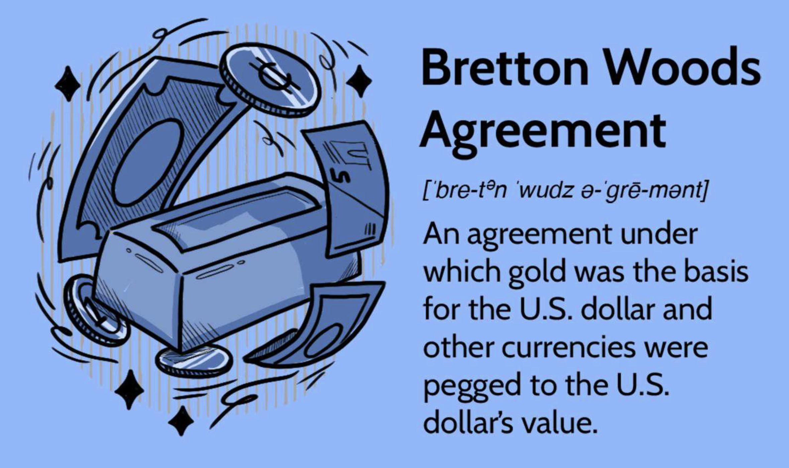

## Table of Contents

## What is the Bretton Woods Agreement?

The Bretton Woods Agreement was a big meeting that happened in 1944 in a place called Bretton Woods, New Hampshire. A lot of countries came together to make rules about money and trade. They wanted to make sure that the world's economy would be stable after World War II. The main idea was to set up a system where countries could work together and help each other with their money problems.

From this meeting, two important groups were created: the International Monetary Fund (IMF) and the World Bank. The IMF helps countries that have money troubles by giving them loans and advice. The World Bank helps poor countries by giving them money to build things like roads and schools. The agreement also said that countries should keep their money's value steady by linking it to the US dollar, which was linked to gold. This system lasted until the 1970s when it changed because the world's economy was different by then.

## When and where was the Bretton Woods Conference held?

The Bretton Woods Conference was held in 1944. It took place in a town called Bretton Woods, which is in the state of New Hampshire in the United States. This was a big meeting where leaders from many different countries came together to talk about money and trade.

The main goal of the conference was to make a plan to help the world's economy stay stable after World War II. They wanted to avoid the problems that happened after World War I. So, they created the International Monetary Fund (IMF) and the World Bank to help countries with their money issues and to support development.

## What were the main objectives of the Bretton Woods Agreement?

The main objectives of the Bretton Woods Agreement were to create a stable and cooperative international monetary system after World War II. Countries wanted to avoid the economic problems that happened after World War I, so they came together to make rules about money and trade. The big idea was to help countries work together and support each other, especially if they were having money troubles.

To achieve these goals, the agreement led to the creation of two important organizations: the International Monetary Fund (IMF) and the World Bank. The IMF was set up to provide loans and advice to countries facing financial difficulties, helping them stabilize their economies. The World Bank was established to give financial help to poorer countries so they could build things like roads, schools, and hospitals, which would help their economies grow. Together, these organizations aimed to promote global economic stability and development.

## Which countries were the primary signatories of the Bretton Woods Agreement?

The primary signatories of the Bretton Woods Agreement were the 44 countries that attended the conference in 1944. Some of the most important countries included the United States, the United Kingdom, and Canada. These countries played a big role in making the agreement and setting up the rules for the new international monetary system.

Other key countries that signed the agreement were France, China, and the Soviet Union. Each of these countries wanted to help create a stable world economy after World War II. By working together, they hoped to avoid the economic problems that happened after World War I and make sure that countries could support each other if they had money troubles.

## What are the key institutions established by the Bretton Woods Agreement?

The Bretton Woods Agreement set up two main organizations to help countries with their money problems. The first one is the International Monetary Fund (IMF). The IMF's job is to give loans and advice to countries that are having financial troubles. This helps them keep their economy stable and avoid big problems. The IMF works like a big helper that countries can go to when they need support.

The second organization created by the agreement is the World Bank. The World Bank's main goal is to help poorer countries grow their economies. It does this by giving them money to build important things like roads, schools, and hospitals. This helps these countries develop and improve the lives of their people. Together, the IMF and the World Bank work to make the world's economy stronger and more stable.

## What is the role of the International Monetary Fund (IMF) under the Bretton Woods system?

The International Monetary Fund (IMF) was created by the Bretton Woods Agreement to help countries with their money problems. Its main job is to give loans and advice to countries that are having financial troubles. This helps them keep their economy stable and avoid big problems. The IMF works like a big helper that countries can go to when they need support. It makes sure that if a country is struggling, it can get the help it needs to fix its money issues.

The IMF also helps keep the world's economy stable by making sure countries follow the rules set by the Bretton Woods Agreement. It keeps an eye on how countries are doing and gives them advice on how to make their economies stronger. By working together with countries, the IMF helps prevent big economic problems and makes sure that the global economy stays healthy. This was very important after World War II when countries wanted to avoid the economic troubles they faced after World War I.

## How does the World Bank function within the framework of the Bretton Woods Agreement?

The World Bank was set up by the Bretton Woods Agreement to help poor countries grow their economies. It does this by giving them money to build important things like roads, schools, and hospitals. This helps these countries develop and improve the lives of their people. When a country needs help to build something that will make its economy stronger, it can ask the World Bank for a loan. The World Bank then gives the country the money it needs, and the country uses it to build the projects that will help it grow.

The World Bank also works with countries to make sure these projects are successful. It gives advice on how to plan and manage the projects so they can have the biggest impact. By helping countries build important things and improve their economies, the World Bank plays a big role in making the world's economy stronger and more stable. This was a key part of the plan from the Bretton Woods Agreement, which wanted to help countries work together and support each other after World War II.

## What was the significance of the fixed exchange rate system established by Bretton Woods?

The fixed exchange rate system set up by the Bretton Woods Agreement was really important because it helped keep the world's money stable after World War II. Before the war, countries' money values went up and down a lot, which caused big economic problems. The Bretton Woods system tried to fix this by making countries link their money to the US dollar, which was linked to gold. This meant that if a country's money started to change too much, other countries could help it stay stable. This system made it easier for countries to trade with each other and helped prevent big money problems.

The fixed exchange rate system also made countries work together more. If a country was having money troubles, it could go to the International Monetary Fund (IMF) for help. The IMF would give the country loans and advice to fix its problems. This teamwork was a big part of the Bretton Woods plan. It helped countries feel more secure about their money and encouraged them to help each other. Even though the fixed exchange rate system ended in the 1970s, it played a big role in making the world's economy more stable during the time it was used.

## How did the Bretton Woods system collapse and what were the contributing factors?

The Bretton Woods system collapsed in the early 1970s because of a few big problems. One problem was that the US dollar was the main money that other countries' money was linked to, and the US had a lot of money troubles in the 1960s. The US was spending a lot on things like the Vietnam War and social programs, which made the dollar weaker. Other countries started to worry that their money, which was linked to the dollar, was also getting weaker. They wanted to change their money to gold, but the US didn't have enough gold to give to everyone.

Another big problem was that countries were trading more with each other, and they wanted their money to be able to change more freely. The fixed exchange rate system made it hard for countries to change their money's value when they needed to. In 1971, President Richard Nixon decided to stop linking the dollar to gold. This was called the "Nixon Shock." After that, countries started to let their money's value go up and down more freely. By 1973, the Bretton Woods system was over, and countries were using a new system where their money's value could change more easily.

Even though the Bretton Woods system ended, it had a big impact on the world's economy. It helped countries work together and made the world's money more stable for a while. The International Monetary Fund (IMF) and the World Bank, which were created by the Bretton Woods Agreement, are still helping countries today. They give loans and advice to countries that need help with their money problems and help poor countries grow their economies.

## What impact did the Bretton Woods Agreement have on global economic stability and development?

The Bretton Woods Agreement had a big impact on global economic stability and development. It helped countries work together to keep their money stable after World War II. By setting up the International Monetary Fund (IMF) and the World Bank, the agreement made sure that countries could get help if they were having money problems. The IMF gave loans and advice to countries that needed it, which helped them fix their economies and avoid big problems. The World Bank gave money to poor countries to build things like roads and schools, which helped them grow their economies and improve people's lives.

The fixed exchange rate system that came from the Bretton Woods Agreement also played a big role in keeping the world's money stable. Countries linked their money to the US dollar, which was linked to gold. This made it easier for countries to trade with each other and helped prevent big money problems. Even though the system ended in the 1970s, it helped the world's economy stay stable for many years. The IMF and the World Bank are still important today, helping countries with their money troubles and supporting development around the world.

## How have the roles and functions of the IMF and World Bank evolved since the end of the Bretton Woods system?

Since the end of the Bretton Woods system, the roles and functions of the International Monetary Fund (IMF) have changed a lot. The IMF used to help countries keep their money stable by giving them loans and advice. Now, it also helps countries fix their money problems in other ways. It gives advice on how to make their economies stronger and helps them deal with big problems like financial crises. The IMF also works with countries to make sure they follow good money rules. It keeps an eye on the world's economy and helps countries work together to keep it stable.

The World Bank has also changed since the end of the Bretton Woods system. It used to give money to poor countries to build things like roads and schools. Now, it does more than that. The World Bank helps countries fight poverty in many ways. It gives money and advice on how to make their economies grow and how to take care of the environment. It also helps countries deal with big problems like climate change and health crises. The World Bank works with other groups to make sure that countries can grow in a way that is good for everyone.

## What are some criticisms and controversies surrounding the Bretton Woods institutions and their policies?

Some people think that the IMF and the World Bank have problems with how they work. One big criticism is that these groups sometimes make countries do things that might not be good for them. For example, the IMF might say a country has to cut spending on things like schools and hospitals to get a loan. This can make life harder for people in that country. Also, some people say that the IMF and the World Bank have too much power and don't listen to what countries want. They think these groups should work more with countries to find the best solutions.

Another problem is that the IMF and the World Bank are seen as favoring rich countries. Critics say that these groups often make rules that help rich countries more than poor ones. This can make it harder for poor countries to grow their economies. Some people also think that the IMF and the World Bank don't do enough to help with big problems like climate change and inequality. They want these groups to focus more on making the world a better place for everyone, not just a few countries.

## References & Further Reading

[1]: Boughton, J. M. (2004). ["The IMF and the Force of History: Ten Events and Ten Ideas that Have Shaped the Institution."](https://www.imf.org/external/pubs/ft/wp/2004/wp0475.pdf) International Monetary Fund.

[2]: Bordo, M. D. (1993). ["The Bretton Woods International Monetary System: A Historical Overview."](https://www.nber.org/papers/w4033) In A Retrospective on the Bretton Woods System: Lessons for International Monetary Reform, National Bureau of Economic Research.

[3]: ["The World Bank: From Reconstruction to Development to Equity"](https://www.taylorfrancis.com/books/mono/10.4324/9780203967539/world-bank-katherine-marshall) by Katherine Marshall

[4]: MacKenzie, D. A. (2006). ["An Engine, Not a Camera: How Financial Models Shape Markets."](https://academic.oup.com/mit-press-scholarship-online/book/20588) The MIT Press.

[5]: Chabria, A., & Mihov, I. (2017). ["Algorithmic Trading: A Primer."](https://assets.cambridge.org/97811070/91146/frontmatter/9781107091146_frontmatter.pdf) INSEAD Knowledge.