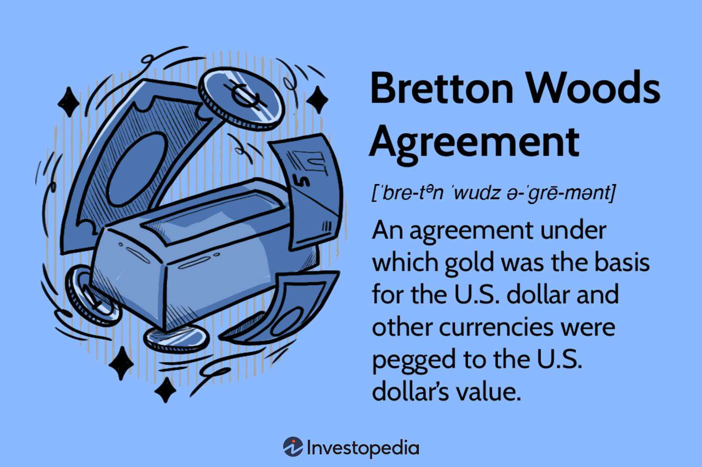

The global economic system has undergone significant transformations since the Bretton Woods Conference in 1944, which laid the foundation for modern international finance. This conference aimed to create a cooperative framework to prevent the economic instability that characterized the interwar period. As a result, two pivotal institutions were established: the World Bank and the International Monetary Fund (IMF).

The World Bank and the IMF play distinct yet complementary roles in international finance. The World Bank focuses on long-term economic development and poverty reduction, financing various projects ranging from infrastructure to education in developing countries. Its mission is to foster sustainable economic growth by improving infrastructure, healthcare, education, and environmental conditions. Meanwhile, the IMF's primary purpose is to ensure global financial stability. It monitors exchange rates and balance of payments, providing financial assistance to countries facing economic crises to maintain currency stability and support economic policies that foster growth.

A noteworthy transformation in financial markets in recent decades has been the rise of algorithmic trading. This form of trading employs complex algorithms to execute trades at speeds and frequencies beyond human capability. Algorithmic trading has significantly impacted global markets, contributing to increased liquidity and market efficiency but also raising concerns about volatility and systemic risk. The use of algorithms in finance exemplifies the broader trend of digitization and technological innovation in economic systems.

The purpose of this article is to explore how these influential entities and concepts intersect and shape the global economic landscape. An understanding of these dynamics is crucial for investors and policymakers, as the interplay between traditional financial institutions, like the World Bank and IMF, and modern trading technologies can influence economic stability and growth. By examining the roles and interactions of these elements, stakeholders can better navigate the complexities of the global financial system and develop strategies for resilience and sustainability in an increasingly interconnected world.

## Table of Contents

## The Bretton Woods System and Its Legacy

The Bretton Woods Conference was convened in July 1944 in Bretton Woods, New Hampshire, amidst the closing chapters of World War II, with the primary objective of designing a framework for the post-war international economic order. Representatives from 44 allied nations gathered to address critical economic challenges, culminating in the establishment of pivotal financial institutions and mechanisms that would shape the global economic landscape for decades.

Central to the Bretton Woods System was the creation of the International Monetary Fund (IMF) and the International Bank for Reconstruction and Development (IBRD), now part of the World Bank Group. The IMF was tasked with promoting international monetary cooperation, facilitating balanced international trade, and providing resources to member countries in financial distress. Conversely, the World Bank focused on reconstructing war-torn economies and promoting economic development, initially concentrated in Europe but eventually expanding globally to alleviate poverty and build infrastructure in developing nations.

The Bretton Woods Agreement also introduced a fixed exchange rate system, pegging global currencies to the U.S. dollar, which was in turn convertible to gold at a fixed rate of $35 per ounce. This system established a stable monetary environment conducive to international trade and investment by minimizing exchange rate [volatility](/wiki/volatility-trading-strategies) and enabling predictability in international economic transactions.

However, the fixed exchange rate system faced increasing strain during the 1960s, driven by factors such as persistent U.S. balance of payments deficits, the Vietnam War expenditures, and the gold drain from U.S. reserves. These pressures culminated in the Nixon Shock of 1971, when President Richard Nixon suspended the dollar's gold convertibility, effectively ending the Bretton Woods System. This action initiated a transition to a regime of floating exchange rates, wherein currency values were determined by market forces rather than fixed parity.

Despite the dissolution of the fixed exchange rate system, the Bretton Woods institutions have continued to play a crucial role in international economic governance. The IMF has adapted to a world of floating exchange rates by focusing on macroeconomic surveillance, financial assistance programs, and crisis management. Meanwhile, the World Bank has expanded its mission to encompass a broader array of development goals, leveraging financial instruments to address global challenges such as poverty reduction, education, and climate change.

Overall, the legacy of the Bretton Woods System remains evident in the enduring influence of its institutions on global economic policies and practices. Through their initiatives and interventions, the IMF and the World Bank continue to shape economic strategies and provide vital support to countries navigating the complexities of modern economic landscapes.

## Role of the World Bank in Global Development

The World Bank, established in 1944 during the Bretton Woods Conference, serves as a vital global institution focused on reducing poverty and facilitating development projects worldwide. Its primary mission is to provide financial and technical assistance to developing countries, enabling them to implement development projects that can stimulate economic progress and improve living conditions.

One of the World Bank's key initiatives is funding infrastructure projects such as roads, bridges, and energy plants, which are critical for economic growth. Additionally, the bank invests heavily in healthcare and education, recognizing these sectors as foundational to fostering long-term development. Through these initiatives, the World Bank aims to improve access to essential services, promote sustainable practices, and enhance economic opportunities for impoverished communities.

The impact of World Bank policies on developing countries is considerable, with numerous projects leading to tangible improvements in economic infrastructure and human development indicators. However, these policies have also drawn criticism, primarily due to concerns about the social and environmental repercussions of certain projects and the perceived imposition of neoliberal economic models. Critics argue that some initiatives may benefit large corporations more than local populations or disrupt traditional ways of life without offering adequate alternatives.

In response to these challenges, the World Bank has implemented various reforms aimed at increasing transparency, enhancing stakeholder engagement, and ensuring environmental and social safeguards. The institution has also shifted focus towards more inclusive and sustainable development strategies, emphasizing the importance of addressing climate change, reducing inequality, and promoting good governance.

Looking ahead, the World Bank is likely to concentrate on areas such as digital development, gender equality, and climate resilience. As global challenges evolve, the World Bank aims to adapt its approaches to meet the diverse needs of its member countries, leveraging technology and innovation to maximize development impacts while maintaining financial and operational accountability.

## The International Monetary Fund and Global Financial Stability

The International Monetary Fund (IMF) serves as a pivotal institution in maintaining global financial stability, facilitating international monetary cooperation, and providing resources to countries in need. Established in 1944 during the Bretton Woods Conference, the IMF aims to promote economic growth and reduce poverty worldwide. Its primary purpose lies in ensuring the stability of the international monetary system—the system of exchange rates and international payments that enables countries to transact with each other.

The IMF plays a critical role in monitoring exchange rates and balance of payments, helping to prevent monetary disturbances that could lead to global economic instability. By conducting rigorous surveillance of its member countries' economic policies, the IMF provides assessments and offers policy advice designed to ward off potential financial crises. This surveillance function encompasses regular reports and evaluations, such as the World Economic Outlook and the Global Financial Stability Report, which offer detailed analyses of economic trends and vulnerabilities.

Financial assistance and lending constitute another core function of the IMF. Through its various lending mechanisms, the IMF provides financial support to member countries facing balance of payments problems. The primary financial tools include Stand-By Arrangements (SBAs) and the Extended Fund Facility (EFF), designed to assist with short- and medium-term economic challenges, respectively. Additionally, lending instruments like the Rapid Financing Instrument (RFI) and Rapid Credit Facility (RCF) are used for urgent financial needs, such as those arising from natural disasters or commodity price shocks.

The utilization of IMF resources is crucial during economic crises, often providing a stabilizing effect on afflicted economies. The IMF has historically stepped in to aid countries during severe financial turmoil, such as the Asian Financial Crisis in the late 1990s and the Global Financial Crisis of 2007-2008. By supplying necessary funds and implementing economic reform programs, the IMF helps restore economic order and confidence.

Reforms and controversies often accompany the IMF's policies and programs. Criticisms typically revolve around the conditionalities attached to IMF assistance, which some argue can lead to austere measures that may exacerbate socio-economic hardships in borrowing countries. Efforts to reform the IMF include increasing the representation of emerging markets within the institution and revising lending policies to be more attuned to the social impacts of economic reforms.

Overall, the IMF remains a bedrock institution in the quest for global economic stability. Its functions of surveillance, financial assistance, and crisis prevention play integral roles in safeguarding the international monetary system. Nonetheless, ongoing reform and adaptation to changing global dynamics are vital for the IMF to effectively meet future challenges.

## Algorithmic Trading: Revolutionizing Global Markets

Algorithmic trading refers to the execution of orders using automated pre-programmed trading instructions, taking into account variables such as time, price, and [volume](/wiki/volume-trading-strategy). This technology-driven method relies heavily on computers to conduct trades at speeds and frequencies that are impossible for human traders. The concept of [algorithmic trading](/wiki/algorithmic-trading) can be traced back to the 1970s with the advent of electronic communication networks (ECNs), which started to facilitate direct trading of securities without the need for an exchange floor.

The rise of algorithmic trading over the years has introduced several advantages to financial markets. One of the primary benefits is the enhancement of market efficiency. Algorithmic systems can process vast amounts of market data quickly, reacting instantly to discrepancies in asset pricing and thus contributing to the efficient market hypothesis, which suggests that asset prices instantly reflect all available information. Additionally, algorithmic trading increases market [liquidity](/wiki/liquidity-risk-premium) by providing more buy and sell orders to the market. This reduces the bid-ask spreads and helps stabilize prices. Strategies such as [market making](/wiki/market-making), [arbitrage](/wiki/arbitrage), and [trend following](/wiki/trend-following) are commonly used in algorithmic trading to capitalize on market trends and inefficiencies.

However, despite its advantages, algorithmic trading also significantly impacts market volatility and presents several risks. While it can add liquidity, studies have shown that it can also lead to increased short-term volatility, particularly during high-frequency trading ([HFT](/wiki/high-frequency-trading-strategies)) activities. Events such as the 2010 Flash Crash exemplify the potential for algorithmic trading to cause abrupt market movements when algorithms react to the same market triggers.

Regulation of algorithmic trading poses considerable challenges due to its complexity and rapid evolution. Regulatory bodies, such as the U.S. Securities and Exchange Commission (SEC) and European Securities and Markets Authority (ESMA), have taken steps to implement frameworks that oversee algorithmic trading practices. These include demanding greater transparency in order strategies and execution and enforcing rules to minimize manipulative trading practices, such as spoofing or layering.

Recent trends highlight significant technological advancements that are shaping algorithmic trading. Machine learning and [artificial intelligence](/wiki/ai-artificial-intelligence) (AI) are increasingly integrated into trading algorithms, allowing systems to learn from historical data patterns and improve their predictive accuracy. Quantum computing also poses potential future impacts, promising even faster data processing and execution speeds.

In summary, algorithmic trading has transformed global financial markets by making trading faster and more efficient. Nonetheless, it brings about complexities and risks that require ongoing innovations and regulatory oversight to ensure it operates harmoniously within the financial ecosystem.

## Interconnection between the Global Economic Institutions and Algorithmic Trading

The intersection of global economic institutions such as the World Bank and the International Monetary Fund (IMF) with algorithmic trading involves a complex interplay where policies and digital technologies mutually influence financial markets. The policies implemented by these institutions often set the macroeconomic environment within which algorithmic trading operates. These policies can influence interest rates, exchange rates, and economic stability, which are critical factors in financial markets. For example, when the IMF provides assistance to stabilize a country's economy, this decision can lead to changes in currency valuations that are immediately picked up by algorithmic trading systems. These systems often utilize data related to GDP growth rates, inflation rates, and international trade balances — areas profoundly affected by World Bank and IMF policies — to make real-time trading decisions.

Algorithmic trading plays a pivotal role in reflecting and amplifying global economic trends. By leveraging vast datasets, algorithmic trading systems can identify patterns and predict market movements with greater efficiency than human traders. This capability allows these systems to quickly react to policy shifts announced by the World Bank and IMF, which can lead to rapid market responses, amplifying the impact of these policies beyond their traditional reach. For instance, an [interest rate](/wiki/interest-rate-trading-strategies) change suggested or implemented due to IMF policy guidance can cause immediate and widespread fluctuations in stock and currency markets, driven by the speed of algorithmic trading executions.

Several case studies illustrate how global policy shifts can affect algorithmic trading strategies. One noteworthy example occurred during the European debt crisis, where decisions by the IMF and European Central Bank impacted sovereign bond yields and foreign exchange rates. Algorithmic trading systems, programmed to detect such shifts, led to substantial capital flows across markets, accentuating market volatility during the crisis. Another instance is the policy interventions during the COVID-19 pandemic, where both World Bank and IMF actions to provide economic support influenced markets significantly. Algorithmic trading strategies adjusted swiftly, capitalizing on these interventions by reallocating assets dynamically based on perceived risk and return profiles.

The integration between traditional institutions like the World Bank and IMF, and modern trading technologies, presents both collaborative opportunities and potential conflicts. While collaboration could enhance data-sharing initiatives and foster more informed trading strategies, conflicts may arise regarding regulatory aspects and disparities in response times. Traditional policy implementation processes may not keep pace with the rapid execution speeds of algorithmic trading, posing challenges to ensure market stability.

This symbiotic relationship between global economic institutions and algorithmic trading is reshaping future economic landscapes. The feedback loops created by responsive trading systems mean that global policies need to consider these immediate effects when formulating interventions. As technologies continue to advance, this interconnection is likely to become more pronounced, necessitating an adaptive approach by both policymakers and traders to foster economic stability and growth. Understanding this dynamic is crucial for stakeholders aiming to navigate and influence future global financial systems effectively.

## Challenges and Opportunities Ahead

Algorithmic trading has fundamentally altered the landscape of financial markets, offering both advantages and introducing new complexities. A key challenge is the over-reliance on algorithmic systems for market operations. This dependency can exacerbate systemic risks, as automated trading systems may react similarly to changing market conditions, amplifying market volatility and potentially leading to flash crashes. A notable example is the May 6, 2010 Flash Crash, where the Dow Jones Industrial Average dropped nearly 1,000 points within minutes, only to recover shortly after. This incident highlighted the vulnerability of markets to rapid, algorithm-driven movements.

Regulatory challenges accompany the swift advancement of trading technologies. Traditional regulatory frameworks often struggle to keep pace with innovations such as high-frequency trading (HFT) and [machine learning](/wiki/machine-learning) algorithms. The decentralized and rapid nature of these technologies complicates oversight and enforcement, as regulators strive to adapt rules and practices to ensure market integrity and protect against manipulation. National and international regulatory bodies increasingly face the task of establishing balanced measures that safeguard markets without stifling innovation. 

Despite these challenges, algorithmic trading presents significant opportunities for achieving sustainable economic growth. Automation and advanced algorithms can enhance market efficiency by narrowing bid-ask spreads and increasing trade execution speed. These improvements lead to more liquid and competitive markets, which are beneficial for both investors and companies seeking capital. Furthermore, algorithmic trading's ability to analyze vast datasets and identify patterns offers potential gains in investment strategies and risk management.

Striking a balance between institutional stability and innovation remains crucial. The rapid evolution of trading technologies necessitates a reassessment of traditional financial systems and practices. Financial institutions must adapt to new trading paradigms while maintaining robust risk management frameworks. Empowering regulatory bodies with technological tools and expertise is essential, ensuring they possess the capability to monitor and respond to market developments effectively.

For stakeholders navigating these evolving dynamics, strategic recommendations include fostering collaboration between regulators, financial institutions, and technology firms. This collaboration can lead to the development of standardized protocols and best practices, promoting transparency and accountability in algorithmic trading. Investment in research and development to understand the implications of technological changes better is also critical. Additionally, continuous education and skill development for professionals involved in financial markets will ensure the readiness to adapt to new tools and systems.

In conclusion, while algorithmic trading poses challenges, particularly in risk management and regulation, it also offers pathways for improving market efficiency and supporting economic growth. A proactive and cooperative approach among stakeholders will be essential to harnessing the potential of these technologies while safeguarding market stability.

## Conclusion

The global financial landscape has undergone significant transformations since the establishment of the Bretton Woods system. The establishment of the World Bank and the International Monetary Fund (IMF) during the 1944 Bretton Woods Conference marked the beginning of structured international economic cooperation intended to promote stability and development. These institutions continue to play pivotal roles in shaping economic policies across the globe, their influence ever-evolving in response to changing economic conditions.

In recent years, the rapid advancement of technology has brought about a new paradigm shift in financial markets through algorithmic trading. This approach, which utilizes computer algorithms to execute trades at speeds and efficiencies unattainable by human traders, has revolutionized market dynamics. While algorithmic trading enhances market liquidity and operational efficiency, it also introduces new challenges, including increased market volatility and the need for robust regulatory frameworks.

The intersection of traditional economic institutions and modern trading technologies creates a complex, intertwined system. The policies implemented by the World Bank and IMF often ripple through financial markets, impacting trading strategies and outcomes. Algorithmic trading, with its ability to respond almost instantaneously to economic data and policy shifts, acts as both a barometer and amplifier of these global trends.

Adapting to this dynamic environment requires resilience and foresight from all stakeholders. Policymakers are urged to craft regulatory measures that ensure market stability without stifling innovation. Financial institutions must embrace technological advancements to enhance service delivery, while traders should leverage these tools to optimize their strategies within the confines of ethical and sustainable practices.

Looking ahead, the potential transformations in global finance promise both challenges and opportunities. A balanced and inclusive economic system can be achieved through strategic collaboration between global institutions and the financial technology sector. By aligning objectives and leveraging diverse capabilities, the global community can foster an economic environment that is both stable and conducive to growth. This calls for continuous dialogue and cooperation among policymakers, institutions, and traders to ensure a resilient and adaptive financial ecosystem capable of withstanding future challenges.

## References & Further Reading

[1]: Boughton, J. M. (2004). ["The IMF and the Force of History: Ten Events and Ten Ideas that Have Shaped the Institution."](https://www.imf.org/external/pubs/ft/wp/2004/wp0475.pdf) International Monetary Fund.

[2]: Bordo, M. D. (1993). ["The Bretton Woods International Monetary System: A Historical Overview."](https://www.nber.org/papers/w4033) In A Retrospective on the Bretton Woods System: Lessons for International Monetary Reform, National Bureau of Economic Research.

[3]: ["The World Bank: From Reconstruction to Development to Equity"](https://www.taylorfrancis.com/books/mono/10.4324/9780203967539/world-bank-katherine-marshall) by Katherine Marshall

[4]: MacKenzie, D. A. (2006). ["An Engine, Not a Camera: How Financial Models Shape Markets."](https://academic.oup.com/mit-press-scholarship-online/book/20588) The MIT Press.

[5]: Chabria, A., & Mihov, I. (2017). ["Algorithmic Trading: A Primer."](https://assets.cambridge.org/97811070/91146/frontmatter/9781107091146_frontmatter.pdf) INSEAD Knowledge.