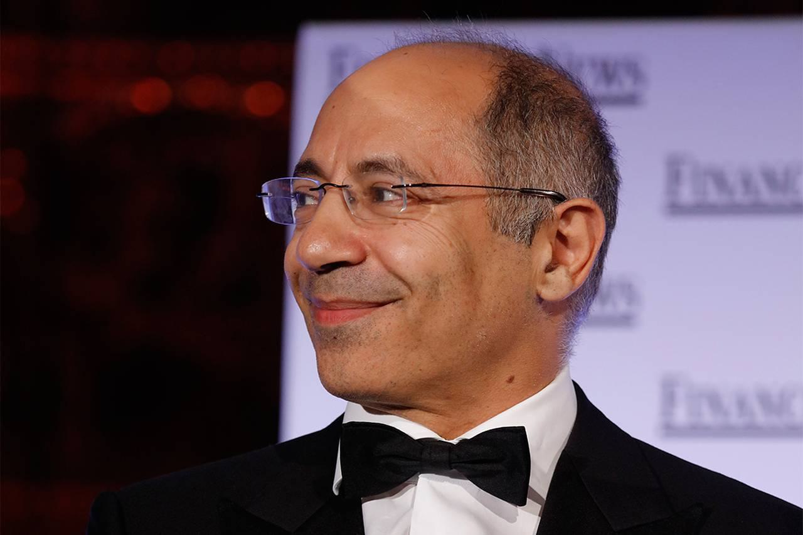

Brevan Howard is a leading name in the hedge fund industry, distinguished for its comprehensive approach to investment management and a primary focus on global macro trading strategies. Established in 2002 by Alan Howard alongside a team of financial experts, the firm has expanded to become one of the most significant macro hedge funds worldwide. This transformation underscores a robust infrastructure built around a unique approach to algorithmic trading, complemented by a broad array of investment strategies that ensure sustained competitive advantage in the financial markets.

Brevan Howard's investment philosophy is rooted in a triad of core elements that are meticulously integrated into its operational framework. These pillars—macro thinking, trade structuring, and risk management—are pivotal in driving the firm's success and shaping its strategic direction. The firm's commitment to technology has further augmented its trading practices, enabling the use of sophisticated algorithmic techniques to yield better risk-adjusted returns. This technological emphasis is integral to Brevan Howard's ability to navigate complex financial landscapes and optimize trading outcomes.

Additionally, the firm's culture is a cornerstone of its operational excellence. Brevan Howard attracts highly skilled professionals, fostering an environment characterized by intellectual curiosity and innovation, with a strong adherence to integrity. This cultural ethos not only supports individual growth and development but also underpins the firm's position as a prominent figure in the global financial arena.

Brevan Howard's impact extends beyond its internal framework, influencing the broader financial landscape. Through its strategic maneuvers and investment decisions, the firm has consistently set benchmarks in the world of alternative investment, demonstrating resilience and adaptability in fluctuating market conditions. This article further discusses Brevan Howard's trading strategies, technological integration, and cultural attributes, highlighting its influential role and ongoing contributions to the hedge fund sector.

## Table of Contents

## The Rise of Brevan Howard

Brevan Howard was established in 2002 by Alan Howard and his co-founders, drawing segments of their last names to form a brand that would become synonymous with macroeconomic prowess. Their foresight in emphasizing global macro strategies allowed them to carve a niche in the highly competitive hedge fund industry. The firm's philosophy of fusing rigorous macroeconomic analysis with dynamic trading strategies fostered rapid growth.

By 2013, Brevan Howard had reached a significant milestone: its assets under management (AUM) peaked at approximately $40 billion. This was indicative not only of the firm's continued influence but also of the trust it had built among institutional investors globally. The capacity to attract capital to such an extent highlights their strategic acumen and efficient capital deployment.

However, like many financial entities, Brevan Howard faced headwinds. In 2016, the firm saw a downturn in its AUM. This can be attributed to market conditions and internal performance challenges. Nevertheless, their adeptness at strategic reinvestment and a resurgence in market [volatility](/wiki/volatility-trading-strategies) facilitated a recovery. By 2022, Brevan Howard was managing $26 billion in assets. This rebound demonstrates their resilience and ability to navigate complex financial landscapes successfully.

Brevan Howard's track record during the COVID-19 pandemic underscored their robust investment strategies. Despite the unprecedented market turmoil caused by the pandemic, the firm delivered exceptional returns. This achievement further cemented Brevan Howard's standing as a firm capable of delivering strong performance even under adverse conditions.

Brevan Howard's trajectory showcases a balance between aggressive growth and strategic adaptability. Their journey reflects the importance of macroeconomic insights and strategic agility in maintaining a competitive edge in the ever-changing global financial landscape.

## Algo Trading at Brevan Howard

Brevan Howard integrates [algorithmic trading](/wiki/algorithmic-trading) into its portfolio management, utilizing leading-edge technology to optimize its trading operations. The firm's methodology centers around three foundational elements: macro thinking, trade structuring, and robust risk management. These pillars are augmented through advanced algorithmic trading techniques, a key component of Brevan Howard's strategy.

Macro thinking serves as the strategic starting point, guiding the identification of large-scale economic trends and financial indicators that can influence market movements. Brevan Howard's algorithms capitalize on these insights to formulate trading opportunities. The next step, trade structuring, involves designing trades that reflect these macroeconomic views. This process is enhanced by algorithms that identify optimal entry and [exit](/wiki/exit-strategy) points, create efficient execution paths, and adjust based on real-time market data.

A crucial aspect of Brevan Howard's algorithmic trading is its ability to structure convex trades. Convex trades benefit more from favorable price movements than they lose from adverse ones. Algorithms play a pivotal role in identifying and constructing these trades, optimizing the risk-reward outcomes to make the most of market inefficiencies and asymmetries. By doing so, Brevan Howard can achieve positive returns even in volatile or unpredictable market conditions.

Risk management, the third pillar, is deeply integrated with algorithmic trading practices at Brevan Howard. The firm employs sophisticated algorithms to monitor risk metrics and perform stress testing, scenario analysis, and portfolio adjustments. This dynamic risk management framework ensures that potential losses are minimized, safeguarding against adverse market conditions while capitalizing on favorable shifts.

Investment in cutting-edge technology is a cornerstone of Brevan Howard's strategy. This commitment ensures that traders are equipped with state-of-the-art tools to interpret complex datasets, execute trades with precision, and maintain a competitive edge in financial markets. The advancement of [machine learning](/wiki/machine-learning) and [artificial intelligence](/wiki/ai-artificial-intelligence) within the firm's trading systems further enhances Brevan Howard's ability to adapt to fast-changing financial landscapes.

In conclusion, Brevan Howard's approach to algorithmic trading is a harmonious blend of strategic macroeconomic insights, innovative trade structuring, and comprehensive risk management. By prioritizing technology and algorithmic solutions, the firm continually refines its trading strategies to maintain its standing as a leading macro [hedge fund](/wiki/hedge-fund-trading-strategies).

## Investment Strategies and Techniques

Brevan Howard employs a comprehensive range of investment products that strategically target various asset classes such as fixed income, foreign exchange, commodities, and, more recently, digital assets. This diversity allows the firm to effectively leverage opportunities across different sectors and economic cycles.

One of the primary investment strategies utilized by Brevan Howard is directional trading, wherein the firm takes positions based on anticipated market movements and broader economic trends. This approach is complemented by relative value trading strategies, which seek to exploit price differentials between related securities. These strategies allow Brevan Howard to generate returns that are independent of overall market direction, thereby providing a more stable performance profile.

Managing risks and maximizing returns are core components of Brevan Howard's investment philosophy. The firm employs proprietary risk management techniques, which include rigorous stress tests and scenario analyses. These processes help in identifying potential vulnerabilities in their investment portfolio and allow for adequate adjustments to mitigate losses. Additionally, these practices ensure that the firm is well-prepared for unprecedented market events, enhancing its resilience against volatility.

The utilization of leverage and quantitative models is another critical aspect of Brevan Howard's strategy. Leverage is employed judiciously to amplify returns, while quantitative models are used to analyze market data and inform decision-making. These models help in identifying patterns and inefficiencies in the market, thereby refining the firm's investment strategies to respond to shifting market dynamics effectively.

By consistently applying these strategies and techniques, Brevan Howard maintains its adaptability in a fast-evolving financial market landscape, thereby securing its position as a leader in the alternative investment arena.

## Cultural and Operational Excellence

Brevan Howard's success is intimately linked to its distinct culture, characterized by intellectual curiosity, innovation, and integrity. This culture fosters an environment where exceptional talent can thrive, significantly contributing to the firm's prominent position in the hedge fund industry.

The firm has strategically established a global presence with hubs in key financial cities, such as London, New York, and Hong Kong. These locations facilitate a diverse and inclusive community of independent thinkers, enhancing Brevan Howard's ability to navigate complex global markets. The geographical diversity not only allows for the collation of varied perspectives but also provides strategic advantages in responding to regional market dynamics.

Employee development stands at the core of Brevan Howard's operational philosophy, emphasizing continuous growth and professional advancement. The firm promotes a collaborative culture that centers on results-driven performance, ensuring that employees are well-equipped to contribute to the firm's overarching goals. This commitment to professional development is evident in structured training programs, mentorship opportunities, and a performance review process designed to identify and cultivate potential within the organization.

Brevan Howard's vibrant and challenging environment is a testament to its operational excellence. It provides employees with the autonomy to explore innovative solutions while maintaining rigorous standards of accountability and performance. This balance between innovation and discipline ensures that the firm remains competitive and adapts to the evolving landscape of global finance.

In embracing this unique cultural and operational approach, Brevan Howard positions itself at the forefront of the hedge fund industry. Its emphasis on fostering talent and maintaining operational integrity not only supports its immediate objectives but also establishes a sustainable framework for long-term growth and stability.

## Conclusion

Brevan Howard stands as a testament to the effectiveness of a meticulously devised macro strategy, backed by sophisticated technological infrastructure and a highly skilled team. The firm's unwavering dedication to robust risk management and state-of-the-art algorithmic trading techniques serves as the foundation of its investment philosophy, empowering it to adeptly navigate the unpredictability of financial markets. 

The continuous refinement of its investment processes and the strategic expansion of its product offerings enables Brevan Howard to maintain its position as a leader in the alternative investment space. This adaptability ensures not only sustained superior performance but also the successful engagement with a broad spectrum of asset classes, including traditional commodities and emerging digital assets. 

Furthermore, Brevan Howard exemplifies excellence through the cultivation of strong investor relations and adherence to high standards of operational integrity. This commitment to innovation and excellence positions the firm as a benchmark for industry best practices and operational rigor, offering a model of resilience and success for other players in the hedge fund industry.

## References & Further Reading

[1]: ["The Man Who Solved the Market: How Jim Simons Launched the Quant Revolution"](https://www.amazon.com/Man-Who-Solved-Market-Revolution/dp/073521798X) by Gregory Zuckerman

[2]: Asness, C., Krail, R., & Liew, J. (2001). "Do Hedge Funds Hedge?". Journal of Portfolio Management, 28(1), 6-19.

[3]: Lo, A. W. (2008). ["Hedge Funds, Systemic Risk, and the Financial Crisis of 2007–2008: Written Testimony for the U.S. House of Representatives Oversight Committee Hearing on Hedge Funds"](https://papers.ssrn.com/sol3/papers.cfm?abstract_id=1301217). 

[4]: ["Hedge Fund Market Wizards: How Winning Traders Win"](https://www.amazon.com/Hedge-Fund-Market-Wizards-Winning/dp/1118273044) by Jack D. Schwager

[5]: Daniell, J. (2013). "Brevan Howard: A Success Story". Money Management, 27(7), 26-29.