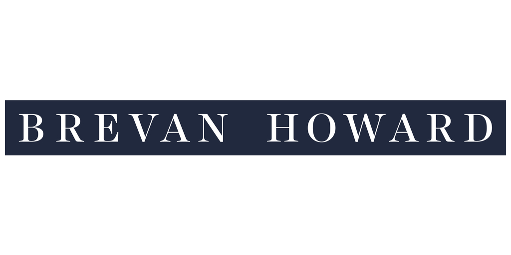

## Table of Contents

## What is Brevan Howard?

Brevan Howard is a hedge fund company. It was started in 2002 by a man named Alan Howard and some other people. The company is based in Jersey, which is a small island near England. Brevan Howard manages a lot of money for people who want to invest it. They try to make more money by trading things like stocks, bonds, and other financial stuff.

The company became well-known because it made a lot of money during the 2008 financial crisis. Many other companies lost money, but Brevan Howard made profits. They did this by betting that the market would go down, which it did. After that, Brevan Howard grew bigger and opened offices in many places around the world, like London, New York, and Hong Kong. They now manage billions of dollars for their clients.

## When was Brevan Howard founded?

Brevan Howard was founded in 2002. It was started by Alan Howard and some other people. They wanted to create a company that could help people invest their money and make more money.

The company is based in Jersey, a small island near England. Brevan Howard manages a lot of money for people who want to invest it. They trade things like stocks, bonds, and other financial stuff to try to make more money for their clients.

## Who are the founders of Brevan Howard?

Brevan Howard was started by Alan Howard and some other people. Alan Howard is the main person who helped start the company. He used to work at other big banks before he decided to start his own company.

The other founders are James Vernon, Jean-Philippe Blochet, and Trifon Natsis. They all worked together to create Brevan Howard in 2002. They wanted to make a company that could help people invest their money and make more money by trading things like stocks and bonds.

## What type of financial services does Brevan Howard offer?

Brevan Howard offers services to help people invest their money. They manage a lot of money for their clients and try to make more money by trading things like stocks, bonds, and other financial stuff. They focus on making money from short-term changes in the market, which is called trading.

The company also offers different types of investment funds. These funds are groups of money from many people that Brevan Howard manages. They have funds that focus on different things, like trading in different countries or trading certain types of financial stuff. This way, people can choose the type of investment that fits what they want.

## Where is Brevan Howard headquartered?

Brevan Howard is headquartered in Jersey, which is a small island near England. They chose Jersey because it has special rules that can help companies like Brevan Howard.

The company also has offices in many other places around the world, like London, New York, and Hong Kong. These offices help them manage money for people in different countries and trade in different markets.

## How has Brevan Howard's performance been historically?

Brevan Howard has had some good times and some tough times. One of their best moments was during the 2008 financial crisis. While many other companies lost money, Brevan Howard made a lot of money. They did this by betting that the market would go down, which it did. This made them well-known and helped them grow bigger.

After 2008, Brevan Howard kept growing and opened offices in many places around the world. But like any company, they also faced some challenges. In some years, they didn't make as much money as they hoped. For example, in 2018, they had a tough year and lost money. But they kept working hard and trying to find new ways to make money for their clients.

## What are some of the major funds managed by Brevan Howard?

Brevan Howard manages several major funds, with the Master Fund being one of the most well-known. The Master Fund focuses on trading different financial things like stocks, bonds, and currencies. It tries to make money by betting on short-term changes in the market. This fund became famous because it made a lot of money during the 2008 financial crisis when many other companies lost money.

Another important fund is the Brevan Howard Multi-Strategy Fund. This fund uses different ways to make money, not just one. It might invest in stocks, bonds, and other things all at the same time. This helps spread out the risk so that if one type of investment doesn't do well, the others might still make money. The Multi-Strategy Fund is popular because it tries to be less risky than focusing on just one thing.

Brevan Howard also has the Brevan Howard Systematic Trading Fund. This fund uses computers and math to decide what to buy and sell. It looks at a lot of data and tries to find patterns that can help make money. This type of trading is called systematic because it follows a set of rules that the computers use. It's different from the other funds because it relies more on technology than on people making decisions.

## What is Brevan Howard's approach to investment?

Brevan Howard's approach to investment is all about trying to make money from short-term changes in the market. They do this by trading things like stocks, bonds, and currencies. Their main strategy is to look at what's happening in the market right now and make quick decisions based on that. They use a lot of data and sometimes computers to help them decide what to buy and sell. This approach can be risky, but it can also make a lot of money if they get it right.

The company also tries to spread out the risk by using different strategies at the same time. For example, their Multi-Strategy Fund might invest in stocks, bonds, and other things all at once. This way, if one type of investment doesn't do well, the others might still make money. Brevan Howard also uses technology a lot, especially in their Systematic Trading Fund. This fund uses computers and math to find patterns in the data and make trading decisions. By using different approaches, Brevan Howard tries to make money for their clients while also managing risk.

## How does Brevan Howard manage risk?

Brevan Howard manages risk by using different strategies at the same time. They don't just focus on one type of investment. Instead, they spread out their money across stocks, bonds, and other financial stuff. This way, if one type of investment doesn't do well, the others might still make money. It's like not putting all their eggs in one basket. By doing this, they try to make sure that they can still make money for their clients even if the market goes up and down a lot.

They also use technology to help manage risk. In their Systematic Trading Fund, they use computers and math to find patterns in the data. This helps them make better decisions about what to buy and sell. The computers can look at a lot of information very quickly, which helps them see risks that people might miss. By using technology, Brevan Howard tries to be smart about the risks they take and make the best choices for their clients.

## What are some significant events or milestones in Brevan Howard's history?

Brevan Howard was started in 2002 by Alan Howard and some other people. They wanted to make a company that could help people invest their money and make more money by trading things like stocks and bonds. One big moment for Brevan Howard was during the 2008 financial crisis. While many other companies lost money, Brevan Howard made a lot of money. They did this by betting that the market would go down, which it did. This made them well-known and helped them grow bigger.

After 2008, Brevan Howard kept growing and opened offices in many places around the world, like London, New York, and Hong Kong. They started to manage a lot more money for their clients. But like any company, they also faced some challenges. In some years, they didn't make as much money as they hoped. For example, in 2018, they had a tough year and lost money. But they kept working hard and trying to find new ways to make money for their clients. They also started using more technology, like computers and math, to help them trade and manage risk.

## How does Brevan Howard contribute to the broader financial industry?

Brevan Howard helps the financial industry by managing a lot of money for people who want to invest it. They try to make more money for their clients by trading things like stocks, bonds, and currencies. This helps keep the financial markets active because when Brevan Howard trades, it can affect the prices of these things. Other people in the financial industry watch what Brevan Howard does and sometimes follow their lead. This makes the markets move and helps keep them lively.

Brevan Howard also shares their knowledge with the financial industry. They do this by talking at events, writing articles, and sometimes working with other companies. This helps other people in the industry learn new ways to invest and manage risk. Brevan Howard's success, especially during tough times like the 2008 financial crisis, shows other companies what can work and what doesn't. By doing all these things, Brevan Howard plays a big role in making the financial industry better and more active.

## What are the future strategies and goals of Brevan Howard?

Brevan Howard wants to keep growing and helping more people invest their money. They plan to do this by opening more offices around the world. This way, they can work with people in different countries and trade in more markets. They also want to use more technology to help them trade and manage risk. By using computers and math, they can make better decisions and find new ways to make money for their clients.

Another big goal for Brevan Howard is to keep coming up with new strategies to make money. They want to keep trying different ways to invest, like trading stocks, bonds, and other financial stuff. They also want to make sure they can handle any tough times in the market. By being ready for anything, they can keep making money for their clients even when things are hard. Brevan Howard hopes to stay a leader in the financial industry by always looking for new ways to do things better.

## References & Further Reading

[1]: ["The Man Who Solved the Market: How Jim Simons Launched the Quant Revolution"](https://www.amazon.com/Man-Who-Solved-Market-Revolution/dp/073521798X) by Gregory Zuckerman

[2]: Asness, C., Krail, R., & Liew, J. (2001). "Do Hedge Funds Hedge?". Journal of Portfolio Management, 28(1), 6-19.

[3]: Lo, A. W. (2008). ["Hedge Funds, Systemic Risk, and the Financial Crisis of 2007–2008: Written Testimony for the U.S. House of Representatives Oversight Committee Hearing on Hedge Funds"](https://papers.ssrn.com/sol3/papers.cfm?abstract_id=1301217). 

[4]: ["Hedge Fund Market Wizards: How Winning Traders Win"](https://www.amazon.com/Hedge-Fund-Market-Wizards-Winning/dp/1118273044) by Jack D. Schwager

[5]: Daniell, J. (2013). "Brevan Howard: A Success Story". Money Management, 27(7), 26-29.