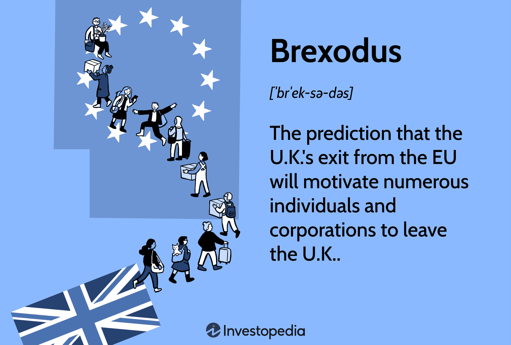

Brexit, the landmark decision by the United Kingdom to exit the European Union, has brought significant changes to its economic and social fabric. This decision, formalized in 2016, initiated a series of transformations that have touched nearly every aspect of the UK’s economy. A notable phenomenon that emerged in the wake of Brexit is termed 'Brexodus.' This phrase describes the migration of skilled workers and businesses from the UK, driven by the uncertainty and regulatory complexities that the departure from the EU introduced.

Brexit's impact is multifaceted, affecting critical sectors such as trade, the labor market, and the financial industry. These shifts have far-reaching consequences for both the domestic economy and the UK's position on the global stage. For instance, the newfound independence in trade policy allows the UK to seek and establish new economic partnerships but also introduces challenges as businesses try to adapt to new tariff and regulatory environments.

In the labor market, Brexodus has intensified the shortage of skilled professionals in several industries, notably in technology and healthcare. This exodus exacerbates existing challenges, such as training domestic talent to fill critical roles left vacant by departing EU citizens. 

Moreover, Brexit's ripple effects extend into financial markets, notably impacting algorithmic trading—a key component of modern financial transactions. Regulatory divergences between the UK and EU create additional layers of complexity for firms involved in algorithmic trading, altering market liquidity and introducing new risk factors.

This article aims to examine these developments, providing a thorough analysis of Brexit’s long-term economic effects. By understanding these complex interactions, the article will outline how different sectors have been influenced, the evolving dynamics within the labor and trade spheres, and the strategies employed by businesses to navigate this new landscape. The objective is to present a clear and detailed perspective on how Brexit is reshaping the economic framework of the UK, offering insights into potential future directions and opportunities for growth.

## Table of Contents

## Understanding Brexodus and its Economic Implications

Brexodus refers to the phenomenon where a significant number of European Union (EU) citizens and businesses choose to leave the United Kingdom (UK) following Brexit. This exodus is primarily driven by the uncertainties associated with new regulatory barriers and potential economic instability resulting from the UK's departure from the EU. 

One of the most immediate economic implications of Brexodus is found in the UK's labor market, especially in high-skill sectors like technology and healthcare. The departure of highly skilled EU workers exacerbates the existing skills gap, leading to notable shortages in these critical sectors. This shortage has a ripple effect, driving up hiring costs as competition among firms for the existing talent intensifies. At the same time, companies are compelled to invest more in training and developing domestic skills to fill these gaps.

Furthermore, the mass departure of EU citizens is posing concerns about foreign investment in the UK. A reduction in foreign investment can lead to slower innovation and productivity growth. Investment is often a key driver of new technological developments and efficiency improvements. Without the influx of foreign capital, the UK may find it more challenging to sustain its competitive edge in the global economy.

Brexodus is not without its potential opportunities, though. It invites a rethinking to reshape the economic landscape of the UK. For instance, it could be a catalyst for the UK to implement policies and strategies designed to bolster domestic talent and attract a new wave of international partnerships. Moreover, it emphasizes the importance of creating a business environment conducive to innovation and entrepreneurship, which could, over time, compensate for the short-term challenges faced post-Brexit.

In summary, Brexodus represents both challenges and opportunities for the UK economy. Its impact on the labor market and foreign investment underscores the need for adaptive strategies to ensure long-term resilience and growth in a post-Brexit landscape.

## Impact on the UK's Labor Market

Brexit has had significant implications for the UK labor market, particularly impacting skilled professionals in key industries such as technology, finance, and healthcare. The departure of these professionals has led to pronounced vacancies, which have resulted in increased hiring costs and heightened competition among firms to secure the available talent. 

One observable consequence of this situation is the rising cost of attracting and retaining skilled workers. Companies are finding themselves required to offer more competitive salaries and benefits packages to fill critical roles. This trend is placing additional financial strain on businesses, particularly those that are small to medium-sized and may lack the resources to compete with larger firms for talent acquisition.

While the absence of skilled professionals poses substantial challenges, it has also provided certain opportunities within the labor market. The tighter labor market has encouraged firms and educational institutions to focus on training and developing domestic skills. There is a concerted push towards upskilling and reskilling the existing workforce to meet the demand for skilled labor, bridging gaps left by the departing EU nationals. Initiatives such as apprenticeships and vocational training programs have gained traction as viable solutions to equip the local labor force with the necessary skills demanded by the evolving market.

This paradigm shift in the labor market underlines the necessity for a recalibration of the UK's labor policies. Long-term strategies are required to adapt to these changes and ensure the sustainability of the UK's economic growth. Policies that support education and training can create a resilient workforce capable of meeting the demands of rapidly changing industrial landscapes. Moreover, attracting international talent through streamlined immigration policies and incentives may mitigate the immediate impacts of the talent shortage and maintain the UK's competitive edge in attracting global professionals.

Ultimately, the impact of Brexit on the labor market necessitates a multifaceted approach that balances immediate needs with strategic planning for future labor supply and demand. The recalibration of labor force policies is crucial in addressing the post-Brexit shifts effectively, fostering an adaptable and skilled workforce that can support the UK's economic aspirations.

## Effects on Trade and Supply Chains

Brexit has introduced significant modifications to trade relations between the UK and the European Union, leading to the implementation of new tariffs and non-tariff barriers. These changes have required companies to navigate an increasingly complex regulatory landscape, increasing the burden of paperwork and impacting overall trade efficiency and costs. The additional administrative tasks have resulted in delays and increased costs for businesses that are now required to comply with new customs declarations and product standards. 

One of the most affected areas has been the manufacturing sector, which is heavily reliant on cross-border supply chains for raw materials and components. Manufacturers have seen disruptions in their supply chains, compelling them to seek alternative suppliers outside the EU. This diversification process, while necessary, has proven to be both costly and complex as businesses need to establish new trade links and logistics arrangements, which can be time-consuming and resource-intensive.

To address these challenges, companies have been exploring digitalization and automation as strategies to streamline operations and mitigate the impacts of post-Brexit trade dynamics. The integration of digital tools and automated systems has facilitated more efficient customs processing and inventory management, allowing businesses to better handle the increased paperwork and compliance requirements. Furthermore, blockchain technology is being considered in supply chain management to enhance transparency and traceability of goods, potentially reducing disputes and ensuring compliance with trade regulations.

Despite these adaptations, trade volumes between the UK and the EU have fluctuated, with some sectors experiencing a decrease in exports due to the new trade barriers. To counter these challenges and maintain competitiveness, UK companies are proactively seeking new markets beyond the EU, although this strategy comes with its own challenges related to market entry and establishing new trade relationships. 

Ultimately, the shift towards digitalization and automation in response to Brexit-related trade changes offers both challenges and opportunities. Companies that effectively leverage technology and innovative practices are more likely to navigate the post-Brexit landscape successfully, creating a framework for future growth and resilience in a changing economic environment.

## Brexit's Influence on Algorithmic Trading in the UK

Algorithmic trading, integral to modern financial markets, has been notably impacted by the changes introduced by Brexit. One primary concern is the regulatory divergence that emerged between the UK and the European Union post-Brexit. This divergence has brought about significant challenges for firms employing [algorithmic trading](/wiki/algorithmic-trading) strategies. Prior to Brexit, financial regulations were largely harmonized across the EU, allowing for seamless cross-border trading operations. However, the UK's departure has led to the introduction of new, sometimes conflicting, regulatory frameworks, compelling firms to adapt their algorithmic systems to comply with both UK and EU regulations. This has increased the complexity and cost of compliance, posing a significant operational challenge for trading firms.

Market [volatility](/wiki/volatility-trading-strategies), an inherent feature of financial markets, has been accentuated post-Brexit. This increased volatility has, in turn, led to heightened algorithmic trading activity as firms attempt to capitalize on rapid price movements. However, volatility can also increase the risk of algorithmic trading strategies, potentially leading to erratic trading patterns and unexpected market behavior. Firms must therefore continuously refine their algorithms to adapt to these volatile conditions and mitigate associated risks.

Furthermore, Brexit has impacted market [liquidity](/wiki/liquidity-risk-premium) and trading volumes, which are critical factors for the successful execution of algorithmic trading strategies. Changes in liquidity can alter the execution costs, affect slippage rates, and impact the overall performance of trading algorithms. Brexit has led to fragmented capital markets, which complicates access to liquidity pools that were previously unified under EU membership. This fragmentation necessitates a reevaluation of liquidity management strategies employed by trading firms.

In navigating the post-Brexit financial landscape, firms are confronted with a shifting array of compliance requirements, market access challenges, and technological demands. Company operations must adapt to new regulatory landscapes, requiring ongoing monitoring of legal developments to ensure continued compliance. Additionally, firms must consider the technological implications of Brexit, as changes in market structure may necessitate updates or redesigns of existing trading systems to maintain efficiency and competitiveness.

Algorithmic trading firms are thus tasked with innovatively adapting their strategies and technologies to maintain profitability and operational efficiency amidst the new economic realities introduced by Brexit. The ability to quickly respond to regulatory changes, market volatility, and liquidity shifts will be crucial for firms aiming to thrive in this evolving trading environment.

## The Future Outlook and Opportunities Post-Brexit

Brexit, while presenting numerous challenges, also offers the United Kingdom an opportunity to reshape its economic landscape by capitalizing on innovation and growth. This transitional phase permits the UK to independently redefine its trade and economic policies, fostering new international partnerships. By establishing trade agreements on its own terms, the UK aims to align more closely with fast-growing global markets, potentially enhancing its economic influence and trade balance.

An essential strategy for mitigating the adverse effects on labor and trade disruptions involves significant investment in technology, infrastructure, and skill development. By focusing on digital transformation and technological advancements, the UK can position itself as a leader in the global tech economy, thereby attracting high-tech firms and fostering a vibrant startup culture. This can be supported by initiatives like tax incentives for research and development, which can spur innovation and elevate the UK's standing in the global market.

Moreover, crafting business-friendly policies will arguably make the UK a magnet for foreign investment and new enterprises. Simplifying the regulatory framework and establishing competitive tax rates could enhance the UK’s attractiveness to multinational corporations and startups alike. The government's commitment to creating a stable economic environment will be pivotal in retaining and drawing investments, which could be further stimulated by establishing free trade zones or innovation hubs.

In the forthcoming years, leveraging these opportunities can lead to the development of a resilient and competitive economy. The focus should be on sectors where the UK possesses a strategic advantage, such as financial services, creative industries, and green technologies. The promotion of sustainable economic practices, coupled with incentives for eco-friendly innovations, could align the UK with global sustainability goals while fostering long-term economic growth.

Hence, the post-Brexit era, although challenging, provides an avenue for the UK to redefine its economic identity. With adaptive policies, strategic investments, and openness to global trade, the UK can transform potential obstacles into platforms for economic reinvigoration. As it navigates these uncharted waters, the UK has the opportunity to build a forward-looking economy that thrives on innovation, competitiveness, and sustainability.

## Conclusion

Brexit and the ensuing Brexodus have undeniably reshaped the UK economy with far-reaching implications. The labor market, trade dynamics, and financial sectors have all experienced significant changes, driven by the departure of skilled workers and businesses, alongside altered regulatory landscapes. For instance, the labor force has been hit by shortages in skilled sectors, increasing competition for available talent and driving up hiring costs.

Trade dynamics have been disrupted by new tariffs and complex regulations, compelling firms to revise supply chains and explore diversification strategies. Meanwhile, the financial sector, particularly algorithmic trading, has had to navigate the challenges posed by regulatory divergence and fluctuating market conditions.

Despite these challenges, Brexit also unlocks opportunities for strategic reorientation and economic reinvigoration. The UK's ability to independently redefine its trade and economic policies presents a chance to establish new international partnerships and business-friendly environments that could attract foreign investment.

Key to capitalizing on these opportunities will be adaptive policies that embrace change and innovation, prioritizing investment in homegrown talent and infrastructure. Strategies to enhance digital capabilities, boost technological investment, and cultivate a skilled workforce can mitigate adverse impacts and drive economic resilience.

Furthermore, an openness to global trade will be essential to optimize the UK's position in the international market, facilitating access to diverse markets and resources.

As the UK navigates its post-Brexit landscape, time will reveal the full extent and nature of its economic impact. Continuous assessment will be crucial for refining policies and ensuring that future policymaking is informed and effective, enabling the UK to thrive in the evolving global economy.

## References & Further Reading

[1]: Mügge, D. (2014). ["The Political Economy of European Union Financial Integration."](https://www.semanticscholar.org/paper/THE-POLITICAL-ECONOMY-OF-EUROPEANIZED-FINANCIAL-M%C3%BCgge/9e65e6acbfe3692ad2b8f8af7081732614346c96) Palgrave Macmillan.

[2]: Kierzenkowski, R., Pain, N., Rusticelli, E., & Zwart, S. (2016). ["The Economic Consequences of Brexit: A Taxing Decision."](https://www.sciepub.com/reference/264733) OECD Economic Policy Papers No. 16.

[3]: Portes, J., & Forte, G. (2017). ["The Economic Impact of Brexit-induced Reductions in Migration."](https://www.niesr.ac.uk/wp-content/uploads/2021/10/The-Economic-Impact-of-Brexit-induced-Reductions-in-Migration-Dec-16-4.pdf) Oxford Review of Economic Policy, 33(S1), S31-S44.

[4]: Bloom, N. (2014). ["Fluctuations in Uncertainty."](https://www.aeaweb.org/articles?id=10.1257/jep.28.2.153) Journal of Economic Perspectives, 28(2), 153-176.

[5]: HM Government (2018). ["The Future Relationship between the United Kingdom and the European Union."](https://www.gov.uk/government/publications/the-future-relationship-between-the-united-kingdom-and-the-european-union) White Paper, ISBN: 978-1-5286-0716-0.