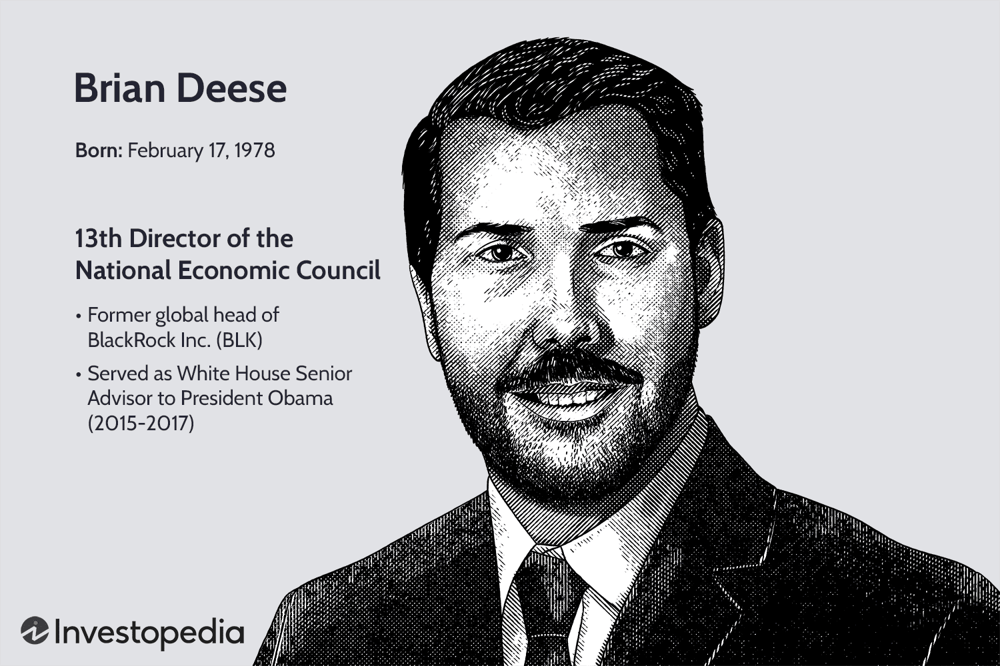

The interconnected themes of education, economics, leadership, and the rise of algorithmic trading form a complex landscape shaping modern financial markets and policy decisions. Central to this exploration is Brian Deese, a pivotal figure in U.S. economic policy, who served as the director of the National Economic Council (NEC) under President Biden. Deese's expertise and leadership have significantly impacted how economic strategies are formulated and implemented, positioning him as a key influencer in addressing contemporary economic challenges.

Brian Deese's role at the NEC involved coordinating domestic and international economic policies, a task demanding a deep understanding of both macroeconomic principles and intricate market dynamics. His contributions are particularly noteworthy for their focus on integrating sustainable economic practices into mainstream policy frameworks. Deese's background in economic policy, complemented by his tenure in the private sector at BlackRock, has informed his comprehensive approach to economic leadership.

Algorithmic trading, a prominent feature of modern financial markets, is defined by the use of computer algorithms to execute trades at speeds and frequencies impossible for humans. This method relies on mathematical models and statistical analyses to make trading decisions, significantly enhancing trading efficiency and market behavior. The rise of algorithmic trading has propelled technological advancements in finance, requiring economic policymakers to consider the implications of these sophisticated tools.

This article aims to explore the intersection of education and economic policy, focusing on the contributions of Brian Deese and the implications of algorithmic trading. By examining how education shapes economic leaders and understanding the influence of technological advancements in trading, we can better navigate the evolving economic landscape. Through this exploration, the article seeks to elucidate the vital role education plays in economic decision-making and the adaptation required to harness technological innovations for sustainable economic growth.

## Table of Contents

## Brian Deese and the National Economic Council

Brian Deese has emerged as a significant figure in shaping U.S. economic policy, particularly through his role in the National Economic Council (NEC). His academic and professional background laid the foundation for his influential career. Deese graduated from Middlebury College with a degree in Political Science and continued his education at Yale Law School, obtaining a Juris Doctor degree. His education equipped him with a strong understanding of both domestic and international legal-economic frameworks, crucial for his subsequent roles in government and finance.

Deese's early career highlights include his work in the Obama administration, where he contributed to significant policy initiatives. During Obama's presidency, Deese served as a Special Assistant for Economic Policy, and later as a Senior Advisor to the President. His work was pivotal during the financial crisis, where he helped design and implement the restructuring of the automotive industry, a key component of the economic recovery at that time. He also played a role in crafting policies relating to energy and climate change, emphasizing sustainable economic growth and resilience.

In the Biden administration, Deese was appointed as the Director of the National Economic Council, where he coordinated domestic and international economic policies. His responsibilities included advising the President on economic issues and developing policies to foster economic growth and stability. One of his significant achievements at the NEC was promoting equitable growth and ensuring the U.S. economy could recover from the COVID-19 pandemic. His leadership involved not only short-term economic stabilization but also planning for long-term structural changes to enhance economic resilience and sustainability.

Deese's tenure at BlackRock, one of the world's largest investment management firms, greatly influenced his approach to economic policymaking. At BlackRock, he was the Global Head of Sustainable Investing, focusing on integrating environmental, social, and governance ([ESG](/wiki/esg-investing)) considerations into investment strategies. This experience enriched his perspective on how financial markets operate and underscored the importance of linking sustainable practices with economic growth. His experience at BlackRock informed his advocacy for policies that support a transition to a low-carbon economy, recognizing the critical role finance plays in addressing climate change.

Overall, Brian Deese's comprehensive background, spanning prestigious academic institutions, governmental roles, and private sector experience, has significantly influenced his approach to economic policy. His work at the NEC reflects these diverse insights, blending traditional economic strategies with innovative solutions to contemporary challenges, from pandemic recovery to climate change mitigation.

## The Role of Education in Economic Policy

Education plays a critical role in shaping economic leaders and influencers by providing them with the foundational knowledge and analytical skills necessary to navigate complex economic landscapes. For individuals like Brian Deese, education has been instrumental in preparing him for his career in economic policy.

Brian Deese graduated from Middlebury College, where he studied political science and environmental studies. His undergraduate education provided him with a broad understanding of political and environmental issues, which has been crucial in his roles involving economic policy, particularly in addressing climate-related economic challenges. His education at Middlebury also equipped him with critical thinking and problem-solving skills essential for crafting effective economic strategies.

Building on his undergraduate experience, Deese pursued further education at Yale Law School, where he earned his Juris Doctor degree. At Yale, Deese developed legal expertise and analytical skills, which allowed him to approach economic policy with a rigorous understanding of legal and regulatory frameworks. This education was particularly significant in his governmental roles, where the interplay between economic policy and law is prominent.

Furthermore, Deese's involvement with the Massachusetts Institute of Technology (MIT) as an Innovation Fellow highlights the influence of esteemed academic institutions on national economic policy. MIT’s focus on technology and innovation likely provided Deese with insights into the economic implications of technological advancements and innovation-led growth. Such an environment encourages the development of cutting-edge economic policies that incorporate the latest technological trends and research findings.

Education serves as a powerful tool for understanding and managing economic challenges and innovations by providing economic leaders with the ability to analyze, interpret, and respond to dynamic economic conditions. It fosters a deep understanding of economic theories, data analysis, and policy formulation, all of which are crucial for leaders tasked with guiding the economy through periods of change and uncertainty.

In conclusion, the educational background of economic leaders like Brian Deese is fundamental to their ability to influence economic policy effectively. Institutions such as Middlebury College, Yale Law School, and MIT play a significant role in equipping these leaders with the necessary knowledge and skills to address current and future economic challenges. Through education, economic policymakers are better prepared to integrate innovative solutions into the fabric of national and global economic strategies.

## Algorithmic Trading: An Emerging Landscape

Algorithmic trading, also known as automated trading or algo trading, involves the use of computer algorithms to execute trading orders. By utilizing pre-programmed instructions accounting for variables such as timing, price, and [volume](/wiki/volume-trading-strategy), these algorithms facilitate the rapid and efficient execution of trades, often with minimal human intervention. The growing significance of [algorithmic trading](/wiki/algorithmic-trading) in the financial sector is attributable to its ability to enhance market efficiency, reduce transaction costs, and provide [liquidity](/wiki/liquidity-risk-premium).

Algorithmic trading impacts the economy by contributing to increased trading efficiency and improved market behavior. It provides high-frequency trading ([HFT](/wiki/high-frequency-trading-strategies)) opportunities, where algorithms can execute thousands of small trades in microseconds, capitalizing on minute price discrepancies. This not only increases liquidity but also narrows bid-ask spreads, potentially benefiting all market participants. Additionally, algorithmic trading supports price discovery mechanisms by facilitating more transactions and enabling markets to quickly reflect new information.

The integration of technological advancements in finance has been pivotal in the evolution of algorithmic trading. Machine learning and [artificial intelligence](/wiki/ai-artificial-intelligence) now play key roles in analyzing vast datasets to predict market trends and generate trading strategies. Education is necessary for adapting to these changes as financial professionals must learn to work with complex algorithms and data analysis tools. Proficiency in programming languages like Python, R, and C++ is increasingly required for roles in this dynamic field.

Challenges associated with algorithmic trading include its potential to exacerbate market [volatility](/wiki/volatility-trading-strategies), as seen in events like the 2010 "Flash Crash." The speed and volume of trades can lead to erratic market behavior if not properly managed. Moreover, the prevalence of similar algorithms across trading firms raises concerns about herd behavior, where many traders make identical moves simultaneously, potentially destabilizing the market.

Despite these challenges, algorithmic trading presents numerous opportunities. It enables the development of sophisticated trading strategies that can operate 24/7 across global markets, responding to real-time data far quicker than human traders. Furthermore, the continuous advancement of technology promises to enhance the capabilities of algorithmic trading systems, making them more adaptive and efficient.

In summary, algorithmic trading is reshaping the financial landscape, with implications for market behavior, economic efficiency, and educational demands. Balancing the benefits and challenges of this technology remains critical for maximizing its potential in modern financial markets.

## Interconnections between Economic Council Policies and Financial Markets

The policies formulated by the National Economic Council (NEC) are key drivers of financial market dynamics and economic trends. As head of the NEC, Brian Deese has significantly influenced these interactions, leveraging his experience from both public and private sectors.

One significant area influenced by NEC policies is sustainable investing. During his tenure at BlackRock, Deese was a vocal proponent of integrating environmental, social, and governance (ESG) considerations into investment decisions. This approach has trickled into broader economic policies under his direction at the NEC, promoting sustainable investing as a pillar in economic policy. Such policies have encouraged businesses and investors to adopt ESG frameworks, influencing market behavior and promoting investment in renewable energy sectors.

A critical consideration is how policy initiatives can either support or hinder technological innovation in financial trading. Regulations fostering transparency and reducing transaction costs can enhance algorithmic trading by offering clearer data and streamlined processing. Conversely, overly restrictive policies may stifle innovation, deterring financial institutions from implementing advanced trading technologies. By carefully balancing regulation and innovation, the NEC can facilitate the integration of cutting-edge technologies in trading practices.

Algorithmic trading represents a significant integration of data analysis into the financial sector, serving as a vital tool in both policy implementation and economic forecasting. By employing algorithms to analyze vast datasets, traders can optimize decision-making and predict market trends. This capability aligns with economic policies focused on improving market efficiency and stability. Furthermore, algorithmic trading can complement policy initiatives aimed at financial stabilization by providing mechanisms for real-time market assessments, enabling policymakers to adapt quickly to emerging economic trends.

In conclusion, the interconnections between the NEC’s economic policies and financial market practices are profound. By advocating for sustainable investment and balancing regulatory frameworks with technological advancements, the NEC under Brian Deese has the potential to shape a financial ecosystem that is both resilient and forward-thinking. The role of algorithmic trading in this context cannot be overstated, as it provides essential insights and capabilities that bolster economic policy goals and market efficiency.

## Future Outlook on Education, Economic Policy, and Algorithmic Trading

Education in economics and finance is poised to undergo significant transformations to address emerging challenges. As financial markets become increasingly complex and interconnected, educational curricula will likely emphasize interdisciplinary learning, integrating fields such as data science, artificial intelligence, and behavioral economics. The ability to analyze large data sets and develop algorithms will be crucial for professionals in this field. For example, courses might cover [machine learning](/wiki/machine-learning) techniques applied to economic data, focusing on predictive analytics and real-time decision-making.

The National Economic Council (NEC) is expected to evolve continually in response to shifting global economic dynamics. As global issues like climate change and digital currencies become more prominent, the NEC could expand its focus to include these areas, advocating for policies that support sustainable economic development and digital innovation. This evolution will necessitate that policymakers possess both a deep understanding of traditional economic principles and a grasp of technological advancements and international relations.

Algorithmic trading will continue to advance as technology progresses. Future developments may include the incorporation of quantum computing, which could exponentially increase processing speeds and enhance predictive models. However, these advancements will bring regulatory challenges. Regulators will need to balance innovation with market stability, ensuring that automated trading systems do not exacerbate volatility or undermine market integrity. Enhanced regulatory frameworks could include real-time monitoring systems and stricter compliance protocols for trading algorithms.

As an MIT Innovation Fellow, Brian Deese's future contributions are expected to focus on fostering innovation at the intersection of technology and policy. His expertise could drive initiatives that address economic challenges through technological solutions, potentially influencing both academic discourse and practical policy implementations. Deese's work may emphasize sustainable economic practices, leveraging his background to promote environmentally conscious investment strategies and policies.

In summary, the future outlook in education, economic policy, and algorithmic trading points towards an integrated approach. This includes the convergence of traditional economic principles with cutting-edge technology and sustainable practices, highlighting the need for adaptability and continuous learning for future leaders in the field.

## Conclusion

The intersection between education, economic policy, and technological innovation manifests profoundly in the current financial landscape. Through the lens of Brian Deese’s influence and leadership, particularly during his tenure with the National Economic Council, it becomes evident how these domains interplay to shape robust economic frameworks. Deese’s educational background and extensive experience at high-powered circles like BlackRock have bestowed him with insights instrumental in steering economic policies that understand and indeed embrace the complexities of contemporary financial systems, including algorithmic trading.

Algorithmic trading represents a significant shift in how financial markets operate, characterized by the utilization of sophisticated algorithms to execute trades at velocities and efficiencies unimagineable in previous decades. The impacts are profound, dictating new paradigms of market behavior and trading efficacy, thereby necessitating an educational approach that embeds these realities into the foundational knowledge of upcoming economists and financial experts. As a result, the role of education is not just to transfuse traditional economic theories but also to provide tools for navigating advanced technological applications within finance.

In this shifting landscape, continuous learning and adaptation become indispensable. Economic leaders, highlighted by Brian Deese's career trajectory, illustrate the imperative to integrate various disciplines. These include economic theories, policy-making skills, and a profound understanding of emergent technologies like algorithmic trading. By doing so, they pave the way for policies that not only regulate but also facilitate innovations, ensuring that markets remain competitive and resilient.

The necessity of integrated approaches—combining education, policy, and technology—becomes apparent in fostering sustainable economic growth. As technological advancements continue to reshape the market landscape, policymakers and educators alike must cultivate environments conducive to understanding and harnessing these changes. Such holistic perspectives are essential to shaping future economic leaders who are equipped to drive both national and global economic progress.

## References & Further Reading

[1]: Bergstra, J., Bardenet, R., Bengio, Y., & Kégl, B. (2011). ["Algorithms for Hyper-Parameter Optimization."](https://papers.nips.cc/paper/4443-algorithms-for-hyper-parameter-optimization) Advances in Neural Information Processing Systems 24.

[2]: ["Advances in Financial Machine Learning"](https://www.amazon.com/Advances-Financial-Machine-Learning-Marcos/dp/1119482089) by Marcos Lopez de Prado

[3]: ["Evidence-Based Technical Analysis: Applying the Scientific Method and Statistical Inference to Trading Signals"](https://www.amazon.com/Evidence-Based-Technical-Analysis-Scientific-Statistical/dp/0470008741) by David Aronson

[4]: ["Machine Learning for Algorithmic Trading"](https://github.com/stefan-jansen/machine-learning-for-trading) by Stefan Jansen

[5]: ["Quantitative Trading: How to Build Your Own Algorithmic Trading Business"](https://www.amazon.com/Quantitative-Trading-Build-Algorithmic-Business/dp/1119800064) by Ernest P. Chan