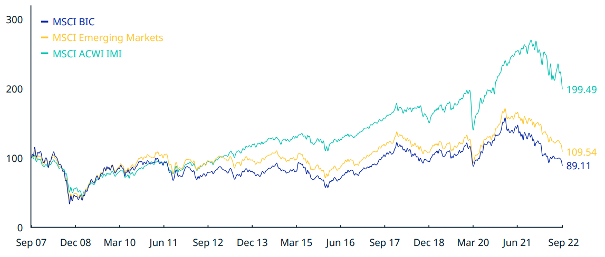

## Table of Contents

## What is a BRIC ETF?

A BRIC ETF is a type of investment fund that focuses on stocks from Brazil, Russia, India, and China. These countries are often grouped together because they are seen as emerging markets with big potential for growth. When you buy shares in a BRIC ETF, you are investing in a basket of companies from these four countries, which helps spread out your risk compared to buying individual stocks.

These ETFs are popular among investors looking to tap into the growth of these emerging economies without having to pick out specific companies. By investing in a BRIC ETF, you get exposure to different sectors like technology, energy, and consumer goods across these countries. However, it's important to remember that investing in emerging markets can be riskier because these economies can be less stable than more developed ones.

## Which countries are included in the BRIC acronym?

The BRIC acronym stands for Brazil, Russia, India, and China. These countries are grouped together because they are seen as big emerging markets with a lot of potential for growth. They are important because they have large populations and growing economies.

People use the BRIC acronym to talk about investment opportunities and economic trends in these countries. Each country in BRIC has its own unique strengths and challenges, but together they represent a significant part of the global economy. Investors often look at BRIC countries to find new places to put their money and grow their investments.

## How does a BRIC ETF work?

A BRIC [ETF](/wiki/etf-trading-strategies) is a type of investment fund that lets you buy a piece of many companies from Brazil, Russia, India, and China all at once. When you invest in a BRIC ETF, your money is pooled together with money from other investors. The fund then uses this money to buy shares in different companies from these four countries. This way, you get to own a small part of lots of companies without having to pick them out yourself.

These ETFs are popular because they help spread out your risk. Instead of betting on just one company, you're investing in a whole group of them across different industries like technology, energy, and consumer goods. This can be a good way to tap into the growth of these big emerging markets. But remember, investing in emerging markets can be riskier because their economies can be less stable than those in more developed countries.

## What are the main advantages of investing in a BRIC ETF?

One big advantage of investing in a BRIC ETF is that it lets you spread your risk. When you buy shares in a BRIC ETF, you're not just betting on one company. You're getting a piece of many different companies from Brazil, Russia, India, and China. This means if one company doesn't do well, it won't hurt your whole investment as much. It's like not putting all your eggs in one basket.

Another advantage is that you can tap into the growth of these big emerging markets. Brazil, Russia, India, and China are all countries that are growing fast. They have big populations and lots of new businesses starting up. By investing in a BRIC ETF, you can be a part of this growth without having to pick out individual companies. It's a way to grow your money as these countries get bigger and stronger.

But remember, investing in emerging markets can be riskier. These countries can have ups and downs in their economies more than more developed countries. So, while a BRIC ETF can offer good growth opportunities, it's important to think about the risks too.

## What are the potential disadvantages of investing in a BRIC ETF?

One potential disadvantage of investing in a BRIC ETF is the higher risk that comes with emerging markets. Brazil, Russia, India, and China can have big ups and downs in their economies. This means your investment could go up a lot, but it could also go down a lot. If you're not ready for that kind of risk, a BRIC ETF might not be the best choice for you.

Another disadvantage is that these countries can have political and economic problems that affect the stock market. For example, changes in government, new laws, or economic policies can make it hard for companies to grow. If these problems happen, the value of your BRIC ETF could drop. So, it's important to keep an eye on what's happening in these countries if you decide to invest in a BRIC ETF.

Lastly, because a BRIC ETF includes companies from four different countries, it can be hard to understand all the different things that might affect your investment. Each country has its own language, culture, and business practices. This can make it tricky to know exactly what's going on with your money. If you prefer to invest in something you can understand more easily, a BRIC ETF might not be the best fit.

## What is the historical performance of BRIC ETFs?

The historical performance of BRIC ETFs has been a bit of a rollercoaster ride. Over the years, these ETFs have had times when they did really well and other times when they didn't do so great. For example, in the early 2000s, BRIC ETFs saw a lot of growth because Brazil, Russia, India, and China were all doing well economically. People were excited about investing in these countries because they were seen as the next big thing. But then, around 2008, when there was a big global financial crisis, the value of BRIC ETFs dropped a lot. This showed how risky investing in emerging markets can be.

In the years after the financial crisis, the performance of BRIC ETFs was mixed. Sometimes they did better than other types of investments, and sometimes they didn't. For instance, in the early 2010s, China's economy was growing fast, which helped BRIC ETFs do well. But later in the decade, things like falling oil prices hurt countries like Russia and Brazil, which made the ETFs go down. Overall, the historical performance of BRIC ETFs shows that they can be a good way to grow your money, but you have to be ready for some big ups and downs along the way.

## How has the composition of BRIC ETFs changed over time?

The composition of BRIC ETFs has changed over time as the economies of Brazil, Russia, India, and China have evolved. In the early days, these ETFs were often heavily weighted towards sectors like energy and materials, especially in countries like Russia and Brazil. As China's economy grew, technology and consumer goods companies started to play a bigger role in these ETFs. This shift happened because China became a big player in tech and started making lots of products people around the world wanted to buy.

More recently, the focus has started to change again. India has been growing fast, and more companies from India are being included in BRIC ETFs. This means the ETFs now have a bigger mix of technology, healthcare, and financial services from India. Also, as the world pays more attention to things like climate change, some BRIC ETFs are starting to include more companies that focus on renewable energy and sustainability. So, the composition of these ETFs keeps changing to reflect what's happening in these countries' economies.

## What are the key economic factors affecting BRIC countries?

The economies of BRIC countries are influenced by a lot of different things. One big [factor](/wiki/factor-investing) is how fast their populations are growing. Brazil, Russia, India, and China all have big populations, and as more people join the workforce, it can help the economy grow. But it can also make it harder to find jobs for everyone. Another important factor is the price of things they sell to other countries, like oil from Russia and Brazil, or manufactured goods from China. If these prices go up, it can help their economies, but if they go down, it can hurt them.

Another key factor is how much the government gets involved in the economy. In some BRIC countries, the government plays a big role in deciding what businesses can do. This can help the economy grow in some ways, but it can also make it harder for businesses to make their own decisions. Political stability is also really important. If there's a lot of change or uncertainty in the government, it can scare away investors and make it harder for the economy to grow. Finally, things like new technology and how easy it is to do business in these countries can make a big difference in how well their economies do.

## How do geopolitical events impact BRIC ETFs?

Geopolitical events can have a big impact on BRIC ETFs. These events, like changes in government, new laws, or conflicts with other countries, can shake up the economies of Brazil, Russia, India, and China. When something big happens in one of these countries, it can make investors nervous. They might start selling their shares in the ETF, which can make the value of the ETF go down. For example, if there's a new law in China that makes it harder for businesses to make money, this could hurt the companies in the ETF and lower its value.

On the other hand, good geopolitical news can help BRIC ETFs do better. If a country in the BRIC group signs a big trade deal with another country, it can help their economy grow. This might make investors feel more confident, and they might buy more shares in the ETF, which can push its value up. For instance, if India makes it easier for foreign companies to invest there, this could bring more money into the country and help the companies in the ETF grow. So, keeping an eye on what's happening around the world is important when you're investing in a BRIC ETF.

## What are the tax implications of investing in BRIC ETFs?

When you invest in a BRIC ETF, you need to think about taxes. The taxes you pay can depend on where you live and the kind of account you use to invest. In the United States, for example, if you hold a BRIC ETF in a regular investment account, you'll have to pay taxes on any money you make from it. This includes dividends, which are payments companies make to shareholders, and capital gains, which is the profit you make when you sell the ETF for more than you paid for it. The tax rate can be different depending on how long you held the ETF before selling it. If you hold it for less than a year, you'll pay a higher tax rate than if you hold it for more than a year.

If you use a special kind of account like an IRA or a 401(k) to invest in a BRIC ETF, the tax rules change. In these accounts, you don't have to pay taxes on your earnings right away. Instead, you might pay taxes when you take money out of the account later on. This can be a good way to save on taxes if you think you'll be in a lower tax bracket when you retire. But remember, tax laws can change, and they can be different in other countries. So, it's a good idea to talk to a tax advisor to understand exactly how taxes will affect your investment in a BRIC ETF.

## How do BRIC ETFs compare to other emerging market ETFs?

BRIC ETFs focus on companies from Brazil, Russia, India, and China. These countries are big and growing fast, so a BRIC ETF can be a good way to tap into that growth. But, BRIC ETFs are different from other emerging market ETFs because they only include companies from these four countries. Other emerging market ETFs might include companies from a lot more countries, like South Korea, Mexico, or South Africa. So, a BRIC ETF is more specific, while other emerging market ETFs are more spread out.

Both types of ETFs can help you grow your money, but they come with different risks. Because BRIC ETFs focus on just four countries, they can be riskier. If something bad happens in one of those countries, it can hurt the whole ETF. On the other hand, other emerging market ETFs spread their risk over more countries, so if one country has problems, it might not affect the ETF as much. But, because BRIC countries are so big and important, a BRIC ETF might give you a bigger chance for growth if things go well in those countries. So, it's all about what kind of risk and growth you're looking for when you choose between a BRIC ETF and other emerging market ETFs.

## What strategies can investors use to mitigate risks associated with BRIC ETFs?

One way to lower the risks of investing in BRIC ETFs is to spread out your investments. Instead of putting all your money into a BRIC ETF, you can also invest in other types of ETFs or individual stocks from different countries. This way, if something bad happens in Brazil, Russia, India, or China, it won't hurt your whole investment as much. Another strategy is to keep an eye on what's happening in these countries. If you know about big changes in government or new laws that might affect businesses, you can make smarter choices about when to buy or sell your shares in the BRIC ETF.

Another good idea is to think about how long you want to keep your money in the BRIC ETF. If you're okay with waiting a long time, you might be able to ride out the ups and downs of these markets. But if you need your money soon, it might be better to invest in something less risky. Also, you can use something called "stop-loss orders" to help protect your money. This means you tell your broker to sell your shares if they drop to a certain price, so you don't lose too much if the ETF goes down a lot. By using these strategies, you can enjoy the growth potential of BRIC ETFs while also being ready for the risks that come with them.

## References & Further Reading

[1]: Bergstra, J., Bardenet, R., Bengio, Y., & Kégl, B. (2011). ["Algorithms for Hyper-Parameter Optimization."](https://papers.nips.cc/paper/4443-algorithms-for-hyper-parameter-optimization) Advances in Neural Information Processing Systems.

[2]: Lopez de Prado, M. (2018). ["Advances in Financial Machine Learning."](https://www.amazon.com/Advances-Financial-Machine-Learning-Marcos/dp/1119482089) Wiley.

[3]: Aronson, D. (2006). ["Evidence-Based Technical Analysis: Applying the Scientific Method and Statistical Inference to Trading Signals."](https://www.amazon.com/Evidence-Based-Technical-Analysis-Scientific-Statistical/dp/0470008741) Wiley.

[4]: Jansen, S. (2020). ["Machine Learning for Algorithmic Trading."](https://github.com/stefan-jansen/machine-learning-for-trading) Packt Publishing.

[5]: Chan, E.P. (2009). ["Quantitative Trading: How to Build Your Own Algorithmic Trading Business."](https://github.com/ftvision/quant_trading_echan_book) Wiley.