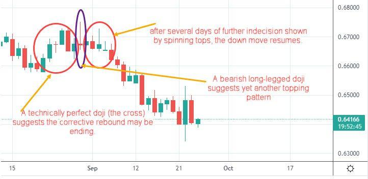

Bright trading in algorithmic trading refers to the use of sophisticated trading strategies and technologies to profit from market trends and inefficiencies. Algorithmic trading, often abbreviated as algo trading, utilizes computer programs specifically designed to execute trades at exceptionally high speeds based on a set of predefined criteria. This automation in trading enhances the ability to manage risk effectively while simultaneously operating on a scale that is challenging for human traders to match. The key advantage here is the capability to execute large volumes of trades with minimal human intervention, reducing errors and inefficiencies associated with manual trading practices.

A significant outcome of the increasing interest in algorithmic trading is the expanded deployment of advanced indicators and analytical tools aimed at fine-tuning trading decisions. These tools enable traders to interpret complex market data efficiently, allowing for more informed and precise trading strategies. As financial markets continue to evolve rapidly, the role of such technologies becomes ever more critical.



This article will navigate through the components of bright trading within the broader scope of algorithmic trading. The focus will include its inherent benefits, the strategies that underpin its effectiveness, and the significant role that trading indicators play in optimizing outcomes. The goal is to provide a comprehensive overview that underscores the potential of bright trading to enhance performance in modern financial markets.

## Table of Contents

## Understanding Bright Trading and Its Relevance

Bright trading, within the context of [algorithmic trading](/wiki/algorithmic-trading), refers to the implementation of strategies that utilize advanced computational techniques and data-driven analyses to capitalize on market opportunities. These strategies focus on identifying and exploiting inefficiencies in the market, leveraging the capabilities of algorithms to process vast amounts of data quickly and accurately.

Central to bright trading is the bridging function it fulfills between traditional manual trading methods and fully automated algorithmic systems. While manual trading relies heavily on human intuition and decision-making, bright trading integrates these elements with the precision and speed of algorithms, striving for optimal trade executions that minimize market impact. This approach allows traders to execute large volumes of trades efficiently, significantly reducing the risks associated with human errors and delays.

Programmable logic, fundamental to bright trading, enhances the precision and effectiveness of trading activities. Algorithms can be designed to execute trades only when certain predefined criteria are met, ensuring that trades are executed at the most favorable moments. For example, an algorithm might automatically execute a trade when a stock's price deviates from its historical mean by a certain percentage, a strategy known as mean reversion. This ensures that trading decisions are consistent, removing the emotional and psychological influences that can detract from trading performance.

Moreover, bright trading strategies are often supported by advanced indicators and tools which enhance the algorithmic framework. These indicators can provide real-time analytics and insights, guiding the algorithms in making informed trading decisions. By integrating such tools, traders can fine-tune their strategies to respond more effectively to dynamic market conditions.

This hybrid approach, merging manual ingenuity with algorithmic rigor, underscores the relevance of bright trading in modern financial markets. It enables traders to harness the best of both worlds, optimizing performance through sophisticated strategies that are both reactive and predictive. As a result, bright trading represents a significant advancement in the pursuit of trading efficacy and profitability.

## Top Algorithmic Trading Strategies in 2023

Algorithmic trading is continually evolving with strategies that capitalize on different market behaviors. By 2023, several prominent strategies dominate the algorithmic trading landscape, significantly impacting trading success and profitability.

**Trend Following**: This strategy capitalizes on the persistence of market trends by identifying and following them until signs of reversal appear. Trend following is based on the premise that markets often follow long-term trends, and traders can profit by aligning with these movements. Algorithms for trend following typically use moving averages, channel breakouts, or related indicators to spot these trends. The strategy is particularly effective in markets showing strong directional movement, allowing traders to capture extended price moves.

**Momentum Trading**: This strategy focuses on securities exhibiting strong movements, with the expectation that these will continue in the same direction for a period. Momentum traders aim to exploit the acceleration in price behavior, often entering trades based on substantial price movements supported by trading volume. Key indicators include the Relative Strength Index (RSI) and moving average convergence divergence (MACD), which help traders gauge the strength of price movements. Synthesizing such indicators into algorithmic systems helps automate the process of detecting viable trading opportunities based on momentum.

**Mean Reversion**: This strategy operates under the assumption that prices and returns eventually move back towards their historical mean or average. Traders engaging in mean reversion seek to identify assets that have diverged from their mean prices, allowing them to profit by buying low and selling high as prices revert. Statistical measures, like z-scores, are often used to quantify deviations from the mean, enabling precise entry and exit points for trades. Incorporating these statistical analyses into trading algorithms facilitates the efficient execution of mean reversion trades.

**Weighted Average Price**: This strategy attempts to execute trades at prices close to the volume-weighted average price (VWAP), minimizing the market impact and timing risk. The VWAP is calculated as the ratio of the value traded to the total volume over a specified time frame. Algorithms designed for this strategy split large orders into smaller, strategically timed trades to achieve a price close to the VWAP, thus ensuring more favorable execution. The VWAP strategy is particularly favored by institutional traders seeking to minimize their price impact on large transactions.

**Statistical Arbitrage**: This strategy exploits price discrepancies between related assets, typically using complex quantitative models to identify mispricings. Statistical arbitrage involves the use of statistical methods and econometric models to evaluate the relationship between multiple assets and predict movements for profit. Strategies like pairs trading, where a trader takes opposing positions in two correlated securities, leverage these statistical dependencies. The complexity of these strategies often necessitates sophisticated algorithms capable of rapidly identifying and exploiting short-term market inefficiencies.

In conclusion, the sophistication and diversity of algorithmic trading strategies in 2023 highlight the technological advancements and deeper market insights available to traders. These strategies allow for nuanced approaches that can cater to various market conditions, maximizing potential returns.

## Advantages of Bright Trading in Algo Trading

Bright trading in algorithmic trading offers several key advantages that make it a preferred approach for modern traders. One of the foremost benefits is efficiency. Automated trading systems are designed to process and execute trades at high speeds, significantly reducing the delays and errors typically associated with manual trading. This rapid execution ensures that traders can capitalize on fleeting market opportunities, which is particularly crucial in fast-paced markets.

Another advantage is precision. By relying on data-driven strategies and removing human emotions from the trading process, bright trading consistently delivers repeatable and reliable results. Trades are executed based on pre-defined algorithms, ensuring that decisions are made with objectivity and accuracy. This approach minimizes the risks associated with impulsive or irrational trading behaviors often observed in manual trading settings.

Scalability is also a crucial feature of bright trading. Algorithmic systems can manage vast volumes of trades effortlessly across diverse markets and securities. This capability is essential for traders looking to expand their operations without the need to proportionally increase their workforce. Automated systems can handle numerous trades simultaneously, which is a considerable advantage over traditional trading methods that rely on human intervention.

Backtesting is another significant aspect of bright trading. These systems enable traders to test their algorithms against historical data, providing a platform to validate and refine trading models before they are deployed in live markets. This process involves analyzing how a trading strategy would have performed in the past, allowing traders to assess its viability and make necessary adjustments. For example, in Python, the following code snippet demonstrates a basic [backtesting](/wiki/backtesting) setup using historical price data:

```python
import pandas as pd

# Load historical price data
data = pd.read_csv('historical_prices.csv')

# Define a simple moving average strategy
data['SMA_20'] = data['Close'].rolling(window=20).mean()

# Simulate trades based on the strategy
def backtest(data):
    buy_signals = []
    sell_signals = []
    position = None

    for i in range(1, len(data)):
        if data['Close'][i] > data['SMA_20'][i] and position != 'buy':
            buy_signals.append(i)
            position = 'buy'
        elif data['Close'][i] < data['SMA_20'][i] and position != 'sell':
            sell_signals.append(i)
            position = 'sell'

    return buy_signals, sell_signals

buy_signals, sell_signals = backtest(data)
```

This kind of backtesting allows traders to identify strengths and weaknesses in their strategies, ensuring better preparedness when transitioning to live trading scenarios. By leveraging these advantages, traders involved in bright trading can enhance their effectiveness and profitability in the dynamic landscape of financial markets.

## Role of Trading Indicators in Bright Trading

Indicators like those provided by TradingCanyon offer critical tools for analyzing market trends and making informed trading decisions in bright trading environments. These indicators enhance traders' ability to process large datasets and distill actionable insights, ultimately leading to more informed decision-making in algorithmic trading systems.

The 'Super Alpha' indicator is a prime example of this. It is designed to identify potential high-yield opportunities by analyzing historical price patterns and current market conditions. This indicator can be integrated into trading systems to automatically signal buying or selling opportunities, minimizing human errors and emotional biases.

Similarly, 'Market Radar' plays a pivotal role in both manual and algorithmic trading systems. By providing real-time analysis of market conditions, it enables traders to act swiftly and with precision. This indicator tracks a range of variables, such as [volatility](/wiki/volatility-trading-strategies) and [liquidity](/wiki/liquidity-risk-premium), to align trading strategies with prevailing market conditions. Thus, it effectively bridges the gap between human intuition and algorithmic precision.

Advanced trading indicators can be seamlessly woven into algorithmic models to automate the identification of trading opportunities. For instance, they can employ moving averages, RSI (Relative Strength Index), or Bollinger Bands to generate signals based on predefined criteria. This automation allows for high-speed trades that would be impractical for human traders to execute manually.

Incorporating these advanced tools within a trading framework can significantly enhance the overall strategy, particularly in environments where timely execution is crucial. As algorithms process data and execute trades based on complex strategies, these indicators provide an added layer of sophistication, ensuring strategies are not only fast but also precise and adaptive to market changes.

## Conclusion

Bright trading in algorithmic trading provides effective solutions for navigating today's complex financial markets. By utilizing high-speed computations and sophisticated algorithms, traders significantly enhance accuracy and profitability. These methods optimize trade execution by minimizing market impact and improving decision-making.

The success of bright trading strategies heavily relies on understanding and applying the optimal mix of strategies and tools, such as those offered by platforms like TradingCanyon. These platforms provide advanced indicators and analytics that empower traders to make informed decisions, whether in manual or automated systems. By integrating these tools into trading algorithms, traders can automate the identification of lucrative opportunities and execute trades with precision.

As financial markets continuously evolve, the adaptability of traders becomes paramount. This involves not only applying current tools and strategies but also continually refining them to maintain a competitive edge. The dynamic nature of technology and market conditions requires traders to stay informed about emerging trends and technological advancements to optimize their trading performance.

In conclusion, the fusion of high-speed trading algorithms and intelligent indicators within the scope of bright trading equips traders with powerful resources to thrive in modern financial environments. This adaptability and focus on leveraging technological advancements are central to achieving sustained success in the rapidly changing landscape of algorithmic trading.

## References & Further Reading

[1]: ["Algorithms for Hyper-Parameter Optimization."](https://dl.acm.org/doi/10.5555/2986459.2986743) by Bergstra, J., Bardenet, R., Bengio, Y., & Kégl, B., Advances in Neural Information Processing Systems 24.

[2]: ["Advances in Financial Machine Learning"](https://www.amazon.com/Advances-Financial-Machine-Learning-Marcos/dp/1119482089) by Marcos Lopez de Prado.

[3]: ["Evidence-Based Technical Analysis: Applying the Scientific Method and Statistical Inference to Trading Signals"](https://www.amazon.com/Evidence-Based-Technical-Analysis-Scientific-Statistical/dp/0470008741) by David Aronson.

[4]: ["Machine Learning for Algorithmic Trading"](https://github.com/stefan-jansen/machine-learning-for-trading) by Stefan Jansen.

[5]: ["Quantitative Trading: How to Build Your Own Algorithmic Trading Business"](https://books.google.com/books/about/Quantitative_Trading.html?id=j70yEAAAQBAJ) by Ernest P. Chan.