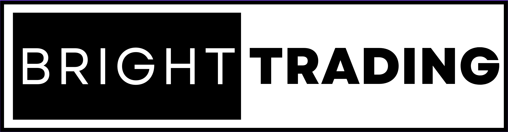

## Table of Contents

## What is Bright Trading?

Bright Trading is a company that helps people trade stocks and other financial products. They give traders the tools, technology, and support they need to buy and sell in the stock market. Bright Trading works with professional traders and also trains new traders. They have offices in different places and let traders work from home too.

The company makes money by taking a part of the profits that traders make. This is called a profit split. Bright Trading also has rules and training programs to help traders do well and follow the law. They focus on teaching traders how to manage risk and make smart choices in the market. This way, traders can grow their skills and hopefully make more money over time.

## How does Bright Trading differ from traditional trading?

Bright Trading is different from traditional trading because it offers a supportive environment for traders. In traditional trading, people often trade on their own or work for big banks and firms. They might not get much help or training. But with Bright Trading, traders get tools, technology, and support to help them trade better. Bright Trading also lets traders work from home, which is not always possible in traditional trading setups.

Another big difference is how Bright Trading makes money. In traditional trading, traders usually keep all their profits or pay a set fee to their firm. But with Bright Trading, they use a profit split model. This means Bright Trading takes a part of the profits that traders make. In return, traders get access to training and support. This can be good for new traders who want to learn and grow, but it's different from the way money is handled in traditional trading.

## What are the basic requirements to start trading with Bright Trading?

To start trading with Bright Trading, you need to meet some basic requirements. First, you need to have a good understanding of the stock market. This means you should know how stocks work and be ready to learn more. Bright Trading also looks for people who are serious about trading and want to grow their skills. You don't need to be an expert, but you should be willing to put in the time and effort to learn.

Another requirement is that you need to have some money to start trading. Bright Trading will help you with the tools and training, but you'll need your own money to buy and sell stocks. They will also check your financial situation to make sure you can handle the risks of trading. If you meet these requirements, you can apply to join Bright Trading and start your trading journey with their support.

## Can you explain the fee structure associated with Bright Trading?

Bright Trading uses a profit split model for its fee structure. This means that when you make money from trading, you share a part of your profits with Bright Trading. The exact percentage of the profit split can change, but it's usually around 50%. So, if you make $100 from trading, you might keep $50 and Bright Trading would get the other $50. This is different from traditional trading where you might pay a flat fee or keep all your profits.

There are also some other costs to think about. You might need to pay for data feeds, which give you real-time information about the stock market. Bright Trading can help you set these up, but you'll have to pay for them. Also, if you want to use special trading software or tools, there might be extra fees for those. But overall, the main fee you'll deal with is the profit split, which is how Bright Trading makes most of its money.

## What kind of support and training does Bright Trading offer to beginners?

Bright Trading helps beginners by giving them a lot of support and training. They have special programs to teach new traders about the stock market and how to trade well. These programs include classes and workshops where you can learn from experienced traders. They also give you access to mentors who can guide you and answer your questions. This way, you can feel more confident as you start trading.

Besides training, Bright Trading also provides tools and technology to help you trade. They have special software that makes it easier to buy and sell stocks. They also give you real-time data about the market, so you can make smart decisions. With all this support, beginners can learn and grow their skills while trading with Bright Trading.

## How does Bright Trading ensure compliance with financial regulations?

Bright Trading makes sure they follow financial rules by setting up strict rules for their traders. They have a team that watches over trading to make sure everyone is doing things the right way. This team checks trades to see if they match the rules set by the government and other groups that watch over trading. If they find any problems, they can stop traders from making more trades until things are fixed.

Bright Trading also gives training to their traders about the rules they need to follow. They teach them about important laws like the ones from the SEC, which is the group that watches over the stock market in the United States. By making sure everyone knows the rules and follows them, Bright Trading helps keep trading fair and safe for everyone involved.

## What are the most common strategies used by traders at Bright Trading?

Traders at Bright Trading often use a strategy called [scalping](/wiki/gamma-scalping). This means they make lots of small trades to make a little bit of money each time. They look for small changes in stock prices and try to buy low and sell high very quickly. This can be a good way to make money if you are good at watching the market and making fast decisions.

Another common strategy is [day trading](/wiki/day-trading-spy). With this, traders buy and sell stocks within the same day. They don't hold onto stocks overnight because they want to avoid the risks that can happen when the market is closed. Day traders at Bright Trading use the tools and data the company provides to find good times to trade during the day.

Some traders also use swing trading. This is when they hold onto stocks for a few days or weeks, trying to catch bigger moves in the market. They look for patterns in stock prices and try to buy when prices are low and sell when they go up. Bright Trading's training helps traders learn how to spot these patterns and make smart trades.

## How does Bright Trading's technology platform support trading activities?

Bright Trading's technology platform helps traders by giving them fast and easy ways to buy and sell stocks. The platform has special software that lets traders see real-time data about the stock market. This means they can watch prices change and make quick decisions. The software also has tools that help traders set up their trades and manage them easily. This makes it simpler for traders to follow their plans and keep track of their money.

The platform also has features that help traders stay organized and focused. For example, it can show charts and graphs that help traders see patterns in the market. This can be really useful for figuring out when to buy or sell. Bright Trading's technology also connects traders to different markets, so they can trade many kinds of stocks and other financial products. This gives traders more options and helps them make the most of their trading strategies.

## What are the success stories or case studies of traders at Bright Trading?

One success story at Bright Trading is about a trader named John. John started as a beginner and used the training and support from Bright Trading to learn how to trade well. He started with small trades and slowly grew his skills. Over time, John became really good at scalping, making lots of small trades to earn a steady income. With the help of Bright Trading's technology and mentors, John was able to turn his trading into a full-time job and now he earns enough to support his family comfortably.

Another case study is about Sarah, who joined Bright Trading with some experience but wanted to improve her skills. She used Bright Trading's day trading tools and learned how to make better decisions during the trading day. Sarah's hard work paid off, and she started making bigger profits. She also learned about swing trading and began to hold onto stocks for a few days to catch bigger market moves. Thanks to Bright Trading's support and her own dedication, Sarah was able to grow her trading account and achieve financial independence.

## What are the risks involved in trading with Bright Trading, and how can they be mitigated?

Trading with Bright Trading, like any trading, comes with risks. The stock market can go up and down, and you might lose money if the stocks you buy go down in value. Also, because Bright Trading uses a profit split model, you have to share your profits with them. This means you might not keep as much money as you would if you were trading on your own. Another risk is that trading can be stressful and time-consuming, and if you don't manage your time well, it could affect other parts of your life.

To lower these risks, it's important to use the training and tools that Bright Trading provides. Their training can help you learn how to make better trading decisions and manage your money wisely. You should also set clear goals and only trade with money you can afford to lose. Using the technology platform can help you stay organized and make quick decisions. And remember, it's okay to take breaks and not trade every day, so you can keep a good balance in your life.

## How does Bright Trading adapt to market changes and technological advancements?

Bright Trading keeps up with changes in the market and new technology by always learning and updating their tools. They watch the market closely and change their training programs to teach traders about new trends and ways to trade. When the market changes, Bright Trading makes sure their traders know about it and can use new strategies. They also listen to what their traders need and want, so they can keep improving their support and training.

Bright Trading also stays ahead by using the latest technology. They update their trading platform to make it faster and easier to use. This helps traders get real-time information and make quick decisions. They also add new tools and features to the platform to help traders do better. By keeping their technology up to date, Bright Trading helps traders take advantage of new opportunities in the market.

## What advanced tools and features does Bright Trading offer to expert traders?

Bright Trading gives expert traders special tools to help them do better in the stock market. They have a fast trading platform that lets traders see real-time data and make quick trades. This is important for expert traders who need to act fast when the market changes. The platform also has advanced charting tools that show detailed patterns and trends in stock prices. These charts help expert traders spot good times to buy and sell. Bright Trading also offers tools for managing risk, like setting automatic stop-losses to protect their money if the market goes down.

Another thing Bright Trading does for expert traders is give them access to more markets and types of financial products. This means traders can trade not just stocks, but also options, futures, and other things. This gives expert traders more ways to make money and spread out their risks. Bright Trading also lets expert traders use special software that helps them do more trades at the same time. This can be a big help for traders who want to use advanced strategies like scalping or day trading. With all these tools, expert traders can work smarter and try to make more money.

## References & Further Reading

[1]: ["Algorithms for Hyper-Parameter Optimization."](https://dl.acm.org/doi/10.5555/2986459.2986743) by Bergstra, J., Bardenet, R., Bengio, Y., & Kégl, B., Advances in Neural Information Processing Systems 24.

[2]: ["Advances in Financial Machine Learning"](https://www.amazon.com/Advances-Financial-Machine-Learning-Marcos/dp/1119482089) by Marcos Lopez de Prado.

[3]: ["Evidence-Based Technical Analysis: Applying the Scientific Method and Statistical Inference to Trading Signals"](https://www.amazon.com/Evidence-Based-Technical-Analysis-Scientific-Statistical/dp/0470008741) by David Aronson.

[4]: ["Machine Learning for Algorithmic Trading"](https://github.com/stefan-jansen/machine-learning-for-trading) by Stefan Jansen.

[5]: ["Quantitative Trading: How to Build Your Own Algorithmic Trading Business"](https://books.google.com/books/about/Quantitative_Trading.html?id=j70yEAAAQBAJ) by Ernest P. Chan.