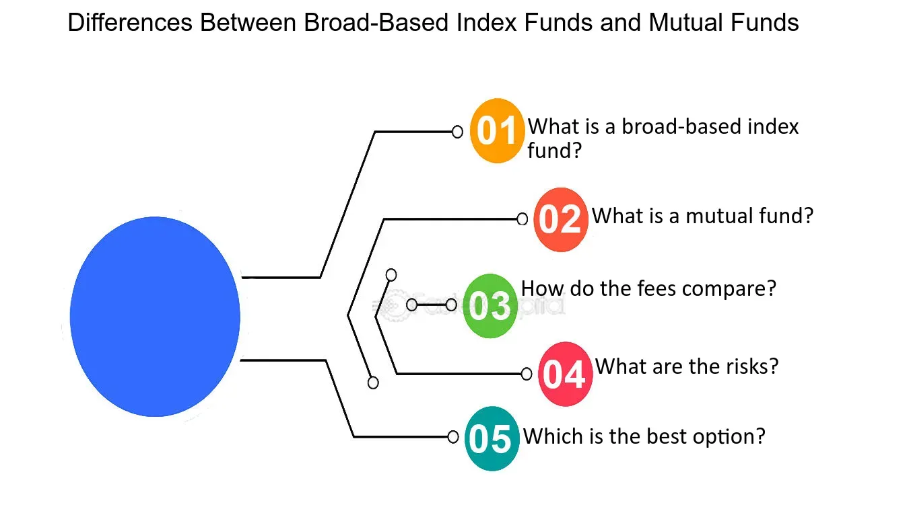

## Table of Contents

## What is a broad-based index?

A broad-based index is a type of stock market index that includes a large number of stocks from different sectors and industries. This means it gives a good overall picture of how the whole market is doing, not just one part of it. Some well-known examples of broad-based indexes are the S&P 500 and the Dow Jones Industrial Average. These indexes are important because they help investors see the general health of the stock market.

Investors and financial experts often use broad-based indexes to compare the performance of their own investments. For example, if your stocks are doing better than the S&P 500, it might mean you're making good choices. These indexes are also used to create investment products like index funds, which try to match the performance of the index. This way, people can invest in the overall market without having to pick individual stocks.

## How does a broad-based index differ from a narrow index?

A broad-based index includes a lot of different stocks from many sectors and industries. This makes it a good way to see how the whole stock market is doing. For example, the S&P 500 has 500 big companies from different parts of the economy. Because it covers so much, it gives a big picture of the market's health. Investors use broad-based indexes to see if their own investments are doing better or worse than the market as a whole.

On the other hand, a narrow index focuses on a smaller group of stocks or just one part of the market. For example, the NASDAQ-100 is a narrow index because it only includes 100 big tech and internet companies. Narrow indexes are useful if you want to know how a specific industry or type of company is doing, but they don't tell you about the overall market. So, while a broad-based index gives you a wide view, a narrow index gives you a more focused look at certain areas.

## What are the benefits of investing in a broad-based index?

Investing in a broad-based index has several benefits. One big advantage is that it helps spread out your risk. Because a broad-based index includes many different companies from various industries, if one company or sector does poorly, it won't hurt your whole investment as much. This is called diversification, and it's like not putting all your eggs in one basket. By investing in a broad-based index, you're betting on the overall health of the economy, which tends to be more stable over time.

Another benefit is that it's easy and often cheaper. When you invest in a broad-based index, you don't need to spend a lot of time picking individual stocks or trying to predict which companies will do well. You can just buy an index fund or ETF that tracks the index, and it will do the work for you. These funds usually have lower fees than actively managed funds, which means more of your money stays in your pocket. Plus, over the long term, broad-based indexes have historically provided good returns, making them a solid choice for many investors.

## What is a broad index fund?

A broad index fund is a type of investment that follows a big stock market index, like the S&P 500. It includes a lot of different companies from many industries, so it gives you a good picture of how the whole market is doing. When you invest in a broad index fund, your money is spread out across all these companies, which helps lower your risk. Instead of betting on just one or a few companies, you're betting on the overall health of the economy.

One big advantage of investing in a broad index fund is that it's simple and usually cheaper. You don't need to spend a lot of time picking individual stocks or trying to guess which ones will do well. You can just buy the fund, and it will automatically adjust to match the index. These funds often have lower fees than other types of funds, which means more of your money stays invested. Over time, broad index funds have shown they can provide good returns, making them a smart choice for many people looking to grow their savings.

## How do broad index funds track their underlying indices?

Broad index funds track their underlying indices by holding a portfolio of securities that closely matches the components of the index. For example, if a fund is tracking the S&P 500, it will buy shares of all 500 companies in that index, in the same proportions as they appear in the index. This way, the performance of the fund will closely follow the performance of the S&P 500. To keep up with changes in the index, like when companies are added or removed, the fund managers will adjust the fund's holdings accordingly.

Sometimes, instead of buying every single stock in the index, a fund might use a sampling method. This means they pick a smaller group of stocks that are similar to the whole index. They choose these stocks carefully so that the fund still acts a lot like the index it's tracking. This can be a bit cheaper and easier to manage, but the goal is always the same: to give investors returns that are as close as possible to the index's performance.

## What are the typical costs associated with broad index funds?

The typical costs associated with broad index funds are mainly the expense ratio and sometimes transaction fees. The expense ratio is a yearly fee that the fund charges to cover its operating costs, like managing the fund and keeping records. For broad index funds, this fee is usually very low, often around 0.03% to 0.20% of the total amount you have invested. This means if you have $10,000 in the fund, you might pay between $3 and $20 a year.

Sometimes, there might also be transaction fees when you buy or sell shares of the fund. These fees can depend on where you're buying the fund from, like a brokerage or a mutual fund company. But many broad index funds, especially those that are ETFs, can be traded without these extra costs. Overall, broad index funds are known for being cost-effective because their low fees help you keep more of your investment returns over time.

## Can you explain the diversification benefits of broad index funds?

Investing in broad index funds helps spread out your risk because they include a lot of different companies from many industries. If one company or even one whole sector does badly, it won't hurt your whole investment too much. This is called diversification, and it's like not putting all your eggs in one basket. By owning a piece of many different companies, you're betting on the overall health of the economy, which is usually more stable than betting on just one or a few companies.

Another way broad index funds help with diversification is by automatically adjusting to changes in the market. When new companies are added to the index or old ones are taken out, the fund managers make sure the fund matches these changes. This means you don't have to worry about keeping your investments up to date. Over time, this can lead to more consistent returns because you're always spread out across a wide range of the market.

## How do broad index funds perform compared to actively managed funds?

Broad index funds usually do better than actively managed funds over the long run. This is because they have lower fees. Actively managed funds have higher costs because they need people to pick stocks and make decisions. These extra costs can eat into the returns, making it harder for them to beat the market. Broad index funds just follow the market, so they don't need as much work and their fees are smaller. This means more of your money stays invested and can grow over time.

Also, it's hard for actively managed funds to pick stocks that will do better than the whole market. Studies show that most actively managed funds don't beat the market over many years. This is because the market includes all the information and smart people trying to guess where it's going. Broad index funds don't try to guess; they just go along with the market's ups and downs. This makes them a safer bet for steady, long-term growth.

## What are some popular broad-based indices used for index funds?

Some of the most popular broad-based indices used for index funds are the S&P 500 and the Dow Jones Industrial Average. The S&P 500 is made up of 500 big companies from different parts of the economy. It's a good way to see how the U.S. stock market is doing overall. Many people invest in funds that track the S&P 500 because it's easy and usually gives good returns over time. The Dow Jones Industrial Average, or just the Dow, includes 30 big companies and is another way to check the health of the market, though it's a bit smaller than the S&P 500.

Another popular broad-based index is the Total Stock Market Index, like the one from Vanguard or CRSP. This index tries to include almost every stock in the U.S. market, so it's even broader than the S&P 500. It's good for people who want to invest in the whole market without leaving anything out. These broad-based indices are used to make index funds and ETFs, which are easy ways for people to invest in the market without picking individual stocks.

## How can investors select the right broad index fund for their portfolio?

When picking the right broad index fund, investors should first think about their goals and how much risk they want to take. If you want to invest in the whole U.S. market, a fund that follows the S&P 500 or a Total Stock Market Index might be good. These funds are broad and include many different companies, which can help spread out your risk. If you're saving for retirement or a long-term goal, these funds can be a good choice because they usually give steady returns over time.

Next, look at the costs. Broad index funds are known for being cheap, but some are cheaper than others. Check the expense ratio, which is the yearly fee the fund charges. A lower expense ratio means more of your money stays invested and can grow. Also, think about where you want to buy the fund. Some places might charge extra fees for buying or selling, so make sure you know all the costs. By considering your goals, the level of risk you're okay with, and the costs, you can pick a broad index fund that fits well in your portfolio.

## What are the tax implications of investing in broad index funds?

When you invest in broad index funds, you need to think about taxes. One important thing is capital gains tax. If you sell your shares in the fund for more than you paid, you'll have to pay tax on the profit. How much you pay depends on how long you held the shares. If you held them for more than a year, you pay a lower long-term capital gains tax rate. But if you held them for a year or less, you pay a higher short-term capital gains tax rate, which is the same as your regular income tax rate.

Another tax thing to consider is dividends. Broad index funds often pay out dividends from the companies in the fund. These dividends are usually taxed as regular income, but there's a special lower tax rate for "qualified" dividends. To get this lower rate, you need to hold the shares for a certain amount of time. Also, some funds might sell stocks inside the fund and pass on those capital gains to you, even if you don't sell your shares. This can happen at the end of the year, and you'll have to pay taxes on those gains too. So, it's good to think about how often the fund trades and if it might give you extra tax bills.

## How do global economic factors influence the performance of broad index funds?

Global economic factors can have a big impact on how broad index funds do. Things like interest rates, inflation, and how well different countries' economies are doing can all affect the stocks in the fund. For example, if the U.S. economy is growing fast, companies in the S&P 500 might do well, and the fund's value could go up. But if there's a global economic slowdown or a big event like a financial crisis, it could hurt many companies and make the fund's value go down. Also, changes in currency values can matter. If the U.S. dollar gets stronger compared to other currencies, it might make U.S. companies that sell things overseas less profitable, which could affect the fund's performance.

Another thing to think about is how global trade and politics can influence broad index funds. If countries start putting up trade barriers or if there's a lot of political uncertainty, it can make companies nervous about their future profits. This can lead to lower stock prices and affect the fund's returns. On the other hand, if countries work together and trade more freely, it can help companies grow and make the fund do better. So, keeping an eye on what's happening around the world can help you understand why your broad index fund is going up or down.

## What is the understanding of Broad-Based Indexes?

Broad-based indexes are integral components of the financial world, highly regarded for their role in providing a comprehensive overview of market performance. These indexes are designed to reflect the health and trends of entire market segments, thereby offering investors a benchmark against which individual securities or portfolios can be measured. Notable examples of broad-based indexes include the S&P 500, NASDAQ Composite, and Russell 3000.

The S&P 500, managed by S&P Dow Jones Indices, comprises 500 of the largest publicly traded companies in the United States. It is notable for its market-value weighting approach, where each company's influence on the index is proportional to its market capitalization. This characteristic ensures that larger companies have a more significant impact on the index's movement. The formula for calculating the index level, $I$, given the market value $MV$ and divisor $D$, can be expressed as:

$$
I = \frac{\sum MV}{D}
$$

The NASDAQ Composite includes over 3,000 stocks listed on the NASDAQ stock exchange, featuring a high concentration of technology firms. Like the S&P 500, it uses a market-value weighting methodology, allowing it to reflect the economic sentiments prevalent in the tech sector prominently.

The Russell 3000 Index, offered by FTSE Russell, includes 3,000 of the largest U.S. stocks, representing approximately 98% of the American investable equity market. It provides extensive coverage across various sectors and is often used as a comprehensive benchmark for the broad market.

Broad-based indexes serve as essential benchmarks for market performance due to their comprehensive coverage and ability to aggregate data from numerous stocks, sectors, and industries. This aggregation enables investors to gauge overall market conditions with a single glance, making these indexes vital tools for portfolio management and performance evaluation.

The market-value weighting feature of broad-based indexes enhances their significance by ensuring that movements are predominantly influenced by companies with the largest market capitalizations, which are typically the most stable and established entities. This weighting mechanism results in a more stable index, less susceptible to the volatile swings of smaller stocks.

Investing in broad-based indexes is advantageous for diversification and stability. These indexes automatically diversify investments across a wide range of sectors and companies, thereby reducing unsystematic risk associated with individual stocks or sectors. The inherent stability of these investments makes them particularly appealing to investors seeking to mitigate risk while pursuing steady growth.

When distinguishing between broad-based indexes and total stock market indexes, it is crucial to note that the latter aims to include every stock in the market regardless of size, thereby providing an even more comprehensive view. However, broad-based indexes focus on a representative sample, such as large-cap stocks in the case of the S&P 500, which simplifies management while still reflecting market trends effectively.

In summary, broad-based indexes are foundational elements in the investment landscape, offering investors crucial insights into market performance and serving as pivotal tools for achieving diversified and stable investment strategies. Their market-value weighting approach and role as benchmarks underscore their importance in financial markets.

## What are some practical tips for investors getting started?

Embarking on the journey of investing in index funds and engaging in algorithmic trading can be rewarding. For beginners, starting with a structured approach ensures informed decisions and a grasp of the complexities involved. Here are practical steps to assist investors in this dual investment strategy.

### Steps to Take for Investors

1. **Understanding Index Funds and Algorithmic Trading**: 
   Before investing, it is crucial to comprehend what index funds are and how they function by mimicking the performance of specific market indices like the S&P 500. Similarly, algorithmic trading involves using algorithms to automate trading decisions based on statistical analysis. Reading materials, online courses, and webinars can provide foundational knowledge.

2. **Choosing the Right Platforms and Tools**:
   Selecting an appropriate platform is vital for algorithmic trading. Platforms like MetaTrader, NinjaTrader, or specialised options for beginners like Robinhood can serve diverse needs. Evaluate them based on user-friendliness, analytical tools offered, fees, and customer support.

3. **Educating Oneself on Market Trends and Technology Use**:
   Regularly following financial news, subscribing to market analysis reports, and engaging in webinars by experts help in staying updated with market trends. Understanding technology's role, especially in algorithmic aspects, can significantly impact success rates. Joining forums like QuantConnect can provide insights from community experiences.

4. **Risk Management Strategies**:
   Establishing robust risk management protocols is essential. This involves setting stop-loss and take-profit margins, using position sizing techniques, and having a diversified portfolio to mitigate risks. A key formula often used in this context is the Kelly Criterion, which aids in determining the optimal size of trades based on historical profit and loss data:
$$
   f^* = \frac{bp - q}{b}

$$

   where $f^*$ is the fraction of the portfolio to wager, $b$ represents the odds received on the wager, $p$ is the probability of winning, and $q$ is the probability of losing.

5. **Continuous Learning and Adaptation in Financial Technology**:
   The financial technology landscape is continuously evolving. Participating in workshops, pursuing certifications such as the Chartered Financial Analyst (CFA) for more comprehensive learning, and staying abreast of emerging technologies like AI in trading can equip investors with cutting-edge strategies.

6. **Building a Practice Portfolio**:
   Beginners should consider creating a mock portfolio to practice without risk. This could be done using paper trading accounts offered by many brokerage firms. This allows for testing strategies and gaining confidence before committing real capital.

Integrating these practices equips investors to make informed decisions, leveraging both index fund investing and algorithmic trading to enhance overall financial performance. Continuous engagement with educational resources and adapting strategies based on market shifts will help in optimizing outcomes and achieving long-term investment goals.

## References & Further Reading

[1]: ["Common Sense on Mutual Funds: New Imperatives for the Intelligent Investor"](https://www.amazon.com/Common-Sense-Mutual-Funds-Imperatives/dp/0471392286) by John C. Bogle  

[2]: ["The Little Book of Common Sense Investing: The Only Way to Guarantee Your Fair Share of Stock Market Returns"](https://www.amazon.com/Little-Book-Common-Sense-Investing/dp/1119404509) by John C. Bogle

[3]: ["A Random Walk Down Wall Street: The Time-Tested Strategy for Successful Investing"](https://www.amazon.com/Random-Walk-Down-Wall-Street/dp/0393358380) by Burton G. Malkiel

[4]: ["The Man Who Solved the Market: How Jim Simons Launched the Quant Revolution"](https://www.amazon.com/Man-Who-Solved-Market-Revolution/dp/073521798X) by Gregory Zuckerman

[5]: Lo, A. W., & Hasanhodzic, J. (2010). ["The Heretics of Finance: Conversations with Leading Practitioners of Technical Analysis"](https://archive.org/details/hereticsoffinanc0000loan). Wiley.

[6]: James, G., Witten, D., Hastie, T., & Tibshirani, R. (2013). ["An Introduction to Statistical Learning: With Applications in R"](https://link.springer.com/book/10.1007/978-1-0716-1418-1). Springer Texts in Statistics.