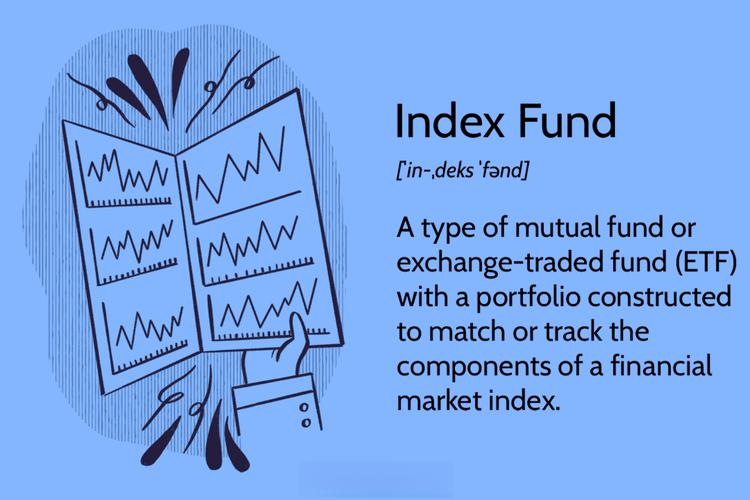

Broad-based index investment, index funds, and algorithmic trading are pivotal components in the landscape of modern finance. Broad-based indices, such as the S&P 500 and the NASDAQ Composite, serve as benchmarks that reflect the performance of a wide spectrum of the market. By investing in these indices, investors can achieve diversification, a strategy that mitigates risk by spreading investments across various asset classes. This diversification forms the backbone of passive investment strategies, allowing investors to mirror market returns without engaging in frequent buying and selling.

Index funds emerged as a tool to simplify this approach, providing a cost-effective and straightforward method to invest in these indices. By passively tracking the components of a specific benchmark, index funds offer investors the opportunity to gain exposure to a range of securities that mirror the index's composition. This approach not only keeps costs low but also aligns with the belief that markets are efficient, and consistently outperforming them is challenging without taking on significant risk.



Technological advancements, particularly in algorithmic trading, have further transformed index fund investing. Algorithmic trading utilizes mathematical models and computational algorithms to execute trades at speeds and frequencies that are impossible for human traders. This automation enables better handling of large volumes and complex strategies, optimizing the execution of trades and reducing the chances of human error. As the use of big data and machine learning becomes more prevalent in financial markets, algorithmic trading is becoming increasingly popular among institutional and individual investors. It offers the allure of increased trading efficiency, precision, and the ability to react swiftly to market changes.

The intersection of index investment and algorithmic trading represents a new frontier in investment strategies. The potential for these technologies to enhance portfolio management by automating rebalancing and optimizing trades is significant. This article will explore how these two approaches can be synergistically combined to offer improved returns and efficiency. The focus will be on understanding how investors can harness these advancements while navigating the associated risks and challenges. By examining the strategies and technologies driving this evolution, investors can be equipped to make informed decisions in a rapidly changing financial environment.

## Table of Contents

## Understanding Broad-Based Indexes

Broad-based indexes are integral components of the financial world, highly regarded for their role in providing a comprehensive overview of market performance. These indexes are designed to reflect the health and trends of entire market segments, thereby offering investors a benchmark against which individual securities or portfolios can be measured. Notable examples of broad-based indexes include the S&P 500, NASDAQ Composite, and Russell 3000.

The S&P 500, managed by S&P Dow Jones Indices, comprises 500 of the largest publicly traded companies in the United States. It is notable for its market-value weighting approach, where each company's influence on the index is proportional to its market capitalization. This characteristic ensures that larger companies have a more significant impact on the index's movement. The formula for calculating the index level, $I$, given the market value $MV$ and divisor $D$, can be expressed as:

$$
I = \frac{\sum MV}{D}
$$

The NASDAQ Composite includes over 3,000 stocks listed on the NASDAQ stock exchange, featuring a high concentration of technology firms. Like the S&P 500, it uses a market-value weighting methodology, allowing it to reflect the economic sentiments prevalent in the tech sector prominently.

The Russell 3000 Index, offered by FTSE Russell, includes 3,000 of the largest U.S. stocks, representing approximately 98% of the American investable equity market. It provides extensive coverage across various sectors and is often used as a comprehensive benchmark for the broad market.

Broad-based indexes serve as essential benchmarks for market performance due to their comprehensive coverage and ability to aggregate data from numerous stocks, sectors, and industries. This aggregation enables investors to gauge overall market conditions with a single glance, making these indexes vital tools for portfolio management and performance evaluation.

The market-value weighting feature of broad-based indexes enhances their significance by ensuring that movements are predominantly influenced by companies with the largest market capitalizations, which are typically the most stable and established entities. This weighting mechanism results in a more stable index, less susceptible to the volatile swings of smaller stocks.

Investing in broad-based indexes is advantageous for diversification and stability. These indexes automatically diversify investments across a wide range of sectors and companies, thereby reducing unsystematic risk associated with individual stocks or sectors. The inherent stability of these investments makes them particularly appealing to investors seeking to mitigate risk while pursuing steady growth.

When distinguishing between broad-based indexes and total stock market indexes, it is crucial to note that the latter aims to include every stock in the market regardless of size, thereby providing an even more comprehensive view. However, broad-based indexes focus on a representative sample, such as large-cap stocks in the case of the S&P 500, which simplifies management while still reflecting market trends effectively.

In summary, broad-based indexes are foundational elements in the investment landscape, offering investors crucial insights into market performance and serving as pivotal tools for achieving diversified and stable investment strategies. Their market-value weighting approach and role as benchmarks underscore their importance in financial markets.

## Index Funds: A Primer

Index funds are investment vehicles designed to replicate the performance of a specific financial market index. They achieve this by holding a portfolio of securities that mirror the components of the index they aim to track. For example, an index fund tracking the S&P 500 will invest in the 500 companies comprising the S&P 500 index, in proportion to their weighting in the index. This approach allows investors to gain exposure to broad market segments with minimal decision-making.

Historically, the concept of index funds was popularized in the 1970s, with the launch of the first index mutual fund by Vanguard, developed by John Bogle. This marked a shift towards passive investing, which contrasts with active management where fund managers attempt to outperform the market through selective stock [picking](/wiki/asset-class-picking) and market timing. The passive strategy of index funds aims to match, rather than exceed, the market's performance, providing a relatively predictable investment outcome.

The benefits of investing in index funds include simplicity, cost-effectiveness, and reduced risk. The simplified management of index funds results from their passive nature, which minimizes the need for frequent trading and decision-making. This simplicity translates to lower management fees when compared to actively managed funds, making index funds an attractive option for cost-sensitive investors. The risk is also reduced by the inherent diversification within index funds, as they spread investments across a wide range of securities as defined by the tracked index.

However, index fund investing is not without potential drawbacks. Since these funds are designed to track market performance, they inherently limit returns to the performance of the index. Investors who seek to outperform the market may find this strategy less appealing than active management. Furthermore, during bear markets or times of economic downturn, index funds will generally reflect the negative performance of the benchmark index, leading to potential losses.

Prominent examples of index funds include the SPDR S&P 500 [ETF](/wiki/etf-trading-strategies) Trust (SPY) and the Vanguard Total Stock Market Index Fund (VTI). The SPY is one of the oldest and most heavily traded ETFs, offering exposure to the S&P 500 index. The VTI provides investors with a broader scope, covering the entire U.S. stock market, both small and large cap stocks. These funds exemplify the vast opportunities available through index fund investing, catering to a variety of investor preferences and risk tolerances.

## Algorithmic Trading: The New Age of Investing

Algorithmic trading represents a significant evolution in the landscape of financial markets, ushering in increased efficiency and precision. In essence, [algorithmic trading](/wiki/algorithmic-trading) involves using computer programs to execute trades at optimal prices, leveraging predefined strategies that consider a multitude of market variables. This approach is increasingly relevant as trading volumes rise and speed becomes paramount.

**Algorithm Determination and Execution**

Algorithms in trading are designed to identify the best possible execution strategies by evaluating market data such as price, time, and [volume](/wiki/volume-trading-strategy). For example, a simple algo might involve executing a large order by slicing it into multiple smaller trades to minimize market impact—a strategy known as Time-Weighted Average Price (TWAP). More complex algorithms might integrate statistical models to predict market trends or utilize [arbitrage](/wiki/arbitrage) opportunities across different exchanges.

Python, a popular language for algorithmic trading, allows traders to implement these strategies efficiently. A basic example might involve calculating moving averages to signal buy or sell actions:

```python
import numpy as np

def moving_average(data, window_size):
    return np.convolve(data, np.ones(window_size)/window_size, mode='valid')

# Example usage
stock_prices = [120, 121, 122, 124, 125, 126, 127, 130]
print(moving_average(stock_prices, 3))
```

**Role of Big Data and Machine Learning**

Big data and [machine learning](/wiki/machine-learning) have significantly propelled the capabilities of algorithmic trading. Vast amounts of market data are analyzed to discern patterns and enhance decision-making processes. Machine learning algorithms, particularly those using techniques like neural networks, are adept at identifying complex, non-linear relationships within data. This allows for the development of predictive models, which can forecast asset price movements.

For instance, machine learning algorithms can be trained on historical data to predict future price trends. They improve over time with more data, continually refining their models to increase prediction accuracy.

**Advantages: Speed, Efficiency, and Reduced Human Error**

Algorithmic trading offers substantial advantages that traditional trading methods cannot match. Speed is a critical [factor](/wiki/factor-investing)—algorithms can execute orders in fractions of a second, far outpacing human traders. Efficiency is enhanced by the algorithm’s ability to process vast datasets and execute trades at the most favorable times. Additionally, the reduction of human error minimizes the risk of emotional decision-making, leading to more consistent trading outcomes.

**Challenges and Risks**

Despite its advantages, algorithmic trading is not without challenges and risks, especially in volatile market conditions. One primary concern is the potential for market overreactions caused by rapid, large-volume trades, which can exacerbate market [volatility](/wiki/volatility-trading-strategies). Algorithms might also misinterpret signals during unprecedented market events, leading to substantial financial losses.

Systems are vulnerable to technological failures or cyber-attacks, with potentially severe financial repercussions. Furthermore, the regulatory landscape for algorithmic trading is constantly evolving, posing compliance challenges for traders and firms.

In conclusion, while algorithmic trading has revolutionized financial markets by providing unprecedented speed and efficiency, it requires a careful balance of technology and oversight to mitigate inherent risks. As technology continues to evolve, the sophistication and capabilities of algorithmic trading are expected to expand, solidifying its role in modern financial strategies.

## Combining Index Investing with Algorithmic Trading

The integration of index investing and algorithmic trading represents a transformative approach in modern investment strategies, combining the benefits of diversification with the efficiency of automation. By leveraging algorithms, investors can potentially optimize and enhance the management of index portfolios.

Algorithms are particularly effective in optimizing portfolio management and rebalancing index funds. Portfolio optimization involves selecting the best possible asset allocation to maximize returns for a given level of risk. Algorithms can efficiently process vast amounts of market data to identify optimal points for buying or selling assets, improving the alignment of investment portfolios with designated benchmarks such as the S&P 500 or NASDAQ Composite. Rebalancing, essential in maintaining the desired asset allocation in an index fund, can be systematically managed through algorithms to ensure adherence with investment strategies while minimizing costs and market impact.

Several case studies illustrate the successful application of algorithmic trading within broad-based index trading. One notable example is the use of machine learning algorithms by hedge funds, such as Renaissance Technologies, which reportedly has achieved significant returns through advanced trading strategies that include indexing components. These case studies highlight algorithmic trading's ability to adapt to market conditions, reduce latency in execution, and enhance [liquidity](/wiki/liquidity-risk-premium) management.

The potential for higher returns and increased efficiency in fund management via algorithmic trading is considerable. Algorithms can act upon small market inefficiencies faster than human traders, facilitating better pricing and trade execution. Additionally, the automated nature of algorithmic trading reduces transaction costs, as it enables the handling of large volumes of trades without significant delays or manual intervention.

However, individual investors should consider several factors when integrating algorithmic strategies with index investing. The complexity of developing and managing the algorithms mandates a certain technical proficiency or access to sophisticated trading platforms that provide algorithmic functionalities. Investors must remain vigilant about their reliance on technology and understand its limitations, including potential errors in trading programs and the challenges of volatile market conditions.

In summary, the combination of index investing with algorithmic trading presents opportunities for enhanced portfolio management and strategic optimization, while necessitating careful consideration of the technological, market, and regulatory dimensions involved.

## Pros and Cons of This Investment Approach

Broad-based index investment and algorithmic trading represent a potent combination for contemporary investors, offering several distinct advantages. One of the primary benefits is diversification. By investing in index funds, which track broad-based indexes like the S&P 500, investors gain exposure to a wide range of companies and sectors. This diversification reduces risk by minimizing the impact of poor performance in any single stock or industry.

Additionally, this investment strategy is cost-effective. Index funds generally have lower expense ratios compared to actively managed funds due to their passive nature. Algorithmic trading further enhances cost efficiency by automating trade execution, thereby reducing transaction costs and minimizing the bid-ask spread.

Improved trade execution is another critical advantage of incorporating algorithmic trading. Algorithms can analyze market conditions in real-time and execute trades at optimal prices, offering speed and precision that human traders may not match. This can lead to better investment outcomes, particularly in volatile markets where quick decision-making is crucial.

Despite these benefits, there are potential pitfalls. One significant risk is the reliance on technology, as algorithmic systems are subject to technical failures and cybersecurity threats. A malfunctioning algorithm can lead to substantial financial losses. Market dependency is another concern. The performance of index investments is tied to overall market trends, which may not always align with investor expectations.

Regulatory considerations should not be overlooked. Algorithmic trading is subject to rigorous oversight to prevent market manipulation and ensure fair trading practices. Changes in regulations can impact the functionality and legality of certain algorithmic strategies, posing a risk to investors reliant on these methods.

Balancing automation with traditional investment advice is crucial. While algorithms offer speed and efficiency, human judgment provides valuable insights based on experience and market nuances. Investors can benefit by combining automated strategies with strategic input from financial advisors.

Looking to the future, the sustainability of algorithmic investing in index funds appears promising. Continuous advancements in [artificial intelligence](/wiki/ai-artificial-intelligence) and data analysis are expected to enhance the sophistication and efficacy of trading algorithms. However, investors must remain vigilant and adaptable to technological and market shifts.

When navigating market fluctuations, a hybrid approach can be particularly beneficial. By leveraging both algorithmic tools and traditional investment strategies, investors can manage risks more effectively and capitalize on diverse opportunities. This balanced approach fosters resilience in the face of economic uncertainties and technological disruptions.

## Getting Started: Practical Tips for Investors

Embarking on the journey of investing in index funds and engaging in algorithmic trading can be rewarding. For beginners, starting with a structured approach ensures informed decisions and a grasp of the complexities involved. Here are practical steps to assist investors in this dual investment strategy.

### Steps to Take for Investors

1. **Understanding Index Funds and Algorithmic Trading**: 
   Before investing, it is crucial to comprehend what index funds are and how they function by mimicking the performance of specific market indices like the S&P 500. Similarly, algorithmic trading involves using algorithms to automate trading decisions based on statistical analysis. Reading materials, online courses, and webinars can provide foundational knowledge.

2. **Choosing the Right Platforms and Tools**:
   Selecting an appropriate platform is vital for algorithmic trading. Platforms like MetaTrader, NinjaTrader, or specialised options for beginners like Robinhood can serve diverse needs. Evaluate them based on user-friendliness, analytical tools offered, fees, and customer support.

3. **Educating Oneself on Market Trends and Technology Use**:
   Regularly following financial news, subscribing to market analysis reports, and engaging in webinars by experts help in staying updated with market trends. Understanding technology's role, especially in algorithmic aspects, can significantly impact success rates. Joining forums like QuantConnect can provide insights from community experiences.

4. **Risk Management Strategies**:
   Establishing robust risk management protocols is essential. This involves setting stop-loss and take-profit margins, using position sizing techniques, and having a diversified portfolio to mitigate risks. A key formula often used in this context is the Kelly Criterion, which aids in determining the optimal size of trades based on historical profit and loss data:
$$
   f^* = \frac{bp - q}{b}

$$

   where $f^*$ is the fraction of the portfolio to wager, $b$ represents the odds received on the wager, $p$ is the probability of winning, and $q$ is the probability of losing.

5. **Continuous Learning and Adaptation in Financial Technology**:
   The financial technology landscape is continuously evolving. Participating in workshops, pursuing certifications such as the Chartered Financial Analyst (CFA) for more comprehensive learning, and staying abreast of emerging technologies like AI in trading can equip investors with cutting-edge strategies.

6. **Building a Practice Portfolio**:
   Beginners should consider creating a mock portfolio to practice without risk. This could be done using paper trading accounts offered by many brokerage firms. This allows for testing strategies and gaining confidence before committing real capital.

Integrating these practices equips investors to make informed decisions, leveraging both index fund investing and algorithmic trading to enhance overall financial performance. Continuous engagement with educational resources and adapting strategies based on market shifts will help in optimizing outcomes and achieving long-term investment goals.

## Conclusion and Future Outlook

The integration of index fund investment and algorithmic trading represents a transformative development in the financial world. By combining the simplicity and stability of index funds with the efficiency and precision of algorithmic trading strategies, investors can potentially achieve enhanced portfolio performance. This synergy provides a path to optimize returns while managing risks more effectively. Algorithmic trading, with its reliance on advanced data analysis and machine learning, offers the ability to execute trades at unmatched speeds and precision, reducing human errors and enhancing decision-making processes. Such technology enables the automation of complex trading strategies which, when aligned with the passive nature of index funds, offers investors a powerful toolset to navigate the ever-evolving market landscapes.

As we look towards the future of investing, continuous innovations in artificial intelligence and big data analytics promise to further refine and enhance investment strategies. The financial sector is poised to benefit from these technologies, which will facilitate more sophisticated market predictions and adaptive trading strategies. The ongoing advancements could allow algorithms to become even more intuitive and responsive to market changes, potentially improving upon the traditional buy-and-hold strategies frequently associated with index investing.

However, it is crucial for investors to adopt a balanced approach towards the integration of technology in their personal finance strategies. While the benefits of technology-driven identification of market opportunities are substantial, investors should be mindful of becoming overly reliant on technology alone. Instead, they should complement algorithm-driven insights with traditional investment advice, fostering a diversified approach to portfolio management.

Remaining informed about technological advancements and market dynamics is imperative for investors seeking to capitalize on these opportunities. By staying strategically adaptable, investors can navigate uncertain market conditions and adjust their strategies to align with evolving market trends.

In conclusion, the intersection of index fund investing and algorithmic trading offers a compelling investment avenue for both seasoned and novice investors. As financial technologies continue to evolve, so too will opportunities to capitalize on their integration. Investors are encouraged to remain knowledgeable and proactive, leveraging both technology and traditional methodologies to optimize their portfolios and achieve their financial goals.

## References & Further Reading

[1]: ["Common Sense on Mutual Funds: New Imperatives for the Intelligent Investor"](https://www.amazon.com/Common-Sense-Mutual-Funds-Imperatives/dp/0471392286) by John C. Bogle  

[2]: ["The Little Book of Common Sense Investing: The Only Way to Guarantee Your Fair Share of Stock Market Returns"](https://www.amazon.com/Little-Book-Common-Sense-Investing/dp/1119404509) by John C. Bogle

[3]: ["A Random Walk Down Wall Street: The Time-Tested Strategy for Successful Investing"](https://www.amazon.com/Random-Walk-Down-Wall-Street/dp/0393358380) by Burton G. Malkiel

[4]: ["The Man Who Solved the Market: How Jim Simons Launched the Quant Revolution"](https://www.amazon.com/Man-Who-Solved-Market-Revolution/dp/073521798X) by Gregory Zuckerman

[5]: Lo, A. W., & Hasanhodzic, J. (2010). ["The Heretics of Finance: Conversations with Leading Practitioners of Technical Analysis"](https://archive.org/details/hereticsoffinanc0000loan). Wiley.

[6]: James, G., Witten, D., Hastie, T., & Tibshirani, R. (2013). ["An Introduction to Statistical Learning: With Applications in R"](https://link.springer.com/book/10.1007/978-1-0716-1418-1). Springer Texts in Statistics.