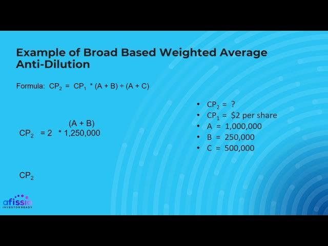

## Table of Contents

## What is a Broad-Based Weighted Average?

A Broad-Based Weighted Average is a way to adjust the price of a company's stock when new shares are issued. It's used to protect existing shareholders from having their ownership diluted too much. When a company issues new shares at a lower price than the current shares, the price of all shares is adjusted. This adjustment is calculated using a formula that takes into account the number of old shares and the number of new shares, as well as the prices of both.

The formula for a Broad-Based Weighted Average considers not just the common stock but also other types of securities that can be converted into common stock, like options and warrants. This makes it "broad-based." The goal is to find a fair new price that reflects the impact of the new shares on the overall value of the company. By using this method, the company tries to balance the interests of new investors with those of existing shareholders, making sure everyone's stake in the company is treated fairly.

## How does the Broad-Based Weighted Average differ from other anti-dilution provisions?

The Broad-Based Weighted Average is one way to protect shareholders when a company issues new shares at a lower price. It's different from other anti-dilution provisions because it considers a wider range of securities when calculating the new share price. This means it looks at not just the common stock, but also other things like options and warrants that could turn into common stock. This makes it more fair because it takes into account the whole picture of the company's ownership.

Another common anti-dilution provision is the Full Ratchet, which is simpler but can be much harsher on new investors. With Full Ratchet, if new shares are issued at a lower price, the price of all existing shares drops to match the new price. This can really hurt the company's ability to raise new money because it makes the new shares less attractive to investors. The Broad-Based Weighted Average is usually seen as a middle ground, balancing the needs of existing shareholders with the company's need to attract new investment.

In contrast, the Narrow-Based Weighted Average is similar to the Broad-Based method but only considers a smaller set of securities when adjusting the share price. This can lead to a bigger drop in the share price for existing shareholders because fewer securities are included in the calculation. So, while both methods aim to protect shareholders from dilution, the Broad-Based Weighted Average tends to be more favorable to new investors because it spreads the impact of the new shares across a larger pool of securities.

## What is the purpose of using a Broad-Based Weighted Average in stock options?

The purpose of using a Broad-Based Weighted Average in stock options is to protect existing shareholders when a company issues new shares at a lower price. This method helps to balance the interests of current shareholders with those of new investors. When new shares are sold at a lower price, it can dilute the value of existing shares. The Broad-Based Weighted Average adjusts the price of all shares to reflect this new issuance, making sure that the impact is shared fairly among all shareholders.

This adjustment is calculated by considering not just the common stock, but also other securities like options and warrants that could be converted into common stock. By including these in the calculation, the Broad-Based Weighted Average takes a more comprehensive view of the company's ownership structure. This makes it a fairer method because it spreads the impact of the new shares across a larger pool of securities, helping to maintain a sense of equity among all shareholders.

## Can you explain the formula used to calculate the Broad-Based Weighted Average?

The formula for the Broad-Based Weighted Average helps figure out the new price of shares when a company issues new shares at a lower price. It looks at the old price of the shares, the number of old shares, the number of new shares, and the price of the new shares. The goal is to find a new price that is fair to everyone. The formula is: New Price = (Old Price x (Old Shares + New Shares)) / (Old Shares + (New Shares x (New Price / Old Price))). This might look complicated, but it's really about balancing the old and new shares to find a fair price.

What makes the Broad-Based Weighted Average special is that it includes not just the common stock, but also other securities like options and warrants that can turn into common stock. So, when you use this formula, you count all these different kinds of securities as part of the "Old Shares." This makes the calculation more fair because it considers the whole picture of who owns the company. By doing this, the formula helps make sure that when new shares are issued, the impact is spread out fairly among everyone who has a stake in the company.

## What are the key components needed to apply the Broad-Based Weighted Average formula?

To use the Broad-Based Weighted Average formula, you need to know a few important things. First, you need to know the old price of the shares. This is the price the shares were at before the company issued new shares. Second, you need to know how many old shares there are. This includes not just the common stock, but also other securities like options and warrants that can turn into common stock. Third, you need to know how many new shares the company is issuing and what price they are selling these new shares at.

Once you have all these pieces of information, you can plug them into the formula to find the new price of the shares. The formula takes the old price and multiplies it by the total number of shares (old shares plus new shares). Then, it divides that by the old shares plus the new shares adjusted for their price difference. This adjustment makes sure that the impact of the new shares is shared fairly among all shareholders. By using this method, the company can balance the needs of existing shareholders with the need to attract new investors.

## How does the Broad-Based Weighted Average protect existing shareholders during a down round?

When a company goes through a down round, it means they're selling new shares at a lower price than before. This can make the value of the old shares go down, which isn't good for people who already own shares. The Broad-Based Weighted Average helps protect these existing shareholders by adjusting the price of all shares to make things more fair. It does this by considering not just the common stock, but also other things like options and warrants that can turn into common stock.

This method takes into account the old price of the shares, the number of old shares, the number of new shares, and the price of the new shares. By using a special formula, it finds a new price that balances the impact of the new shares on the overall value of the company. This way, the existing shareholders don't see their shares lose as much value, and the company can still attract new investors without making things too unfair for the people who already own shares.

## What is an example of a company issuing new shares and applying the Broad-Based Weighted Average?

Imagine a company called TechStart that has 1 million shares, and each share is worth $10. Now, TechStart decides to issue 200,000 new shares, but they can only sell them for $5 each. This is called a down round because the new shares are cheaper than the old ones. To protect the people who already own shares, TechStart uses the Broad-Based Weighted Average. They include not just the common stock but also other things like options and warrants that can turn into shares. 

So, they use a special formula to figure out the new price of all the shares. They take the old price ($10) and multiply it by the total number of shares after the new ones are added (1 million old shares + 200,000 new shares). Then, they divide that by the old shares plus the new shares, but the new shares are adjusted to reflect their lower price. After doing the math, the new price for all the shares comes out to be about $9.17. This way, the value of the existing shares doesn't drop as much, and everyone feels the impact of the new shares more fairly.

## How does the Broad-Based Weighted Average impact the conversion price of preferred stock?

When a company issues new shares at a lower price, it can affect the value of preferred stock. Preferred stock often comes with a conversion feature, allowing it to be turned into common stock at a set price, called the conversion price. If the company uses the Broad-Based Weighted Average method during a down round, it adjusts this conversion price to protect the investors who own preferred stock. This adjustment makes sure that the preferred stock holders don't lose as much value when new shares are sold at a lower price.

The Broad-Based Weighted Average takes into account not just the common stock but also other securities like options and warrants that can be converted into common stock. This method uses a formula that considers the old price of the shares, the number of old shares, the number of new shares, and the price of the new shares. By applying this formula, the company calculates a new conversion price for the preferred stock that reflects the impact of the new shares. This helps to balance the interests of the preferred stock holders with those of new investors, making sure everyone's stake in the company is treated fairly.

## What are the potential drawbacks of using the Broad-Based Weighted Average method?

Using the Broad-Based Weighted Average method can make things more complicated for a company. The formula used to adjust the share price is not simple and can be hard to understand. This means the company might need to spend more time explaining it to investors, which can slow down the process of raising new money. Also, even though it tries to be fair, some investors might still feel like they are not getting the best deal because the method spreads the impact of new shares across a lot of different securities.

Another issue is that while the Broad-Based Weighted Average tries to protect existing shareholders, it might make it harder for the company to attract new investors. New investors might be less interested in buying shares if they know the price will be adjusted to favor existing shareholders. This can make it tougher for the company to raise the money it needs to grow. So, while the method helps balance things out, it can also create challenges when the company is trying to bring in new investment.

## How do you compare the effectiveness of Broad-Based Weighted Average versus Full Ratchet anti-dilution?

The Broad-Based Weighted Average and Full Ratchet are two different ways to protect shareholders when a company sells new shares at a lower price. The Broad-Based Weighted Average is seen as a fairer method because it looks at all kinds of securities, not just the common stock. It uses a special formula to adjust the price of all shares, which helps to balance the impact of the new shares across everyone who owns a piece of the company. This means existing shareholders don't lose as much value, and the company can still attract new investors without making things too unfair.

On the other hand, Full Ratchet is a simpler method, but it can be much harder on new investors. With Full Ratchet, if new shares are sold at a lower price, the price of all existing shares drops to match the new price. This can make it very tough for the company to raise new money because new investors might not want to buy shares if they know the price will drop right away. While Full Ratchet protects existing shareholders more strongly, it can hurt the company's ability to grow by scaring off new investors. So, the Broad-Based Weighted Average is usually seen as a better middle ground that tries to be fair to everyone.

## In what scenarios would a company choose to implement a Broad-Based Weighted Average?

A company might choose to use the Broad-Based Weighted Average when they need to sell new shares at a lower price than before. This can happen if the company is going through tough times and needs to raise money quickly. By using this method, the company can make sure that the people who already own shares don't lose too much value. It's a way to keep things fair for everyone who has a stake in the company, including those who own options and warrants that can turn into shares.

This method is also a good choice when the company wants to attract new investors without scaring them away. The Broad-Based Weighted Average is seen as a fair middle ground because it adjusts the price of all shares in a way that considers the whole picture of the company's ownership. This makes it easier for the company to raise new money while still protecting the value of the shares for existing shareholders.

## What advanced considerations should be taken into account when negotiating the terms of a Broad-Based Weighted Average?

When negotiating the terms of a Broad-Based Weighted Average, it's important to think about how it will affect everyone involved. Existing shareholders want to make sure their shares don't lose too much value, so they might push for a method that protects them more. On the other hand, new investors might want a method that doesn't make their shares too expensive right away. Finding the right balance can be tricky, but it's key to making sure the company can keep growing while keeping everyone happy.

Another thing to consider is how the formula is set up. The Broad-Based Weighted Average looks at not just common stock, but also other things like options and warrants that can turn into shares. Deciding which securities to include in the calculation can make a big difference in how the new price is figured out. It's also important to make sure the formula is clear and easy to understand for everyone, so there are no surprises later on. By thinking through these details carefully, the company can create a fair deal that works for both old and new shareholders.

## What is the process for understanding weighted average calculations?

Weighted averages play an essential role in the financial analysis domain by assigning varying importance to individual data points, thus reflecting their significance or relevance. This method of calculation provides a more precise analytical perspective compared to simple averages, which treat all data points equally regardless of their context or importance.

The foundational concept of weighted averages is straightforward: each data point in a dataset is assigned a weight that represents its significance. The weighted average is then calculated by multiplying each data point by its corresponding weight, summing these products, and dividing by the total sum of weights. This can be expressed mathematically as follows:

$$
\text{Weighted Average} = \frac{\sum_{i=1}^{n} (x_i \times w_i)}{\sum_{i=1}^{n} w_i}
$$

Where:
- $x_i$ represents each individual data point.
- $w_i$ is the weight assigned to each data point.
- $n$ denotes the total number of data points.

This formula enables analysts to tailor their assessments to reflect the varying levels of importance or certainty associated with individual data entries, which is particularly beneficial in financial contexts. For example, when analyzing stock prices over time, a financial analyst might assign greater weights to recent prices, assuming they offer more relevant insights into present market conditions. This methodology provides enhanced accuracy and insight, proving crucial for data-driven decision-making.

In diverse financial scenarios, weighted averages facilitate precise portfolio management, risk assessment, and investment evaluations. For instance, in portfolio management, securities can be weighted based on factors like market capitalization, [volatility](/wiki/volatility-trading-strategies), or investor preference. Similarly, credit rating agencies use weighted averages to calculate a score that reflects a company's financial health based on its historical performance, [liquidity](/wiki/liquidity-risk-premium), and economic conditions, thereby assisting investors in making informed decisions.

Overall, the use of weighted averages in financial analysis ensures that the most relevant data points exert proportional influence on the outcomes of calculations, enabling more nuanced and accurate insights into financial trends and metrics. Leveraging weighted averages effectively can enhance the quality of financial analyses, optimizing decision-making processes and strategic planning.

## What is the concept and calculation of Broad-Based Weighted Average?

The broad-based weighted average is an essential anti-dilution mechanism employed in the equity markets. It aims to safeguard existing shareholders' interests when a company decides to issue additional stock. This provision recalibrates the conversion price of preferred shares to a new weighted average, factoring in both previously issued and new shares. By doing so, it mitigates the adverse impact of share dilution.

Consider the scenario where a company issues new shares at a price lower than the conversion price of existing preferred shares. This typically results in dilution of value for the existing shareholders. The broad-based weighted average adjustment addresses this by recalculating the conversion price using a weighted formula. This formula takes into account all categories of equity, such as common shares and convertible securities, to achieve a holistic adjustment.

The calculation is illustrated by the following formula:

$$
\text{New Conversion Price} = \frac{(\text{Old Conversion Price} \times \text{Old Outstanding Shares}) + (\text{New Issue Price} \times \text{New Shares})}{\text{Total Shares After New Issue}}
$$

Here's how this works in practice:

Suppose a company has 1,000,000 shares outstanding, with preferred shares convertible at $10 each. If the company issues an additional 500,000 shares at $5, the new conversion price is calculated as follows:

1. $\text{Old Conversion Price} = 10$
2. $\text{Old Outstanding Shares} = 1,000,000$
3. $\text{New Issue Price} = 5$
4. $\text{New Shares} = 500,000$

Plug these values into the formula:

$$
\text{New Conversion Price} = \frac{(10 \times 1,000,000) + (5 \times 500,000)}{1,000,000 + 500,000} = \frac{10,000,000 + 2,500,000}{1,500,000} = \frac{12,500,000}{1,500,000} \approx 8.33
$$

This adjustment results in a new conversion price of approximately $8.33, minimizing the dilution impact for existing shareholders.

In summary, the broad-based weighted average anti-dilution provision is critical in finance, enabling companies to continue financing operations while maintaining fairness and equity for existing shareholders. By incorporating both common and convertible securities, it provides a robust defense against potential dilution effects.

## What are the applications of weighted averages in algorithmic trading?

Algorithmic trading, a staple in modern financial markets, notably benefits from the application of weighted averages to refine execution strategies. These tools are pivotal in managing trades with efficiency and precision, especially within the fast-paced and complex landscape of automated trading systems.

The Volume-Weighted Average Price (VWAP) is a principal metric used by traders to gauge the average price at which a security has traded during a specific period, factoring in both price and [volume](/wiki/volume-trading-strategy). The VWAP calculation is defined by the formula:

$$
\text{VWAP} = \frac{\sum (P_i \times Q_i)}{\sum Q_i}
$$

where $P_i$ represents the price of the trade and $Q_i$ the quantity of the trade. By employing this metric, traders can minimize market impact during large orders and assess whether they are buying or selling at a favorable market price compared to this average. Utilizing VWAP can help a trader execute large orders without causing significant price shifts, thus maintaining the integrity of market prices.

Exponential Moving Averages (EMA) are another critical tool derived from weighted average principles. Unlike simple moving averages, EMAs give more significance to recent prices, providing a more responsive indicator to recent market movements. The formula for calculating the EMA at the time $t$ is:

$$
EMA_t = (P_t \times \alpha) + EMA_{t-1} \times (1 - \alpha)
$$

Here, $P_t$ represents the price at time $t$, and $\alpha$ is the smoothing [factor](/wiki/factor-investing), calculated as $\frac{2}{N+1}$, with $N$ being the number of days in the EMA period. Python code implementing an EMA might look like this:

```python
def calculate_ema(prices, days):
    alpha = 2 / (days + 1)
    ema_values = [prices[0]]
    for price in prices[1:]:
        ema_values.append((price * alpha) + (ema_values[-1] * (1 - alpha)))
    return ema_values
```

By incorporating EMA into their trading strategies, traders can capture short-term trends and reactions to price changes more adequately than with simple averages. 

Both VWAP and EMA allow traders to promptly respond to market signals. VWAP facilitates decisions about trade execution relative to average conditions, assisting in the management of transaction costs. EMA helps traders identify [momentum](/wiki/momentum) within the markets, improving the timing of entry and [exit](/wiki/exit-strategy) points. These tools, powered by weighted averages, enhance strategic decision-making by providing clear and actionable insights, thereby optimizing the effectiveness of [algorithmic trading](/wiki/algorithmic-trading) strategies.

## What are the differences between Broad-Based and Narrow-Based Weighted Averages?

In the sphere of equity markets, anti-dilution provisions play a crucial role in preserving shareholders' equity stakes when new shares are issued. Broad-based and narrow-based weighted averages are two primary methods utilized to protect against this dilution. Each approach offers its unique benefits and sets of considerations that investors must understand when participating in funding rounds.

Broad-based weighted averages account for all types of convertible securities, including warrants, options, and different classes of equity, alongside preferred and common shares. This comprehensive approach ensures a more equitable adjustment of the conversion price of convertible securities when new shares are issued at a price lower than the existing conversion price. The formula used in broad-based adjustments is:

$$
\text{New Conversion Price} = \frac{\text{(Original Outstanding Shares + Convertible Securities) } \times \text{ Original Conversion Price} + \text{New Shares Issued } \times \text{Issue Price} }{\text{Total Outstanding Shares after Issue}}
$$

The broad-based method's main advantage is its inclusivity, reflecting a more accurate market value adjustment, which is essential for preserving shareholder value during equity dilution.

Conversely, the narrow-based weighted average concentrates solely on the conversion of preferred and common shares, excluding other securities like warrants or options. This method typically results in a more significant downward adjustment to the conversion price because it considers fewer securities in the calculation. While it can be beneficial in certain contexts, it often leads to higher dilution for existing shareholders compared to the broad-based method:

$$
\text{New Conversion Price} = \frac{\text{Original Preferred Shares} \times \text{Original Conversion Price} + \text{New Shares Issued} \times \text{Issue Price}}{\text{New Total Preferred Shares}}
$$

Investors need to recognize these distinctions to align their protection strategies with their investment goals. Broad-based weighted averages generally offer greater protection against dilution for all stakeholders due to their inclusive approach. On the other hand, narrow-based calculations may be more straightforward but can result in increased dilution risk.

Understanding these differences is essential when negotiating anti-dilution clauses in funding agreements. The decision on which method to employ should consider the investor's risk tolerance, the company's capital structure, and the potential impact on future funding rounds. An informed decision can significantly influence the preservation of shareholders' equity stakes and overall investment returns.

## References & Further Reading

[1]: ["Quantitative Trading: How to Build Your Own Algorithmic Trading Business"](https://www.amazon.com/Quantitative-Trading-Build-Algorithmic-Business/dp/1119800064) by Ernest P. Chan

[2]: ["Advances in Financial Machine Learning"](https://www.amazon.com/Advances-Financial-Machine-Learning-Marcos/dp/1119482089) by Marcos Lopez de Prado

[3]: ["Evidence-Based Technical Analysis: Applying the Scientific Method and Statistical Inference to Trading Signals"](https://www.amazon.com/Evidence-Based-Technical-Analysis-Scientific-Statistical/dp/0470008741) by David Aronson

[4]: Fullman, J. T. (2018). ["Anti-Dilution: Theory and Accelerated Conversion."](https://www.nishithdesai.com/Content/document/pdf/Hotline/Cracking-the-Anti-Dilution-Formula.pdf) *Multidisciplinary Digital Publishing Institute*.

[5]: Hull, J. C. (2018). ["Options, Futures, and Other Derivatives"](https://www.semanticscholar.org/paper/Options%2C-Futures%2C-and-Other-Derivatives-Hull/89bdee500c8623864fc9eb7a471546aa713acc44). Pearson Education.

[6]: Aldridge, I. (2013). ["High-Frequency Trading: A Practical Guide to Algorithmic Strategies and Trading Systems"](https://books.google.com/books/about/High_Frequency_Trading.html?id=6l0DDQAAQBAJ). Wiley.