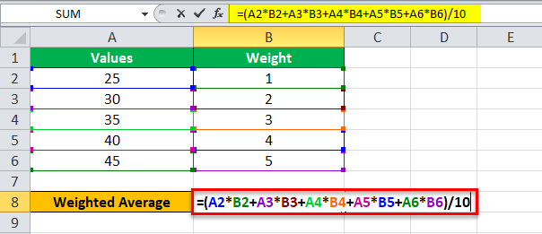

In the dynamic world of finance, understanding the intricacies of weighted averages is crucial for making informed investment decisions. Weighted averages assign a different level of importance to each data point, which allows for a more nuanced analysis than simple averages. This results in more accurate financial insights, particularly useful in scenarios where data points have varying degrees of relevance.

This article explores the concept of weighted averages, focusing on their application in financial calculations and algorithmic trading. Weighted averages are integral in creating robust investment strategies, as they reflect the true significance of different components within a dataset. These calculations are not only pivotal in traditional financial analysis but also serve as foundational tools in algorithmic trading systems.



One significant application of weighted averages is seen in the context of broad-based anti-dilution provisions. Broad-based weighted averages protect shareholders by adjusting the value of their investments when new shares are issued, effectively safeguarding against dilution. Understanding this mechanism is essential for shareholders who wish to maintain their financial interests in a company amid varying market conditions.

Moreover, algorithmic trading relies extensively on weighted averages to refine trading strategies. The use of techniques like the Volume-Weighted Average Price (VWAP) and Exponential Moving Averages (EMA) exemplifies how traders apply these calculations to improve execution strategies, reduce market impact, and respond effectively to market changes.

By examining these diverse applications, the article provides comprehensive insights into the role of weighted averages in financial analysis and modern trading practices, highlighting their importance and versatility in the ever-evolving landscape of finance.

## Table of Contents

## Understanding Weighted Average Calculations

Weighted averages play an essential role in the financial analysis domain by assigning varying importance to individual data points, thus reflecting their significance or relevance. This method of calculation provides a more precise analytical perspective compared to simple averages, which treat all data points equally regardless of their context or importance.

The foundational concept of weighted averages is straightforward: each data point in a dataset is assigned a weight that represents its significance. The weighted average is then calculated by multiplying each data point by its corresponding weight, summing these products, and dividing by the total sum of weights. This can be expressed mathematically as follows:

$$
\text{Weighted Average} = \frac{\sum_{i=1}^{n} (x_i \times w_i)}{\sum_{i=1}^{n} w_i}
$$

Where:
- $x_i$ represents each individual data point.
- $w_i$ is the weight assigned to each data point.
- $n$ denotes the total number of data points.

This formula enables analysts to tailor their assessments to reflect the varying levels of importance or certainty associated with individual data entries, which is particularly beneficial in financial contexts. For example, when analyzing stock prices over time, a financial analyst might assign greater weights to recent prices, assuming they offer more relevant insights into present market conditions. This methodology provides enhanced accuracy and insight, proving crucial for data-driven decision-making.

In diverse financial scenarios, weighted averages facilitate precise portfolio management, risk assessment, and investment evaluations. For instance, in portfolio management, securities can be weighted based on factors like market capitalization, [volatility](/wiki/volatility-trading-strategies), or investor preference. Similarly, credit rating agencies use weighted averages to calculate a score that reflects a company's financial health based on its historical performance, [liquidity](/wiki/liquidity-risk-premium), and economic conditions, thereby assisting investors in making informed decisions.

Overall, the use of weighted averages in financial analysis ensures that the most relevant data points exert proportional influence on the outcomes of calculations, enabling more nuanced and accurate insights into financial trends and metrics. Leveraging weighted averages effectively can enhance the quality of financial analyses, optimizing decision-making processes and strategic planning.

## Broad-Based Weighted Average: Concept and Calculation

The broad-based weighted average is an essential anti-dilution mechanism employed in the equity markets. It aims to safeguard existing shareholders' interests when a company decides to issue additional stock. This provision recalibrates the conversion price of preferred shares to a new weighted average, factoring in both previously issued and new shares. By doing so, it mitigates the adverse impact of share dilution.

Consider the scenario where a company issues new shares at a price lower than the conversion price of existing preferred shares. This typically results in dilution of value for the existing shareholders. The broad-based weighted average adjustment addresses this by recalculating the conversion price using a weighted formula. This formula takes into account all categories of equity, such as common shares and convertible securities, to achieve a holistic adjustment.

The calculation is illustrated by the following formula:

$$
\text{New Conversion Price} = \frac{(\text{Old Conversion Price} \times \text{Old Outstanding Shares}) + (\text{New Issue Price} \times \text{New Shares})}{\text{Total Shares After New Issue}}
$$

Here's how this works in practice:

Suppose a company has 1,000,000 shares outstanding, with preferred shares convertible at $10 each. If the company issues an additional 500,000 shares at $5, the new conversion price is calculated as follows:

1. $\text{Old Conversion Price} = 10$
2. $\text{Old Outstanding Shares} = 1,000,000$
3. $\text{New Issue Price} = 5$
4. $\text{New Shares} = 500,000$

Plug these values into the formula:

$$
\text{New Conversion Price} = \frac{(10 \times 1,000,000) + (5 \times 500,000)}{1,000,000 + 500,000} = \frac{10,000,000 + 2,500,000}{1,500,000} = \frac{12,500,000}{1,500,000} \approx 8.33
$$

This adjustment results in a new conversion price of approximately $8.33, minimizing the dilution impact for existing shareholders.

In summary, the broad-based weighted average anti-dilution provision is critical in finance, enabling companies to continue financing operations while maintaining fairness and equity for existing shareholders. By incorporating both common and convertible securities, it provides a robust defense against potential dilution effects.

## Applications of Weighted Averages in Algorithmic Trading

Algorithmic trading, a staple in modern financial markets, notably benefits from the application of weighted averages to refine execution strategies. These tools are pivotal in managing trades with efficiency and precision, especially within the fast-paced and complex landscape of automated trading systems.

The Volume-Weighted Average Price (VWAP) is a principal metric used by traders to gauge the average price at which a security has traded during a specific period, factoring in both price and [volume](/wiki/volume-trading-strategy). The VWAP calculation is defined by the formula:

$$
\text{VWAP} = \frac{\sum (P_i \times Q_i)}{\sum Q_i}
$$

where $P_i$ represents the price of the trade and $Q_i$ the quantity of the trade. By employing this metric, traders can minimize market impact during large orders and assess whether they are buying or selling at a favorable market price compared to this average. Utilizing VWAP can help a trader execute large orders without causing significant price shifts, thus maintaining the integrity of market prices.

Exponential Moving Averages (EMA) are another critical tool derived from weighted average principles. Unlike simple moving averages, EMAs give more significance to recent prices, providing a more responsive indicator to recent market movements. The formula for calculating the EMA at the time $t$ is:

$$
EMA_t = (P_t \times \alpha) + EMA_{t-1} \times (1 - \alpha)
$$

Here, $P_t$ represents the price at time $t$, and $\alpha$ is the smoothing [factor](/wiki/factor-investing), calculated as $\frac{2}{N+1}$, with $N$ being the number of days in the EMA period. Python code implementing an EMA might look like this:

```python
def calculate_ema(prices, days):
    alpha = 2 / (days + 1)
    ema_values = [prices[0]]
    for price in prices[1:]:
        ema_values.append((price * alpha) + (ema_values[-1] * (1 - alpha)))
    return ema_values
```

By incorporating EMA into their trading strategies, traders can capture short-term trends and reactions to price changes more adequately than with simple averages. 

Both VWAP and EMA allow traders to promptly respond to market signals. VWAP facilitates decisions about trade execution relative to average conditions, assisting in the management of transaction costs. EMA helps traders identify [momentum](/wiki/momentum) within the markets, improving the timing of entry and [exit](/wiki/exit-strategy) points. These tools, powered by weighted averages, enhance strategic decision-making by providing clear and actionable insights, thereby optimizing the effectiveness of [algorithmic trading](/wiki/algorithmic-trading) strategies.

## Broad-Based vs. Narrow-Based Weighted Averages

In the sphere of equity markets, anti-dilution provisions play a crucial role in preserving shareholders' equity stakes when new shares are issued. Broad-based and narrow-based weighted averages are two primary methods utilized to protect against this dilution. Each approach offers its unique benefits and sets of considerations that investors must understand when participating in funding rounds.

Broad-based weighted averages account for all types of convertible securities, including warrants, options, and different classes of equity, alongside preferred and common shares. This comprehensive approach ensures a more equitable adjustment of the conversion price of convertible securities when new shares are issued at a price lower than the existing conversion price. The formula used in broad-based adjustments is:

$$
\text{New Conversion Price} = \frac{\text{(Original Outstanding Shares + Convertible Securities) } \times \text{ Original Conversion Price} + \text{New Shares Issued } \times \text{Issue Price} }{\text{Total Outstanding Shares after Issue}}
$$

The broad-based method's main advantage is its inclusivity, reflecting a more accurate market value adjustment, which is essential for preserving shareholder value during equity dilution.

Conversely, the narrow-based weighted average concentrates solely on the conversion of preferred and common shares, excluding other securities like warrants or options. This method typically results in a more significant downward adjustment to the conversion price because it considers fewer securities in the calculation. While it can be beneficial in certain contexts, it often leads to higher dilution for existing shareholders compared to the broad-based method:

$$
\text{New Conversion Price} = \frac{\text{Original Preferred Shares} \times \text{Original Conversion Price} + \text{New Shares Issued} \times \text{Issue Price}}{\text{New Total Preferred Shares}}
$$

Investors need to recognize these distinctions to align their protection strategies with their investment goals. Broad-based weighted averages generally offer greater protection against dilution for all stakeholders due to their inclusive approach. On the other hand, narrow-based calculations may be more straightforward but can result in increased dilution risk.

Understanding these differences is essential when negotiating anti-dilution clauses in funding agreements. The decision on which method to employ should consider the investor's risk tolerance, the company's capital structure, and the potential impact on future funding rounds. An informed decision can significantly influence the preservation of shareholders' equity stakes and overall investment returns.

## Challenges and Considerations in Using Weighted Averages

Determining appropriate weights for data points in weighted average analyses presents a significant challenge. It is crucial to assign weights that accurately reflect the importance of each data point, as misjudgment in this regard can lead to distorted outcomes and suboptimal financial decisions. The process of selecting these weights often involves subjective judgment and a deep understanding of the context wherein the data is utilized.

Data quality stands out as a critical consideration. High-quality data ensures accuracy in weighted average calculations, which in turn, impacts trading strategies. Poor data quality can introduce biases, leading to unreliable analyses. Ensuring data integrity involves regular data audits, verification procedures, and validation techniques, which can be resource-intensive but necessary.

Market volatility adds another layer of complexity. Financial markets are inherently volatile, and this unpredictability can affect the stability of the outcomes derived from weighted averages. Traders must account for this volatility by dynamically adjusting weights to reflect current market conditions, thereby maintaining the relevance and accuracy of their analyses.

The risk of overfitting is a prevalent issue when employing weighted averages in trading algorithms. Overfitting occurs when a model is too closely tailored to historical data, limiting its applicability to future scenarios. This can be mitigated by using techniques such as cross-validation and regularization during model development. Additionally, maintaining a balance between model complexity and simplicity is vital to avoid overfitting.

Regulatory standards play an essential role in the use of weighted averages. Adhering to regulations ensures that analyses are conducted within the legal framework, protecting not only the traders but also the integrity of financial markets. This involves staying updated with evolving regulations and integrating compliance checks into trading algorithms.

Lastly, ethical practices are fundamental in maintaining transparency and trust in financial markets. Traders should ensure that their use of weighted averages does not manipulate or misrepresent market conditions, and they should uphold ethical standards to foster fairness and reliability in their analyses.

To optimize the use of weighted averages, traders can leverage [machine learning](/wiki/machine-learning) techniques to aid in the dynamic adjustment of weights and automate compliance and ethical considerations. Implementing robust risk management frameworks and continuous monitoring systems can further enhance the efficacy and reliability of weighted average analyses.

## Conclusion

Weighted averages play a crucial role in modern finance by providing nuanced insights and precision in decision-making processes. They allow financial professionals to account for the varying significance of different data points, resulting in more accurate and reliable analyses. This capability is especially important in contexts such as risk assessment, asset allocation, and performance measurement, where nuanced interpretations can lead to more informed decisions.

Traders and financial analysts can achieve improved financial outcomes through a thorough understanding and implementation of weighted average calculations. By appropriately weighting financial metrics, they can refine their trading strategies and align them more closely with market realities. This practice empowers them to respond more effectively to market trends and optimize their investment portfolios.

The continuous advancements in technology and algorithmic trading underscore the evolving importance of weighted averages within financial markets. Sophisticated algorithms leverage these calculations to enhance trading performance and mitigate risks associated with market fluctuations. As algorithmic trading grows more prevalent, the role of weighted averages in crafting efficient and responsive trading strategies becomes increasingly significant.

Looking ahead, future innovations promise to further refine the methods used in weighted average calculations, ensuring their sustained relevance and utility in financial analyses. As data analytics and computational power continue to advance, new tools and techniques are likely to emerge, enhancing the precision and applicability of weighted averages. This evolution will support the ever-changing landscape of finance, enabling professionals to harness the full potential of weighted averages in achieving financial objectives.

## References & Further Reading

[1]: ["Quantitative Trading: How to Build Your Own Algorithmic Trading Business"](https://www.amazon.com/Quantitative-Trading-Build-Algorithmic-Business/dp/1119800064) by Ernest P. Chan

[2]: ["Advances in Financial Machine Learning"](https://www.amazon.com/Advances-Financial-Machine-Learning-Marcos/dp/1119482089) by Marcos Lopez de Prado

[3]: ["Evidence-Based Technical Analysis: Applying the Scientific Method and Statistical Inference to Trading Signals"](https://www.amazon.com/Evidence-Based-Technical-Analysis-Scientific-Statistical/dp/0470008741) by David Aronson

[4]: Fullman, J. T. (2018). ["Anti-Dilution: Theory and Accelerated Conversion."](https://www.nishithdesai.com/Content/document/pdf/Hotline/Cracking-the-Anti-Dilution-Formula.pdf) *Multidisciplinary Digital Publishing Institute*.

[5]: Hull, J. C. (2018). ["Options, Futures, and Other Derivatives"](https://www.semanticscholar.org/paper/Options%2C-Futures%2C-and-Other-Derivatives-Hull/89bdee500c8623864fc9eb7a471546aa713acc44). Pearson Education.

[6]: Aldridge, I. (2013). ["High-Frequency Trading: A Practical Guide to Algorithmic Strategies and Trading Systems"](https://books.google.com/books/about/High_Frequency_Trading.html?id=6l0DDQAAQBAJ). Wiley.