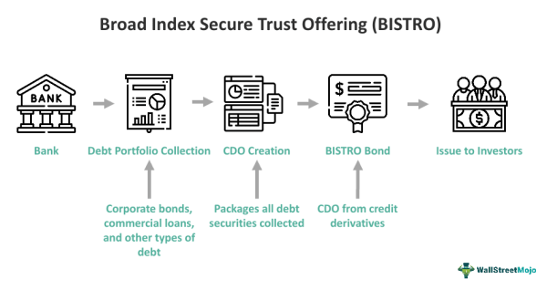

The world of finance is characterized by continuous evolution, driven by innovative financial instruments that reshape the landscape of investment and risk management. One such innovation is the Broad Index Secured Trust Offering (BISTRO), introduced by the financial giant J.P. Morgan. This product has revolutionized the market for collateralized debt obligations (CDOs) by providing a novel approach to managing credit risk and enhancing capital efficiency.

BISTRO is a testament to financial engineering, offering a sophisticated mechanism for financial institutions to optimize their portfolios. By understanding the structure and functionality of BISTRO, market participants can gain a deeper comprehension of contemporary financial products. This understanding extends to the implications for risk management strategies, where the ability to anticipate and mitigate potential financial risks is paramount.



Furthermore, the intersection of BISTRO with algorithmic trading introduces additional dimensions to its application. Advanced trading algorithms facilitate efficient management and optimization of trading decisions, aligning with predefined investment parameters. This synergy underscores the importance of technology and analytics in navigating the complexities of modern finance.

In this article, we explore how BISTRO has shaped the financial landscape, providing insights into its structure, applications, and the broader implications of its use. As we examine the intricacies of BISTRO offerings, we aim to enhance understanding of how these financial products contribute to the dynamic environment of global finance. Understanding BISTRO is crucial for investors and institutions as they navigate the challenges and opportunities presented by innovative financial instruments.

## Table of Contents

## Understanding BISTRO

BISTRO, or Broad Index Secured Trust Offering, is a sophisticated financial instrument developed by J.P. Morgan that has significantly impacted the world of collateralized debt obligations (CDOs). This product is renowned for its ability to help financial institutions manage credit risk while also optimizing capital requirements through synthetic securitization.

The primary structure of BISTRO involves the pooling of a variety of debt obligations. This mechanism permits investors to gain exposure to an extensive range of credits without the necessity of investing directly in individual debt instruments. By aggregating diverse credit exposures into a single instrument, BISTRO provides a layer of complexity that can enhance an investor’s portfolio diversification strategies.

At its core, BISTRO employs synthetic financial techniques to achieve its goals. These techniques often involve credit default swaps (CDS), which serve as a form of insurance against the default of a borrower. In this sense, BISTRO can be seen as a precursor to other synthetic CDOs, where instead of holding the physical assets (like loans or bonds), the exposure is derived from these credit derivatives. The mechanics of BISTRO rely heavily on this synthetic nature, where risk distribution is optimized across various tranches, each with different risk-return profiles.

Investors in BISTRO products typically include financial institutions that are adept at navigating structured financial products' intricacies. By understanding the mechanics of BISTRO, such as its components and functioning, these investors can better navigate the complexities associated with structured financial offerings. The BISTRO structure not only diversifies risk but also allows for the efficient allocation of capital and precise credit risk management.

BISTRO is a landmark in financial innovation due to its transformative approach to credit risk management and securitization. The introduction of BISTRO and its underlying methodologies laid the groundwork for more advanced financial instruments, thereby revolutionizing the traditional approach to credit risk and capital optimization. By effectively disassociating direct credit exposure and instead focusing on correlated financial instruments like credit default swaps, BISTRO has influenced the development of more advanced synthetic financial products in the banking sector.

## History and Evolution of BISTRO

The inception of the Broad Index Secured Trust Offering (BISTRO) can be traced back to December 1997, when J.P. Morgan launched the first offering valued at $700 million. This initial offering encompassed a portfolio of over 300 corporate and public finance credits, signaling a transformative approach to managing credit risk in the financial markets. BISTRO was originally conceived as a sophisticated mechanism to hedge credit risk, utilizing innovative financial engineering techniques that subsequently paved the way for synthetic collateralized debt obligations (CDOs).

BISTRO's architecture allowed financial institutions to achieve substantial diversification in their portfolios, thereby mitigating risks while offering the potential for attractive returns. By pooling diverse debt obligations, institutions could gain exposure to a broad range of credits without directly investing in individual debt securities. This method of indirect investment provided a level of safety and potential profitability that was appealing in an increasingly complex financial landscape.

The impact of BISTRO on the banking industry was significant, sparking substantial innovation and the development of various synthetic financial products. BISTRO's introduction marked an important phase in the evolution of structured finance, demonstrating the potential of synthetic securitization to revolutionize how credit risk was managed and traded. The ability to synthetically replicate the economic exposure to a range of credit events without holding the physical assets themselves was a notable advancement.

Since its introduction, BISTRO has inspired a range of derivative products and financial instruments that have been embraced by the financial sector for their flexibility and innovative approaches to risk management. It served as a precursor to future financial engineering feats, such as credit default swaps (CDS) and other complex derivatives, which further advanced the capabilities of financial markets in handling credit exposure.

Understanding the historical context and evolution of BISTRO is essential for recognizing its enduring influence on structured finance and the ongoing innovations in financial products that continue to shape modern banking and investment strategies. 

## The Role of Algorithmic Trading in BISTRO

Algorithmic trading has emerged as a pivotal development in modern financial markets, significantly enhancing the trading and management of complex financial products like the Broad Index Secured Trust Offering (BISTRO). This approach leverages high-frequency trading strategies and sophisticated algorithms to handle the intricacies associated with large portfolios, particularly those containing synthetic financial instruments such as BISTROs.

Algorithmic trading optimizes the investment process through several key functions:

### Speed and Efficiency

The implementation of [algorithmic trading](/wiki/algorithmic-trading) in managing BISTRO offerings is primarily driven by its ability to execute large volumes of transactions at speeds incomparable to human capabilities. This rapid execution is crucial when dealing with the diverse and complex debt obligations encapsulated within a BISTRO. The swift processing of trades minimizes the impact of market fluctuations, providing investors with more stable and predictable returns. 

### Enhanced Accuracy

By utilizing algorithms, financial institutions can systematically analyze vast datasets and execute trades with precision. Predefined parameters and trading rules embedded within algorithms help in identifying optimal trade opportunities. This reduces the risk of human error and helps ensure compliance with trading strategies, thereby maintaining the integrity of the investment process in the context of BISTROs.

### Profitability Optimization

The integration of algorithmic trading into BISTRO management facilitates the optimization of profitability. Algorithms are designed to identify patterns and make real-time decisions that capitalize on market inefficiencies. This capability not only maximizes returns but also strategically manages risks, allowing investors to maintain a balanced risk-reward profile in complex financial landscapes.

### Synergy with BISTRO

The synergy between BISTROs and algorithmic trading represents a sophisticated interaction that leverages the strengths of both financial engineering and advanced computational techniques. BISTROs, by their design, aggregate a broad array of credits, which require nuanced management—an endeavor perfectly suited for algorithmic trading. This synergy ensures that financial solutions are not only streamlined but also adaptive to swiftly changing market conditions. 

### Example of Algorithmic Implementation

To illustrate, consider a simple Python script that simulates a basic algorithmic trading strategy:

```python
import random

def simulate_trading(days, initial_investment, volatility):
    investment_value = initial_investment
    daily_return_rate = 0.0001
    for _ in range(days):
        # Simulating random market fluctuations influenced by volatility
        market_change = random.uniform(-volatility, volatility)
        investment_value += investment_value * (daily_return_rate + market_change)
    return investment_value

# Example usage
days = 252  # Number of trading days in a year
initial_investment = 1000000  # Initial investment in USD
volatility = 0.02  # Market volatility factor

final_value = simulate_trading(days, initial_investment, volatility)
print(f"Final investment value after one year: ${final_value:,.2f}")
```

This script, while simplistic, portrays how algorithmic models can be used to project investment outcomes under various market conditions, allowing for better preparation and strategic planning when managing BISTRO offerings.

In summary, the role of algorithmic trading in the context of BISTRO is profound, driving advancements in trade execution speed, accuracy, and profitability. This integration offers robust financial solutions and provides better insights into the ever-evolving dynamics of modern markets.

## Consequences and Impact of BISTRO

While the Broad Index Secured Trust Offering (BISTRO) introduced a paradigm shift in credit risk management by offering innovative mechanisms to hedge risk, its complexity and opacity also posed significant systemic risks. The market's embrace of synthetic collateralized debt obligations (CDOs), including BISTRO, effectively amplified vulnerabilities that eventually contributed to the 2007-2008 financial crisis. 

Synthetic CDOs like BISTRO allowed institutions to gain broad credit exposure without owning the underlying assets directly. This facilitated the proliferation of leverage within the financial system, creating layers of dependency that were hard to track and manage. The intricate nature of these products, combined with a lack of transparency, meant that many market participants did not fully understand the risks they were undertaking, leading to severe market dislocations when defaults began to occur.

Despite these controversies, BISTRO's contribution to financial engineering and risk management was pivotal. It demonstrated how synthetic products could be utilized to efficiently manage credit exposure, diversify risk, and optimize capital allocation. BISTRO's approach to risk transfer and capital optimization inspired subsequent financial innovations, although it also underscored the need for caution and clarity in financial product design.

In response to the issues highlighted by the financial crisis, the regulatory landscape underwent significant changes to improve transparency, accountability, and stability in financial markets. Regulatory bodies such as the U.S. Securities and Exchange Commission (SEC) and international counterparts implemented stricter capital requirements, enhanced disclosure obligations, and more comprehensive oversight to monitor and curtail the excessive risk-taking associated with complex financial derivatives. The Dodd-Frank Act, enacted in 2010, is a landmark piece of legislation in the United States that introduced comprehensive reform to address systemic risk and protect consumers, with specific provisions aimed at the over-the-counter derivatives market.

In summary, while BISTRO was instrumental in advancing financial technology, its role in the complexities that contributed to financial instability cannot be overlooked. The lessons learned from its deployment continue to shape the dialogue around balancing financial innovation with risk management and regulatory oversight, ensuring that future innovations can proceed with both dynamism and prudence.

## Conclusion

The introduction of the Broad Index Secured Trust Offering (BISTRO) was a pivotal development in structured finance. It introduced novel mechanisms for managing credit risk and optimizing capital through synthetic securitization. BISTRO, as a financial innovation, offered both opportunities and challenges within the financial market. On one hand, it allowed for greater diversification and efficient risk management strategies. On the other, its complexity and opacity contributed to systemic risks, as seen during the financial turmoil of 2007-2008.

As the financial markets continue to change, a comprehensive understanding of BISTRO and its interaction with algorithmic trading is essential for investors and financial institutions. This knowledge enables them to optimize returns while mitigating risks associated with complex financial instruments. Algorithmic trading, characterized by speed and accuracy, plays a significant role in this landscape by facilitating streamlined management of synthetic products like BISTRO.

Reflecting on past experiences with BISTRO provides valuable lessons for the future. It demonstrates the importance of balancing innovation with robust risk management frameworks. The financial crisis underscored the need for transparent and comprehensible financial products, leading to significant regulatory reforms aimed at safeguarding the financial system. By learning from these precedents, future financial products can be designed to harness the benefits of innovation while minimizing potential drawbacks.

Continuous dialogue among financial institutions, investors, and regulators remains crucial. This engagement fosters an environment where the financial industry can leverage advancements in securitization and trading to enhance stability and efficiency. BISTRO, with its innovative solutions and inherent challenges, exemplifies the complexities and opportunities present in modern finance, guiding the sector towards a balanced approach to innovation and risk management.

## Frequently Asked Questions (FAQs)

### What is a Broad Index Secured Trust Offering (BISTRO)?

A Broad Index Secured Trust Offering (BISTRO) is a financial product introduced by J.P. Morgan in 1997, designed to address credit risk management. It functions as a type of synthetic collateralized debt obligation (CDO), allowing investors to gain diversified exposure to a large pool of credit instruments without direct investment in individual debt assets. Essentially, BISTRO involves the pooling of debt obligations to create a broad index of credits, offering a more extensive range of investment opportunities and risk management strategies in the financial markets.

### How did BISTRO transform the market for collateralized debt obligations?

BISTRO revolutionized the market for collateralized debt obligations by introducing the concept of synthetic CDOs. Unlike traditional CDOs, which are created using actual loans or bonds, synthetic CDOs like BISTRO use credit derivatives to simulate the performance of a portfolio of assets. This innovation allowed financial institutions to manage credit risk more effectively and optimize capital. By enabling exposure to a broad array of credit risks, BISTRO also enhanced the [liquidity](/wiki/liquidity-risk-premium) and tradability of these instruments, making them more attractive to investors seeking diversification and higher returns.

### What role does algorithmic trading play in managing BISTRO offerings?

Algorithmic trading plays a significant role in the management and trading of BISTRO offerings. Through the use of advanced computational algorithms, investors can efficiently manage complex financial instruments like BISTRO. Algorithmic trading enhances the speed and accuracy of executing trades, allowing for optimization based on predefined parameters and market conditions. This capability is crucial for handling the large and complex portfolios associated with BISTRO offerings, enabling investors to respond swiftly to market dynamics and enhance the profitability of their investment strategies.

### What were the consequences of BISTRO in the context of the financial crisis?

While BISTRO contributed to advancements in risk management through synthetic CDOs, its complexity and opacity also introduced systemic risks that were significant contributors to the 2007-2008 financial crisis. The extensive use of synthetic CDOs such as BISTRO amplified credit risk by obscuring the true nature of the underlying assets. Investors and financial institutions often underestimated the risks involved, leading to widespread defaults when asset values declined. This, in turn, triggered a cascading effect in the financial markets, highlighting the potential dangers of overly complex financial instruments.

### How has the regulatory landscape evolved to address risks associated with BISTRO?

In response to the challenges posed by BISTRO and similar financial products during the financial crisis, the regulatory landscape has undergone significant changes. Regulations such as the Dodd-Frank Wall Street Reform and Consumer Protection Act in the United States have increased transparency and oversight in the derivatives market. These regulations aim to mitigate systemic risk by requiring greater disclosure of financial instruments, enhancing the accountability of financial institutions, and implementing stricter control measures on the creation and trading of complex securities like synthetic CDOs. Such measures are designed to prevent a recurrence of the systemic risks observed during the financial crisis.

## References & Further Reading

[1]: Tett, G. (2009). ["Fool's Gold: How Unrestrained Greed Corrupted a Dream, Shattered Global Markets and Unleashed a Catastrophe"](https://archive.org/details/foolsgoldhowunre00tett) by Gillian Tett.

[2]: Partnoy, F. (2009). ["Infectious Greed: How Deceit and Risk Corrupted the Financial Markets"](https://www.amazon.com/Infectious-Greed-Corrupted-Financial-Markets/dp/0805072675) by Frank Partnoy.

[3]: Johnson, S., & Kwak, J. (2010). ["13 Bankers: The Wall Street Takeover and the Next Financial Meltdown"](https://www.emerald.com/insight/content/doi/10.1108/17422041111149543/full/html) by Simon Johnson and James Kwak.

[4]: [Greenspan, A. (2010). "The Crisis."](https://www.brookings.edu/wp-content/uploads/2010/03/2010a_bpea_greenspan.pdf) Brookings Papers on Economic Activity.

[5]: [Duffie, D. (2010). "The Failure Mechanics of Dealer Banks."](https://www.jstor.org/stable/pdf/25703482.pdf) Journal of Economic Perspectives.