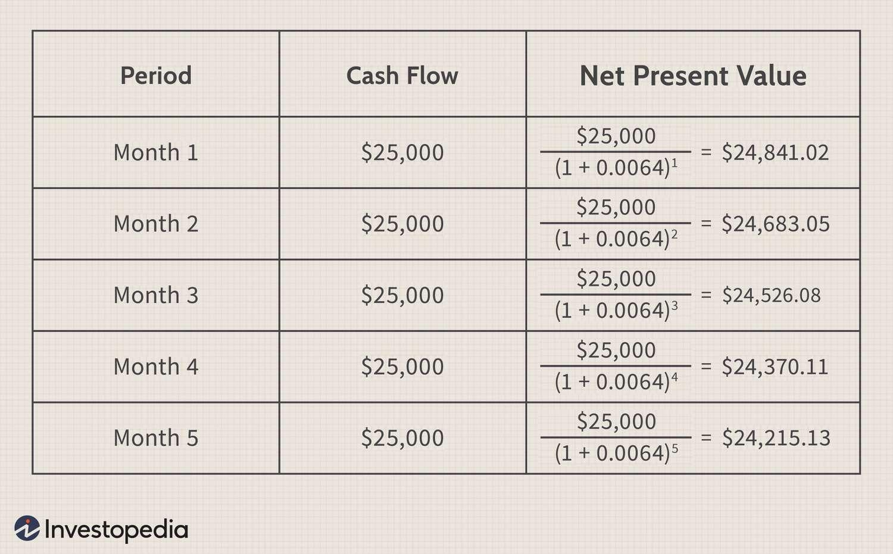

Economic analysis relies heavily on understanding broad money, money supply, and algorithmic trading. Broad money is a critical measure of an economy's liquidity, encompassing the entire money supply, which includes both physical and electronic currencies as well as other near-money assets. It serves as a crucial indicator of potential inflationary pressures and overall economic health. Monitoring changes in broad money can help in predicting inflationary trends and provides valuable insights into the availability of financial resources in the economy.

Algorithmic trading plays a pivotal role in modern financial markets by leveraging technology to automate trading strategies, making decisions based on a set of pre-defined criteria. These algorithms exploit economic indicators such as broad money to make precise and timely trading decisions. By analyzing economic data, algorithmic trading systems can forecast market conditions and execute trades with greater efficiency and accuracy.



This article examines how broad money, money supply, and algorithmic trading intersect in the context of modern financial markets, highlighting their relevance and application. By exploring these relationships, we aim to provide a comprehensive understanding of how these concepts influence trading strategies and economic outcomes. Understanding these dynamics is essential for traders and policymakers who aim to navigate the complexities of today's financial landscape effectively.

## Table of Contents

## Understanding Economic Indicators: Broad Money

Broad money represents a comprehensive aggregation of all liquid assets within an economy. This incorporates narrow money, which includes cash and checkable deposits, along with other less immediately liquid forms such as savings deposits, money market securities, mutual funds, and time deposits. Broad money serves as a crucial indicator of the overall money supply within an economy, offering vital insights into the economic health and potential inflationary pressures that may arise.

Central banks and policymakers closely monitor shifts in broad money, as alterations can significantly impact their capacity to craft targeted monetary policies. These policies often aim to stabilize the economy by controlling inflation rates, regulating employment levels, and influencing interest rates. As broad money grows, it may signal increased liquidity within the economy, often spurring higher spending and potential inflationary pressures. Conversely, a contraction in broad money might indicate reduced liquidity, leading to slower economic growth and potential deflation.

For example, central banks may use open market operations to influence broad money levels by buying or selling government securities. Such actions can adjust the amount of reserve money in the banking system, thereby impacting the lending capacity of banks and ultimately altering the broad money supply. This dynamic interaction is vital for ensuring economic stability, making an understanding of broad money indispensable for those engaged in economic analysis and for entities involved in financial markets.

## Components and Calculation of Broad Money

Broad money is a comprehensive measure of a country's money supply, encompassing both narrow money (cash and checkable deposits) and less liquid financial assets such as savings accounts, money market funds, and certain securities. The term "narrow money" typically refers to the most liquid forms of money, including currency in circulation and demand deposits in the banking system. Broad money, therefore, extends this definition to include assets that, while not immediately accessible for transaction purposes, can be easily converted into cash or checking deposits.

Calculating broad money is a nuanced process that varies across countries and is often expressed in terms of aggregates like M2 and M3. The M2 measure includes M1 (currency and demand deposits) as well as savings deposits, small-denomination time deposits, and retail money market mutual funds. M3 extends M2 by including larger, less liquid financial instruments such as large time deposits, institutional money market funds, and other larger liquid assets.

In many economies, the formula representing the broad money can be expressed as:

$$
\text{Broad Money (M3)} = \text{M1} + \text{Small Time and Savings Deposits} + \text{Large Time Deposits and Other Liquid Assets}
$$

This calculation aids in tracking the overall [liquidity](/wiki/liquidity-risk-premium) available within an economy and plays a significant role in shaping monetary policy and economic forecasts. By assessing the changes in broad money, central banks and policymakers can gain insights into the potential expansionary or contractionary trends in the economy. Consequently, these insights inform decisions regarding [interest rate](/wiki/interest-rate-trading-strategies) adjustments, aiming to either stimulate or cool down economic activity according to prevailing conditions.

The differences in broad money calculations across countries might reflect variations in the structure of their banking systems, financial market development, and regulatory environments. Despite these variations, the core intent remains the same: to provide a comprehensive overview of the money available in the national economy, influencing policymakers and investors alike. 

For investors and financial analysts, understanding broad money is essential as it signals macroeconomic trends, assisting in making informed decisions regarding investment and risk management.

## Algorithmic Trading and Money Supply Indicators

Algorithmic trading employs sophisticated algorithms to execute trades based on predetermined strategies, leveraging speed and precision unattainable by human traders. By using algorithms, traders can swiftly analyze vast amounts of data and execute trades efficiently according to the conditions programmed into the system.

One of the critical inputs for these algorithms is economic indicators, such as broad money, which provide valuable insights into the economic climate. Broad money, as a measure of the economy’s total supply of liquid assets, can influence market dynamics and [volatility](/wiki/volatility-trading-strategies), making it a significant [factor](/wiki/factor-investing) in [algorithmic trading](/wiki/algorithmic-trading) strategies. When changes in the money supply are detected, these can inform algorithms to adjust positions accordingly, signaling potential buy or sell actions.

An important strategy in algorithmic trading involves monitoring fluctuations in the money supply to predict macroeconomic trends. For instance, if an increase in broad money supply is observed, it could signal potential inflationary pressures. This information can be programmed into trading algorithms to initiate trades in assets that typically rise during inflationary periods, such as commodities or inflation-linked bonds. Conversely, a contraction in the money supply might prompt algorithms to shift focus towards risk-off assets like government bonds.

Moreover, algorithmic trading systems can use Python or other programming languages to implement these strategies. For example, a basic pseudocode snippet to integrate broad money data might look like this:

```python
def analyze_money_supply(current_data, threshold):
    if current_data > threshold:
        return "Buy inflation-protected assets"
    elif current_data < threshold:
        return "Buy defensive assets"
    else:
        return "Hold current positions"

# Example usage
broad_money_data = get_broad_money_data() # Hypothetical function to retrieve data
decision = analyze_money_supply(broad_money_data['M2'], threshold=5.0)
execute_trade(decision)
```

This simplistic example illustrates how traders can incorporate economic indicators like broad money into their algorithmic strategies, using real-time data to optimize trading decisions and achieve more timely market entries and exits. Through such strategies, traders aim to enhance the profitability and responsiveness of their trading approaches amidst various economic conditions.

## Technical Indicators and Algorithmic Trading

Technical indicators are indispensable tools within algorithmic trading, offering the ability to gauge market conditions through trend and [momentum](/wiki/momentum) insights. Among the most widely used indicators are Moving Averages, the Relative Strength Index (RSI), and the Moving Average Convergence Divergence (MACD). These indicators facilitate automated decision-making, enabling traders to execute trades with speed and precision.

**Moving Averages** serve as a foundational tool, smoothing out price data by creating a constantly updated average price. This is useful for identifying the direction of the trend. The Simple Moving Average (SMA) and the Exponential Moving Average (EMA) are the two most common types. The difference lies in their calculation: 

- SMA is the arithmetic mean of a given set of prices over a specified number of periods.  
$$
  SMA = \frac{P_1 + P_2 + \cdots + P_n}{n}

$$
  where $P$ is the price at each time period and $n$ is the number of periods.

- EMA gives more weight to recent prices, making it more responsive to new information. It’s calculated using the formula:
$$
  EMA_t = \left(P_t \times \frac{2}{1 + n}\right) + EMA_{t-1} \times \left(1 - \frac{2}{1 + n}\right)

$$
  where $P_t$ is the price at time $t$, and $n$ is the number of periods.

**Relative Strength Index (RSI)** is a momentum oscillator that measures the speed and change of price movements. It ranges from 0 to 100 and is typically used to identify overbought or oversold conditions. An RSI above 70 suggests that an asset might be overbought, while an RSI below 30 indicates it might be oversold. The basic formula is:
$$
RSI = 100 - \left(\frac{100}{1 + RS}\right)
$$
where $RS$ is the average of $n$ periods' up closes divided by the average of $n$ periods' down closes.

**MACD** is a trend-following momentum indicator that shows the relationship between two moving averages of an asset’s price. It consists of the MACD line, the signal line, and the histogram. The general formula is:
$$
MACD = EMA_{fast} - EMA_{slow}
$$
This is typically a 12-day EMA minus a 26-day EMA.

Combining these technical indicators with economic data such as broad money enhances the robustness and data-driven foundation of trading algorithms. By integrating such macroeconomic conditions, algorithmic trading systems can refine their predictive capabilities, enabling traders to make more informed decisions based on the comprehensive analysis of both market patterns and underlying economic fundamentals. For example, changes in broad money supply could adjust the sensitivity of these indicators, creating dynamic trading strategies that adapt to economic signals. Python, widely used in algorithmic trading, allows seamless integration of these indicators and economic data:

```python
import pandas as pd
import numpy as np

# Example function to calculate EMA
def calculate_ema(prices, period):
    return prices.ewm(span=period, adjust=False).mean()

# Example function to calculate RSI
def calculate_rsi(prices, period=14):
    delta = prices.diff()
    gain = (delta.where(delta > 0, 0)).rolling(window=period).mean()
    loss = (-delta.where(delta < 0, 0)).rolling(window=period).mean()
    rs = gain / loss
    return 100 - (100 / (1 + rs))

# Assume 'data' is a DataFrame with price data
data['EMA12'] = calculate_ema(data['Close'], 12)
data['EMA26'] = calculate_ema(data['Close'], 26)
data['RSI'] = calculate_rsi(data['Close'])
```

By automating these calculations, traders can swiftly react to market shifts, aligning algorithmic trading strategies with real-time economic insights, thereby ensuring an agile and informed approach to financial markets.

## The Benefits of Monitoring Broad Money for Traders

Understanding broad money is crucial for traders seeking to anticipate economic changes and optimize their market strategies. Broad money comprises all liquid financial assets, offering an extensive view of an economy's liquidity that directly affects various market factors, including inflation and asset pricing.

Economic shifts often reflect changes in broad money, making it an important signal of potential inflationary or deflationary trends. When broad money increases significantly, it may indicate an inflationary environment, where too much liquidity could lead to rising prices and a decrease in currency value. Conversely, a contraction in broad money could signal deflationary pressures, suggesting decreased liquidity and potential price declines across markets. Traders incorporate these signals to adapt their strategies, making informed decisions on when to enter or [exit](/wiki/exit-strategy) markets.

By combining broad money analysis with algorithmic trading, traders can significantly enhance their effectiveness and profitability. Algorithmic trading involves using computer-driven systems to execute trades based on predefined conditions. These systems analyze vast amounts of data rapidly, allowing traders to act swiftly on market opportunities. For instance, a trading algorithm might use changes in broad money metrics like M2 or M3 as a triggering condition for executing trades. When a specific pattern or threshold is identified—such as an increase in M2 growth—algorithms can trigger buy signals in sectors historically sensitive to inflation, like commodities or real estate.

This integration of broad money insights ensures that traders remain agile and responsive. The automation and precision of algorithmic trading complement the macroeconomic perspective provided by broad money metrics, resulting in more robust trading models. Such strategies not only support timely market entries and exits but also offer a competitive edge in identifying and exploiting market trends long before they become apparent to less data-driven trading approaches.

Ultimately, monitoring broad money equips traders with a deeper understanding of economic indicators, enabling them to make strategic decisions. This sophisticated approach underscores the importance of broad money in modern trading environments, where the ability to anticipate and respond to economic trends can significantly affect trading outcomes.

## Practical Example: Broad Money and Algorithmic Trading

A practical application of broad money insights in algorithmic trading can be illustrated through a trading algorithm that uses the M2 money supply as a benchmark for trade initiation in currency markets. M2 is widely recognized as a measure of money supply which includes not only cash but also savings deposits, money market securities, and other time deposits. By analyzing the growth rates of M2, traders can gain insights into potential inflationary or deflationary trends in the economy.

In implementing such a strategy, a specific threshold of M2 growth is set. When this threshold is exceeded, it triggers a buy signal for inflation-hedged assets within the algorithm. These assets might include commodities, real estate, or certain types of bonds, which traditionally perform well during inflationary periods.

Here is an example of how this can be structured using Python:

```python
import pandas as pd

# Data: Historical M2 growth rates and asset pricing
m2_growth_data = pd.read_csv('m2_growth_data.csv')
asset_data = pd.read_csv('asset_data.csv')

# Parameters: Define M2 growth threshold
M2_THRESHOLD = 0.05  # Example threshold of 5% growth

# Trading signal function
def generate_trading_signal(m2_growth):
    return m2_growth > M2_THRESHOLD

# Evaluate trading signals based on historical data
trading_signals = m2_growth_data['growth_rate'].apply(generate_trading_signal)
asset_data['buy_signal'] = trading_signals

print(asset_data[asset_data['buy_signal'] == True])
```

In this example, the trading algorithm reads historical M2 growth data and asset pricing data. A threshold (e.g., 5% growth) is set to indicate when M2 growth is robust enough to predict inflation. When actual growth rates exceed this threshold, the algorithm generates a buy signal for selected assets.

This strategy effectively combines macroeconomic insights with automated trading, illustrating how algorithmic systems can adapt to broad money indicators. By integrating such economic indicators into their algorithms, traders can better align their strategies with underlying economic conditions, potentially enhancing trading outcomes and profitability.

## Conclusion

Broad money, encompassing various forms of liquid assets, acts as a crucial economic indicator that provides significant insights into an economy’s liquidity and overall economic climate. Its monitoring helps gauge potential inflationary or deflationary trends, which central banks and policymakers frequently use to adjust monetary policies. For traders, understanding broad money can be particularly beneficial, especially within the context of algorithmic trading strategies. 

Algorithmic trading systems, which rely on computer-generated algorithms, can leverage changes in broad money supply to optimize trading decisions. By analyzing fluctuations in broad money, these systems can formulate predictions about macroeconomic conditions. This data-driven approach supports strategic market entry and exit decisions, aligning with economic developments and enhancing profitability.

As financial markets continue to evolve, integrating economic indicators such as broad money with advanced technological tools like algorithmic trading heralds a transformative era for strategic market engagement. This integration allows for more informed decision-making tailored to the complex dynamics of modern financial environments, ultimately supporting traders in achieving more consistent and informed trading outcomes.

## References & Further Reading

[1]: ["The Money Supply in the Macroeconomy: Conceptual and Empirical Issues"](https://www.semanticscholar.org/paper/The-money-supply-in-macroeconomics-Howells/4cefea936654196ab09389abd90638d15db608c9) by J. Pollex (Journal of Economic Literature, 1994)

[2]: ["Modern Monetary Theory and Practice: An Introductory Text"](https://resources.caih.jhu.edu/textbooks/virtual-library/filedownload.ashx/Modern_Monetary_Theory_And_Practice_An_Introductory_Text.pdf) by William Mitchell et al.

[3]: ["Advances in Financial Machine Learning"](https://www.amazon.com/Advances-Financial-Machine-Learning-Marcos/dp/1119482089) by Marcos Lopez de Prado

[4]: ["Evidence-Based Technical Analysis: Applying the Scientific Method and Statistical Inference to Trading Signals"](https://www.amazon.com/Evidence-Based-Technical-Analysis-Scientific-Statistical/dp/0470008741) by David Aronson

[5]: ["Algorithmic Trading: Winning Strategies and Their Rationale"](https://www.wiley.com/en-us/Algorithmic+Trading%3A+Winning+Strategies+and+Their+Rationale-p-9781118460146) by Ernest P. Chan

[6]: ["The Oxford Handbook of Banking"](https://academic.oup.com/edited-volume/34288) edited by Allen N. Berger, Philip Molyneux, and John O.S. Wilson