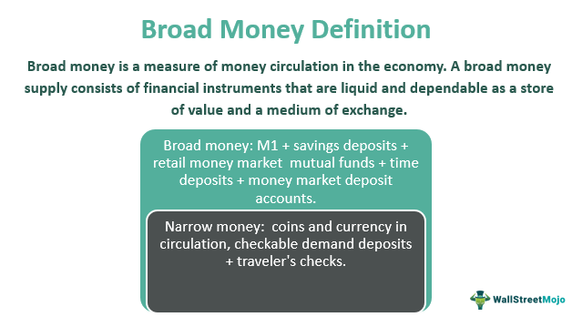

## Table of Contents

## What is broad money?

Broad money is a way to measure the total amount of money in an economy. It includes not just the cash and coins that people have, but also other types of money that can be easily used to buy things. This includes money in bank accounts that you can take out anytime, like savings and checking accounts, and other kinds of deposits.

Economists use broad money to understand how much money is circulating and how people are using it. It helps them see if people are saving more or spending more. Broad money is important because it can affect things like inflation and interest rates. When there's more broad money, prices might go up, and when there's less, prices might go down.

## How is broad money different from narrow money?

Narrow money is a smaller part of all the money in an economy. It's mostly the cash and coins that people carry around and the money in bank accounts that you can use right away, like in your checking account. Narrow money is what people use for everyday buying and spending. It's easy to get and use, so it's important for keeping the economy moving every day.

Broad money, on the other hand, includes narrow money but also adds other kinds of money that aren't as easy to spend right away. This can include money in savings accounts, money market funds, and other types of deposits that might take a bit more time to turn into cash. Broad money gives a bigger picture of all the money available in the economy, showing not just what people are spending now, but also what they might spend in the future. It helps economists understand the overall health and direction of the economy.

## What components are included in the calculation of broad money?

Broad money includes many different kinds of money that people can use or save. It starts with all the cash and coins that people [carry](/wiki/carry-trading) around, as well as the money in checking accounts that you can use right away. This part is called narrow money and it's the money people use for everyday spending. But broad money goes beyond this to include other types of money that aren't as easy to spend immediately.

In addition to narrow money, broad money includes money in savings accounts, which you can take out but might take a little time. It also covers money in money market funds, which are like savings accounts but can sometimes offer higher interest rates. Certificates of deposit, which are savings accounts that you agree to keep your money in for a certain time, are part of broad money too. All these different types of money together help show how much money is available in the whole economy, not just what's being used right now.

## Can you provide a simple example of how broad money is calculated?

Imagine you have $100 in your pocket, $500 in your checking account, and $1,000 in your savings account. The $100 in your pocket and the $500 in your checking account are part of narrow money because you can use them right away to buy things. Narrow money is like the money you use for everyday spending.

But broad money includes more than just narrow money. It also counts the $1,000 in your savings account. So, to calculate broad money, you add up all these amounts: $100 (cash) + $500 (checking account) + $1,000 (savings account) = $1,600. Broad money gives a bigger picture of all the money you have, including what you might use later.

## What role does broad money play in the economy?

Broad money is important because it helps show how much money is moving around in the economy. It includes all the money people can use right away, like cash and checking accounts, and also the money they might use later, like savings accounts. By looking at broad money, economists can understand if people are saving more or spending more. This helps them see how the economy is doing and what might happen next.

When there's more broad money, it can mean that people have more money to spend, which can make prices go up. This is called inflation. On the other hand, if there's less broad money, people might not have as much to spend, and prices could go down. So, broad money is a big part of how the economy works, affecting things like interest rates and how much things cost.

## How do central banks use broad money as an economic indicator?

Central banks watch broad money closely because it helps them understand how the economy is doing. Broad money includes all the money people can use right away, like cash and checking accounts, and also money they might use later, like savings accounts. By looking at broad money, central banks can see if people are saving more or spending more. This tells them if the economy is growing or slowing down.

When central banks see that broad money is growing quickly, it might mean that people have more money to spend. This can lead to higher prices, or inflation. If broad money is growing slowly or shrinking, it might mean that people are saving more and spending less, which can lead to lower prices. Central banks use this information to decide if they should change interest rates or take other actions to help keep the economy stable.

## What are the benefits of monitoring broad money for policymakers?

Monitoring broad money helps policymakers understand how much money is moving around in the economy. It includes money people can use right away, like cash and checking accounts, and also money they might use later, like savings accounts. By watching broad money, policymakers can see if people are saving more or spending more. This tells them if the economy is growing or slowing down.

When broad money grows quickly, it can mean that people have more money to spend, which might lead to higher prices, or inflation. If broad money grows slowly or shrinks, it might mean people are saving more and spending less, which can lead to lower prices. Policymakers use this information to decide if they should change interest rates or take other actions to help keep the economy stable. By keeping an eye on broad money, they can make better decisions to help the economy stay healthy.

## How does the concept of broad money vary across different countries?

The concept of broad money can be different in different countries because each country has its own way of measuring money. In some places, broad money might include only cash, checking accounts, and savings accounts. In other countries, it might also include money market funds, certificates of deposit, and other types of savings that take a bit longer to turn into cash. Each country's central bank decides what counts as broad money based on what's important for their economy.

For example, in the United States, broad money is measured using something called M2, which includes cash, checking accounts, savings accounts, and money market funds. In the United Kingdom, broad money is measured using M4, which includes all of M2 plus other types of deposits that businesses and people might have. These differences show how each country looks at its own economy and decides what kinds of money to include when they talk about broad money.

## What are the limitations or criticisms of using broad money as an economic measure?

One problem with using broad money to understand the economy is that it can be hard to measure accurately. Different countries count different things as part of broad money, so comparing one country to another can be tricky. Also, broad money includes money that people might not spend right away, like savings accounts. This means that even if broad money goes up, it doesn't always mean people will spend more right away, which can make it hard to predict what will happen in the economy.

Another criticism is that broad money might not tell the whole story about the economy. For example, if people are borrowing a lot of money, broad money might look like it's growing, but this could lead to problems if people can't pay back their loans. Also, broad money doesn't show how money is spread out among different people. If rich people are saving more but poor people are spending less, broad money might not show that the economy is in trouble. So, while broad money is useful, it's important to look at other things too to get a full picture of the economy.

## How has the definition of broad money evolved over time?

The idea of broad money has changed a lot over time as people and economies have changed. In the past, broad money mostly meant cash, coins, and money in bank accounts that you could use right away. But as banks and other ways to save and spend money grew, the definition of broad money got bigger. Now, it includes money in savings accounts, money market funds, and other kinds of savings that might take a little time to turn into cash. This change happened because economists wanted a better way to see all the money that people could use, not just the money they were spending right away.

Over the years, different countries have also started to measure broad money in their own ways. For example, in the United States, they use something called M2 to measure broad money, which includes cash, checking accounts, savings accounts, and money market funds. But in other places, like the United Kingdom, they use M4, which includes all of M2 plus other types of deposits. These changes show how each country looks at its own economy and decides what kinds of money to count as broad money. As the world keeps changing, the way we think about and measure broad money will probably keep changing too.

## What advanced metrics or models are used to analyze broad money data?

Economists use different tools to look at broad money data and understand what it means for the economy. One tool is called econometric models. These models use math to find patterns in broad money and see how it affects things like inflation and interest rates. They help economists guess what might happen in the future based on what's happening with broad money right now. Another tool is called vector autoregression (VAR) models. These models look at how different parts of the economy, like broad money, work together over time. They can show how changes in broad money might lead to changes in other parts of the economy.

Another important tool is the money multiplier model. This model helps economists understand how much money banks can create from the money they have. It's important because it shows how changes in broad money can affect how much money is available for people to spend. There are also newer ways to analyze broad money data, like using [machine learning](/wiki/machine-learning). Machine learning can find patterns in big sets of data that might be hard for people to see. It can help economists predict what might happen with broad money and the economy more accurately.

## How can understanding broad money help in predicting economic trends?

Understanding broad money can help economists predict what might happen in the economy. Broad money includes all the money people can use right away, like cash and checking accounts, and also money they might use later, like savings accounts. When broad money grows quickly, it can mean that people have more money to spend. This might lead to higher prices, or inflation. On the other hand, if broad money grows slowly or shrinks, it might mean that people are saving more and spending less, which can lead to lower prices. By watching how broad money changes, economists can make guesses about whether the economy will grow or slow down.

Economists use different tools to look at broad money data and understand what it means for the economy. For example, they might use math models to find patterns in broad money and see how it affects things like inflation and interest rates. These models help economists predict what might happen in the future based on what's happening with broad money right now. By understanding broad money, policymakers can make better decisions to help keep the economy stable. For instance, if they see that broad money is growing too quickly and might cause inflation, they might raise interest rates to slow things down.

## What are the components and how is the calculation done for Broad Money?

Broad money is a comprehensive measure of a country's money supply, encompassing both narrow money (cash and checkable deposits) and less liquid financial assets such as savings accounts, money market funds, and certain securities. The term "narrow money" typically refers to the most liquid forms of money, including currency in circulation and demand deposits in the banking system. Broad money, therefore, extends this definition to include assets that, while not immediately accessible for transaction purposes, can be easily converted into cash or checking deposits.

Calculating broad money is a nuanced process that varies across countries and is often expressed in terms of aggregates like M2 and M3. The M2 measure includes M1 (currency and demand deposits) as well as savings deposits, small-denomination time deposits, and retail money market mutual funds. M3 extends M2 by including larger, less liquid financial instruments such as large time deposits, institutional money market funds, and other larger liquid assets.

In many economies, the formula representing the broad money can be expressed as:

$$
\text{Broad Money (M3)} = \text{M1} + \text{Small Time and Savings Deposits} + \text{Large Time Deposits and Other Liquid Assets}
$$

This calculation aids in tracking the overall [liquidity](/wiki/liquidity-risk-premium) available within an economy and plays a significant role in shaping monetary policy and economic forecasts. By assessing the changes in broad money, central banks and policymakers can gain insights into the potential expansionary or contractionary trends in the economy. Consequently, these insights inform decisions regarding [interest rate](/wiki/interest-rate-trading-strategies) adjustments, aiming to either stimulate or cool down economic activity according to prevailing conditions.

The differences in broad money calculations across countries might reflect variations in the structure of their banking systems, financial market development, and regulatory environments. Despite these variations, the core intent remains the same: to provide a comprehensive overview of the money available in the national economy, influencing policymakers and investors alike. 

For investors and financial analysts, understanding broad money is essential as it signals macroeconomic trends, assisting in making informed decisions regarding investment and risk management.

## What are Technical Indicators and how are they used in Algorithmic Trading?

Technical indicators are indispensable tools within [algorithmic trading](/wiki/algorithmic-trading), offering the ability to gauge market conditions through trend and [momentum](/wiki/momentum) insights. Among the most widely used indicators are Moving Averages, the Relative Strength Index (RSI), and the Moving Average Convergence Divergence (MACD). These indicators facilitate automated decision-making, enabling traders to execute trades with speed and precision.

**Moving Averages** serve as a foundational tool, smoothing out price data by creating a constantly updated average price. This is useful for identifying the direction of the trend. The Simple Moving Average (SMA) and the Exponential Moving Average (EMA) are the two most common types. The difference lies in their calculation: 

- SMA is the arithmetic mean of a given set of prices over a specified number of periods.  
$$
  SMA = \frac{P_1 + P_2 + \cdots + P_n}{n}

$$
  where $P$ is the price at each time period and $n$ is the number of periods.

- EMA gives more weight to recent prices, making it more responsive to new information. It’s calculated using the formula:
$$
  EMA_t = \left(P_t \times \frac{2}{1 + n}\right) + EMA_{t-1} \times \left(1 - \frac{2}{1 + n}\right)

$$
  where $P_t$ is the price at time $t$, and $n$ is the number of periods.

**Relative Strength Index (RSI)** is a momentum oscillator that measures the speed and change of price movements. It ranges from 0 to 100 and is typically used to identify overbought or oversold conditions. An RSI above 70 suggests that an asset might be overbought, while an RSI below 30 indicates it might be oversold. The basic formula is:
$$
RSI = 100 - \left(\frac{100}{1 + RS}\right)
$$
where $RS$ is the average of $n$ periods' up closes divided by the average of $n$ periods' down closes.

**MACD** is a trend-following momentum indicator that shows the relationship between two moving averages of an asset’s price. It consists of the MACD line, the signal line, and the histogram. The general formula is:
$$
MACD = EMA_{fast} - EMA_{slow}
$$
This is typically a 12-day EMA minus a 26-day EMA.

Combining these technical indicators with economic data such as broad money enhances the robustness and data-driven foundation of trading algorithms. By integrating such macroeconomic conditions, algorithmic trading systems can refine their predictive capabilities, enabling traders to make more informed decisions based on the comprehensive analysis of both market patterns and underlying economic fundamentals. For example, changes in broad money supply could adjust the sensitivity of these indicators, creating dynamic trading strategies that adapt to economic signals. Python, widely used in algorithmic trading, allows seamless integration of these indicators and economic data:

```python
import pandas as pd
import numpy as np

# Example function to calculate EMA
def calculate_ema(prices, period):
    return prices.ewm(span=period, adjust=False).mean()

# Example function to calculate RSI
def calculate_rsi(prices, period=14):
    delta = prices.diff()
    gain = (delta.where(delta > 0, 0)).rolling(window=period).mean()
    loss = (-delta.where(delta < 0, 0)).rolling(window=period).mean()
    rs = gain / loss
    return 100 - (100 / (1 + rs))

# Assume 'data' is a DataFrame with price data
data['EMA12'] = calculate_ema(data['Close'], 12)
data['EMA26'] = calculate_ema(data['Close'], 26)
data['RSI'] = calculate_rsi(data['Close'])
```

By automating these calculations, traders can swiftly react to market shifts, aligning algorithmic trading strategies with real-time economic insights, thereby ensuring an agile and informed approach to financial markets.

## References & Further Reading

[1]: ["The Money Supply in the Macroeconomy: Conceptual and Empirical Issues"](https://www.semanticscholar.org/paper/The-money-supply-in-macroeconomics-Howells/4cefea936654196ab09389abd90638d15db608c9) by J. Pollex (Journal of Economic Literature, 1994)

[2]: ["Modern Monetary Theory and Practice: An Introductory Text"](https://resources.caih.jhu.edu/textbooks/virtual-library/filedownload.ashx/Modern_Monetary_Theory_And_Practice_An_Introductory_Text.pdf) by William Mitchell et al.

[3]: ["Advances in Financial Machine Learning"](https://www.amazon.com/Advances-Financial-Machine-Learning-Marcos/dp/1119482089) by Marcos Lopez de Prado

[4]: ["Evidence-Based Technical Analysis: Applying the Scientific Method and Statistical Inference to Trading Signals"](https://www.amazon.com/Evidence-Based-Technical-Analysis-Scientific-Statistical/dp/0470008741) by David Aronson

[5]: ["Algorithmic Trading: Winning Strategies and Their Rationale"](https://www.wiley.com/en-us/Algorithmic+Trading%3A+Winning+Strategies+and+Their+Rationale-p-9781118460146) by Ernest P. Chan

[6]: ["The Oxford Handbook of Banking"](https://academic.oup.com/edited-volume/34288) edited by Allen N. Berger, Philip Molyneux, and John O.S. Wilson