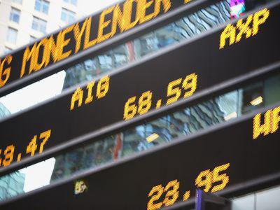

The stock market has long been a dynamic arena of financial activity, with technology increasingly influencing its operations and efficiency. The ever-evolving landscape of financial markets has brought forth sophisticated tools and strategies, such as the broad tape financial ticker and algorithmic trading, essential for modern trading environments. This article examines these concepts and their significance in today’s financial systems.

The concept of the broad tape has transformed from its historical roots, where information was conveyed via physical ticker tape, into a digital stream of continuous, real-time market data. This technology plays a critical role in delivering comprehensive financial news and updates to investors and traders, enabling them to make informed decisions swiftly. As financial data becomes more accessible and immediate, the relevance of digital tickers in providing a competitive edge grows.



Algorithmic trading has emerged as a pivotal aspect of contemporary trading frameworks, automating market transactions through sophisticated algorithms that adhere to predefined criteria and rules. By leveraging real-time data, algorithmic trading enhances the precision and speed of trade execution, often outperforming manual operations. This strategy not only exemplifies technological progress in trading but also necessitates an understanding of data integration and seamless market interactions.

Together, the digital evolution of the broad tape and the rise of algorithmic trading underscore technology's profound impact on the stock market. Mastery of these tools and technologies is crucial for investors and traders aiming to enhance their strategic capabilities. As these concepts become increasingly integrated into trading practices, they will continue to redefine the landscape of financial markets, offering new opportunities and challenges for market participants.

## Table of Contents

## What is Broad Tape?

Historically, the broad tape was an essential tool in the financial industry, referring to the printed ticker tape that displayed stock prices and financial news. These ticker tapes were used by brokerage firms and investors to receive updates on stock prices from the trading floor of stock exchanges. Information was transmitted via telegraph to ticker tape machines, which printed abbreviated company names followed by numeric data indicating the stock price and [volume](/wiki/volume-trading-strategy). This provided investors with a near real-time snapshot of market activities and helped them make informed decisions.

In contemporary financial markets, the broad tape has evolved from its mechanical origins into a digital format. Today, it provides a continuous real-time stream of market data accessible through various electronic platforms, including trading terminals, online services, and mobile applications. This digitization not only enhances the speed of data dissemination but also increases the volume and types of data available, including comprehensive quotes, bid/ask spreads, and transaction volumes. This transformation allows for a greater depth of analysis and the ability to make quicker and more informed financial decisions.

The digital broad tape serves as a crucial channel for delivering comprehensive financial news to investors. It integrates various types of market data ranging from equities, commodities, to foreign exchange and derivatives. As a tool, it empowers investors by providing up-to-the-minute information needed to track the ever-fluctuating dynamics of financial markets. In turn, this access to timely data supports more sophisticated financial strategies and enables investors to react promptly to market developments. The modern broad tape's capability of offering a broad spectrum of granular information spells the end of the trading day as a fixed point for decision-making, turning financial markets into an ever-evolving landscape navigable in real time.

## Evolution of the Financial Ticker

The financial ticker has undergone a remarkable transformation since its inception, reflecting significant technological advancements. Originally, ticker machines were a groundbreaking technology that linked investors to Wall Street by providing printed tape containing stock prices and trade information. This early system allowed investors to stay updated with the market's pulse, albeit with certain delays inherent to the mechanical process.

The ticker tape mechanism, initially developed in the late 19th century, utilized telegraph systems to transmit financial information over long distances. This innovation allowed brokerage houses and trading floors to receive stock market data almost as quickly as it was being reported. The word "ticker" comes from the sound the machines made as they printed stock symbols and numeric data onto a narrow tape of paper. The printed output provided a continuous stream of information, albeit constrained by the limitations of mechanical and telegraphic technology. 

With the dawn of electronic trading and the internet, financial tickers have evolved dramatically. Today, electronic tickers efficiently provide live-streamed data directly through digital platforms, such as financial news websites, stock trading applications, and custom trading terminals. These digital tickers showcase real-time updates, allowing investors to react and make decisions almost instantaneously as market conditions change. 

The shift from mechanical tickers to digital displays underscores a significant leap in the speed and accessibility of financial information dissemination. Modern investors benefit from immediate access to a comprehensive array of data, including stock prices, trade volumes, market indices, and economic indicators. This real-time data feed supports more informed trading decisions and aligns with the demands of a faster-paced market environment.

The electronic transmission of financial data also facilitates automated trading systems, which rely heavily on timely and accurate information. Digital tickers integrate seamlessly with [algorithmic trading](/wiki/algorithmic-trading) strategies, enabling precise execution based on up-to-the-minute data.

Overall, the evolution of the financial ticker from printed tape to electronic displays marks a substantial advancement in financial technology. This progression has improved the efficiency and effectiveness of market participants' ability to access and analyze market data, ensuring a more dynamic and responsive trading landscape.

## Algorithmic Trading: A Modern Approach

Algorithmic trading represents a significant shift in how trades are executed in the stock market. It involves the use of computer algorithms to automate trading processes based on predefined rules and strategies. These algorithms analyze and assess trading opportunities utilizing various financial indicators, historical data, and real-time market data. The main advantage of algorithmic trading lies in its ability to execute trades at speeds and frequencies impractical for human traders, thus enhancing trading efficiency and precision.

In essence, algorithmic trading leverages real-time data to make instantaneous decisions that align with the trader’s strategic goals. For instance, consider a moving average crossover strategy. When the short-term moving average surpasses the long-term moving average, an algorithm might signal a buy order. Conversely, a crossover in the opposite direction could trigger a sell order. Using Python, such a strategy can be implemented as follows:

```python
import pandas as pd

# Sample data of stock prices
data = {'price': [101, 102, 103, 105, 106, 107, 104, 103, 102]}
df = pd.DataFrame(data)

# Calculate short-term and long-term moving averages
short_window = 2
long_window = 5
df['short_mavg'] = df['price'].rolling(window=short_window, min_periods=1).mean()
df['long_mavg'] = df['price'].rolling(window=long_window, min_periods=1).mean()

# Generate signals
df['signal'] = 0
df['signal'][short_window:] = np.where(df['short_mavg'][short_window:] > df['long_mavg'][short_window:], 1, -1)

print(df)
```

The rapid progression of technology has exponentially increased the role of algorithms in trading, attributing to faster trade execution and heightened efficiency. With the ability to process vast amounts of data at lightning speed, algorithmic trading reduces the unpredictability of human error and provides a more systematic approach to trading.

Furthermore, the rise of high-frequency trading ([HFT](/wiki/high-frequency-trading-strategies)), a subset of algorithmic trading, is testament to the efficiency gains offered by algorithms. HFT firms use sophisticated technology to conduct trades within microseconds, benefiting from tiny price margins that would be unprofitable for slower trades.

However, the effectiveness of these algorithms is heavily reliant on the quality and accuracy of the data they process. Real-time data facilitates immediate market reactions, enabling strategies to capitalize on minute fluctuations that could affect trade profitability. Continuous advancements in computational power and data processing capabilities have only amplified this capability.

Overall, algorithmic trading has transformed the traditional trading landscape, paving the way for more innovative and efficient financial markets. It allows for precision trading, minimizes latency, and offers the potential for maximizing returns while mitigating risks.

## Integrating Ticker Data in Algorithmic Trading

Continual real-time ticker data is essential in implementing effective algorithmic trading strategies. This constant stream of market data, including stock prices, trading volumes, and market indices, allows algorithms to analyze and react to market conditions almost instantaneously. By processing this information efficiently, algorithmic trading systems can make timely market reactions and informed strategic decisions.

Integrating ticker data into algorithmic trading involves leveraging sophisticated algorithms that can process vast amounts of data and identify patterns or trends that may indicate favorable trading opportunities. For example, algorithms can use statistical methods such as moving averages or [machine learning](/wiki/machine-learning) techniques to forecast price movements and execute trades precisely when certain conditions are met.

One typical approach is the utilization of quantitative models that allow for real-time decision-making. These models may include predictive analytics and pattern recognition, which evaluate the incoming stream of ticker data to predict short-term market fluctuations. Consider a simple moving average crossover strategy, which can be implemented with Python as follows:

```python
import pandas as pd

# Sample market data
data = pd.read_csv('market_data.csv')
data['Short_MA'] = data['Price'].rolling(window=5).mean()
data['Long_MA'] = data['Price'].rolling(window=20).mean()

# Generate signals
data['Signal'] = 0  
data['Signal'][5:] = np.where(data['Short_MA'][5:] > data['Long_MA'][5:], 1, -1)

# Execute trades based on generated signals
buy_signals = data[data['Signal'] == 1]['Price']
sell_signals = data[data['Signal'] == -1]['Price']
```

This code computes short-term and long-term moving averages and generates buy or sell signals based on the crossover strategy. It demonstrates how real-time data can be incorporated into an algorithm that reacts to changing market conditions.

The integration of ticker data in algorithmic trading is fundamental for executing complex trading strategies. These strategies can include [arbitrage](/wiki/arbitrage), [market making](/wiki/market-making), and [trend following](/wiki/trend-following), all of which rely on up-to-the-minute data to optimize trade execution times and improve overall trading performance. Algorithms adapt to market dynamics by continuously ingesting and processing ticker data, thereby making adjustments to trading parameters and strategies in real-time. Consistent access to real-time market data enhances the accuracy and effectiveness of algorithmic trading, ensuring that strategies remain robust against market [volatility](/wiki/volatility-trading-strategies) and rapid changes in trading conditions.

## Benefits and Challenges of Algorithmic Trading

Algorithmic trading has revolutionized the landscape of financial markets by offering several key benefits. One of the primary advantages is the speed at which trades can be executed. Algorithms can process and execute trades in fractions of a second, far surpassing the capabilities of human traders. This rapid execution allows traders to capitalize on fleeting opportunities and market inefficiencies, potentially resulting in higher profits.

Another significant benefit is the reduction of human error. By automating trading processes, algorithmic trading minimizes the impact of emotional decision-making and cognitive biases, which can often lead to suboptimal trading outcomes. Algorithms follow predetermined rules and criteria, ensuring consistent and objective trade execution.

Enhanced market oversight is also an important advantage of algorithmic trading. The use of sophisticated algorithms enables traders to monitor multiple markets and financial instruments simultaneously. This broad oversight facilitates more informed decision-making and contributes to market efficiency by providing [liquidity](/wiki/liquidity-risk-premium) and narrowing bid-ask spreads.

However, algorithmic trading is not without its challenges. One of the main concerns is the potential for system failures. Automated systems rely heavily on technology, and any technical malfunctions can lead to significant financial losses. For example, an algorithm operating without human intervention could continue to execute erroneous trades, magnifying the impact of a malfunction.

Regulatory compliance is another critical challenge faced by algorithmic traders. Financial markets are subject to stringent regulations to ensure fairness and transparency. Traders must ensure that their algorithms comply with all applicable regulations, such as maintaining accurate records of transactions and ensuring that trading practices do not manipulate the market.

Market volatility poses another challenge, as rapid price changes can lead to unanticipated losses. Algorithms must be designed to adapt to changing market conditions, which requires continuous monitoring and periodic adjustments. Proper risk management strategies, such as setting stop-loss limits or hedging positions, are essential to mitigate potential adverse effects.

Managing these elements is crucial for successfully navigating the automated trading landscape. Traders must invest in robust technological infrastructure to minimize the risk of system failures and maintain compliance with regulatory standards. Additionally, strategies should be developed to adapt to market volatility, ensuring that algorithms can react appropriately to dynamic market conditions. By leveraging the benefits of algorithmic trading while addressing these challenges, traders can enhance their potential for success in modern financial markets.

## Future Trends in Algo Trading and Market Technology

The future of algorithmic trading is closely tied to the advancements in [artificial intelligence](/wiki/ai-artificial-intelligence) (AI) and machine learning (ML). These technologies provide tools for developing sophisticated trading algorithms that can learn and adapt from data. By analyzing large volumes of historical and real-time data, AI and ML models identify patterns and make predictions with high precision, facilitating more informed trading decisions. Machine learning techniques, such as [reinforcement learning](/wiki/reinforcement-learning) and [deep learning](/wiki/deep-learning), are increasingly being employed to optimize trading strategies and automate the decision-making process.

Blockchain technology is also poised to revolutionize market technology. Its decentralized nature offers transparency, security, and efficiency in transactions, which can streamline settlement processes and reduce fraud. Smart contracts, a feature of blockchain, can be used to automate the execution of trading strategies without the need for intermediaries, reducing operational costs and enhancing speed. Decentralized finance (DeFi) expands these possibilities by removing traditional financial institutions from trading processes. This shift enables more direct and peer-to-peer trading activities, potentially reducing costs and increasing market efficiency.

Investors and traders must continuously develop their skills to keep pace with these technological advancements. A strong understanding of AI, ML, and blockchain is becoming essential. Familiarity with coding languages such as Python, which is often used in algorithmic trading for its robust libraries and frameworks, is increasingly valuable. As markets evolve due to these technologies, proactive learning and adaptation are key for maintaining a competitive edge. The integration of AI, blockchain, and DeFi will likely define the new era of financial trading, mandating a shift in how market participants operate.

## Conclusion

Broad tape, financial tickers, and algorithmic trading represent foundational elements in today's financial markets. These technologies collectively enhance the ability of investors and traders to access, interpret, and act upon financial data with unprecedented speed and accuracy. Understanding how to leverage these tools is paramount for modern traders aiming to maintain a competitive edge. By providing real-time, comprehensive data streams, the broad tape and sophisticated financial tickers allow for informed decision-making processes.

Algorithmic trading, on the other hand, maximizes the use of such data, enabling automated and highly precise trades based on pre-set conditions. This not only reduces human error but also increases the level of market oversight, ensuring that trades occur at optimal times and prices. However, as beneficial as these technologies are, the complexities they introduce require careful management to address potential risks such as system failures, regulatory requirements, and the challenges presented by market volatility.

The continuous evolution of these technologies suggests that they will play an even more significant role in shaping future trading and investment strategies. As innovations like artificial intelligence, machine learning, blockchain, and decentralized finance become more integrated into trading processes, the landscape of financial markets will continue to change. Investors and traders must stay adaptive, continually advancing their skills and strategies to harness the full potential of these evolving tools, ensuring they stay ahead in the ever-changing financial market environment.

## References & Further Reading

[1]: ["Advances in Financial Machine Learning"](https://www.amazon.com/Advances-Financial-Machine-Learning-Marcos/dp/1119482089) by Marcos Lopez de Prado

[2]: ["Machine Learning for Algorithmic Trading"](https://www.amazon.com/Machine-Learning-Algorithmic-Trading-alternative/dp/1839217715) by Stefan Jansen

[3]: ["Quantitative Trading: How to Build Your Own Algorithmic Trading Business"](https://www.amazon.com/Quantitative-Trading-Build-Algorithmic-Business/dp/1119800064) by Ernest P. Chan

[4]: Aldridge, I. (2013). ["High-Frequency Trading: A Practical Guide to Algorithmic Strategies and Trading Systems."](https://www.amazon.com/High-Frequency-Trading-Practical-Algorithmic-Strategies/dp/1118343506) John Wiley & Sons.

[5]: ["Evidence-Based Technical Analysis: Applying the Scientific Method and Statistical Inference to Trading Signals"](https://www.amazon.com/Evidence-Based-Technical-Analysis-Scientific-Statistical/dp/0470008741) by David Aronson

[6]: Hasbrouck, J. (2018). ["Trading and Exchanges: Market Microstructure for Practitioners."](https://academic.oup.com/book/52292) Oxford University Press.