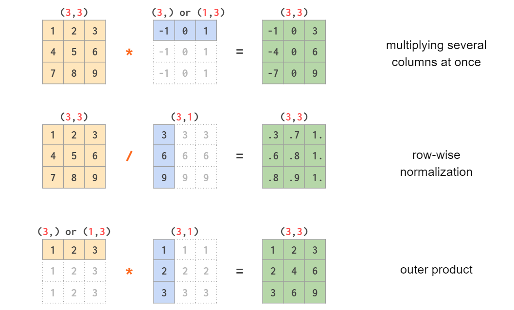

## Table of Contents

## What is broadcasting in the context of machine learning?

Broadcasting in machine learning is a technique used in numerical computing, particularly with libraries like NumPy in Python. It allows operations between arrays of different shapes and sizes to be performed efficiently. When you perform operations like addition or multiplication on arrays that don't match in size, broadcasting automatically expands the smaller array to match the larger one, without actually copying the data. This saves memory and makes computations faster. For example, if you want to add a scalar value to each element of a matrix, broadcasting lets you do this easily without needing to manually create a matrix of the same size filled with that scalar.

To understand how broadcasting works, consider adding a vector to each row of a matrix. If you have a matrix of shape $$ (3, 4) $$ and a vector of shape $$ (4,) $$, broadcasting will treat the vector as if it were a matrix of shape $$ (3, 4) $$ by repeating it along the rows. This means you can perform the addition as if both arrays were the same size, but without the overhead of actually creating a larger array. This technique is very useful in machine learning for tasks like normalizing data or applying the same operation to multiple data points simultaneously. 

Here's a simple example of broadcasting in Python using NumPy:

```python
import numpy as np

# Create a matrix and a vector
matrix = np.array([[1, 2, 3], [4, 5, 6]])
vector = np.array([10, 20, 30])

# Add the vector to each row of the matrix
result = matrix + vector

print(result)
```

In this code, the vector is added to each row of the matrix, resulting in a new matrix where each element is the sum of the corresponding elements from the original matrix and the vector.

## How does broadcasting work with numpy arrays in Python?

Broadcasting in NumPy allows you to perform operations on arrays of different shapes without having to manually resize them. When you try to add, subtract, multiply, or divide arrays of different sizes, NumPy figures out how to make them compatible by expanding the smaller array to match the larger one. This happens without actually copying the data, which saves memory and makes computations faster. For example, if you want to add a single number to every element in a matrix, you don't need to create a new matrix filled with that number; NumPy will do it automatically.

Let's look at a simple example. Imagine you have a matrix of shape $$ (2, 3) $$ and a vector of shape $$ (3,) $$. When you add these together, NumPy will treat the vector as if it were a matrix of shape $$ (2, 3) $$ by repeating the vector for each row of the original matrix. This means you can add the vector to each row of the matrix without any extra work on your part. Here's how you can do this in Python:

```python
import numpy as np

# Create a matrix and a vector
matrix = np.array([[1, 2, 3], [4, 5, 6]])
vector = np.array([10, 20, 30])

# Add the vector to each row of the matrix
result = matrix + vector

print(result)
```

This code will output a new matrix where each element is the sum of the corresponding elements from the original matrix and the vector.

## What are the benefits of using broadcasting in machine learning operations?

Broadcasting in [machine learning](/wiki/machine-learning) makes operations on data much simpler and faster. When you want to do the same thing to many pieces of data, like adding a number to every element in a big list, broadcasting lets you do it without making the computer work harder than it needs to. This is really helpful because it saves time and computer memory. For example, if you have a matrix of numbers and you want to add the same number to each row, broadcasting lets you do this without having to write a loop or create a new big list filled with that number.

Another big benefit of broadcasting is that it makes your code easier to read and write. Instead of writing long, complicated code to handle different sizes of data, you can use broadcasting to make your operations work automatically. This means you can focus more on the machine learning part of your project and less on the details of how to make the computer do what you want. For example, if you want to subtract the average value from each column of a matrix, you can do it in just one line of code with broadcasting, which makes your work a lot easier and cleaner.

## Can you explain a simple example of broadcasting in a machine learning task?

In a machine learning task, you often need to normalize data. Let's say you have a dataset where each row represents a different example, and each column represents a different feature. You want to subtract the mean of each feature from the corresponding column to center the data. With broadcasting, you can do this easily. If your dataset is a matrix of shape $$ (m, n) $$, and you have a vector of means for each feature of shape $$ (n,) $$, you can subtract the means from the dataset in one line of code.

Here's how you can do it: ```python
import numpy as np

# Create a sample dataset
data = np.array([[1, 2, 3], [4, 5, 6], [7, 8, 9]])

# Calculate the mean of each feature
means = np.mean(data, axis=0)

# Subtract the means from the dataset
normalized_data = data - means

print(normalized_data)
```

This code will subtract the mean of each column from all the rows in that column. For example, if the mean of the first column is 4, it will subtract 4 from 1, 4, and 7. Broadcasting makes this operation simple and efficient, without needing to write loops or create extra arrays.

## What are common pitfalls or mistakes when using broadcasting in machine learning?

One common mistake when using broadcasting in machine learning is not understanding how the shapes of arrays need to align for broadcasting to work. For example, if you have a matrix of shape $$ (3, 4) $$ and you want to subtract a vector from each row, the vector must have shape $$ (4,) $$. If the vector has a different shape, like $$ (3,) $$, NumPy will raise an error because it can't figure out how to broadcast the vector to match the matrix. Always make sure the dimensions you want to broadcast over match, or that one of them is 1, which allows NumPy to repeat that dimension as needed.

Another pitfall is assuming that broadcasting will always work the way you expect it to, without checking the results. Sometimes, especially with more complex operations, the broadcasting might not do what you think it should. For example, if you're trying to add a vector to a matrix but the vector's shape doesn't align correctly, you might end up with unexpected results or errors. Always double-check your array shapes and the result of your operations to make sure broadcasting is working as intended. 

Using broadcasting incorrectly can also lead to performance issues. If you're not careful, you might end up broadcasting in a way that creates unnecessary copies of data, which can slow down your computations and use more memory than needed. For instance, if you have a large matrix and you're trying to add a scalar to it, make sure you're doing it in a way that doesn't create an intermediate array. Always consider the efficiency of your operations when using broadcasting in machine learning tasks.

## How does broadcasting improve the efficiency of machine learning algorithms?

Broadcasting helps make machine learning algorithms run faster and use less memory. When you want to do the same thing to many pieces of data, like adding a number to every element in a big list, broadcasting lets you do it without making the computer work harder than it needs to. For example, if you have a matrix of numbers and you want to add the same number to each row, broadcasting lets you do this without having to write a loop or create a new big list filled with that number. This means the computer can do the work much quicker and doesn't need to use as much memory.

Another way broadcasting helps is by making your code easier to read and write. Instead of writing long, complicated code to handle different sizes of data, you can use broadcasting to make your operations work automatically. This means you can focus more on the machine learning part of your project and less on the details of how to make the computer do what you want. For example, if you want to subtract the average value from each column of a matrix, you can do it in just one line of code with broadcasting, which makes your work a lot easier and cleaner.

## What are the differences between broadcasting and traditional array operations?

Broadcasting and traditional array operations differ mainly in how they handle arrays of different sizes. In traditional array operations, you usually need to make sure that the arrays you're working with are the same size. If they're not, you might need to use loops or create new arrays to make them match. This can be slow and use a lot of memory. For example, if you want to add a number to every element in a big list, you'd have to create a new list filled with that number, which takes up space and time.

Broadcasting, on the other hand, lets you work with arrays of different sizes without having to do all that extra work. When you use broadcasting, the computer figures out how to make the arrays match up, so you don't need to write loops or create new arrays. This makes your code run faster and use less memory. For instance, if you have a matrix of shape $$ (3, 4) $$ and you want to add a vector of shape $$ (4,) $$ to each row, broadcasting will treat the vector as if it were a matrix of shape $$ (3, 4) $$ without actually copying the data. This makes operations like adding a number to every element in a big list much easier and more efficient.

## How can broadcasting be applied to multi-dimensional arrays in machine learning?

Broadcasting in machine learning can be used with multi-dimensional arrays to make operations simpler and faster. For example, if you have a 3D array representing images with shape $$ (num_images, height, width) $$ and you want to subtract the average pixel value from each image, you can use broadcasting. You would first calculate the mean of each image, which would give you a 2D array of shape $$ (num_images, 1) $$. Then, by using broadcasting, you can subtract this 2D array from the 3D array, and NumPy will automatically align the dimensions to perform the operation on each image without needing to manually adjust the sizes.

Here's how you can do this in Python using NumPy:

```python
import numpy as np

# Create a 3D array representing images
images = np.array([[[1, 2], [3, 4]], [[5, 6], [7, 8]]])

# Calculate the mean of each image
means = np.mean(images, axis=(1, 2))[:, np.newaxis, np.newaxis]

# Subtract the means from the images
normalized_images = images - means

print(normalized_images)
```

This code shows how broadcasting makes it easy to perform operations on multi-dimensional arrays without having to write complicated loops or create extra arrays. By understanding how broadcasting works, you can make your machine learning tasks more efficient and your code easier to read and maintain.

## What are some advanced techniques for optimizing broadcasting in large-scale machine learning models?

In large-scale machine learning models, optimizing broadcasting can significantly improve performance. One advanced technique is to use vectorized operations as much as possible. Instead of using loops to apply operations to individual elements or rows, you can use broadcasting to apply operations to entire arrays at once. This reduces the overhead of loop iterations and makes your code run faster. For example, if you have a large matrix and you want to subtract the mean of each column from the matrix, you can use broadcasting to do this in one line of code, which is much faster than using a loop.

Another technique is to carefully manage memory usage when using broadcasting. In large-scale models, memory can become a bottleneck, so it's important to make sure you're not creating unnecessary copies of data. When using broadcasting, try to structure your operations so that they work directly on the original arrays without creating intermediate results. For instance, if you're normalizing a large dataset, you can calculate the means and then use broadcasting to subtract them from the original data in place, rather than creating a new array for the normalized data. This helps keep memory usage down and makes your operations more efficient.

Finally, consider using specialized libraries like TensorFlow or PyTorch, which are designed to handle large-scale machine learning tasks efficiently. These libraries have built-in support for broadcasting and other optimizations that can help speed up your computations. They also provide tools for working with GPUs, which can further accelerate your operations. By leveraging these advanced features, you can optimize broadcasting and other operations to make your large-scale machine learning models run faster and use less memory.

## How does broadcasting interact with other machine learning operations like gradient descent?

Broadcasting makes gradient descent in machine learning easier and faster. In gradient descent, you need to update the parameters of your model by subtracting the gradient of the loss function from the current parameters. If you have a large dataset and many parameters, this can be a lot of work. Broadcasting helps by letting you do this update in one step, without needing to write loops or create extra arrays. For example, if you have a vector of gradients and a vector of parameters, you can subtract the gradients from the parameters using broadcasting. This makes the update step quick and simple, which is important for training large models.

Using broadcasting with gradient descent also helps with memory management. When you're training a big model, you want to be careful about how much memory you use. Broadcasting lets you do operations without making extra copies of your data, which saves memory. This is really helpful when you're working with large datasets and complex models, because it means you can keep more data in memory at once and train your model faster. So, broadcasting not only speeds up the gradient descent process but also helps you manage your resources better.

## Can broadcasting be used effectively in distributed machine learning environments?

Broadcasting can be used effectively in distributed machine learning environments to make operations simpler and faster across multiple machines. When you have a big dataset spread out over different computers, you want to do the same thing to all the data without moving it around too much. Broadcasting lets you do this by sending a small piece of data, like a vector of means, to each machine. Each machine can then use broadcasting to apply this data to its part of the dataset without needing to create extra copies or write complicated code. This saves time and helps keep the machines working together smoothly.

For example, if you want to normalize a large dataset that's split across several machines, you can calculate the overall means on one machine and then send these means to all the others. Each machine can then use broadcasting to subtract these means from its part of the dataset. This way, you don't need to move the entire dataset to one place, which would be slow and use a lot of memory. Instead, you can do the work in parallel on each machine, making the whole process faster and more efficient.

## What future developments might we see in broadcasting techniques for machine learning?

In the future, we might see improvements in broadcasting techniques that make them work even better with big data and complex models. One possibility is smarter automatic broadcasting, where the computer figures out the best way to align arrays without the user having to do much work. This could be especially helpful in machine learning tasks where data comes in all sorts of shapes and sizes. For example, if you have a dataset with $$ (m, n) $$ shape and you want to apply operations across different dimensions, smarter broadcasting could make this easier and faster.

Another development could be better integration of broadcasting with distributed computing. As machine learning models get bigger and datasets grow, it's important to be able to spread the work across many computers. Future broadcasting techniques might make it easier to send small pieces of data to each machine and then use broadcasting to apply operations to the whole dataset without moving everything around. This would help speed up training and make it easier to work with very large datasets.