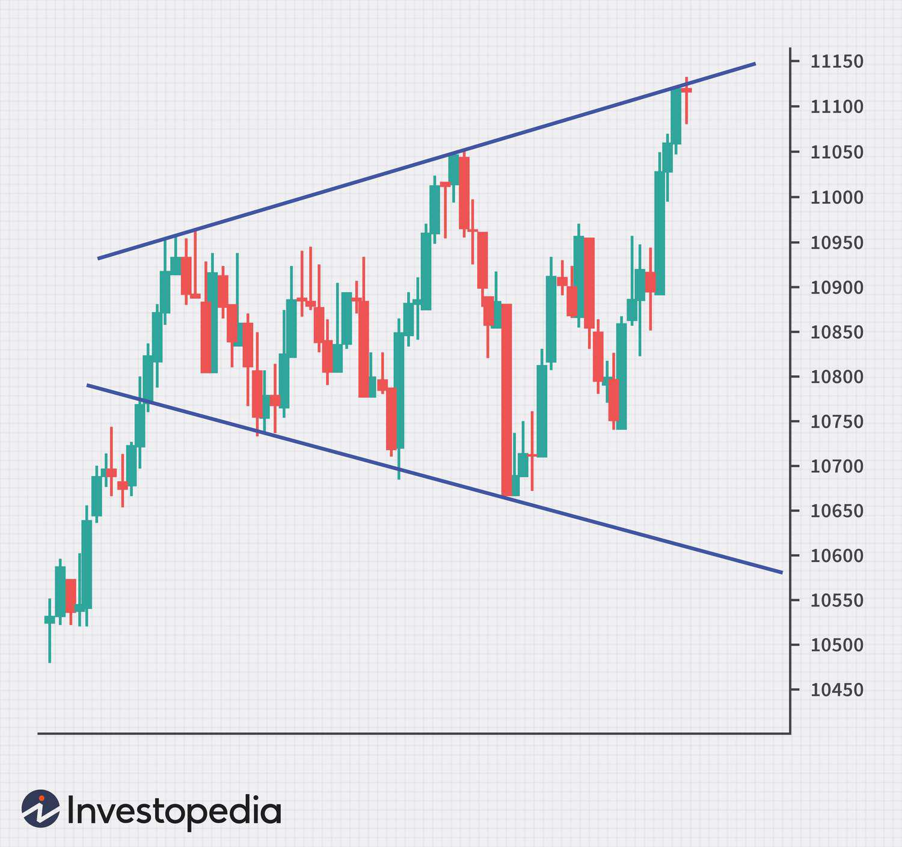

Technical analysis plays a fundamental role in trading by providing traders with tools to interpret market movements and uncover potential trading opportunities. Among the various patterns that traders analyze, the broadening formation emerges as a particularly intriguing one. This chart pattern is marked by increasing price volatility, characterized by diverging trend lines and reflecting a market in a state of indecision. As such, it offers significant insights into future price movements, though it is often accompanied by heightened risk due to the volatility it represents.

The broadening formation is particularly relevant in today's trading environment, where algorithmic trading (algo trading) systems are increasingly used to identify and capitalize on market patterns. These formations demand a sophisticated understanding of market dynamics as well as reliance on advanced trading strategies. This article delves into the broadening formation, examining its key characteristics, the factors that lead to its development, and how traders can leverage it, especially through the use of algo trading, to achieve precision and efficiency in their trading endeavors.



## Table of Contents

## What is a Broadening Formation?

Broadening formations are a distinct chart pattern in technical analysis, identified by their two diverging trend lines. These formations signal increasing price volatility by producing a sequence of higher highs and lower lows. Visually, they resemble a megaphone or an expanding triangle, capturing the market's growing uncertainty and indecision.

The broadening formation typically emerges after significant price movements, a characteristic that often points to increased disagreement among investors regarding the asset's future direction. This disagreement can lead to pronounced fluctuations, making the pattern a hallmark of volatile market phases. As the name suggests, the formation captures a "broadening" of price activity, as traders continuously reassess asset values in response to new information or external factors.

Such formations are often observed in the wake of pivotal market events or data releases that shift investor sentiment dramatically. The subsequent fluctuations create an environment where traditional support and resistance levels are consistently breached. Thus, broadening formations are considered crucial by traders who look to exploit the resulting market volatility for potential gains. The pattern itself is not a predictor of future price direction but rather an indication of existing market dynamics that could lead to sharp price movements.

## Understanding the Formation

Broadening formations develop as a result of increased investor disagreement regarding asset valuation. These formations are marked by diverging trend lines that encapsulate growing price oscillations, effectively showcasing heightened market [volatility](/wiki/volatility-trading-strategies). This volatility stems from the conflicting perspectives investors might have on the future direction of asset prices, incited by various market conditions.

Significant events such as political developments or corporate earnings announcements can lead to such investor disagreements. For instance, political instability might create uncertainty about future economic policies, influencing investor sentiment and prompting divergent views on asset valuations. Similarly, unexpected earnings results can disrupt preconceived notions about a company’s performance, leading to varied interpretations and heightened trading activity. 

These formations are characterized by price fluctuations reaching new highs and dips to fresh lows, indicating a struggle between bullish and bearish sentiments among traders. This pattern of increasing volatility can present traders with high-reward opportunities, albeit with corresponding higher risks. The potential for profit exists as traders anticipate price movements between the expanding boundaries of the formation. However, the unpredictability associated with these wide price swings demands careful application of risk management strategies to mitigate potential losses. 

To effectively gauge these patterns, traders often rely on technical indicators that can further illuminate the market's sentiment. Employing statistical measures of volatility, like the Average True Range (ATR), could provide additional confirmation of a broadening formation's validity. As such, while broadening formations offer a platform for potentially lucrative trading, they necessitate a careful balance of strategic insight and risk management.

## Identifying Broadening Formations on Charts

Broadening formations are chart patterns recognized by diverging trend lines that connect a sequence of higher highs and lower lows. These patterns signify increasing market volatility and investor uncertainty, thereby creating potential opportunities for traders. To accurately identify broadening formations, traders should employ a combination of technical analysis tools and market analytics. 

Initially, the identification process involves plotting the trend lines on a trading chart. This requires connecting a series of higher highs on the upper trend line and lower lows on the lower trend line. The resulting pattern should have a distinct expanding shape, often likened to a megaphone, reflecting increasing volatility over time. The precise identification of these trend lines is crucial, as it establishes the formation's validity.

To confirm the presence and reliability of a broadening formation, traders may incorporate various technical indicators. Volatility measures, such as the Average True Range (ATR), can provide insights into the degree of market fluctuation. An increasing ATR may corroborate the expanding nature of a broadening formation. Similarly, [volume](/wiki/volume-trading-strategy) indicators, which track trading volume levels, can also validate the formation. A significant increase in trading volume during the formation's development might indicate heightened market interest and reinforce the pattern's credibility.

Advanced charting tools and market analytics further enhance the identification process. Platforms offering real-time data and analytical capabilities can help traders isolate broadening formations effectively. These tools often come with customizable settings, allowing the trader to adjust parameters for specific assets or timeframes. Integration of these tools ensures a comprehensive approach to pattern recognition, minimizing the risk of false identification.

Python can automate the process of detecting broadening formations by integrating it with technical analysis libraries such as `pandas` and `ta-lib`. Here's a simple script to identify higher highs and lower lows:

```python
import pandas as pd

# Sample data
data = {'date': pd.date_range(start='2023-01-01', periods=10, freq='D'),
        'high': [100, 105, 102, 110, 108, 115, 113, 120, 118, 125],
        'low': [95, 98, 96, 104, 102, 110, 107, 114, 111, 118]}
df = pd.DataFrame(data)

# Identifying higher highs and lower lows
df['higher_high'] = (df['high'] > df['high'].shift(1)) & (df['high'] > df['high'].shift(-1))
df['lower_low'] = (df['low'] < df['low'].shift(1)) & (df['low'] < df['low'].shift(-1))

print("Higher highs:\n", df[df['higher_high']])
print("Lower lows:\n", df[df['lower_low']])
```

This Python code provides a rudimentary mechanism to identify higher highs and lower lows. Implementing it within a broader analytical framework can streamline the detection process, ensuring timely and accurate recognition of broadening formations on trading charts.

## Trading Strategies for Broadening Formations

Traders targeting broadening formations often employ swing trading and [day trading](/wiki/day-trading-spy) strategies to exploit the volatility inherent in these patterns. One core principle in trading broadening formations is identifying precise entry and [exit](/wiki/exit-strategy) points by targeting the upper and lower trend lines. As prices oscillate between these diverging trend lines, traders can optimize their trades by executing buy orders near the lower trend line and sell orders near the upper trend line. This method leverages the natural price range established by the formation, enabling a strategy that harnesses swings in both upward and downward directions.

Swing trading capitalizes on the medium-term price movements within broadening formations. Traders typically hold positions for several days or weeks, depending on the formation's development and market conditions. In contrast, day trading focuses on short-term price fluctuations, with traders executing multiple trades within a single day. Both strategies require constant monitoring of market trends and swift decision-making to take advantage of the market's volatility.

Algorithmic trading, or algo trading, offers a sophisticated approach to trading broadening formations. By automating the identification and execution of trades, algorithmic systems can enhance precision and efficiency. These systems utilize pre-programmed criteria to detect the pattern's development and trigger trades at optimal times, minimizing human error and emotion-based decisions.

A simple algorithm to trade broadening formations might involve:

1. **Pattern Recognition**: Employing technical indicators to identify the formation on price charts. For example, algorithms can use volatility measures to ascertain the existence of diverging trend lines.

2. **Entry and Exit Rules**: Pre-defining the conditions for entering and exiting trades based on the proximity to the trend lines. For example, entering a long position when the price approaches the lower trend line and exiting near the upper trend line.

3. **Risk Management**: Setting stop-loss orders to prevent excessive losses and employing position sizing rules to manage exposure.

Here's a basic sketch in Python of what an algorithm for trading broadening formations might look like:

```python
# Simple Pseudocode Sketch for a Broadening Formation Trading Algorithm

# Libraries necessary
import talib
import numpy as np
import pandas as pd

def identify_broadening_formation(data):
    # Simplified task to identify diverging trend lines; assuming data is a DataFrame with 'High' and 'Low' prices
    high_trend = talib.LINEARREG(data['High'], timeperiod=14) # using a linear regression as a proxy for trend line
    low_trend = talib.LINEARREG(data['Low'], timeperiod=14)

    return high_trend, low_trend

def trade_broadening_formation(data, high_trend, low_trend):
    for i in range(len(data)):
        if data['Close'][i] < low_trend[i]:  # Entry point
            print(f"Enter Long at {data['Close'][i]}")
        elif data['Close'][i] > high_trend[i]:  # Exit point
            print(f"Exit Long at {data['Close'][i]}")

# Assuming 'market_data' is a DataFrame containing historical price data
high_trend, low_trend = identify_broadening_formation(market_data)
trade_broadening_formation(market_data, high_trend, low_trend)
```

Through this structured approach, algorithmic systems can efficiently navigate the high-risk, high-reward environment of broadening formations, offering traders an edge in a volatile market by executing trades with optimal timing and managed risk.

## Algo Trading and Broadening Formations

Algorithmic trading enhances the ability to identify and respond to broadening formations efficiently, leveraging computational speed and accuracy to navigate market conditions. By automating the detection process, traders can utilize algorithms to swiftly analyze large data sets, identifying the diverging trend lines that characterize broadening formations. This allows for an objective assessment of potential investment opportunities based on predetermined criteria.

Sophisticated algorithms incorporate various technical indicators, such as moving averages, Bollinger Bands, and RSI (Relative Strength Index), to confirm the presence of broadening formations. For instance, Python libraries like TA-Lib or Pandas can be utilized to implement these indicators and automate trading decisions. Below is a simple Python example using Pandas to calculate a moving average, which could be part of an algorithm to detect and act on broadening formations:

```python
import pandas as pd

# Assume df is a DataFrame containing the market data with a column 'Close'
def moving_average(df, window_size):
    return df['Close'].rolling(window=window_size).mean()

# Example usage
df['MA20'] = moving_average(df, 20)

# Condition for broadening formation detection (hypothetical example)
if df['Close'].iloc[-1] > df['MA20'].iloc[-1]:
    print("Potential broadening formation detected, consider trading signal.")
```

By implementing such calculations, algorithms can systematically evaluate market data, recognizing pattern formations with precision.

Furthermore, [algorithmic trading](/wiki/algorithmic-trading) can mitigate the risks associated with manual trading, such as emotional decision-making and delays in execution. Algorithms operate based on pre-established rules and can execute trades at optimal moments, ensuring consistency and speed. This mechanization reduces exposure to human error and allows for the prompt capitalization of fleeting market opportunities.

The automation inherent in algorithmic trading helps manage the inherent volatility of broadening formations. By setting risk management parameters, such as stop-loss and take-profit levels, algorithms can dynamically adjust to market changes, protecting the trader from substantial losses while allowing participation in profitable trades.

Overall, combining algorithmic trading with the analysis of broadening formations offers a powerful approach to navigating volatile market conditions. The strategic interplay between technical indicators and automated processes enhances trading efficiency and can contribute to more consistent trading outcomes.

## Advantages and Risks

Broadening formations are potent tools for traders due to their inherent ties with market volatility. This increased volatility is both a blessing and a curse, offering substantial profit potential while simultaneously posing significant risks. The expanding nature of these formations reflects a market scenario where investor sentiment is undecided, resulting in wide price fluctuations. Successfully navigating this volatility can lead to considerable gains if traders capitalize on the correct timing of trades linked to the pattern's upper and lower trend lines.

However, the same factors that open avenues for substantial profit also introduce heightened risks. The unpredictability of market moves can lead to severe losses if positions are poorly managed or if market conditions shift rapidly and unexpectedly. Therefore, effective risk management becomes paramount. Traders often employ stop-loss orders, position sizing, and diversification to mitigate potential adverse outcomes. These strategies can provide a safety net against the severe drawdowns that might occur if the market moves against a trader’s position unexpectedly.

Algorithmic trading (algo trading) offers an effective framework for handling these challenges. Algorithms can be constructed to detect and respond to broadening formations in real-time, thus optimizing the decision-making process by minimizing human error and emotional decision-making. Utilizing advanced algorithms, traders can automate the execution of predetermined strategies that align with their risk appetite, allowing them to swiftly adjust positions as market conditions change.

For instance, an algorithm might be coded in Python to execute a trade when certain criteria are met, such as:

```python
def trade_based_on_broadening_formation(data):
    if data['price'] > data['upper_trendline']:
        return 'sell'
    elif data['price'] < data['lower_trendline']:
        return 'buy'
    else:
        return 'hold'

# Example usage with market data
market_data = {'price': 105, 'upper_trendline': 100, 'lower_trendline': 90}
action = trade_based_on_broadening_formation(market_data)
print(action)  # Outputs: 'sell'
```

This simple code snippet exemplifies how algorithms can automate responses to market signals derived from broadening formations, improving trading precision and execution speed. By systematically executing trades, algo trading can significantly mitigate the risks of manual trading while enabling traders to harness the profit potentials of broadening formations effectively. As such, the intersection of broadening formations with sophisticated trading algorithms represents a compelling approach to seizing opportunities in volatile markets, while keeping risks under control.

## Conclusion

Broadening formations offer lucrative opportunities for traders willing to navigate the associated risks. These chart patterns, characterized by diverging trend lines, encapsulate periods of heightened volatility, making them attractive for traders seeking significant returns. However, the inherent volatility requires a strategic approach to balance potential profits with the risks involved.

Implementing these strategies within an algorithmic trading framework can optimize trading precision and outcomes. Algorithmic trading, with its ability to process vast amounts of market data at high speeds, enables traders to identify and capitalize on the signals provided by broadening formations more efficiently. Algorithms can automatically execute trades at optimal times, reducing the cognitive load on human traders and potentially improving decision-making accuracy.

As markets evolve, blending technical analysis with technological advancements like algorithmic trading will be key to successful trading strategies. The integration of [machine learning](/wiki/machine-learning) and [artificial intelligence](/wiki/ai-artificial-intelligence) into trading algorithms further enhances their ability to adapt to changing market conditions and refine strategy execution. Adopting such innovations ensures that traders remain competitive, leveraging the strengths of both human insight and computational power to navigate the complexities of modern financial markets effectively.

## References & Further Reading

[1]: Bergstra, J., Bardenet, R., Bengio, Y., & Kégl, B. (2011). ["Algorithms for Hyper-Parameter Optimization."](https://dl.acm.org/doi/10.5555/2986459.2986743) Advances in Neural Information Processing Systems 24.

[2]: ["Advances in Financial Machine Learning"](https://www.amazon.com/Advances-Financial-Machine-Learning-Marcos/dp/1119482089) by Marcos Lopez de Prado

[3]: ["Evidence-Based Technical Analysis: Applying the Scientific Method and Statistical Inference to Trading Signals"](https://www.amazon.com/Evidence-Based-Technical-Analysis-Scientific-Statistical/dp/0470008741) by David Aronson

[4]: ["Machine Learning for Algorithmic Trading"](https://github.com/stefan-jansen/machine-learning-for-trading) by Stefan Jansen

[5]: ["Quantitative Trading: How to Build Your Own Algorithmic Trading Business"](https://www.amazon.com/Quantitative-Trading-Build-Algorithmic-Business/dp/1119800064) by Ernest P. Chan