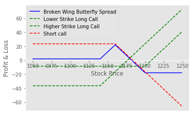

Algorithmic trading is an ever-evolving domain where innovation in trading strategies is constant and necessary to gain a competitive edge. One of the emerging strategies within this scope is the Broken Wing Butterfly, a complex yet advantageous options trading approach that traders can use to optimize results. This strategy, with its distinct characteristic of asymmetrical risk and reward structure, is designed to exploit certain market conditions effectively, offering a unique blend of potential profitability and controlled risk exposure.

The Broken Wing Butterfly strategy builds upon the traditional Butterfly Spread by introducing a modification aimed at enhancing its profitability. Unlike the standard Butterfly Spread, which is typically established at zero or minimal cost, the Broken Wing Butterfly often creates a net credit at initiation. This net credit not only contributes to the potential profit if the strategy performs as anticipated but also provides a cushion against potential losses. The strategic composition involves offsetting vertical spreads in options, thereby allowing traders to position themselves favorably in contrast to specific asset movements.



This article will cover the essential elements of the Broken Wing Butterfly strategy, detailing how it can be embedded into algorithmic trading practices to generate optimized trading outcomes. Through an exploration of its setup, potential profit peaks, and inherent risks, traders will gain insights into harnessing this sophisticated strategy at maximum efficiency. Additionally, practical examples will be discussed to clarify how the Broken Wing Butterfly can be executed effectively within the algorithmic trading landscape, ultimately enhancing a trader’s capability to maneuver through complex market environments skillfully.

## Table of Contents

## Understanding the Broken Wing Butterfly Strategy

The Broken Wing Butterfly strategy, also known as the 'Skip Strike Butterfly', is an advanced options trading strategy designed to enhance profitability beyond that of a traditional Butterfly Spread. Fundamentally, this strategy is executed by integrating a short call vertical spread into a Long Call Butterfly Spread, thereby creating a net credit setup. Traditional Butterfly Spreads involve simultaneously buying and selling options at different strike prices, typically with equal distance between the strikes, creating a symmetrical structure. 

In the Broken Wing Butterfly strategy, this symmetry is intentionally disrupted by widening one wing of the spread. This asymmetry results from skipping a strike price, making one side—the 'broken' wing—wider than the other. The typical setup involves:

1. Buying one call option at a lower strike (K1).
2. Selling two call options at a middle strike (K2).
3. Buying another call option at a higher strike (K3), where the gap between K2 and K3 is larger than between K1 and K2, hence the 'broken' aspect.

The strategic advantage of this setup lies in its ability to generate a net credit at initiation. This occurs because the premium received from selling two middle strike options often exceeds the combined cost of the two bought options, particularly when using options with low implied [volatility](/wiki/volatility-trading-strategies). 

The wider broken wing adjusts the potential risk and payoff dynamics, offering traders a chance to benefit differently from price movements. Specifically, this can lead to higher maximum profit scenarios in certain market conditions, although it also introduces the possibility of incurring a loss if the underlying asset's price shifts unfavorably. 

In summary, the Broken Wing Butterfly modifies the traditional Butterfly Spread with a unique configuration that shifts the risk-reward profile to potentially capitalize on specific market forecasts while maintaining a cost-effective entry.

## Setup and Structure of the Broken Wing Butterfly

The Broken Wing Butterfly strategy is an advanced options trading technique that modifies the standard Butterfly Spread. It is designed to achieve a net credit position while potentially allowing for profit if the underlying asset's price lands near a predetermined strike at expiration.

To execute a Call Broken Wing Butterfly, the trader buys one call option at a lower strike price, sells two call options at a higher strike price, and purchases an additional call option at a even higher strike price. The key is to skip one strike price between the bought and sold options, thereby creating an asymmetrical payoff structure. The setup is intended to be at zero or low cost, resulting in an overall credit position. This configuration can be represented as follows:

- Buy 1 Call at Strike $K_1$
- Sell 2 Calls at Strike $K_2$
- Buy 1 Call at Strike $K_3$, where $K_3 > K_2 > K_1$ and typically $K_3 - K_2 \neq K_2 - K_1$

For a Put Broken Wing Butterfly, the trader follows a similar structure but uses put options to reflect a bearish or neutral market perspective. Here, the positions would be:

- Buy 1 Put at Strike $K_1$
- Sell 2 Puts at Strike $K_2$
- Buy 1 Put at Strike $K_3$, adhering to the inverse where $K_3 < K_2 < K_1$

Such a stance allows traders to benefit from downward price movements or a stationary market with a potential net credit.

Implementing the Broken Wing Butterfly involves careful selection of strike prices and expiration dates to align with the trader's market outlook and risk management framework. The spread between strike prices and the initial net premium are crucial to maximizing profitability and should blend with portfolio strategies to optimize outcomes.

## Profitability and Risk Considerations

The profitability of the Broken Wing Butterfly strategy hinges on the position of the asset relative to the options' strike prices at expiration. To achieve maximum profit, the asset's price should ideally settle at the central strike price. In this scenario, the trader benefits from the premium collected initially (net credit) along with the difference between the strike prices of the purchased and sold options, thereby maximizing the profitability of the strategy. However, achieving the asset's expiration precisely at the central strike price is statistically uncommon, thus requiring careful strategic planning and execution.

The mathematical formulation for the maximum profit of a Broken Wing Butterfly strategy can be expressed as follows:

$$

\text{Max Profit} = \text{Width of the short spread} + \text{Net Credit Received} 
$$

Here, the width of the short spread refers to the difference in strike prices between the nearest option sold and the option purchased closer to the money. The net credit is the premium received by setting up the trade.

Conversely, the maximum loss occurs if the farthest option, often the "broken" wing, ends up being in-the-money at expiration. This situation leads to a loss calculated by:

$$

\text{Max Loss} = \text{Width of the wider spread} - \text{Net Credit Received} 
$$

This loss represents the financial risk a trader assumes if the asset price moves beyond the protective strike of the long options when the position reaches maturity.

Implementing the Broken Wing Butterfly demands meticulous evaluation of option pricing, implied volatility, and market conditions. Given that the probability of the desired price position at expiration is low, traders need to assess the likelihood of various price movements and set up scenarios in which the strategy's structure remains favorable. Risk management tools and strategic adjustments, such as rolling options closer to expiration or changing the strike arrangement, help mitigate potential downsides.

Ultimately, while the strategy holds potential for substantial gains with minimal initial capital outlay, it primarily functions as a sophisticated technique better suited for traders with substantial market understanding and experience in optimizing complex option structures.

## Practical Example in Algorithmic Trading

To implement a Broken Wing Butterfly using Infosys options, the process begins with selecting appropriate strike prices and premiums that align with the trader's market outlook and risk tolerance. Consider an example where a trader believes that Infosys stock will remain stable or experience a modest upward movement until a specified expiration date.

Let's assume the current spot price of Infosys is INR 1500. A trader might choose the following options to create the Broken Wing Butterfly:

1. **Buy 1 Call Option at Strike Price INR 1450 (lower wing)**
2. **Sell 2 Call Options at Strike Price INR 1500 (body)**
3. **Buy 1 Call Option at Strike Price INR 1550 (broken upper wing)**

This setup skips one strike between the upper purchased and sold options, creating the "broken" aspect. The goal is to initiate the trade at zero or low net cost, resulting in a net credit.

### Using Python for Strategy Analysis

With the structure in place, Python can be used for simulation and analysis. You can start by retrieving historical data for Infosys to analyze spot price movements. Several libraries, like `yfinance` or `pandas`, can assist in this task. Here is an outline of how Python can be employed for further analysis:

```python
import yfinance as yf  # For more datasets, visit: https://paperswithbacktest.com/datasets
import numpy as np

# Fetch historical data
symbol = "INFY.NS"  # Infosys ticker on NSE
data = yf.download(symbol, start="2023-01-01", end="2023-12-31")

# Calculate spot price movements
data['Returns'] = data['Close'].pct_change()

# Define the strike prices and current market price
spot_price = 1500
strike_prices = [1450, 1500, 1550]
premiums = [30, 20, 5]  # Hypothetical premiums for the options

# Calculate potential payoff
def calculate_payoff(spot, strikes, premiums):
    lower_w, body, broken_w = strikes
    buy_l_p, sell_b_p, buy_h_p = premiums

    # Payoffs
    payoff_lower_wing = max(0, spot - lower_w) - buy_l_p
    payoff_body = -2 * max(0, spot - body) + 2 * sell_b_p
    payoff_broken_wing = max(0, spot - broken_w) - buy_h_p

    return payoff_lower_wing + payoff_body + payoff_broken_wing

# Simulate over a range of spot prices
spot_range = np.arange(1400, 1600, 10)
payoffs = [calculate_payoff(spot, strike_prices, premiums) for spot in spot_range]

# Analyze the result
import matplotlib.pyplot as plt

plt.plot(spot_range, payoffs, label='Payoff')
plt.axhline(0, color='black', linestyle='--', linewidth=1)
plt.xlabel('Spot Price at Expiration')
plt.ylabel('Net Payoff')
plt.title('Broken Wing Butterfly Payoff Diagram')
plt.legend()
plt.grid(True)
plt.show()
```

This script simulates the potential outcomes of the Broken Wing Butterfly over a range of spot prices at expiration. The plot provides visual insight into how this strategy performs under different market conditions, enabling traders to refine their setups based on profitability and risk assessments.

### Integrating into Algorithmic Trading

To integrate this strategy within a broader algorithmic framework, consider [backtesting](/wiki/backtesting) with historical data to validate its robustness. Python, combined with backtesting libraries such as `Backtrader` or `pyalgotrade`, offers infrastructure to experiment with varying configurations and optimize based on historical performance metrics.

By harmonizing financial domain knowledge with computational resources, traders can tailor the Broken Wing Butterfly to their specific objectives, creating cohesive and potentially lucrative trading systems.

## Conclusion

Broken Wing Butterfly strategies provide traders with the flexibility to capitalize on market movements while maintaining limited risk exposure. This strategy's asymmetrical nature enables traders to adjust the risk-reward profile to align with specific market views and financial objectives. However, understanding and effectively utilizing the Broken Wing Butterfly requires a solid grasp of options strategies, making it more suitable for advanced traders who have experience navigating the complexities of market dynamics.

Advanced users can benefit significantly from this strategy by incorporating it into a comprehensive [algorithmic trading](/wiki/algorithmic-trading) framework. This integration allows traders to systematically exploit market conditions that favor the unique payoff structure of the Broken Wing Butterfly. By mastering its functions, from constructing the spread to setting optimal strike prices, traders can enhance their trading capabilities and decision-making processes.

Moreover, successful implementation hinges on the trader’s ability to perform accurate probability assessments and market condition analyses. This requires not only theoretical knowledge but also practical experience and the use of sophisticated tools for modeling and backtesting strategies in various market scenarios. Proper application of the Broken Wing Butterfly can serve as a powerful addition to an advanced trader’s toolkit, offering opportunities to achieve favorable risk-adjusted returns.

## Additional Resources and Next Steps

For traders interested in exploring the Broken Wing Butterfly strategy further, there are several educational resources and community platforms available that can provide valuable insights and guidance. Courses on systematic options trading are particularly beneficial as they cover not only the Broken Wing Butterfly but also a wide array of other complex strategies, catering to various trading goals and risk appetites.

Platforms like Quantra offer comprehensive courses that focus on options trading strategies, including systematic approaches to implementing the Broken Wing Butterfly. These courses are designed for both beginner and advanced traders, providing a blend of theoretical knowledge and practical application. Additionally, participating in community discussions, whether through online forums or webinars, can enhance a trader's understanding by enabling the exchange of ideas and experiences. Such interactions often lead to the discovery of alternative approaches and new techniques for strategy optimization.

Trading webinars, often free or low-cost, present another opportunity for learning. They typically feature experienced traders who share insights on current market conditions, strategy adjustments, and backtesting results. Staying informed through these real-world perspectives can provide a significant edge when applying complex strategies like the Broken Wing Butterfly in dynamic markets.

When implementing the Broken Wing Butterfly strategy, thorough backtesting and risk analysis are crucial. Backtesting allows traders to simulate the strategy over historical data to evaluate its performance and condition it according to past outcomes. Here's a basic Python snippet for backtesting an options strategy:

```python
import numpy as np
import pandas as pd

def backtest_strategy(option_data):
    results = []
    for index, option in option_data.iterrows():
        # Calculate potential outcomes
        if condition_met(option):
            profit = calculate_profit(option)
            results.append(profit)
        else:
            results.append(0)
    return np.mean(results), np.std(results)

# Example function calls, assuming 'option_data' is a pandas DataFrame with relevant data.
avg_profit, profit_std = backtest_strategy(option_data)
```

While this is a simplistic approach to backtesting, more elaborate simulations would involve stochastic modeling and stress testing across various market scenarios. Traders must assess the strategy's sensitivity to different volatility levels and strike prices to ensure robustness.

Finally, risk analysis involves calculating potential losses under worst-case scenarios, which can be done using techniques like Value at Risk (VaR) or stress testing by simulating extreme market conditions. By tailoring the strategy to align with individual trading objectives and market forecasts, traders can effectively integrate the Broken Wing Butterfly into their overall trading frameworks.

## References & Further Reading

[1]: ["Option Volatility and Pricing: Advanced Trading Strategies and Techniques"](https://www.amazon.com/Option-Volatility-Pricing-Strategies-Techniques/dp/0071818774) by Sheldon Natenberg

[2]: ["Trading Options Greeks: How Time, Volatility, and Other Pricing Factors Drive Profits"](https://www.amazon.com/Trading-Options-Greeks-Volatility-Pricing/dp/1118133161) by Dan Passarelli

[3]: Haug, E. G. (2007). ["The Complete Guide to Option Pricing Formulas."](https://www.amazon.com/Complete-Guide-Option-Pricing-Formulas/dp/0786312408) McGraw-Hill.

[4]: Mitchell, M., & Burns, J. (2020). ["Python for Finance: Analyze Big Financial Data"](https://books.google.com/books/about/Python_for_Finance.html?id=E93SBQAAQBAJ) by Yves Hilpisch

[5]: ["Options, Futures, and Other Derivatives"](https://www.amazon.com/Options-Futures-Other-Derivatives-5th/dp/0130090565) by John C. Hull