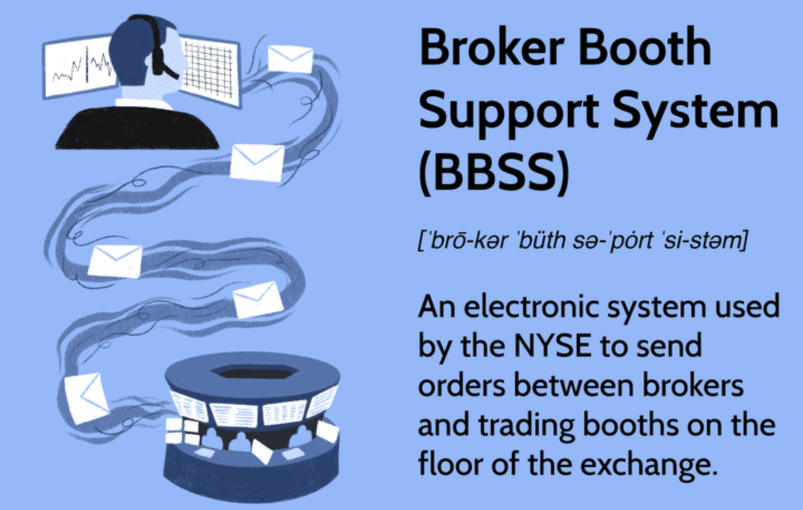

## Table of Contents

## What is a Broker Booth Support System?

A Broker Booth Support System is a tool that helps people who work in trading and finance. It is used by brokers, who are people that buy and sell things like stocks and bonds for their clients. The system makes their job easier by giving them quick access to important information and tools they need to do their work. For example, it can show them current prices of stocks, help them make trades quickly, and keep track of their clients' accounts.

The system is often set up in a special area called a broker booth, where brokers can work efficiently. It usually includes computer screens, phones, and other devices that help brokers stay connected and informed. The support system is important because it helps brokers make fast decisions and handle a lot of information at once, which is crucial in the fast-paced world of trading.

## What is the history behind the development of Broker Booth Support Systems?

The history of Broker Booth Support Systems goes back to the early days of stock trading. In the beginning, brokers used to shout out their trades on the trading floor. They had to remember a lot of information and make quick decisions without much help. As technology started to grow, people realized that computers could help make trading easier and faster. In the 1970s and 1980s, computers began to be used on trading floors. These early systems were simple, but they helped brokers keep track of prices and make trades more efficiently.

Over time, Broker Booth Support Systems became more advanced. In the 1990s and 2000s, these systems started to include more features like real-time data, advanced charting tools, and direct trading capabilities. This made it possible for brokers to do their jobs even better and faster. Today, these systems are very sophisticated. They use the latest technology to help brokers manage large amounts of data, make quick trades, and keep their clients happy. The development of these systems has changed the way trading works, making it more efficient and accessible.

## How does a Broker Booth Support System function in the trading environment?

In the trading environment, a Broker Booth Support System works by giving brokers the tools they need to do their job well. When a broker is in their booth, they use the system to see the current prices of stocks, bonds, and other things they trade. The system shows this information on computer screens in real time, so the broker always knows what is happening in the market. It also lets them make trades quickly by pressing buttons or using a mouse. This is important because trading can be very fast, and brokers need to act quickly to buy or sell things for their clients.

The system also helps brokers keep track of their clients' accounts. It shows them how much money their clients have, what they have bought or sold, and any other important details. This helps brokers make smart decisions for their clients. The system can also connect to phones and other devices, so brokers can talk to their clients or other people they need to work with. All of these features together make the Broker Booth Support System a very important tool in the trading world, helping brokers do their job better and faster.

## What are the key components of a Broker Booth Support System?

A Broker Booth Support System has several important parts that help brokers do their job well. One key part is the computer screens that show real-time market data. These screens display the current prices of stocks, bonds, and other things that brokers trade. This helps brokers make quick decisions because they can see what is happening in the market right away. Another important part is the trading software. This software lets brokers make trades easily by clicking buttons or using a mouse. It makes the process fast and efficient, which is very important in the fast-paced world of trading.

Another key component is the client management system. This part of the Broker Booth Support System helps brokers keep track of their clients' accounts. It shows how much money each client has, what they have bought or sold, and other important details. This helps brokers make smart decisions for their clients. The system also includes communication tools, like phones and messaging systems, that let brokers talk to their clients or other people they need to work with. All of these parts together make the Broker Booth Support System a powerful tool that helps brokers do their job better and faster.

## Who are the primary users of Broker Booth Support Systems?

The main people who use Broker Booth Support Systems are brokers. Brokers are people who help their clients buy and sell things like stocks and bonds. They work in trading places like stock exchanges, where they need to make quick decisions and handle a lot of information. The support system helps them do this by showing them important information on screens and letting them make trades easily.

Besides brokers, other people who might use these systems are trading assistants and support staff. These people help the brokers by doing things like keeping records and managing client accounts. The system helps them do their jobs better by giving them quick access to the information they need. Overall, anyone who works in a trading environment and needs to manage trades and client accounts can benefit from using a Broker Booth Support System.

## What are the benefits of using a Broker Booth Support System for brokers?

Using a Broker Booth Support System helps brokers a lot. It gives them real-time information about the market, so they can see the current prices of stocks and other things they trade. This helps them make quick decisions because they know what is happening right away. The system also makes it easy for brokers to buy and sell things. They can do it with just a few clicks, which saves time and helps them work faster.

Another big benefit is that the system helps brokers keep track of their clients' accounts. They can see how much money each client has and what they have bought or sold. This makes it easier for brokers to make smart decisions for their clients. The system also lets brokers talk to their clients and other people they need to work with, which helps them do their job better. Overall, the Broker Booth Support System makes trading easier, faster, and more efficient for brokers.

## How has technology evolved the capabilities of Broker Booth Support Systems?

Technology has made Broker Booth Support Systems a lot better over time. In the beginning, these systems were simple and could only show basic information about the market. But as computers got better, the systems started to do more. Now, they can show real-time data, which means brokers can see what is happening in the market right away. They also have tools that help brokers make charts and see trends, which helps them make smart decisions. Plus, the systems can connect to the internet, so brokers can get information from all over the world.

These systems also got better at helping brokers make trades quickly. Now, brokers can buy and sell things with just a few clicks, which saves a lot of time. The systems can also keep track of clients' accounts better, showing brokers all the important details they need to know. And because technology keeps getting better, these systems can now use things like [artificial intelligence](/wiki/ai-artificial-intelligence) to help brokers even more. This makes trading easier, faster, and more efficient for brokers.

## What are the common challenges faced in implementing a Broker Booth Support System?

Implementing a Broker Booth Support System can be hard because it needs a lot of planning and money. You have to make sure the system works well with the computers and other tools already in the trading place. This can be tricky because different systems might not work well together. Also, setting up the system can cost a lot of money, not just for the computers and software, but also for training people to use it. If the system is not set up right, it can cause problems and slow down the brokers' work.

Another challenge is keeping the system safe from hackers and other bad things. Trading places have a lot of important information, so they need to make sure no one can break into the system and steal it. This means they have to spend more money on security tools and always be checking for problems. Also, once the system is working, it needs to be updated often to keep up with new technology and rules. This can be hard to do because it takes time and money, but it's important to keep the system running well and helping brokers do their job.

## Can you describe a case study where a Broker Booth Support System significantly improved trading efficiency?

A big trading company called "TradeFast" decided to use a new Broker Booth Support System to help their brokers work better. Before, the brokers at TradeFast had to look at lots of different screens and papers to see what was happening in the market. It was hard for them to keep up with everything and make quick decisions. But after they got the new system, everything changed. The system showed all the important information on one big screen in real-time. This made it easy for the brokers to see what was happening and make trades fast. They could click buttons to buy and sell things instead of writing it down or calling someone. This saved a lot of time and made their work a lot easier.

The results were amazing. TradeFast found out that their brokers were making trades 30% faster than before. They also made fewer mistakes because they could see all the information they needed right away. The clients were happy too because their brokers could make better decisions for them. The company saved money because they didn't need as many people to help with the trading. The new system also helped TradeFast keep up with new technology and rules, so they could keep getting better. Overall, the Broker Booth Support System made a big difference for TradeFast and showed how important technology can be in trading.

## What future trends are expected to influence the development of Broker Booth Support Systems?

In the future, Broker Booth Support Systems are expected to get even better because of new technology. One big trend is the use of artificial intelligence, or AI. AI can help brokers make better decisions by looking at a lot of data and finding patterns that people might miss. This can make trading faster and more accurate. Another trend is using more cloud technology. This means the systems can be updated easily and brokers can get information from anywhere, not just their booth. This can help them work better even when they are not in the office.

Also, there will be more focus on making the systems easier to use and more personalized for each broker. This means the systems can be set up to show the information each broker needs most, making their job easier. Security will also be a big focus because trading places need to keep their information safe from hackers. New technology will help make sure the systems are safe and can keep up with new rules and changes in the market. Overall, these trends will make Broker Booth Support Systems even more helpful for brokers in the future.

## How do Broker Booth Support Systems integrate with other financial technologies?

Broker Booth Support Systems work well with other financial technologies to help brokers do their job better. They can connect to trading platforms, which are the places where brokers buy and sell stocks and other things. This makes it easy for brokers to make trades right from their booth. The systems also link up with data services that give them real-time information about the market. This means brokers can see what is happening and make quick decisions. Plus, these systems can work with risk management tools that help brokers keep their clients' money safe by watching for problems.

Another way Broker Booth Support Systems work with other technologies is by connecting to client management systems. These systems help brokers keep track of their clients' accounts and see what they have bought or sold. This makes it easier for brokers to give good advice to their clients. The systems can also connect to communication tools like phones and messaging apps, so brokers can talk to their clients and other people they need to work with. All of these connections make the Broker Booth Support System a powerful tool that helps brokers do their job better and faster.

## What are the regulatory considerations that impact the design and operation of Broker Booth Support Systems?

When making and using Broker Booth Support Systems, there are a lot of rules that trading places have to follow. These rules are made by groups like the Securities and Exchange Commission (SEC) in the U.S. or other similar groups in other countries. The rules are there to make sure that trading is fair and safe for everyone. For example, the systems have to keep good records of all the trades that happen, so that if there is a problem, people can check what happened. They also have to make sure that the information they show is correct and up-to-date, so brokers can make good decisions.

Another big thing to think about is keeping the systems safe from hackers and other bad things. The rules say that trading places have to use strong security to protect their information. This means they have to spend money on things like firewalls and other tools to keep the systems safe. Also, the systems have to be able to handle a lot of trades at once without slowing down or breaking. This is important because trading can be very fast, and if the system can't keep up, it can cause big problems. Overall, these rules help make sure that Broker Booth Support Systems work well and keep trading fair and safe.

## References & Further Reading

[1]: Schwartz, R. A., & Francioni, R. (Eds.). (2004). ["Equity Markets in Action: The Fundamentals of Liquidity, Market Structure & Trading"](https://books.google.com/books/about/Equity_Markets_in_Action.html?id=fPV16sxH8oUC). Wiley.

[2]: Gomber, P., Arndt, B., Lutat, M., & Uhle, T. (2011). ["High-Frequency Trading"](https://papers.ssrn.com/sol3/papers.cfm?abstract_id=1858626). In H. Gimpel et al. (Eds.), Market Engineering. Springer.

[3]: Aldridge, I. (2013). ["High-Frequency Trading: A Practical Guide to Algorithmic Strategies and Trading Systems"](https://www.amazon.com/High-Frequency-Trading-Practical-Algorithmic-Strategies/dp/1118343506). Wiley.

[4]: Mehta, N. (2013). ["The Foundations of Algorithmic Trading"](https://onlinelibrary.wiley.com/doi/pdf/10.1002/9781118676998.fmatter). CreateSpace Independent Publishing Platform.

[5]: Chlistalla, M. (2011). ["High-Frequency Trading – Better Than Its Reputation?"](https://c.mql5.com/forextsd/forum/168/high-frequency_trading_-_better_than_its_reputation.pdf). Deutsche Bank Research.