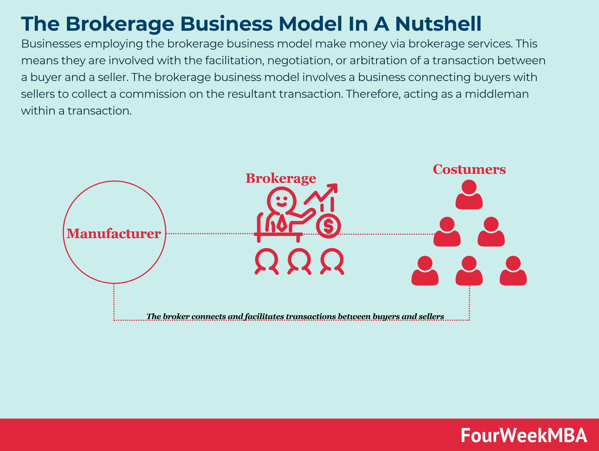

## Table of Contents

## What is a broker-dealer?

A broker-dealer is a financial company that does two main jobs. First, it acts as a broker, which means it helps people buy and sell stocks, bonds, and other investments. People who want to invest in the stock market can use a broker-dealer to make their trades. Second, it acts as a dealer, which means it can buy and sell securities for its own account. This means the broker-dealer can make money by trading for itself, not just by helping others trade.

Broker-dealers are very important in the financial world because they help make the market work smoothly. They make sure that when someone wants to buy a stock, there's someone else willing to sell it, and vice versa. They also have to follow many rules and regulations to make sure they are acting fairly and honestly. This helps keep the market safe for everyone who uses it.

## How does a broker-dealer make money?

A broker-dealer makes money in two main ways. First, as a broker, they charge fees or commissions when they help people buy and sell stocks, bonds, or other investments. For example, if someone wants to buy 100 shares of a company, the broker-dealer might charge a small fee for making that trade happen. This fee is how they earn money from acting as a middleman between buyers and sellers.

Second, as a dealer, a broker-dealer can buy and sell securities for their own account. This means they can make money by trading for themselves. If they buy a stock at a low price and then sell it later at a higher price, they keep the difference as profit. This is similar to how someone might buy and sell items to make money, but instead of physical goods, they are trading stocks and bonds.

## What are the main services provided by a broker-dealer?

A broker-dealer mainly helps people buy and sell stocks, bonds, and other investments. They act as a middleman, connecting people who want to buy with those who want to sell. When someone wants to invest in the stock market, they can go to a broker-dealer who will make the trade happen for them. The broker-dealer charges a fee or commission for this service, which is how they make money from helping people trade.

In addition to helping people trade, broker-dealers also trade for themselves. They can buy and sell securities on their own account, trying to make a profit from the difference in prices. This means they can earn money not just from the fees they charge, but also from their own successful trades. This dual role as both a broker and a dealer helps keep the market active and liquid, making it easier for everyone to buy and sell investments.

## What is the difference between a broker and a dealer?

A broker is like a middleman who helps people buy and sell things in the stock market. When someone wants to invest in stocks, bonds, or other securities, they can go to a broker who will make the trade for them. The broker doesn't own the stocks themselves; they just help match buyers with sellers. For this service, the broker charges a fee or commission, which is how they make money.

A dealer, on the other hand, is someone who buys and sells securities for their own account. This means they can own the stocks or bonds they trade. If a dealer buys a stock at a low price and then sells it later at a higher price, they keep the difference as profit. Unlike a broker, a dealer is not just helping others trade; they are trading for themselves to make money.

A broker-dealer does both jobs. They act as a broker by helping people buy and sell securities and charge a fee for it. They also act as a dealer by trading securities for their own account, trying to make a profit from the price differences. This dual role helps keep the market active and makes it easier for people to trade.

## What are the regulatory requirements for broker-dealers?

Broker-dealers have to follow many rules to make sure they are fair and honest. They are watched by the Securities and Exchange Commission (SEC), which is a group that makes sure the stock market is safe for everyone. The SEC has rules that broker-dealers must follow, like keeping good records of all their trades and making sure they don't cheat or lie to their customers. They also have to check that the people they hire are honest and good at their jobs.

Another important rule is that broker-dealers must keep their customers' money and securities safe. They do this by putting the money and securities in special accounts that are separate from the broker-dealer's own money. This way, if something bad happens to the broker-dealer, the customers' money and securities are still safe. Broker-dealers also have to be part of a self-regulatory organization (SRO), like the Financial Industry Regulatory Authority (FINRA), which makes extra rules and checks to make sure broker-dealers are following the law.

## How do broker-dealers manage risk?

Broker-dealers manage risk by using different ways to keep their business safe. One way is by spreading out their investments so they don't put all their money into one thing. If they buy different kinds of stocks, bonds, and other things, it's less likely that they will lose all their money if one of those things goes down in value. They also use special tools called hedging, which means they buy other investments that can go up in value if their main investments go down. This helps balance out any losses they might have.

Another way broker-dealers manage risk is by following strict rules set by groups like the SEC and FINRA. These rules tell them how much money they need to have on hand to cover any losses, and how they should keep their customers' money and investments safe. By having enough money to cover losses and keeping customer money separate from their own, broker-dealers can reduce the chance of big problems. They also have to check their own business regularly to make sure everything is working right and to fix any issues quickly.

## What role do broker-dealers play in the financial markets?

Broker-dealers are very important in the financial markets. They help people buy and sell stocks, bonds, and other investments. When someone wants to invest, they can go to a broker-dealer who will make the trade for them. This makes it easier for people to get into the stock market because they don't have to find someone to buy from or sell to on their own. The broker-dealer acts like a middleman, connecting buyers and sellers, and they charge a small fee for this service.

Broker-dealers also help keep the market running smoothly. They can buy and sell securities for their own account, which means they can trade for themselves. This helps make sure there are always people willing to buy or sell, even when the market is busy. By doing this, broker-dealers help make the market more active and liquid, which is good for everyone who wants to invest. They also have to follow strict rules to make sure they are fair and honest, which helps keep the market safe for everyone.

## How has technology impacted the broker-dealer business model?

Technology has changed the way broker-dealers work a lot. Now, people can use the internet to buy and sell stocks without needing to talk to someone in person. This means broker-dealers can offer their services online, which makes it easier and faster for people to trade. They use special computer programs and apps that let people see what's happening in the market and make trades with just a few clicks. This has made trading cheaper because broker-dealers don't need as many people to help with trades, and they can charge lower fees.

Also, technology helps broker-dealers keep better track of everything they do. They use computers to make sure they follow all the rules and to keep their customers' information safe. With technology, they can check their trades and records quickly and make sure everything is correct. This helps them manage risk better and make sure they are doing everything right. Overall, technology has made the broker-dealer business more efficient and easier for everyone to use.

## What are the challenges faced by broker-dealers in today's market?

Broker-dealers face a lot of challenges in today's market. One big challenge is competition. With so many online platforms and apps, people can now trade on their own without needing a broker-dealer. This means broker-dealers have to work hard to show why people should use their services instead of doing it themselves. They also have to keep their fees low because people can easily compare prices and choose the cheapest option.

Another challenge is keeping up with technology. Broker-dealers need to use the latest computer programs and apps to stay competitive. But this can be expensive, and they have to make sure their technology is safe and works well. If something goes wrong, it can cause big problems for their business and their customers. They also have to make sure they follow all the rules about using technology, which can be complicated and change a lot.

Lastly, managing risk is a big challenge for broker-dealers. They have to be careful about how they invest their own money and how they handle their customers' money. If the market goes down, they could lose a lot of money, so they need to use smart strategies to protect themselves. They also have to follow strict rules about how much risk they can take, which can make it hard to make big profits.

## How do broker-dealers comply with anti-money laundering (AML) regulations?

Broker-dealers have to follow strict rules to stop money laundering, which is when people try to hide where their money came from, often from illegal activities. To do this, they set up special programs to watch for any signs of money laundering. They use computer systems to check customer information and keep an eye on their transactions. If something looks strange or suspicious, they have to report it to the government. This helps catch people who might be doing something wrong.

Another way broker-dealers comply with these rules is by training their employees. They teach their workers how to spot signs of money laundering and what to do if they see something suspicious. They also have to keep good records of all their customers and their transactions. This way, if the government asks for information, they can show that they are following the rules and doing everything they can to stop money laundering.

## What are the best practices for broker-dealers to maintain client trust and satisfaction?

Broker-dealers can keep their clients happy and trusting them by being clear and honest about everything they do. They should always tell their clients about any fees or charges before they make a trade. This way, clients know exactly what they are paying for. Broker-dealers should also give their clients good advice based on what they know about the market and the client's goals. By being open and giving good advice, clients feel like they can trust their broker-dealer.

Another important way to keep clients happy is by having good customer service. Broker-dealers should be easy to reach and quick to answer any questions or concerns their clients might have. They should also use technology to make trading easy and safe for their clients. By using apps and websites that are easy to use, clients can feel more comfortable and confident in their trading. When clients see that their broker-dealer cares about their needs and works hard to help them, they are more likely to stay loyal and satisfied.

## How do broker-dealers adapt their business models to economic cycles and market changes?

Broker-dealers have to change how they work when the economy goes up and down or when the market changes. When the economy is doing well, people might want to invest more, so broker-dealers might focus on helping people buy stocks and other investments. They might also try to make more trades for themselves to make a profit. But when the economy is not doing well, people might be more careful with their money. Broker-dealers might then focus on helping people sell their investments or move their money into safer places like bonds. They might also change how they trade for themselves to protect their own money.

Another way broker-dealers adapt is by using new technology and changing their services. If new apps or websites make it easier for people to trade on their own, broker-dealers might start offering these tools to stay competitive. They might also start offering new kinds of investments or advice that match what people want in different economic times. By keeping up with what's happening in the market and what their clients need, broker-dealers can stay successful no matter what the economy is doing.

## How can Algorithmic Trading be Integrated into Broker-Dealer Services?

Broker-dealers are increasingly leveraging [algorithmic trading](/wiki/algorithmic-trading) to enhance the efficiency and breadth of their services. Algorithmic trading refers to the use of computer programs and algorithms to execute trades based on pre-defined criteria, effectively automating the trading process. This integration is transforming broker-dealer operations, allowing for more sophisticated trading strategies such as [market making](/wiki/market-making) and [arbitrage](/wiki/arbitrage).

Market making, a key broker-dealer function, involves providing [liquidity](/wiki/liquidity-risk-premium) to the markets by being ready to buy and sell securities at all times. By using algorithms, broker-dealers can optimize their market-making strategies, adjust prices dynamically, and respond swiftly to market changes. This results in tighter bid-ask spreads, increased liquidity, and reduced transaction costs for investors. The formula for calculating the bid-ask spread, a crucial metric in market making, is:

$$
\text{Bid-Ask Spread} = \frac{\text{Ask Price} - \text{Bid Price}}{\text{Mid Price}}
$$

where the mid price is the average of the bid and ask prices.

Arbitrage, another strategy facilitated by algo trading, exploits price differentials of a security across different markets or forms. By leveraging high-speed algorithms, broker-dealers can identify and exploit these arbitrage opportunities in milliseconds, securing profits with minimal risk. For example, an algorithm might buy a security on one exchange where the price is lower and simultaneously sell it on another exchange where the price is higher, thus locking in the profit from the price difference.

Broker-dealers must also consider the ethical and regulatory responsibilities associated with algorithmic trading. Algorithmic systems must be designed and monitored to prevent activities like market manipulation or unfair trading practices. Regulatory frameworks, such as those imposed by the U.S. Securities and Exchange Commission (SEC), mandate that algorithms adhere to fair trading practices and require the implementation of risk management systems to promptly detect and respond to malfunctions.

One ethical consideration involves the speed advantages that algorithmic trading provides. While beneficial for those with access to the technology, it can potentially lead to unfair advantages over retail investors. Therefore, broker-dealers must ensure their practices do not undermine market integrity or investor confidence.

As algorithmic trading continues to develop, broker-dealers are tasked with integrating these technologies responsibly, balancing advanced trading capabilities with the imperative for ethical practices and regulatory compliance. This balance helps maintain a fair and stable financial market, fostering trust among market participants.

## References & Further Reading

[1]: Hasbrouck, J. (2007). ["Empirical Market Microstructure."](https://archive.org/details/empiricalmarketm0000hasb) Oxford University Press.

[2]: Kissell, R. (2013). ["The Science of Algorithmic Trading and Portfolio Management."](https://www.sciencedirect.com/book/9780124016897/the-science-of-algorithmic-trading-and-portfolio-management) Academic Press.

[3]: Aldridge, I. (2013). ["High-Frequency Trading: A Practical Guide to Algorithmic Strategies and Trading Systems."](https://www.amazon.com/High-Frequency-Trading-Practical-Algorithmic-Strategies/dp/1118343506) Wiley.

[4]: Chlistalla, M. (2011). ["High-frequency trading – better than its reputation?"](https://c.mql5.com/forextsd/forum/168/high-frequency_trading_-_better_than_its_reputation.pdf) Deutsche Bank Research.

[5]: Securities and Exchange Commission. (2010). ["Concept Release on Equity Market Structure."](https://www.sec.gov/rules-regulations/2010/01/concept-release-equity-market-structure)