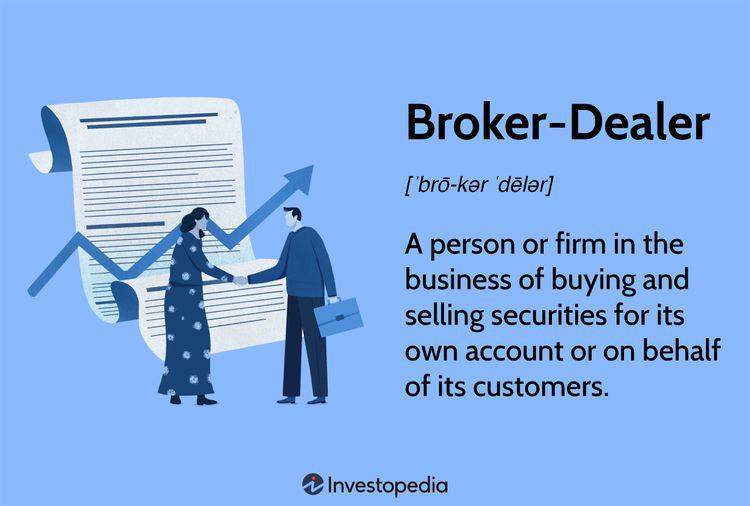

Broker-dealers hold a crucial position in the financial services ecosystem, acting as intermediaries that facilitate the buying and selling of securities for clients. As key players in financial markets, broker-dealers provide essential services such as executing trades, providing market liquidity, and offering investment advice. Traditionally, these activities were conducted manually, relying heavily on human expertise and decision-making. However, the financial industry has experienced significant transformation with the advent of algorithmic trading, which has fundamentally altered how broker-dealers operate.

Algorithmic trading, the use of complex algorithms to automate trading strategies and processes, has reshaped the landscape of traditional brokerage and trading activities. It enables high-speed trade execution, precision in order placement, and the capability to process vast amounts of market data in real-time. These advancements have enhanced the efficiency and effectiveness of broker-dealer services, allowing them to meet client demands more rapidly and with greater accuracy.

This article aims to provide a comprehensive analysis of the evolving role of broker-dealers amidst the rise of algorithmic trading. We begin with an exploration of what broker-dealers are and their dual roles in financial markets. The discussion then shifts to algorithmic trading, examining its significance, advantages, and associated challenges in the financial sector. Further, we explore how broker-dealers integrate algorithmic trading into their services, leveraging strategies like market making and arbitrage while addressing ethical and regulatory concerns.

The article also covers regulatory frameworks governing broker-dealer and algorithmic trading, highlighting the oversight responsibilities of key bodies such as the Securities and Exchange Commission (SEC) and the Financial Industry Regulatory Authority (FINRA). Finally, we delve into technological innovations impacting broker-dealer platforms, including the influence of artificial intelligence, machine learning, and the integration of blockchain technologies. Concluding, the article underscores the imperative for broker-dealers to remain adaptable and compliant with evolving regulations to sustain their pivotal role in financial markets.

## Table of Contents

## Understanding Broker-Dealers

A broker-dealer is a key participant in the financial markets, serving dual roles as both broker, in which they act as [agents](/wiki/agents) for clients, and as dealer, where they buy and sell securities for their own account. This dual capacity enables them to facilitate the buying and selling of securities, which is fundamental to maintaining liquidity and efficient market functioning.

As brokers, broker-dealers act as intermediaries between buyers and sellers, executing trades on behalf of clients. This involves sourcing the best available prices and executing transactions on various exchanges or trading platforms. The compensation for this service is typically a commission or fee. An example of their role as brokers can be seen when they help individual investors purchase stocks or assist institutional clients in executing large order trades to minimize market impact.

In their role as dealers, broker-dealers trade securities for their own accounts, providing [liquidity](/wiki/liquidity-risk-premium) to the market by being ready to buy and sell securities at quoted prices. This market-making function is critical, as it reduces price [volatility](/wiki/volatility-trading-strategies) and ensures that trades can happen smoothly and quickly without significant impact on the market prices. For instance, a broker-dealer might purchase a security with the anticipation of selling it later at a higher price, or they might profit from the bid-ask spread.

The services broker-dealers offer are varied, encompassing trade execution, market-making, and advisory roles. Trade execution is the most fundamental service, ensuring that transactions are carried out efficiently and at the best possible prices. Market-making involves creating a market for securities by being willing to buy and sell them continually, facilitating liquidity and pricing transparency.

Additionally, broker-dealers provide advisory services to clients, offering insights based on market analysis to guide investment decisions. This might include advice on investment strategies, portfolio management, or the timing of trades. These advisory roles are particularly significant for institutional clients, who may rely on broker-dealers for sophisticated financial products and trading strategies.

Through their diverse functions as brokers and dealers, broker-dealers play an essential role in financial markets, ensuring the smooth execution of trades, maintaining market liquidity, and providing valuable insights that help guide investment strategies.

## Algorithmic Trading in the Financial Sector

Algorithmic trading, often referred to as algo trading, involves the use of advanced mathematical models and computer programs to make high-speed trading decisions in financial markets. Its significance in modern finance is underscored by its ability to execute large orders with minimal market impact, thereby enhancing liquidity and market efficiency. Algorithmic trading has successfully revolutionized traditional trading methodologies by minimizing human intervention and optimizing trade execution through automation.

One of the primary advantages of [algorithmic trading](/wiki/algorithmic-trading) is speed. Algorithms can process vast amounts of market data and execute trades in a fraction of a second, a feat impossible for human traders. This superiority in speed allows traders to capitalize on fleeting market opportunities that occur in milliseconds. Additionally, precision is a hallmark of algorithmic trading. Algorithms operate based on predefined criteria, reducing the potential for human error in trading decisions. This precision not only improves the accuracy of trade execution but also ensures consistency in trading strategies.

Efficiency is another significant benefit provided by algorithmic trading. By automating the trading process, algorithms can manage several trades across different markets and asset classes simultaneously. This enhanced efficiency allows institutions to maximize their trading activities while minimizing operational costs. Moreover, algorithms can backtest historical data to evaluate their performance, giving traders confidence in their strategies before they are deployed in live markets.

However, the deployment of algorithmic trading is not without challenges and risks. One of the prominent concerns is the potential for market instability. The high-speed nature of algorithmic trading can contribute to market volatility, as seen in events like the "Flash Crash" of May 2010, where the Dow Jones Industrial Average plunged about 1,000 points within minutes before recovering. Such incidents highlight how algorithms reacting to unusual market conditions can amplify price fluctuations.

Moreover, algorithmic trading systems can be susceptible to technical glitches, leading to unintended market consequences. These errors can arise from incorrect coding, inadequate testing, or unexpected market conditions, which may result in substantial financial losses. Additionally, the complexity of algorithms makes it challenging to fully understand and predict their behavior under various market circumstances, which raises concerns for both traders and regulatory bodies.

Regulators are increasingly scrutinizing algorithmic trading to ensure that it does not compromise market integrity. Compliance measures and risk management protocols are crucial to mitigate the risks associated with high-frequency and algorithmic trading activities. Market participants must adhere to regulatory guidelines, ensuring that their trading activities do not disrupt market stability or fairness.

In conclusion, while algorithmic trading significantly enhances the speed, precision, and efficiency of trading in financial markets, it also introduces unique challenges regarding market stability and technical reliability. As the financial sector continues to evolve, balancing these benefits and risks is essential to maintaining a fair, orderly, and efficient marketplace.

## Integration of Algorithmic Trading into Broker-Dealer Services

Broker-dealers are increasingly leveraging algorithmic trading to enhance the efficiency and breadth of their services. Algorithmic trading refers to the use of computer programs and algorithms to execute trades based on pre-defined criteria, effectively automating the trading process. This integration is transforming broker-dealer operations, allowing for more sophisticated trading strategies such as [market making](/wiki/market-making) and [arbitrage](/wiki/arbitrage).

Market making, a key broker-dealer function, involves providing liquidity to the markets by being ready to buy and sell securities at all times. By using algorithms, broker-dealers can optimize their market-making strategies, adjust prices dynamically, and respond swiftly to market changes. This results in tighter bid-ask spreads, increased liquidity, and reduced transaction costs for investors. The formula for calculating the bid-ask spread, a crucial metric in market making, is:

$$
\text{Bid-Ask Spread} = \frac{\text{Ask Price} - \text{Bid Price}}{\text{Mid Price}}
$$

where the mid price is the average of the bid and ask prices.

Arbitrage, another strategy facilitated by algo trading, exploits price differentials of a security across different markets or forms. By leveraging high-speed algorithms, broker-dealers can identify and exploit these arbitrage opportunities in milliseconds, securing profits with minimal risk. For example, an algorithm might buy a security on one exchange where the price is lower and simultaneously sell it on another exchange where the price is higher, thus locking in the profit from the price difference.

Broker-dealers must also consider the ethical and regulatory responsibilities associated with algorithmic trading. Algorithmic systems must be designed and monitored to prevent activities like market manipulation or unfair trading practices. Regulatory frameworks, such as those imposed by the U.S. Securities and Exchange Commission (SEC), mandate that algorithms adhere to fair trading practices and require the implementation of risk management systems to promptly detect and respond to malfunctions.

One ethical consideration involves the speed advantages that algorithmic trading provides. While beneficial for those with access to the technology, it can potentially lead to unfair advantages over retail investors. Therefore, broker-dealers must ensure their practices do not undermine market integrity or investor confidence.

As algorithmic trading continues to develop, broker-dealers are tasked with integrating these technologies responsibly, balancing advanced trading capabilities with the imperative for ethical practices and regulatory compliance. This balance helps maintain a fair and stable financial market, fostering trust among market participants.

## Regulatory Frameworks Governing Broker-Dealer and Algo Trading

The regulatory landscape for broker-dealers and algorithmic trading platforms is complex and multi-faceted, designed to ensure market integrity, protect investors, and minimize systemic risk. Central to this regulatory framework are institutions such as the Securities and Exchange Commission (SEC) and the Financial Industry Regulatory Authority (FINRA) in the United States, each playing a critical role in overseeing financial activities.

The SEC is a federal agency responsible for enforcing federal securities laws and regulating the securities industry. It ensures that broker-dealers comply with legal obligations related to transparency, trading practices, and investor protection. The SEC's Regulation Best Interest, for example, mandates that broker-dealers prioritize their clients' best interests, enhancing the accountability of these financial intermediaries.

FINRA, an independent, non-governmental organization authorized by Congress, focuses on protecting investors and maintaining market integrity. It carries out this mandate by writing and enforcing rules for broker-dealers, examining firms for compliance with those rules, and disciplining those who fail to meet these standards. An example of FINRA's regulatory influence is the implementation of the comprehensive Know Your Customer (KYC) and Anti-Money Laundering (AML) rules, which require broker-dealers to identify and verify the details of their clients to prevent fraudulent activities.

For algorithmic trading, regulations are particularly nuanced given the high-speed, automated nature of trading algorithms. The SEC has introduced various rules and guidelines to manage the risks associated with algorithmic trading, such as Rule 15c3-5, known as the "Market Access Rule". This rule requires broker-dealers to have risk management controls and supervisory procedures to ensure their trading algorithms do not disrupt market integrity.

Compliance and risk management are paramount in maintaining an orderly and fair market environment. Effective compliance programs are vital for broker-dealers using algorithmic trading strategies, ensuring adherence to regulatory requirements, detecting potential fraudulent activities, and mitigating operational risks. Risk management frameworks are implemented to monitor the impact of algorithmic trades on market volatility and liquidity. These frameworks often include pre- and post-trade controls, [backtesting](/wiki/backtesting) of algorithms, and real-time monitoring systems.

The evolution of markets has prompted regulators to enhance oversight and develop more sophisticated frameworks. Ongoing advancements in trading technology continue to challenge existing regulatory structures, requiring continuous updates to policies and practices to address emerging threats. In this dynamic landscape, maintaining equilibrium between fostering innovation and ensuring regulatory compliance remains a critical task for regulatory bodies and market participants alike.

## Technology and Innovation in Broker-Dealer Platforms

The integration of advanced technology and continuous innovation is reshaping broker-dealer platforms, making them more efficient, secure, and versatile. A pivotal element driving these transformations is the application of [artificial intelligence](/wiki/ai-artificial-intelligence) (AI) and [machine learning](/wiki/machine-learning) (ML) in algorithmic trading. These technologies enable broker-dealers to process vast amounts of data at high speeds, identifying patterns and trends that can inform trading strategies. The predictive capabilities of AI and ML enhance decision-making by analyzing historical data to forecast future market movements, thus allowing traders to execute strategies with greater precision and reduced latency.

AI and ML algorithms are also being used to develop sophisticated trading models that adapt dynamically to changing market conditions, thereby optimizing trade execution and enhancing profitability. For example, [reinforcement learning](/wiki/reinforcement-learning)—a branch of machine learning—has been employed to refine trading strategies based on real-time data, learning from the outcomes of trades in order to improve future performance.

In addition to AI and ML, blockchain technology is making strides in the broker-dealer ecosystem. Blockchain provides a decentralized and immutable ledger that enhances transparency, reduces operational complexities, and mitigates fraud risks. The integration of blockchain can streamline the clearing and settlement processes, leading to faster transaction times and reduced costs. For instance, smart contracts—self-executing contracts with the terms directly written into code—can facilitate automatic trade executions once predefined conditions are met, thereby enhancing efficiency.

Moreover, the rise of cryptocurrencies has prompted broker-dealer platforms to adapt by incorporating digital assets into their offerings. Firms are developing [cryptocurrency](/wiki/cryptocurrency) trading capabilities and custody solutions, enabling them to support a wider range of investment products. These innovations necessitate robust security measures and compliance with evolving regulatory guidelines to protect investors and maintain market integrity.

Looking ahead, the future landscape of digital financial services is poised for further transformation. Emerging trends include the increased use of quantum computing, which promises unparalleled computational power that can solve complex trading algorithms beyond the capabilities of classical computers. Another promising development is the proliferation of decentralized finance (DeFi), which leverages blockchain technology to offer financial services without traditional intermediaries, potentially reshaping broker-dealer functions.

As technology continues to evolve, broker-dealers must remain agile and invest in research and development to stay competitive. They must also prioritize regulatory compliance and risk management to navigate the complexities of the modern financial landscape while capitalizing on innovative technologies to deliver superior services.

## Conclusion

Algorithmic trading, together with evolving regulatory measures, is significantly reshaping the functions and operations of broker-dealers. Traditionally, broker-dealers played crucial roles as intermediaries in securities trading, but the introduction of algorithmic trading has enhanced the precision and speed of executing trades. Algorithms allow broker-dealers to optimize order execution, minimize trading costs, and sustain market liquidity by automating much of what was previously a manual, human-driven process. These sophisticated systems can analyze vast amounts of data, identify patterns, and execute trades within milliseconds, leading to substantial efficiency gains.

Regulatory frameworks have evolved in parallel to address the challenges and risks associated with algorithmic trading. Agencies like the U.S. Securities and Exchange Commission (SEC) and the Financial Industry Regulatory Authority (FINRA) have been pivotal in instituting guidelines designed to prevent market manipulation and ensure systematic risk controls are in place. These measures are crucial as algorithmic trading can, at times, lead to market instability, as seen in events like the "Flash Crash" of 2010. Therefore, broker-dealers must enforce stringent risk management systems and maintain compliance with ongoing regulatory changes, ensuring their operations do not adversely affect market integrity.

Looking toward the future, continuous technological advancements are expected to further revolutionize financial markets. Developments such as artificial intelligence (AI) and machine learning offer the potential for even more sophisticated trading algorithms that can self-adapt based on market conditions. These technologies may enhance predictive capabilities in trading strategies, providing broker-dealers with a competitive advantage. Innovations such as blockchain technology and the integration of cryptocurrencies into trading platforms present additional opportunities for diversification and efficiency improvements.

Given the rapid technological evolution, it is imperative for broker-dealers to continuously adapt to maintain their competitive edge. This involves not only integrating cutting-edge technologies into their operations but also being proactive in addressing regulatory challenges. Broker-dealers must foster an organizational culture centered on compliance and innovation to navigate the complexities of modern financial markets effectively. This dual focus on technology and regulation will ensure that broker-dealers remain indispensable players in the financial ecosystem, capable of adapting to shifts in market dynamics while upholding the principles of market integrity and investor protection.

## References & Further Reading

[1]: Hasbrouck, J. (2007). ["Empirical Market Microstructure."](https://archive.org/details/empiricalmarketm0000hasb) Oxford University Press.

[2]: Kissell, R. (2013). ["The Science of Algorithmic Trading and Portfolio Management."](https://www.sciencedirect.com/book/9780124016897/the-science-of-algorithmic-trading-and-portfolio-management) Academic Press.

[3]: Aldridge, I. (2013). ["High-Frequency Trading: A Practical Guide to Algorithmic Strategies and Trading Systems."](https://www.amazon.com/High-Frequency-Trading-Practical-Algorithmic-Strategies/dp/1118343506) Wiley.

[4]: Chlistalla, M. (2011). ["High-frequency trading – better than its reputation?"](https://c.mql5.com/forextsd/forum/168/high-frequency_trading_-_better_than_its_reputation.pdf) Deutsche Bank Research.

[5]: Securities and Exchange Commission. (2010). ["Concept Release on Equity Market Structure."](https://www.sec.gov/rules-regulations/2010/01/concept-release-equity-market-structure)