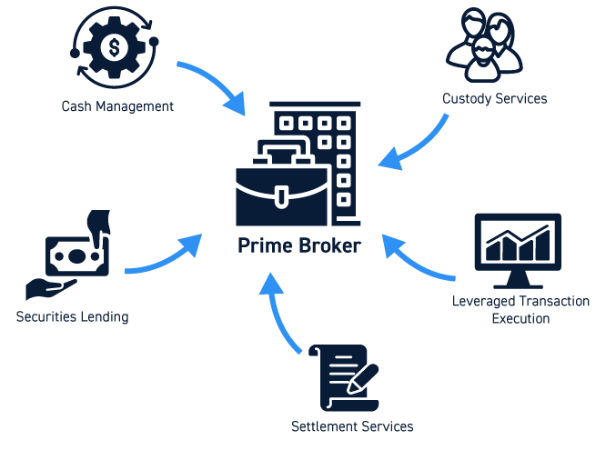

## Table of Contents

## What is a broker execution?

A broker execution is when a broker buys or sells something for you, like stocks or other investments. When you decide you want to buy or sell, you tell your broker what you want to do. The broker then goes to the market and makes the trade happen for you. This is important because it helps you get the investments you want without having to do all the work yourself.

Brokers use different ways to execute trades. Some brokers might do it quickly to get the best price right away. Others might take a bit more time to try and get an even better price. The way they do it can affect how much you pay or how much you get from selling. It's good to know how your broker executes trades so you can choose the best one for your needs.

## How does broker execution work?

When you want to buy or sell stocks or other investments, you tell your broker what you want to do. The broker then goes to the market and makes the trade happen for you. This is called broker execution. It's like the broker is your helper who does the buying and selling for you. They use special systems and tools to find the best place to make the trade, whether it's on a stock exchange or through another broker.

Brokers can use different methods to execute your trade. Some might do it really fast to get the best price right away. This is good if you want to be sure your trade happens quickly. Other brokers might take a bit more time to try and get an even better price. This can be good if you're not in a hurry and want to save a bit of money. The way your broker executes trades can affect how much you pay or how much you get when you sell, so it's important to understand their methods and choose the one that fits your needs best.

## What are the different types of broker execution?

There are several types of broker execution, and each one works a bit differently. One type is called market order execution. This is when you tell your broker to buy or sell something right away at the current market price. It's fast, so you know your trade will happen quickly, but the price might not be the best because it depends on what's happening in the market at that moment.

Another type is limit order execution. With this, you tell your broker the exact price at which you want to buy or sell. Your trade will only happen if the market reaches that price. This can be good if you want to be sure you get a certain price, but it might take longer because the market has to reach your price before the trade happens.

There's also stop order execution. This one is a bit like a limit order, but it's used to protect you from big losses. You set a stop price, and if the market reaches that price, your broker will execute the trade. It's like a safety net that helps you sell before the price drops too much or buy before the price goes up too much. Each type of execution has its own benefits, so it's good to know which one fits your needs best.

## What is the difference between market and limit orders in broker execution?

A market order is when you tell your broker to buy or sell something right away at the current market price. It's quick and makes sure your trade happens fast. But, the price you get might not be the best because it depends on what the market is doing at that exact moment. If you want to be sure your trade happens without delay, a market order is a good choice.

A limit order is different because you tell your broker the exact price at which you want to buy or sell. Your trade will only happen if the market reaches that price. This can be good if you want to make sure you get a certain price, but it might take longer because the market needs to reach your price before the trade can happen. If you're not in a hurry and want to aim for a specific price, a limit order works well.

## How does the speed of broker execution affect trading?

The speed of broker execution can make a big difference in trading. When you use a market order, your broker tries to buy or sell your investment as fast as possible. This can be good if you want to make sure your trade happens right away. But, because it happens so quickly, you might not get the best price. The price you get depends on what the market is doing at that exact moment. If the market is moving fast, the price could be a bit different from what you expected.

On the other hand, if you use a limit order, your broker takes a bit more time to try and get the exact price you want. This means your trade might not happen as quickly, but you have a better chance of getting the price you want. If you're not in a hurry, this can save you money. The speed of execution is important because it can affect how much you pay or how much you get when you sell. Choosing the right type of order depends on whether you care more about speed or getting a specific price.

## What are the common fees associated with broker execution?

When you use a broker to buy or sell stocks or other investments, you might have to pay some fees. One common fee is called a commission. This is what the broker charges you for making the trade happen. The amount can be different depending on the broker and the type of trade. Some brokers might charge a flat fee, like a few dollars for each trade, while others might charge a percentage of the total amount of your trade.

Another fee you might see is called a spread. This is the difference between the price you pay to buy something and the price you get when you sell it. Brokers make money from this difference, and it can affect how much you end up paying or getting. Sometimes, there might also be other fees, like fees for keeping your account open or fees for not trading enough. It's a good idea to check with your broker to know all the fees you might have to pay.

## How can one evaluate the quality of a broker's execution?

To evaluate the quality of a broker's execution, you should look at how fast they can complete your trades and how good the prices are that they get for you. A good broker will be able to buy or sell your stocks quickly, especially if you use a market order. But speed isn't everything. You also want to make sure that the prices they get are close to the best prices available in the market. If a broker can do both—execute trades quickly and at good prices—they are probably doing a good job.

Another way to check the quality of a broker's execution is by looking at their fees and any other costs. Some brokers might charge you a lot of money for each trade, which can eat into your profits. Others might have lower fees but take longer to execute your trades or get worse prices. It's important to find a balance. You can also read reviews from other people who use the same broker to see what they think about the execution quality. By considering all these things—speed, price, and fees—you can get a good idea of how well a broker is performing.

## What role does slippage play in broker execution?

Slippage is what happens when the price you get for a trade is different from the price you expected. This can happen when you use a market order because the broker has to buy or sell your investment right away. If the market is moving fast, the price might change before your trade is done. This means you might end up paying more or getting less than you thought you would. Slippage is normal, but too much of it can make trading less profitable.

To manage slippage, you can use a limit order instead of a market order. With a limit order, you tell your broker the exact price you want to buy or sell at. Your trade will only happen if the market reaches that price. This can help you avoid big differences between the price you want and the price you get. But, using a limit order means your trade might not happen as quickly, so you have to decide if you want to wait for a better price or get the trade done fast.

## How do regulatory requirements impact broker execution practices?

Regulatory requirements can have a big impact on how brokers do their job. Rules from places like the Securities and Exchange Commission (SEC) or the Financial Industry Regulatory Authority (FINRA) make sure that brokers act fairly and in the best interest of their clients. These rules might say that brokers need to give clients the best price they can find when they buy or sell stocks. This is called the "best execution" rule. Because of these rules, brokers have to work hard to find the best prices and be open about how they do their trades.

These rules also mean that brokers have to keep good records of their trades and report them correctly. This helps make sure everything is done right and that there's no cheating. Sometimes, these rules can make the process of buying and selling a bit slower because brokers have to follow strict steps. But, these rules are there to protect you and make sure the market is fair for everyone.

## What advanced strategies can traders use to optimize broker execution?

Traders can use a few smart strategies to make their broker execution better. One strategy is called "order slicing." This means breaking up a big trade into smaller pieces. By doing this, traders can hide their big orders from the market and get better prices. It's like buying a big cake in small slices instead of all at once, which can help keep the price from going up too fast. Another strategy is using "[algorithmic trading](/wiki/algorithmic-trading)." This is when traders use computer programs to make trades automatically. These programs can look at the market and make trades at the best times to get the best prices.

Another way to optimize broker execution is by using "smart order routing." This means the broker's system looks at different places to make the trade and chooses the one with the best price. It's like shopping around to find the best deal. Traders can also use "time of day" strategies. This means making trades at certain times when the market is less busy, which can help get better prices. By using these strategies, traders can make their trades happen more smoothly and save money.

## How does broker execution vary across different financial markets?

Broker execution can be different depending on which financial market you are trading in. In the stock market, brokers usually use electronic systems to buy and sell stocks quickly. They might use market orders to get trades done fast or limit orders to try and get a better price. The stock market is very busy, so brokers have to be quick and smart to get the best deals for their clients. In the [forex](/wiki/forex-system) market, where people trade currencies, broker execution can be a bit different. Forex markets are open 24 hours a day, so brokers can trade anytime. They often use algorithms to find the best times to make trades, and they might use different types of orders to manage the fast-changing prices.

In the futures market, where people trade contracts for things like oil or wheat, broker execution also has its own ways. Futures markets can be very fast-moving, so brokers use special systems to handle the trades quickly. They might use market orders to get in and out of trades fast, or they might use stop orders to protect against big losses. Each market has its own rules and ways of doing things, so brokers need to know these well to help their clients get the best results. By understanding how broker execution works in different markets, traders can choose the best strategies for their needs.

## What future trends are expected to influence broker execution?

In the future, technology is going to change how brokers do their jobs. One big trend is the use of [artificial intelligence](/wiki/ai-artificial-intelligence) (AI) and [machine learning](/wiki/machine-learning). These tools can help brokers make trades faster and smarter. They can look at lots of data to find the best times and prices to buy or sell. This can make broker execution even better and help traders get better deals. Another trend is the growth of blockchain technology. Blockchain can make trading safer and more transparent. It can also make it easier to do trades without needing a middleman, which could change how brokers work.

Another trend that will affect broker execution is the push for more rules and regulations. Governments and organizations around the world want to make sure that trading is fair and safe. This means brokers will have to follow even stricter rules about how they do their trades. These rules can slow things down a bit, but they also help protect traders. Overall, these trends show that broker execution will keep getting better, safer, and more efficient in the future.

## References & Further Reading

[1]: Biais, B., Foucault, T., & Moinas, S. (2015). ["Equilibrium High-Frequency Trading."](https://www.sciencedirect.com/science/article/abs/pii/S0304405X15000288) Journal of Financial Economics, 116(2), 292-313.

[2]: Aldridge, I. (2013). ["High-Frequency Trading: A Practical Guide to Algorithmic Strategies and Trading Systems,"](https://www.amazon.com/High-Frequency-Trading-Practical-Algorithmic-Strategies/dp/1118343506) 2nd Edition, Wiley.

[3]: Bouchaud, J.-P., Farmer, J. D., & Lillo, F. (2009). ["How Markets Slowly Digest Changes in Supply and Demand."](https://arxiv.org/abs/0809.0822) In J.-P. Bouchaud, M. Potters, & M. Meyer (Eds.), Lessons from Derivatives Markets: Financial Markets for Physicists.

[4]: Lopez de Prado, M. (2018). ["Advances in Financial Machine Learning."](https://www.amazon.com/Advances-Financial-Machine-Learning-Marcos/dp/1119482089) Wiley.

[5]: Kissell, R. (2013). ["The Science of Algorithmic Trading and Portfolio Management."](https://www.sciencedirect.com/book/9780124016897/the-science-of-algorithmic-trading-and-portfolio-management) Academic Press.

[6]: Cartea, A., Jaimungal, S., & Penalva, J. (2015). ["Algorithmic and High-Frequency Trading."](https://assets.cambridge.org/97811070/91146/frontmatter/9781107091146_frontmatter.pdf) Cambridge University Press.