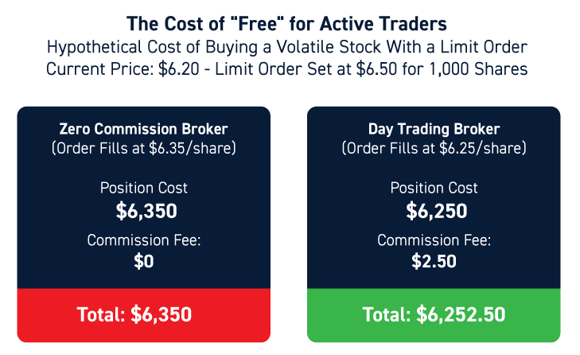

## Table of Contents

## What are broker fees?

Broker fees are charges that a broker, or a person who helps you buy or sell things like stocks, real estate, or insurance, might ask you to pay for their services. These fees can vary depending on what you're buying or selling and how much help you need from the broker. For example, if you're buying a house, the broker might charge a percentage of the house's price as their fee.

Sometimes, broker fees can be confusing because they might be called different names like commissions, transaction fees, or service charges. It's important to ask your broker about all the fees before you start working with them so you know exactly what you'll have to pay. This way, you can plan your budget better and avoid any surprises later on.

## How are broker fees calculated?

Broker fees are calculated based on different things depending on what you are buying or selling. For example, if you are trading stocks, the broker might charge a flat fee for each trade you make, like $5 or $10 per trade. Or, they might charge a percentage of the total amount of money you are trading, like 0.5% of the trade value. For real estate, the broker usually charges a percentage of the home's selling price, often around 5% to 6% of the total price, which is split between the buyer's and seller's agents.

Sometimes, the way broker fees are calculated can be more complicated. For instance, some brokers might have different fee structures for different types of services or for different levels of service. They might charge more if you need extra help or advice. It's also common for brokers to have minimum fees, so even if the calculated fee is very small, you might still have to pay a certain amount. Always ask your broker to explain how they calculate their fees so you understand exactly what you will be paying.

## What is turnover in the context of trading?

Turnover in trading is the total value of all the buying and selling that happens in a market over a certain time, like a day or a year. It's like keeping score of how much trading is going on. If you hear someone say the stock market had a turnover of $100 billion in a day, it means that all the buying and selling of stocks that day added up to $100 billion.

For someone trading, turnover can also mean how often they buy and sell their investments. If a trader buys and sells a lot, they have a high turnover. This can be important because trading a lot can lead to higher costs from fees and taxes. So, traders need to think about how much they are turning over their portfolio and if it's worth it.

## Can you explain how broker fees per turnover work?

Broker fees per turnover mean the fees you pay each time you buy or sell something, like stocks or real estate. If you trade a lot, these fees can add up quickly. For example, if your broker charges $10 every time you buy or sell a stock, and you do this 10 times in a month, you'll pay $100 in fees just for that month.

These fees can affect how much money you make from trading. If you're turning over your investments a lot, the fees can eat into your profits. That's why it's important to think about how often you trade and if the fees are worth it. Sometimes, it might be better to trade less often to keep your costs down and keep more of your money.

## What is the typical range of broker fees per turnover?

Broker fees per turnover can vary a lot depending on what you're trading and which broker you use. For stock trading, many brokers charge between $0 and $10 per trade. Some brokers offer free trades to attract more customers, but they might make money in other ways, like charging for other services or getting payments from companies whose stocks you buy.

For real estate, broker fees are usually a percentage of the home's price. This percentage is often between 5% and 6% of the total price. This fee is split between the buyer's and seller's agents, so each might get around 2.5% to 3% of the home's price. These fees can be a big part of the cost of buying or selling a home, so it's important to understand them before you start.

## How do broker fees per turnover vary across different brokers?

Broker fees per turnover can be different from one broker to another. For stock trading, some brokers might charge nothing at all for each trade. They do this to get more people to use their services. Other brokers might charge a small fee, like $5 or $10 per trade. The exact amount can depend on things like how much you trade or what kind of account you have. Some brokers might even charge more if you need extra help or advice.

For real estate, broker fees are usually a part of the home's price. Most of the time, these fees are between 5% and 6% of what the home costs. This money is split between the agents who help the buyer and the seller. But, not all real estate brokers charge the same. Some might be willing to work for less, especially if the market is slow, or they might charge more if they offer special services. It's a good idea to talk to different brokers to see what they charge before you decide who to work with.

## What factors influence the amount of broker fees per turnover?

Broker fees per turnover can change based on a few things. One big thing is what you are trading. For example, if you are trading stocks, some brokers might not charge you anything at all for each trade. They do this to get more people to use their services. But other brokers might charge a small fee, like $5 or $10 per trade. The exact amount can depend on how much you trade or what kind of account you have. If you need extra help or advice, some brokers might charge you more.

For real estate, broker fees are usually a part of the home's price. Most of the time, these fees are between 5% and 6% of what the home costs. This money is split between the agents who help the buyer and the seller. But not all real estate brokers charge the same. Some might be willing to work for less, especially if the market is slow, or they might charge more if they offer special services. It's a good idea to talk to different brokers to see what they charge before you decide who to work with.

## How can one minimize broker fees per turnover?

One way to minimize broker fees per turnover is by choosing a broker that offers low or no fees for each trade. Many brokers now offer free stock trading to attract more customers. By doing some research and comparing different brokers, you can find one that fits your needs and helps you save money on fees. Another way to cut down on fees is to trade less often. If you buy and sell a lot, the fees can add up quickly. By holding onto your investments for longer periods, you can reduce the number of times you pay fees.

You can also look for brokers that have different fee structures based on how much you trade or the type of account you have. Some brokers offer lower fees if you trade a lot or if you have a certain type of account, like a premium account. It's also a good idea to ask your broker about any discounts or promotions they might have. Sometimes, brokers offer special deals that can help you save on fees. By understanding how your broker calculates their fees and looking for ways to reduce them, you can keep more of your money.

## Are there any strategies to negotiate lower broker fees per turnover?

One way to negotiate lower broker fees per turnover is to talk to your broker about the fees they charge. You can ask if they can lower the fees, especially if you trade a lot or if you're thinking about moving to another broker that charges less. Sometimes, brokers are willing to give you a better deal if it means keeping you as a customer. You can also ask if they have any special deals or discounts that could help you save money on fees.

Another strategy is to compare fees from different brokers. If you find a broker that charges less, you can use this information to negotiate with your current broker. You could say something like, "I found another broker that charges less per trade. Can you match their fees?" This shows your broker that you're looking at other options and might be willing to switch if they don't lower their fees. By being open about your options and willing to negotiate, you might be able to get a better deal on your broker fees.

## How do broker fees per turnover impact overall investment returns?

Broker fees per turnover can lower your overall investment returns. Every time you buy or sell something, you have to pay a fee. If you trade a lot, these fees can add up and take away from the money you make from your investments. For example, if you make a $100 profit on a trade but have to pay a $10 fee, your real profit is only $90. Over time, these fees can eat into your returns and make it harder to grow your money.

To keep more of your returns, you can try to trade less often or find a broker with lower fees. If you hold onto your investments for a longer time, you won't have to pay as many fees. Also, some brokers offer free trades or lower fees if you trade a lot or have a special account. By choosing the right broker and trading strategy, you can reduce how much broker fees take away from your investment returns.

## What are the regulatory aspects concerning broker fees per turnover?

Broker fees per turnover are watched by government rules to make sure they are fair. In the United States, the Securities and Exchange Commission (SEC) and the Financial Industry Regulatory Authority (FINRA) set rules for how much brokers can charge and how they have to tell people about their fees. These rules help make sure that brokers are clear about their fees and don't charge too much. If a broker doesn't follow these rules, they can get in trouble and have to pay fines.

These rules also say that brokers have to show their fees clearly on their websites and in their documents. This helps people understand what they will have to pay before they start trading. If someone thinks a broker is charging too much or not being clear about their fees, they can complain to the SEC or FINRA. These groups can then check if the broker is following the rules and help make things right if they are not.

## How do international broker fees per turnover compare to domestic ones?

International broker fees per turnover can be different from domestic ones. When you trade stocks or other things in another country, you might have to pay more fees. This is because there are extra costs for things like currency exchange and dealing with different rules in other countries. For example, if you are in the United States and you want to trade stocks in Europe, you might have to pay a fee to change your money into euros, and then another fee to the broker for making the trade. These extra costs can make international trading more expensive than trading in your own country.

But, the exact fees can vary a lot depending on the broker and the country you are trading in. Some brokers might charge less for international trades to attract more customers. Others might charge more because they have to deal with more complicated rules and costs. It's a good idea to compare different brokers and their fees before you start trading internationally. This way, you can find the best deal and understand all the costs you might have to pay.

## What is the turnover in algo trading?

Turnover in algorithmic trading represents the total [volume](/wiki/volume-trading-strategy) of trades executed by a trading system within a specific period. This metric is essential in understanding the scale and activity level of a trading strategy. High-frequency trading ([HFT](/wiki/high-frequency-trading-strategies)) strategies typically exhibit high turnovers due to the significant number of trades executed within short time frames. These strategies leverage speed and automation to exploit small price movements, and as a result, they generate a large volume of transactions.

Managing turnover is vital for controlling costs and enhancing profitability in algorithmic trading. High turnover can lead to increased transaction costs, including broker fees, which cumulatively can impact the net profits of a trading strategy. Effective management ensures that the costs associated with high turnover do not outweigh the potential trading gains.

A crucial aspect of turnover management is calculating turnover rate, defined as:

$$
\text{Turnover Rate} = \frac{\text{Total Value of Trades}}{\text{Assets Under Management}}
$$

This formula helps traders understand the proportion of assets being traded relative to the total holdings, providing insights into the strategy's activity level and associated risks. By monitoring this ratio, traders can make informed decisions to optimize their trading activities.

Strategies to manage turnover involve refining trading algorithms to enhance decision accuracy and optimizing execution to minimize unwarranted trades. Additionally, using technology like smart order routing systems can improve trade execution quality, further reducing transaction costs associated with excessive turnover.

In summary, managing turnover effectively in algorithmic trading is crucial for maintaining a balance between executing a high number of trades and controlling related costs. This balance is key to maximizing the profitability of trading strategies.

## What is the impact of broker fees on algo trading?

Broker fees play a pivotal role in determining the profitability of algorithmic trading strategies. When these fees are high relative to turnover, they can significantly erode profit margins. This is particularly crucial for high-frequency trading strategies, where the volume of transactions is substantial. To illustrate, consider a scenario where a strategy generates a gross return of 0.5% per trade. If broker fees total 0.3% per trade, the net return diminishes to 0.2%. This reduction could potentially turn a marginally profitable strategy into an unprofitable one.

The cumulative effect of broker fees becomes even more pronounced in highly automated environments. In algorithmic trading, where large volumes of trades are executed in quick succession, even seemingly small fees can accumulate rapidly, impacting overall performance. For example, if an algorithm executes 1,000 trades per day with a broker fee of $1 per trade, the daily cost sums up to $1,000. Over time, these costs can significantly affect the total returns.

Mathematically, the impact of broker fees on net profitability can be expressed using the formula:

$$
\text{Net Profit} = \text{Gross Profit} - (\text{Broker Fees} \times \text{Turnover})
$$

Where:
- Net Profit is the final profit after fees.
- Gross Profit is the profit before fees.
- Broker Fees are the charges per trade.
- Turnover is the volume or number of trades.

Understanding these costs thoroughly and finding ways to reduce them is essential for achieving sustained trading performance. By minimizing broker fees, traders can better preserve their profit margins, ensuring that strategies remain viable over time. In practice, this might involve opting for brokers with more competitive fee structures, negotiating fees based on trading volume, or employing advanced technologies to optimize trade execution.

## References & Further Reading

[1]: Bergstra, J., Bardenet, R., Bengio, Y., & Kégl, B. (2011). ["Algorithms for Hyper-Parameter Optimization."](https://papers.nips.cc/paper/4443-algorithms-for-hyper-parameter-optimization) Advances in Neural Information Processing Systems 24.

[2]: ["Advances in Financial Machine Learning"](https://www.amazon.com/Advances-Financial-Machine-Learning-Marcos/dp/1119482089) by Marcos Lopez de Prado

[3]: ["Evidence-Based Technical Analysis: Applying the Scientific Method and Statistical Inference to Trading Signals"](https://www.amazon.com/Evidence-Based-Technical-Analysis-Scientific-Statistical/dp/0470008741) by David Aronson

[4]: ["Machine Learning for Algorithmic Trading"](https://github.com/PacktPublishing/Machine-Learning-for-Algorithmic-Trading-Second-Edition) by Stefan Jansen

[5]: ["Quantitative Trading: How to Build Your Own Algorithmic Trading Business"](https://books.google.com/books/about/Quantitative_Trading.html?id=j70yEAAAQBAJ) by Ernest P. Chan