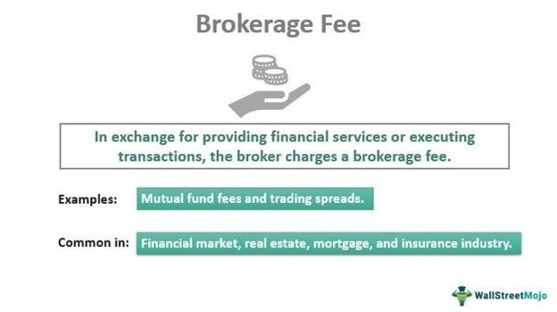

Algorithmic trading, a significant advancement in modern financial markets, facilitates order execution at speeds and frequencies far beyond human capability. This method relies heavily on computer algorithms to make trading decisions, enabling the processing of numerous transactions swiftly and efficiently. The shift from traditional trading to algorithmic trading has revolutionized the market, offering increased liquidity, reduced transaction costs, and enhanced accuracy in trades.

A critical element in algorithmic trading is the understanding and management of brokerage fees relative to turnover. Broker fees, encompassing commissions, spreads, and other transactional charges, can significantly impact the profitability of trading strategies. In high-frequency trading, where thousands of trades may be executed daily, these fees can accumulate rapidly, eroding profit margins and potentially converting profitable trades into losses if not managed correctly.

This article aims to explore broker fees and their effects on trading performance, providing strategies for optimizing these costs within algorithmic trading frameworks. Understanding the intricate balance between turnover and associated costs is essential for traders seeking to maximize profitability in this competitive environment. By examining techniques for cost reduction and the role of technology in efficient fee management, traders can enhance their operational effectiveness.

## Table of Contents

## Understanding Broker Fees

Broker fees are essential considerations for anyone engaged in trading, whether in traditional or algorithmic forms. These fees represent the charges levied by brokerage firms to facilitate the buying and selling of financial instruments on behalf of traders. They are the financial intermediary's means of generating revenue and can significantly impact trading strategies, particularly those involving high-frequency transactions.

These fees typically manifest in several forms. Commission fees are perhaps the most straightforward, where a fixed or percentage-based fee is charged per transaction. Spreads, another form of broker fees, are the difference between the buy (ask) price and the sell (bid) price, applicable particularly to [forex](/wiki/forex-system) and CFD trading. Additionally, brokers may charge other transactional fees, such as account maintenance fees, data feed costs, or fees for accessing certain trading platforms or tools.

In [algorithmic trading](/wiki/algorithmic-trading), where algorithms execute a large number of trades at high speeds, broker fees can accumulate rapidly. The high turnover rates characteristic of such trading systems mean that even seemingly negligible fees per transaction can aggregate to substantial sums over time. This accumulation can dampen the profit margins, as the costs incurred through frequent transactions begin to add up. For example, if a broker charges a $0.005 per share commission, an algorithm executing 100,000 trades a day can result in a daily fee of $500, which underscores the significance of managing these costs effectively.

Thus, a comprehensive understanding of how brokers structure their fees and the implications of these fees on trading activities is crucial for optimizing the performance of algorithmic trading systems. This knowledge enables traders to select brokers and strategies that align with their financial goals, ensuring that fees do not become an unreasonable burden on trading profits.

## Turnover in Algo Trading

Turnover in algorithmic trading represents the total [volume](/wiki/volume-trading-strategy) of trades executed by a trading system within a specific period. This metric is essential in understanding the scale and activity level of a trading strategy. High-frequency trading ([HFT](/wiki/high-frequency-trading-strategies)) strategies typically exhibit high turnovers due to the significant number of trades executed within short time frames. These strategies leverage speed and automation to exploit small price movements, and as a result, they generate a large volume of transactions.

Managing turnover is vital for controlling costs and enhancing profitability in algorithmic trading. High turnover can lead to increased transaction costs, including broker fees, which cumulatively can impact the net profits of a trading strategy. Effective management ensures that the costs associated with high turnover do not outweigh the potential trading gains.

A crucial aspect of turnover management is calculating turnover rate, defined as:

$$
\text{Turnover Rate} = \frac{\text{Total Value of Trades}}{\text{Assets Under Management}}
$$

This formula helps traders understand the proportion of assets being traded relative to the total holdings, providing insights into the strategy's activity level and associated risks. By monitoring this ratio, traders can make informed decisions to optimize their trading activities.

Strategies to manage turnover involve refining trading algorithms to enhance decision accuracy and optimizing execution to minimize unwarranted trades. Additionally, using technology like smart order routing systems can improve trade execution quality, further reducing transaction costs associated with excessive turnover.

In summary, managing turnover effectively in algorithmic trading is crucial for maintaining a balance between executing a high number of trades and controlling related costs. This balance is key to maximizing the profitability of trading strategies.

## Impact of Broker Fees on Algo Trading

Broker fees play a pivotal role in determining the profitability of algorithmic trading strategies. When these fees are high relative to turnover, they can significantly erode profit margins. This is particularly crucial for high-frequency trading strategies, where the volume of transactions is substantial. To illustrate, consider a scenario where a strategy generates a gross return of 0.5% per trade. If broker fees total 0.3% per trade, the net return diminishes to 0.2%. This reduction could potentially turn a marginally profitable strategy into an unprofitable one.

The cumulative effect of broker fees becomes even more pronounced in highly automated environments. In algorithmic trading, where large volumes of trades are executed in quick succession, even seemingly small fees can accumulate rapidly, impacting overall performance. For example, if an algorithm executes 1,000 trades per day with a broker fee of $1 per trade, the daily cost sums up to $1,000. Over time, these costs can significantly affect the total returns.

Mathematically, the impact of broker fees on net profitability can be expressed using the formula:

$$
\text{Net Profit} = \text{Gross Profit} - (\text{Broker Fees} \times \text{Turnover})
$$

Where:
- Net Profit is the final profit after fees.
- Gross Profit is the profit before fees.
- Broker Fees are the charges per trade.
- Turnover is the volume or number of trades.

Understanding these costs thoroughly and finding ways to reduce them is essential for achieving sustained trading performance. By minimizing broker fees, traders can better preserve their profit margins, ensuring that strategies remain viable over time. In practice, this might involve opting for brokers with more competitive fee structures, negotiating fees based on trading volume, or employing advanced technologies to optimize trade execution.

## Strategies for Reducing Broker Fees

Reducing broker fees in algorithmic trading involves strategic decisions that can significantly enhance profitability. One of the most effective methods is to choose brokers with competitive fee structures. By comparing different brokers, traders can find options that offer lower commission rates, tighter spreads, or reduced transactional charges. This selection process can directly reduce the cost incurred per trading turnover, maximizing profit margins.

Negotiating better terms with brokers can also lead to substantial cost savings, particularly for those engaging in high-frequency trading (HFT). Brokers may offer discounts or tailored fee structures to traders who maintain a high volume of transactions, leading to reduced per-trade costs. Establishing a strong relationship and proving consistent volume potential can be leverage during such negotiations.

Another strategy involves leveraging modern technologies to minimize unnecessary costs. Smart Order Routing (SOR) systems can intelligently direct trades to various marketplaces, seeking the best possible execution conditions. These systems utilize algorithms to evaluate market conditions and venue [liquidity](/wiki/liquidity-risk-premium), aiming to achieve optimal pricing and lower transactional expenses. This process can involve selecting routes where intermediary fees are minimized, contributing to overall cost-effectiveness.

Integrating advanced technology solutions can further diminish trading costs. For instance, using cutting-edge platforms like PineConnector can streamline the integration and execution of trades across different market environments. These platforms often provide tools for automating the trade execution process, ensuring that trades are executed at advantageous price points while minimizing slippage and hidden fees.

Incorporating these strategies can yield significant reductions in broker fees, which, over time, contribute to a more profitable and sustainable trading strategy. By focusing on broker relationships, fee negotiations, and technological advancements, traders can optimize their operations to achieve greater financial efficiency.

## The Role of Technology in Cost Management

Technological advancements have become pivotal in enabling traders to enhance their strategies and lower transaction costs within algorithmic trading. Modern trading platforms and tools provide sophisticated features that empower traders to execute orders with greater precision and efficiency, thus minimizing unnecessary expenses.

One of the key aspects of technology in managing costs is the utilization of advanced algorithms for order execution. These algorithms are designed to identify optimal trade opportunities by analyzing market conditions in real-time, which can lead to achieving better price points and reducing slippage. For instance, execution algorithms such as the Time-Weighted Average Price (TWAP) or Volume-Weighted Average Price (VWAP) are engineered to break large orders into smaller, more manageable pieces, reducing the market impact and transaction costs.

Beyond execution algorithms, technologies like smart order routing play a crucial role in cost management. These systems intelligently route orders to various exchanges and market makers to secure the best possible prices while considering factors such as fees, order size, and market depth. By automating this process, traders can reduce manual errors and optimize trade executions.

Moreover, platforms like PineConnector facilitate the seamless integration of multiple trading systems and brokerages, streamlining the trade execution process. This integration minimizes latency and enhances the ability to execute trades accurately and swiftly, thus reducing both opportunity costs and explicit transaction costs. PineConnector, for example, offers compatibility with various trading strategies and platforms, enabling traders to efficiently manage their algo trades without incurring additional overheads.

In summary, leveraging modern technologies and software tools allows traders to manage costs effectively by optimizing the execution of trades and minimizing transaction-related expenses. By implementing advanced algorithms and using platforms that enable efficient execution and integration, traders can significantly improve their overall trading strategy's profitability.

## Conclusion

In the fast-paced world of algo trading, managing broker fees relative to turnover is essential for maintaining profitability. Trading systems that fail to account for these costs can see their profit margins diminish, potentially turning a lucrative strategy into a financial drain. Therefore, traders must assess their fee structures consistently, exploring every opportunity to minimize these expenses.

Utilizing strategies such as opting for brokers with competitive fee structures and negotiating better terms for high-frequency trades can yield substantial savings. Moreover, incorporating advanced technologies, like smart order routing and execution algorithms, can further enhance cost efficiency. These technologies not only enable better price points but also reduce unnecessary transaction costs, optimizing trading strategies for maximum return.

Developing strong broker relationships plays a crucial role in cost optimization. In partnership with brokers, traders can secure favorable terms that align with their trading volumes and styles. This synergy can lead to lower fees, enhancing overall trading performance.

By embracing the right blend of technology and strategic broker relationships, algorithmic traders can significantly boost their operational efficiency. This results in a more robust trading mechanism capable of yielding better financial outcomes in a competitive market.

## References & Further Reading

[1]: Bergstra, J., Bardenet, R., Bengio, Y., & Kégl, B. (2011). ["Algorithms for Hyper-Parameter Optimization."](https://papers.nips.cc/paper/4443-algorithms-for-hyper-parameter-optimization) Advances in Neural Information Processing Systems 24.

[2]: ["Advances in Financial Machine Learning"](https://www.amazon.com/Advances-Financial-Machine-Learning-Marcos/dp/1119482089) by Marcos Lopez de Prado

[3]: ["Evidence-Based Technical Analysis: Applying the Scientific Method and Statistical Inference to Trading Signals"](https://www.amazon.com/Evidence-Based-Technical-Analysis-Scientific-Statistical/dp/0470008741) by David Aronson

[4]: ["Machine Learning for Algorithmic Trading"](https://github.com/PacktPublishing/Machine-Learning-for-Algorithmic-Trading-Second-Edition) by Stefan Jansen

[5]: ["Quantitative Trading: How to Build Your Own Algorithmic Trading Business"](https://books.google.com/books/about/Quantitative_Trading.html?id=j70yEAAAQBAJ) by Ernest P. Chan