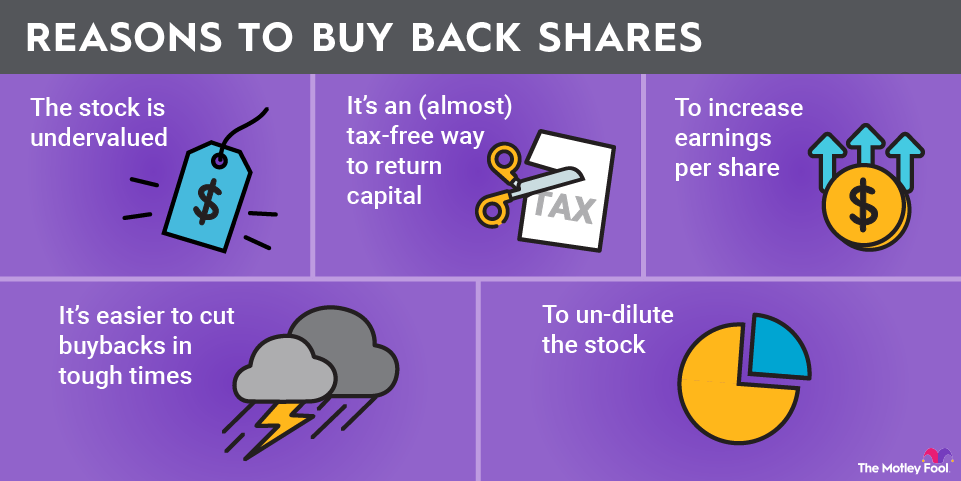

## Table of Contents

## What is a share buyback?

A share buyback, also known as a stock repurchase, is when a company buys back its own shares from the marketplace. This means the company is essentially investing in itself by reducing the number of shares available to the public. Companies might decide to do this for various reasons, like if they think their stock is undervalued, or if they want to increase the value of the remaining shares by making them rarer.

When a company buys back its shares, it uses its own money, which could come from profits or other funds. This can be good for shareholders because it often means the value of their shares might go up. Fewer shares mean each share represents a bigger piece of the company. However, it can also mean the company is not using that money to grow or invest in new projects, which could be a concern for some investors.

## What is a bear market?

A bear market is when the prices of stocks go down a lot, usually by 20% or more, and stay down for a while. It's called a bear market because the bear's swipe is downward, just like how stock prices fall. When this happens, people often feel worried about their money and might sell their stocks, which can make prices fall even more.

During a bear market, it can be hard to make money from stocks because their value is going down. People might wait to buy stocks until prices are lower, hoping to buy them cheaper. But it's also a time when some investors look for good deals, buying stocks they think will go back up when the market gets better. It's all about being careful and trying to see what might happen next.

## Why might a company engage in share buybacks during a bear market?

A company might decide to buy back its shares during a bear market because it believes its stock is undervalued. When stock prices fall a lot, like they do in a bear market, the company can buy its shares back for less money than usual. This can be a smart move because the company is using its cash to invest in itself at a lower price. It's like getting a discount on your own company, which can be good for the shareholders who keep their shares because their part of the company becomes worth more.

Another reason a company might do share buybacks in a bear market is to show confidence to investors. When everyone is worried and selling, a company buying its own shares can signal that it believes in its future. This can help calm down investors and might even encourage them to hold onto their shares or buy more. It's a way for the company to say, "We think our stock is a good deal right now, and we're willing to put our money where our mouth is."

## What are the basic responsibilities of a broker in handling share buybacks?

A broker's main job during a share buyback is to buy the company's shares back from the market. The company gives the broker money and instructions on how many shares to buy and at what price. The broker then goes into the stock market and starts buying the shares, making sure to follow the rules the company set. It's important for the broker to do this carefully because they need to get the best price they can for the company.

Another responsibility of the broker is to keep everything clear and honest. They need to report back to the company about how the buyback is going, how many shares they bought, and at what price. This helps the company know if the buyback is working out as planned. The broker also has to follow all the rules and laws about buying back shares, so everything stays fair and legal.

## How do brokers ensure compliance with regulations during share buybacks in a bear market?

During a share buyback in a bear market, brokers make sure to follow the rules by keeping a close eye on how they buy the shares. They have to be careful not to buy too many shares at once, which could make the stock price go up too quickly. This is important because the rules say that buybacks should not mess with the normal way the market works. So, brokers spread out their buying over time and make sure they don't do anything that looks like they're trying to trick the market.

Brokers also have to report everything they do to the company and sometimes to the people who watch over the stock market. They keep detailed records of how many shares they bought, when they bought them, and at what price. This helps everyone see that the buyback is happening the right way. If there are any special rules during a bear market, like extra checks or different limits on how to buy shares, brokers make sure to follow those too, so the buyback stays fair and legal.

## What specific challenges do brokers face when executing buybacks in a declining market?

When brokers try to buy back shares in a market that's going down, they face some tough challenges. One big problem is that the price of the shares can keep falling while they're trying to buy them. This makes it hard for brokers to decide when to buy the shares. If they wait too long hoping for a lower price, the shares might keep dropping, and they might end up buying at a higher price than they wanted. On the other hand, if they buy too soon, they might miss out on even lower prices.

Another challenge is that everyone in the market can be nervous during a bear market. People might be selling a lot of shares, which can make the market more unpredictable. Brokers have to be careful not to buy too many shares at once because that could make the price go up quickly, and that's against the rules. They need to spread out their buying over time, which can be tricky when the market is moving fast. Keeping everything fair and following the rules is also harder when the market is going down because everyone is watching closely to make sure no one is cheating.

## How can brokers manage the timing of buybacks to maximize shareholder value in a bear market?

Brokers can manage the timing of buybacks in a bear market by carefully watching the market and choosing the right moments to buy shares. They need to balance waiting for the lowest possible price with the risk of prices falling even more. If they see the stock price starting to level off or show signs of going back up, that might be a good time to start buying. They also need to spread out their buying over time to avoid pushing the price up too quickly, which could happen if they buy too many shares all at once.

It's also important for brokers to keep talking with the company they're working for. They need to explain what's happening in the market and why they're choosing certain times to buy shares. This helps the company understand that the broker is trying to get the best deal for them. By being clear and working closely with the company, brokers can make sure they're doing everything they can to increase the value of the shares for the shareholders during a tough market.

## What are the financial implications for a company conducting buybacks in a bear market, and how do brokers advise on these?

When a company decides to buy back its shares during a bear market, it uses its cash to buy its own stock at a lower price. This can be good because it means the company is getting more shares for less money, which can make the value of the remaining shares go up. However, using cash for buybacks means the company might not have that money to spend on other things, like growing the business or paying down debts. If the bear market lasts a long time, the company might need that cash for other important things, and shareholders might worry about the company's financial health.

Brokers play a big role in helping companies make smart choices about buybacks in a bear market. They look at the market closely and tell the company when might be the best time to buy shares. Brokers also make sure the company knows about the risks, like using up cash that might be needed later. They help the company understand how the buyback could affect the stock price and what it might mean for the company's future. By giving clear advice and keeping the company informed, brokers help make sure the buyback is done in a way that helps the company and its shareholders.

## How do brokers communicate with company management and shareholders during the buyback process in a bear market?

During a share buyback in a bear market, brokers keep in close touch with the company's management. They explain what's happening in the market and why they're choosing certain times to buy shares. Brokers make sure the company knows about the risks, like using up cash that might be needed later. They also talk about how the buyback could affect the stock price and what it might mean for the company's future. By giving clear and honest advice, brokers help the company make smart choices about the buyback.

Brokers also need to keep shareholders informed during the buyback process. They might send out reports or updates to let shareholders know how many shares have been bought back and at what price. This helps shareholders understand that the company is trying to increase the value of their shares, even in a tough market. By being open and clear, brokers help build trust with shareholders and show that the company is working to protect their interests during a bear market.

## What advanced strategies can brokers use to optimize share buybacks during a bear market?

Brokers can use a strategy called dollar-cost averaging to make share buybacks work better in a bear market. This means they buy shares little by little over time instead of all at once. By doing this, they can get a better average price for the shares. If the stock price keeps going down, they can buy more shares when the price is low, which can help the company get more value for its money. This way, brokers can help the company use its cash wisely and not buy too many shares at once, which could make the price go up too quickly.

Another strategy brokers can use is called limit orders. This means they set a certain price they're willing to pay for the shares and only buy them if the price drops to that level. In a bear market, this can help the company get the shares at a lower price, which is good for the shareholders. Brokers need to watch the market closely and adjust these limit orders if needed. By using these strategies, brokers can help the company buy back shares in a smart way during a tough market, making sure they get the best deal possible for the shareholders.

## How do brokers assess market conditions to adjust buyback strategies in real-time during a bear market?

Brokers keep a close eye on the market to make smart choices about buying back shares during a bear market. They look at things like how much the stock price is going down, how many people are selling their shares, and what other big news might affect the market. By watching these things, brokers can tell if the market is getting worse or starting to get better. If they see the stock price leveling off or going up a bit, they might decide it's a good time to start buying shares. They also use tools like charts and numbers to help them understand what's happening and make quick decisions.

When the market is going down, brokers need to be ready to change their plans fast. They might use a strategy called dollar-cost averaging, where they buy shares little by little over time. This helps them get a better average price for the shares. They also set limit orders, which means they only buy shares if the price drops to a certain level. By doing this, brokers can make sure they're getting the best deal for the company. They talk to the company a lot during this time, explaining what's happening and why they're making certain choices, so the company can trust that the brokers are doing their best to help during a tough market.

## What case studies or historical examples illustrate successful broker management of share buybacks in past bear markets?

During the bear market of 2008-2009, caused by the global financial crisis, many companies used share buybacks to their advantage. One example is IBM. They had a smart plan where they bought back shares slowly over time, which helped them get a good average price for the shares. By doing this, IBM showed they believed in their future, even when the market was down. This helped keep their shareholders calm and made the value of the remaining shares go up when the market got better. Brokers at IBM worked closely with the company, watching the market carefully and making sure they bought shares at the right times.

Another good example is Apple during the bear market of early 2020, caused by the COVID-19 pandemic. Apple used a strategy called dollar-cost averaging, buying shares little by little. This helped them not spend all their cash at once and get a better price for the shares. Brokers at Apple were very good at watching the market and talking to the company about what was happening. They made sure Apple bought shares when the price was low, which helped increase the value of the shares for the shareholders. By being smart and careful, Apple's brokers helped the company do well during a tough time.

## What is Understanding Share Buybacks?

Share buybacks, also known as share repurchases, occur when a company buys back its own shares from the marketplace, reducing the number of outstanding shares. This corporate financial strategy serves multiple purposes, primarily aimed at enhancing shareholder value. By reducing the number of shares, a company can increase the earnings per share (EPS), assuming profits remain stable. This is because EPS is calculated as:

$$
\text{EPS} = \frac{\text{Net Income}}{\text{Outstanding Shares}}
$$

A reduction in the denominator results in a higher EPS, potentially making the company’s stock more attractive to investors.

Share buybacks can be a signal of confidence from the company's management, indicating that they believe the stock is undervalued. Conversely, it can also be used to manipulate financial metrics like EPS. By artificially enhancing these metrics, companies may present an illusion of improved financial health without actual growth in profits.

The impact of share buybacks on stock prices can be positive. When a company announces a buyback, the reduced supply of shares often leads to a price increase due to the supply-demand principle. Investor sentiment can also shift favorably, as buybacks might suggest strong future prospects or efficient capital use. However, recent trends point to increased scrutiny over buyback activities during volatile market conditions. Critics argue that companies should prioritize reinvesting profits into their operations rather than repurchasing shares.

Recent market [volatility](/wiki/volatility-trading-strategies) has shown fluctuations in buyback activities. Companies with surplus cash might continue repurchasing shares to stabilize stock prices or utilize excess cash. Conversely, during downturns, some companies may halt buybacks to preserve cash.

There are risks and benefits associated with share buybacks. For companies, while buybacks can improve financial ratios and stock price, they also deplete cash reserves and might limit flexibility for future investments. For investors, buybacks offer potential capital gains but might pose risks if the company is over-leveraged or if buybacks are made at inflated prices, which can lead to substantial losses if the stock value subsequently drops.

Overall, share buybacks are a significant component of modern financial strategies, impacting stock valuation and investor sentiment, especially during periods of economic uncertainty.

## References & Further Reading

[1]: ["The Share Repurchase Revolution."](https://www.tapestrynetworks.com/wp-content/uploads/2024/03/IRRCI-Buybacks-and-the-Board-August-2016.pdf) Harvard Business School, Faculty Research.

[2]: Admati, A. R., & Hellwig, M. (2014). ["The Bankers' New Clothes: What's Wrong with Banking and What to Do about It."](https://archive.org/details/bankersnewclothe0000adma) Princeton University Press.

[3]: Yekutiel, D. & Spiegel, Y. (2020). ["Stock Buybacks and Corporate Strategy."](https://academic.oup.com/rcfs/article/9/3/593/5868419) Journal of Industrial Organization.

[4]: Aldridge, I. (2013). ["High-Frequency Trading: A Practical Guide to Algorithmic Strategies and Trading Systems."](https://www.amazon.com/High-Frequency-Trading-Practical-Algorithmic-Strategies/dp/1118343506) Wiley.

[5]: Fabozzi, F. J., Focardi, S. M., & Kolm, P. N. (2010). ["Quantitative Equity Investing: Techniques and Strategies."](https://www.semanticscholar.org/paper/Quantitative-Equity-Investing%3A-Techniques-and-Fabozzi-Focardi/1c49a2a53919f7e65cb96f16691b8ff726fd3cd7) Wiley.

[6]: Mulherin, J. H. (2007). ["Measuring the Costs and Benefits of Regulation: Conceptual Issues in Securities Markets."](https://www.sciencedirect.com/science/article/pii/S092911990700017X) Journal of Corporate Finance.

[7]: Baker, M. P., & Wurgler, J. (2006). ["Investor Sentiment and the Cross-Section of Stock Returns."](https://onlinelibrary.wiley.com/doi/10.1111/j.1540-6261.2006.00885.x) The Journal of Finance.