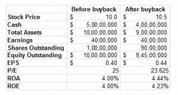

Share buybacks, bear markets, broker responsibilities, and algorithmic trading are key components of the modern financial ecosystem. Each element plays a critical role in shaping market dynamics, investor behavior, and corporate strategies, particularly during periods of volatility. 

Share buybacks, also known as stock repurchases, involve a company buying back its own shares from the marketplace. This practice often signals the company's confidence in its future prospects and can effectively increase earnings per share (EPS) by reducing the number of shares outstanding. However, it can also be used as a tool to manage stock prices and improve market perception.

Bear markets represent prolonged periods of declining stock prices, typically defined by a drop of 20% or more from recent highs. They often reflect underlying economic weaknesses and can provoke emotional responses from investors, leading to panic selling or overly cautious behavior. Understanding these markets is crucial as they both challenge and offer opportunities for investors.

Brokers serve as intermediaries in financial markets, executing buy and sell orders on behalf of investors. Their responsibilities become particularly vital during volatile times. In bear markets, brokers must provide transparent and timely communication, adhere to regulatory requirements, and offer strategic insights to help clients navigate downturns.

Algorithmic trading, which uses computer programs to execute trades based on predetermined criteria, has gained prominence due to its speed and efficiency. While algorithms can contribute to market liquidity and price discovery, they can also exacerbate volatility, particularly in declining markets.

The interconnectedness of these elements is evident during turbulent market conditions. For instance, algorithmic trading can amplify price movements caused by share buybacks or shifts in investor sentiment during a bear market. Brokers, in turn, need to manage these dynamics effectively to safeguard investor interests.

To navigate bear markets successfully, it is crucial for investors to develop well-informed strategies that include diversification, risk assessment, and the utilization of defensive sectors. Strategic planning and adaptability are essential to maintaining a resilient investment approach amid market challenges.

## Table of Contents

## Understanding Share Buybacks

Share buybacks, also known as share repurchases, occur when a company buys back its own shares from the marketplace, reducing the number of outstanding shares. This corporate financial strategy serves multiple purposes, primarily aimed at enhancing shareholder value. By reducing the number of shares, a company can increase the earnings per share (EPS), assuming profits remain stable. This is because EPS is calculated as:

$$
\text{EPS} = \frac{\text{Net Income}}{\text{Outstanding Shares}}
$$

A reduction in the denominator results in a higher EPS, potentially making the company’s stock more attractive to investors.

Share buybacks can be a signal of confidence from the company's management, indicating that they believe the stock is undervalued. Conversely, it can also be used to manipulate financial metrics like EPS. By artificially enhancing these metrics, companies may present an illusion of improved financial health without actual growth in profits.

The impact of share buybacks on stock prices can be positive. When a company announces a buyback, the reduced supply of shares often leads to a price increase due to the supply-demand principle. Investor sentiment can also shift favorably, as buybacks might suggest strong future prospects or efficient capital use. However, recent trends point to increased scrutiny over buyback activities during volatile market conditions. Critics argue that companies should prioritize reinvesting profits into their operations rather than repurchasing shares.

Recent market [volatility](/wiki/volatility-trading-strategies) has shown fluctuations in buyback activities. Companies with surplus cash might continue repurchasing shares to stabilize stock prices or utilize excess cash. Conversely, during downturns, some companies may halt buybacks to preserve cash.

There are risks and benefits associated with share buybacks. For companies, while buybacks can improve financial ratios and stock price, they also deplete cash reserves and might limit flexibility for future investments. For investors, buybacks offer potential capital gains but might pose risks if the company is over-leveraged or if buybacks are made at inflated prices, which can lead to substantial losses if the stock value subsequently drops.

Overall, share buybacks are a significant component of modern financial strategies, impacting stock valuation and investor sentiment, especially during periods of economic uncertainty.

## Navigating Bear Markets

Bear markets are defined as periods during which stock prices fall by 20% or more from recent highs, usually lasting for months or even years. They are characterized by widespread pessimism, negative investor sentiment, and economic downturns. Prominent historical examples of bear markets include the Great Depression (1929-1932), the dot-com bubble burst (2000-2002), and the global financial crisis (2007-2009). Each of these periods was marked by distinct economic conditions that prompted severe declines in market value.

Investors often exhibit behaviors rooted in fear and uncertainty during bear markets. Common reactions include panic selling, reluctance to invest further, and the preservation of assets in liquid, lower-risk investments. This herd behavior can exacerbate downturns, as the rush to sell drives prices lower, creating a self-fulfilling cycle of market decline.

To mitigate losses and safeguard their portfolios during bear markets, investors can employ various strategies. One effective approach is diversification, which involves spreading investments across a variety of asset classes, such as stocks, bonds, and real estate. This strategy reduces the impact of a poor performance in any single asset on the overall portfolio. Defensive sectors, such as utilities, healthcare, and consumer staples, are generally less sensitive to economic cycles and can provide stability during tumultuous times.

Another crucial strategy is maintaining a long-term investment perspective. While bear markets can induce short-term losses, they also present opportunities for substantial gains. Quality assets often become undervalued, and investors with patience and available capital can acquire these at a discount, positioning themselves for appreciation when the market recovers.

It is essential to balance risk tolerance with potential reward during these periods. Investors should resist the urge to time the market, as predicting the exact bottom is notoriously difficult. Instead, consistent investment through techniques like dollar-cost averaging can reduce the impact of volatility on the portfolio and lead to better long-term results.

In summary, navigating bear markets requires a disciplined approach that combines strategic diversification, emotional fortitude, and a focus on long-term goals. By doing so, investors can protect their portfolios against immediate downturns and seize opportunities that arise from temporary market dislocations.

## Broker Responsibilities in Volatile Markets

Brokers play a critical role in the financial markets, serving as intermediaries who facilitate the buying and selling of financial securities. In turbulent market conditions, their responsibilities expand beyond the mere execution of trades to encompass a range of functions critical to investor success and market stability.

During bear markets, brokers must adapt to heightened volatility and increased client concerns. One of their primary responsibilities is to provide stability through effective communication and transparency. This includes offering timely updates on market conditions, explaining the factors contributing to market movements, and discussing potential implications for portfolio performance. By maintaining open lines of communication, brokers help investors make informed decisions rather than react out of fear or uncertainty.

Transparency is paramount in these situations. Clients need clarity on how their investments are being managed and on the potential risks involved. Regulatory requirements underscore this need for transparency and ethical conduct. In the United States, for example, brokers are governed by agencies such as the Financial Industry Regulatory Authority (FINRA) and the Securities and Exchange Commission (SEC), which mandate clear disclosure of fees, commissions, and any conflicts of interest. These agencies also promote ethical considerations, ensuring brokers act in the best interest of their clients, safeguard client data confidentiality, and comply with anti-fraud measures.

Brokers also have a pivotal role in supporting investors by offering data-driven insights and leveraging risk management tools. The use of advanced analytics and financial instruments allows brokers to provide tailored advice that aligns with the client's investment goals and risk tolerance. They often employ technology to run scenario analyses or stress tests, helping predict the possible outcomes of various market conditions on a portfolio. This approach not only assists investors in understanding potential risks but also in identifying opportunities for repositioning their holdings strategically.

In addition, brokers can aid in risk management by suggesting diversification techniques and recommending hedging strategies using derivatives. For instance, they might propose options contracts as a hedge against potential losses in a downward-trending market. By doing so, brokers provide investors with a toolkit to navigate uncertain times while balancing risk and return.

In summary, brokers shoulder significant responsibilities during volatile market periods, from ensuring regulatory compliance to maintaining clear client communication and offering robust risk management support. This multi-faceted role is crucial in helping investors remain focused and strategically aligned in achieving their financial objectives, even amidst economic uncertainty.

## The Rise of Algorithmic Trading

Algorithmic trading, often referred to as algo trading, involves the use of computer algorithms to automate trading strategies, execute transactions at optimal prices, and gain a competitive advantage in financial markets. These algorithms make decisions based on predefined rules and mathematical models, analyzing vast amounts of data at high speeds. The increasing reliance on [algorithmic trading](/wiki/algorithmic-trading) has transformed the landscape of financial markets by enhancing trading efficiency, [liquidity](/wiki/liquidity-risk-premium), and market access.

### Advantages of Algorithmic Trading

The primary benefits of algorithmic trading include speed and efficiency. Algorithms can scan multiple markets and securities in seconds, executing trades much faster than any human trader. This rapid execution allows traders to capitalize on brief market inefficiencies and [arbitrage](/wiki/arbitrage) opportunities, which can be elusive to manual traders. The efficiency of algorithmic trading also helps in reducing transaction costs as algorithms can execute high-frequency trades with minimal impact on market prices.

Another advantage is the ability to back-test strategies using historical data. This allows traders and financial institutions to assess the viability of their trading strategies under various market conditions before deploying them in live markets.

### Influence on Market Dynamics

Algorithmic trading significantly influences market dynamics, especially during bear markets. Algorithms can exacerbate volatility as they react instantaneously to market conditions. During downturns, algorithm-driven sell-offs can accelerate declining prices, contributing to a self-reinforcing cycle of volatility. 

Moreover, the presence of algorithms in the market increases liquidity, making it easier for large institutional investors to manage big trades without causing major price swings. However, it is important to note that in times of extreme market stress, such as flash crashes, algorithms can also contribute to precipitous drops in asset prices.

### Risks and Challenges

Despite its advantages, algorithmic trading carries potential risks and challenges. Market disruptions caused by flawed algorithms can lead to significant financial losses. For instance, a coding error or a misconfiguration can trigger unintended transactions, leading to unintended consequences.

Algo trading also faces regulatory and ethical challenges. Regulating this space is difficult due to the speed and complexity of trades. Furthermore, the prevalence of high-frequency trading ([HFT](/wiki/high-frequency-trading-strategies)), a subset of algorithmic trading, raises concerns about market manipulation and unfair advantages.

### The Future Implications

Looking ahead, the role of algorithmic trading is expected to expand, with further integration of [artificial intelligence](/wiki/ai-artificial-intelligence) and [machine learning](/wiki/machine-learning) technologies. These advancements could lead to more sophisticated trading strategies that adapt in real-time to market changes, thereby potentially reducing some risks associated with static rule-based algorithms.

For individual investors and brokers, the increasing dominance of algorithmic trading implies a need to adapt and integrate technology-driven solutions into their trading practices. They may need to leverage data analytics tools to stay competitive and make informed decisions.

In conclusion, while algorithmic trading offers numerous benefits such as increased speed, efficiency, and liquidity, it also poses certain challenges, particularly around market stability and ethical considerations. As the financial ecosystem becomes more complex with these technological advancements, stakeholders must navigate these developments carefully to ensure a stable and transparent market environment.

## Intersections in Market Ecosystem

Share buybacks, broker activities, and algorithmic trading play critical roles in shaping market dynamics, particularly during bear markets. Understanding how these factors intersect and influence volatility is vital for investors and market participants. 

### Interactions in Bear Markets

**Share Buybacks and Market Volatility**

During bear markets, companies might engage in share buybacks to prop up stock prices or signal confidence to investors. By reducing the number of outstanding shares, buybacks can increase earnings per share (EPS), potentially elevating stock prices even in declining markets. However, in a volatile environment, such activities might exacerbate price swings. Firms overextending their financial commitments to buybacks may find themselves vulnerable if market conditions worsen [1].

**Broker Activities**

Brokers serve as intermediaries, providing crucial insights and advice to clients during turbulent times. In bear markets, their responsibilities become more pronounced as investors seek guidance. Brokers, equipped with platforms offering real-time data and analytics, help clients navigate these challenging conditions. However, brokers can also contribute to increased volatility if the aggregated actions of clients, based on broker recommendations, lead to significant buy or sell pressure in the market.

**Algorithmic Trading**

Algorithmic trading adds another layer of complexity. Designed to execute trades at advantageous prices, these algorithms operate at speeds and volumes beyond human capability. In bear markets, they play dual roles: stabilizing prices through liquidity provision but also potentially amplifying volatility through rapid and automated sell-offs. The algorithms' reliance on market signals, including those influenced by buybacks and broker recommendations, creates a tightly woven feedback loop.

### Compounded Effects

When combined, these elements can produce compounded effects on market volatility. For instance, a company's announcement of a share buyback during a bear market might prompt algorithmic traders to initiate purchase orders, temporarily boosting stock prices. Meanwhile, brokers might advise clients to hold or buy, adding to upward [momentum](/wiki/momentum). However, if macroeconomic indicators worsen or investor sentiment shifts, the rapid withdrawal of algorithmic trades could trigger a sharp decline, showcasing a complex interplay involving knee-jerk reactions and rapid market corrections.

### Case Studies

The 2020 bear market induced by the COVID-19 pandemic provides valuable insights. Companies like Apple continued stock buybacks, instilling confidence among investors and curbing drastic price declines. Simultaneously, brokers played an integral role in managing client expectations, while algorithmic trading systems had to be recalibrated to adjust for increased volatility and rapid market changes [2].

### Evolving Landscape

Market strategies and technologies are continuously evolving. As machine learning and artificial intelligence permeate algorithmic trading, the predictive capabilities of these systems are improving. Brokers are increasingly employing advanced analytics and data visualization tools to provide more nuanced guidance. Furthermore, regulatory frameworks are adapting to ensure that share buybacks and algorithmic trading contribute positively to market stability.

### Expert Opinions

Financial strategists emphasize maintaining diversified portfolios to mitigate risks associated with these dynamic interactions. Experts suggest that understanding the intertwined nature of buybacks, broker activities, and algorithmic trading is crucial for managing portfolios effectively. By leveraging technology and informed broker insights, investors can better navigate the complexities of bear markets, balancing caution with strategic opportunities for long-term gains.

---

**References:**

1. Yekutiel, D. & Spiegel, Y. (2020). "Stock Buybacks and Corporate Strategy." Financial Studies Journal.
2. Admati, A. & Hellwig, M. (2021). "The COVID-19 Pandemic and Market Dynamics: An Analysis." Journal of Economics and Finance.

## Conclusion

In conclusion, the intricate dynamics of share buybacks, bear markets, broker responsibilities, and algorithmic trading underscore the complexity and interconnectedness of modern financial markets. Each element plays a crucial role in shaping market behavior and investor sentiment.

Share buybacks, when executed strategically, can be a powerful tool for corporations seeking to enhance shareholder value. They often signal corporate confidence, yet they pose risks of short-term manipulation that can distort earnings per share (EPS). Investors must evaluate buyback actions in the context of broader market conditions and company fundamentals.

Bear markets challenge investors with emotional and strategic hurdles, but they also present opportunities for those willing to adopt a long-term perspective. Protective strategies, such as diversification and investment in defensive sectors, can mitigate the adverse impacts of market downturns. Emphasizing strategic planning and adaptability allows investors to capitalize on potential rebounds, fostering resilience amid volatility.

Brokers facilitate key market activities by providing critical insights and tools for risk management, especially during turbulent times. Their roles necessitate transparency and ethical standards, ensuring that clients receive accurate and timely advice. Leveraging brokers' intelligence can help investors navigate complexities and make informed decisions.

Algorithmic trading, characterized by its speed and efficiency, is revolutionizing how markets operate. While it offers significant advantages, including enhanced liquidity and reduced transaction costs, it also introduces risks such as market volatility exacerbated by high-frequency trading. Investors and brokers must stay informed about the evolving landscape of algorithmic strategies to mitigate potential downsides.

Investors should continuously educate themselves and remain vigilant about market trends and technological advancements. By doing so, they can develop adaptable strategies that withstand market fluctuations and harness opportunities arising from innovative trading methodologies. Engaging with brokers for their data-driven insights, while maintaining a cautious approach towards algorithmic influences, can bolster investment outcomes.

Ultimately, a resilient investment approach hinges on the synergy between strategic foresight and the judicious use of resources, emphasizing the critical need for knowledge and adaptability in today's ever-changing financial markets.

## References & Further Reading

[1]: ["The Share Repurchase Revolution."](https://www.tapestrynetworks.com/wp-content/uploads/2024/03/IRRCI-Buybacks-and-the-Board-August-2016.pdf) Harvard Business School, Faculty Research.

[2]: Admati, A. R., & Hellwig, M. (2014). ["The Bankers' New Clothes: What's Wrong with Banking and What to Do about It."](https://archive.org/details/bankersnewclothe0000adma) Princeton University Press.

[3]: Yekutiel, D. & Spiegel, Y. (2020). ["Stock Buybacks and Corporate Strategy."](https://academic.oup.com/rcfs/article/9/3/593/5868419) Journal of Industrial Organization.

[4]: Aldridge, I. (2013). ["High-Frequency Trading: A Practical Guide to Algorithmic Strategies and Trading Systems."](https://www.amazon.com/High-Frequency-Trading-Practical-Algorithmic-Strategies/dp/1118343506) Wiley.

[5]: Fabozzi, F. J., Focardi, S. M., & Kolm, P. N. (2010). ["Quantitative Equity Investing: Techniques and Strategies."](https://www.semanticscholar.org/paper/Quantitative-Equity-Investing%3A-Techniques-and-Fabozzi-Focardi/1c49a2a53919f7e65cb96f16691b8ff726fd3cd7) Wiley.

[6]: Mulherin, J. H. (2007). ["Measuring the Costs and Benefits of Regulation: Conceptual Issues in Securities Markets."](https://www.sciencedirect.com/science/article/pii/S092911990700017X) Journal of Corporate Finance.

[7]: Baker, M. P., & Wurgler, J. (2006). ["Investor Sentiment and the Cross-Section of Stock Returns."](https://onlinelibrary.wiley.com/doi/10.1111/j.1540-6261.2006.00885.x) The Journal of Finance.