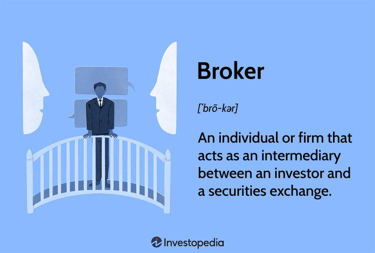

The financial markets are undergoing rapid evolution, driven by technological advancements and a growing pool of investment opportunities. The landscape is more complex and interconnected than ever, with various financial instruments and platforms transforming how trades are executed and managed. Central to this transformation are brokers, who act as vital links between investors and securities exchanges, facilitating the buying and selling of financial assets.

In recent years, algorithmic trading has emerged as a significant force in the financial markets. This method utilizes advanced mathematical models and computer algorithms to execute trades at speeds and volumes that are nearly impossible for human traders to achieve. By automatically submitting orders to the market, algorithmic trading enables greater precision and speed, leading to increased efficiency within the trading environment. This technological shift has made trading more accessible and competitive, but it has also introduced new challenges in terms of market surveillance and regulation.



As the mechanisms of trading evolve, so too must the frameworks that govern them to ensure that markets remain fair and orderly. Financial regulation plays a crucial role in maintaining market integrity, protecting investors, and preventing malpractices such as insider trading and market manipulation. Regulatory bodies are tasked with overseeing market activities to minimize systemic risks and promote transparent practices. The presence of robust financial regulation is essential to accommodate the dynamic changes occurring in global markets and to safeguard the interests of all market participants.

## Table of Contents

## Types of Brokers

A broker is a professional or firm that acts as an intermediary between investors and securities exchanges, facilitating transactions and providing access to financial markets. Brokers are essential to the functioning of financial markets, as they bridge the gap between buyers and sellers, ensuring [liquidity](/wiki/liquidity-risk-premium) and price discovery.

### Discount Brokers vs. Full-Service Brokers

There are various types of brokers, each offering different levels of service and catering to specific investor needs. Discount brokers provide basic trading services with minimal fees, primarily through online platforms. They offer limited or no personalized investment advice, making them suitable for self-directed investors who prioritize cost efficiency. These brokers often charge lower commissions due to their streamlined operations and reliance on technology.

In contrast, full-service brokers offer a comprehensive range of services, including personalized investment advice, financial planning, and portfolio management. They maintain a team of financial advisors who assist clients in making informed investment decisions. Although full-service brokers charge higher fees, they provide valuable insights and expertise, benefiting investors requiring more guidance.

### Real Estate Brokers

In addition to securities brokers, real estate brokers play a vital role in the property market. They assist clients in buying, selling, and renting properties, offering expertise in market trends, property values, and transaction processes. Real estate brokers often facilitate negotiations and ensure compliance with local regulations. They earn commissions based on the transaction value, incentivizing them to secure favorable deals for their clients.

In summary, brokers, whether functioning in financial or real estate markets, act as key intermediaries, enabling effective transactions between parties while offering distinct levels of service and expertise to meet diverse client needs.

## Broker Regulation

Broker regulation is pivotal in maintaining the integrity of financial markets and safeguarding investor interests. It ensures that brokers conduct their operations in accordance with established standards, mitigating the risk of malpractice and fostering trust within the financial ecosystem.

### The Role of FINRA and SEC

The Financial Industry Regulatory Authority (FINRA) and the Securities and Exchange Commission (SEC) are the primary regulatory bodies overseeing securities brokers in the United States. The SEC is a federal agency responsible for enforcing federal securities laws, proposing securities rules, and regulating the securities industry, including the stock and options exchanges. It requires brokers to register with the Commission and adhere to its regulatory standards, which are designed to promote transparency, fairness, and investor protection.

FINRA, a self-regulatory organization, operates under the oversight of the SEC. Its role is to regulate brokerage firms and exchange markets. It develops and enforces rules for its member firms and works to maintain market integrity through regular examinations and enforcement actions. FINRA's regulatory functions include qualification and licensing of individuals involved in securities trading, ensuring compliance with securities laws, and resolving disputes between investors and brokers.

### The 'Suitability Rule' and 'Know Your Client' (KYC) Procedures

The suitability rule is a fundamental requirement enforced by FINRA. It obligates brokers to make recommendations that are consistent with the best interests of their clients. According to this rule, brokers must conduct a thorough assessment of an investor's financial situation, investment experience, and goals before making any recommendations. This assessment helps ensure that the securities or investment strategies recommended are suitable for the investor's unique financial situation.

'Know Your Client' (KYC) procedures are also a critical component of broker regulation. These protocols require brokers to gather relevant personal information from their clients, including their identity, financial profile, and investment objectives. The KYC process is essential for several reasons: it helps brokers to better serve their clients by offering tailored investment advice and products, aids in the prevention of fraudulent activities and money laundering, and ensures compliance with anti-money laundering (AML) laws.

Together, the suitability rule and KYC procedures enhance the accountability of brokers and protect investors by ensuring that investment recommendations are made based on a comprehensive understanding of the client's needs and circumstances. These regulatory measures are vital in maintaining the confidence of investors in financial markets, which is necessary for the markets' orderly and efficient function.

 to Algorithmic Trading

Algorithmic trading, often referred to as algo trading, is a method of executing trades using pre-programmed instructions that account for variables like timing, price, and [volume](/wiki/volume-trading-strategy). This approach relies on algorithms, a set of precise rules and calculations, to automate the trading process. The necessity for speed and efficiency in financial markets has led to the increasing adoption of [algorithmic trading](/wiki/algorithmic-trading). Its utilization is especially prevalent in high-frequency trading ([HFT](/wiki/high-frequency-trading-strategies)), where algorithms execute numerous trades at lightning speeds, often within milliseconds.

The rise of algorithmic trading has been fueled by several technological advancements. High-speed internet, powerful computing systems, and sophisticated trading software have enabled traders to analyze vast amounts of market data quickly and execute trades faster than ever before. These technologies support complex models and algorithms that can interpret market conditions and execute trades without human intervention.

One of the primary advantages of algorithmic trading is its speed. Automated systems can respond to market movements rapidly, allowing traders to capitalize on opportunities that might be missed with manual trading. This speed advantage is crucial in volatile markets, where rapid execution can make a significant difference in profitability. Additionally, algorithmic trading ensures precision and consistency. By adhering to specific parameters and rules, algorithms eliminate human errors related to emotional decision-making or fatigue. This systematic approach can improve execution quality and reduce transaction costs.

Moreover, algorithmic trading allows for the implementation of more sophisticated trading strategies that would be impractical through manual trading. For instance, statistical [arbitrage](/wiki/arbitrage) involves monitoring and capitalizing on price discrepancies between related financial instruments. Such strategies require the processing of vast datasets and rapid execution, both of which are made possible by algorithmic systems.

In summary, algorithmic trading represents a fusion of technological innovation and financial markets. Its advantages in speed, precision, and the ability to execute complex strategies make it an essential tool in the modern trading landscape. As technology continues to advance, algorithmic trading is expected to become even more integral to financial markets.

## Regulation of Algorithmic Trading

Algorithmic trading, a key component of modern financial markets, involves using computer algorithms to automatically execute trades based on predetermined criteria. As this practice has grown in complexity and volume, its regulation has become increasingly critical to maintaining market integrity and stability.

The U.S. Securities and Exchange Commission (SEC) and the Financial Industry Regulatory Authority (FINRA) are the primary bodies responsible for overseeing algorithmic trading in the United States. These entities have developed specific regulations to address the unique challenges that algorithmic trading poses.

One of the primary requirements is the registration of broker-dealers involved in algorithmic trading with the SEC. This registration ensures that these entities comply with the necessary standards and have adequate risk management controls in place. The emphasis is on transparency, which includes the disclosure of trading algorithms and strategies to ensure they do not manipulate market pricing or create unfair trading environments.

Additionally, the SEC and FINRA have established guidelines to safeguard against potential market disruptions caused by algorithmic trading. Such disruptions can include ‘flash crashes,’ which are extremely rapid and deep market declines followed by equally quick recoveries. Flash crashes are often precipitated by algorithms that, due to improper coding or lack of robust risk management procedures, initiate large sell orders exacerbating market [volatility](/wiki/volatility-trading-strategies).

Algorithmic trading regulations highlight the importance of pre-trade risk checks and real-time monitoring. These measures help detect anomalies like abrupt changes in trading patterns that could indicate malfunctioning algorithms or attempts at market manipulation. Moreover, algorithmic trading systems must include robust safeguards such as kill switches, which can halt trading in emergency situations to protect the financial markets from systemic risks.

Continuous compliance with algorithmic trading regulations necessitates that broker-dealers implement updates to their risk management frameworks and technology infrastructure in response to evolving regulatory requirements. These include maintaining records of trading decisions made by algorithms and ensuring secure, controlled access to their trading systems to prevent unauthorized interventions.

In summary, while algorithmic trading offers significant efficiencies and opportunities in modern financial markets, it also requires rigorous oversight. Regulatory frameworks established by the SEC and FINRA seek to mitigate risks associated with algorithmic trading by enforcing transparency, accountability, and robust risk management practices.

## Risks and Challenges

The world of financial markets presents a myriad of risks and challenges, particularly for brokers and participants in algorithmic trading. Understanding these risks is crucial for maintaining market integrity and investor confidence. 

### Risks Associated with Different Broker Types

Brokers serve as vital intermediaries between investors and securities exchanges. However, the type of broker—be it discount or full-service—carries its own set of risks. Discount brokers, while cost-effective, often provide limited advisory services. This can lead to investors making uninformed decisions due to a lack of guidance. Conversely, full-service brokers, who offer comprehensive services, may pose the risk of conflicts of interest, where recommendations are influenced by commissions rather than client needs.

Market manipulation is a constant threat to broker operations. Tactics such as "spoofing," where false orders are placed to influence prices, or "pump and dump" schemes, where asset prices are artificially inflated before being sold, can undermine market fairness. As intermediaries, brokers face the challenge of detecting and preventing such manipulative behaviors, often relying on sophisticated monitoring tools and compliance frameworks.

Regulatory compliance is another significant challenge. Brokers must adhere to a spectrum of regulations, including those put forth by the Financial Industry Regulatory Authority (FINRA) and the Securities and Exchange Commission (SEC). Compliance involves maintaining accurate records, conducting due diligence, and ensuring all trades are suitable for their clients, according to the "suitability rule." Non-compliance can result in severe penalties, including fines and suspension of operations.

### Challenges in Algorithmic Trading

Algorithmic trading, which relies on automated systems to execute trades, brings its own set of complexities. Key challenges include ensuring the algorithms adhere to regulatory standards and do not inadvertently engage in market manipulation. The speed and volume at which algorithmic trades occur can lead to substantial risks, including "flash crashes," where rapid sell-offs due to algorithmic errors trigger sudden market downturns.

One major challenge is developing algorithms that can adapt to market conditions without engaging in risky behavior. Algorithms must be robust, incorporating extensive [backtesting](/wiki/backtesting) and incorporating risk management protocols to avoid trades that could destabilize markets. 

To mitigate these concerns, broker-dealers and algorithmic traders are required to register with relevant authorities and demonstrate robust risk management systems. They must employ real-time monitoring to adjust or halt trading activities in response to anomalous market activity. Regulators like the SEC and FINRA set out guidelines to ensure algorithmic strategies do not compromise market integrity. These entities focus on ensuring that firms have proper oversight, comply with trading limits, and manage the operational risks associated with technology.

### Mitigating Risks

Brokers and algo traders can take several actions to mitigate these risks. Establishing stringent compliance programs ensures adherence to regulatory requirements, minimizing legal risks. Investing in advanced surveillance technologies helps detect and counteract market manipulation tactics in real time. Regular training for staff on ethical trading practices and regulatory changes further strengthens a firm's ability to operate within legal frameworks.

For algorithmic traders, continuous improvement of their algorithms is essential. Incorporating [machine learning](/wiki/machine-learning) techniques can enhance the adaptability and accuracy of trading models. For instance, using Python, traders can implement backtesting strategies to simulate different market conditions:

```python
import pandas as pd
import numpy as np

# Sample backtesting algorithm using momentum strategy
def backtest(prices):
    returns = prices.pct_change()
    signal = np.sign(returns).shift(1)
    strategy_returns = signal * returns
    return strategy_returns.cumsum()

prices = pd.Series([100, 101, 102, 101, 103, 105])
backtest_result = backtest(prices)
print(backtest_result)
```

In this example, a simple [momentum](/wiki/momentum) strategy is backtested. Traders can refine these strategies to account for broader market signals and incorporate additional risk management controls. 

Ultimately, maintaining a balance between advanced trading strategies and robust regulatory compliance is crucial for brokers and algorithmic traders. Through a combination of technology, ethical practices, and regulatory adherence, market participants can help ensure a stable and fair financial environment.

## The Future of Financial Regulation

The landscape of financial regulation is continuously shaped by the advancements in technology and the evolving nature of financial markets. Brokers and algorithmic trading play an instrumental role in this ecosystem, and as such, future regulations must adapt to ensure both innovation and market integrity.

One of the most significant impacts of technological advancements on financial regulation is the proliferation of algorithmic trading. With its reliance on complex algorithms and high-speed data processing, algorithmic trading presents unique challenges for regulators. The Securities and Exchange Commission (SEC) and the Financial Industry Regulatory Authority (FINRA) are tasked with developing regulatory frameworks that can keep pace with these rapidly evolving technologies. This demands a careful balance between fostering innovation and preventing market abuses such as insider trading or market manipulation. Regulators may need to employ techniques such as machine learning and [artificial intelligence](/wiki/ai-artificial-intelligence) to monitor trading activities effectively and in real-time.

Automation and Artificial Intelligence (AI) could significantly influence future regulatory approaches. For example, automated systems equipped with AI could be deployed to detect suspicious or anomalous trading patterns, thereby proactively preventing potential market disruptions or 'flash crashes'. Moreover, as blockchain technology and cryptocurrencies gain prominence, regulators will need to design comprehensive policies that address the decentralized nature of these assets, while ensuring transparency and protecting investors.

Regulations must also evolve to address cybersecurity threats, as financial institutions become increasingly dependent on digital infrastructures. Protecting sensitive data against breaches and ensuring the resilience of trading systems are critical considerations for future regulatory frameworks. Collaboration between regulatory bodies and financial firms will be essential to developing robust cybersecurity policies.

Emerging technologies also offer opportunities for improving compliance and reporting processes. RegTech, or regulatory technology, can provide tools that simplify compliance, reduce costs, and increase efficiency. For instance, automated reporting systems can ensure that brokers and traders adhere to regulatory requirements, such as Know Your Client (KYC) procedures or Anti-Money Laundering (AML) protocols, by flagging any discrepancies or non-compliance in real time.

Furthermore, as financial markets become more globalized, harmonization of regulations across different jurisdictions becomes crucial. International coordination among regulatory entities can help address cross-border financial activities and prevent regulatory arbitrage, where firms exploit regulatory differences to evade oversight.

In conclusion, the future of financial regulation will hinge on the ability of regulators to adapt to technological advancements while safeguarding market integrity. Continuous dialogue between regulators, financial institutions, and technology providers is essential to ensure that regulations support innovation, protect investors, and maintain fair and orderly markets. These efforts will require a dynamic and collaborative approach to regulation that evolves in sync with the ongoing innovations in financial markets.

## Conclusion

In modern finance, brokers and algorithmic trading play pivotal roles in facilitating efficient and effective market operations. Brokers, acting as intermediaries between investors and securities exchanges, have evolved to offer both full-service and discount options, catering to a diverse range of investor needs. Algorithmic trading, driven by technological advancements, has introduced unprecedented levels of speed and precision to the financial markets, enabling traders to execute complex strategies with minimal human intervention.

The significance of financial regulation cannot be overstated in ensuring market stability and protecting investor interests. Regulatory bodies, such as the Securities and Exchange Commission (SEC) and the Financial Industry Regulatory Authority (FINRA), are fundamental in establishing the guidelines and rules that maintain the integrity of financial markets. These frameworks aim to prevent market manipulation, ensure transparency, and foster fair trading practices, which are crucial in preserving investor confidence and market efficiency.

For investors, selecting the right broker and trading strategy is critical. Evaluating a broker's services, costs, regulatory compliance, and technological capabilities is essential for aligning with one's investment goals. Similarly, understanding the nature and risks of algorithmic strategies can help investors make informed decisions that align with their risk tolerance and objectives.

In conclusion, as financial markets continue to evolve, the roles of brokers and algorithmic trading are likely to expand and transform. Ongoing regulatory developments will be essential in adapting to technological innovations, ensuring that markets remain fair and orderly, and safeguarding the interests of all market participants. Investors, by staying informed and discerning in their choices, can better navigate this complex landscape and achieve their financial aspirations.

## References & Further Reading

[1]: Bergstra, J., Bardenet, R., Bengio, Y., & Kégl, B. (2011). ["Algorithms for Hyper-Parameter Optimization."](https://papers.nips.cc/paper/4443-algorithms-for-hyper-parameter-optimization) Advances in Neural Information Processing Systems 24.

[2]: ["Advances in Financial Machine Learning"](https://www.amazon.com/Advances-Financial-Machine-Learning-Marcos/dp/1119482089) by Marcos Lopez de Prado

[3]: ["Evidence-Based Technical Analysis: Applying the Scientific Method and Statistical Inference to Trading Signals"](https://www.amazon.com/Evidence-Based-Technical-Analysis-Scientific-Statistical/dp/0470008741) by David Aronson

[4]: ["Machine Learning for Algorithmic Trading"](https://github.com/PacktPublishing/Machine-Learning-for-Algorithmic-Trading-Second-Edition) by Stefan Jansen

[5]: ["Quantitative Trading: How to Build Your Own Algorithmic Trading Business"](https://books.google.com/books/about/Quantitative_Trading.html?id=j70yEAAAQBAJ) by Ernest P. Chan