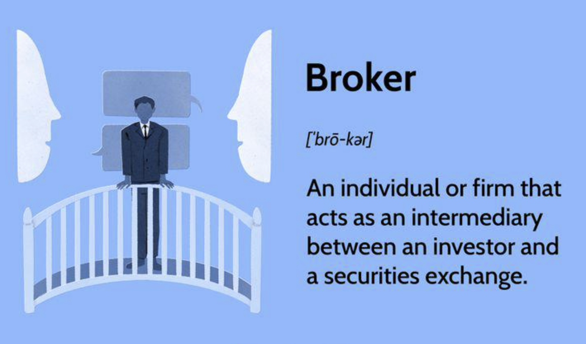

## Table of Contents

## What is a broker?

A broker is a person or a company that helps you buy or sell things like stocks, insurance, or real estate. They work as a middleman between you and the market, making sure everything goes smoothly. For example, if you want to buy a house, a real estate broker will help you find the right one and handle all the paperwork.

Brokers usually get paid through commissions, which means they earn a percentage of the total amount of the transaction. This gives them an incentive to help you make a good deal. However, it's important to choose a trustworthy broker because they have a lot of influence over your decisions and the outcome of your transactions.

## What are the different types of brokers?

There are many types of brokers, each specializing in different areas. Some common ones are stock brokers, who help you buy and sell stocks and other securities. Real estate brokers help you buy, sell, or rent properties. Insurance brokers find the best insurance policies for you. Forex brokers help you trade currencies. Commodity brokers deal with buying and selling commodities like oil, gold, or agricultural products.

Each type of broker has its own set of rules and qualifications. For example, stock brokers need to be licensed and often have to pass exams to show they know the market well. Real estate brokers also need a license, and they usually have to work for a few years as a real estate agent before they can become a broker. Insurance brokers need to understand different insurance products and be able to compare them to find the best fit for their clients.

Choosing the right broker depends on what you need help with. If you're interested in investing in the stock market, a stock broker would be the best choice. If you're looking to buy a new home, a real estate broker would be more helpful. It's important to do your research and pick a broker who is experienced and trustworthy in their field.

## How does a full-service broker differ from a discount broker?

A full-service broker and a discount broker are both there to help you buy and sell things like stocks, but they work in different ways. A full-service broker does a lot more for you. They give you advice, help you plan your investments, and even manage your money for you. They know a lot about the market and can help you make good choices. But because they do so much, they charge more money for their services.

A discount broker, on the other hand, doesn't do as much. They mainly just help you buy and sell stocks without giving you a lot of advice or managing your investments. They are like a simple tool that you use to make your trades. Because they don't do as much, they charge less money. If you know what you're doing and don't need a lot of help, a discount broker can save you money.

## What services do brokers typically offer to their clients?

Brokers offer a range of services to their clients, depending on the type of broker and the client's needs. Stock brokers, for example, help you buy and sell stocks and other securities. They can also provide research and advice on which investments might be good for you. Full-service brokers do even more, like planning your investments and managing your portfolio. They take care of a lot of the work for you, but they charge more for their services. Discount brokers, on the other hand, just help you make trades without giving much advice. They are cheaper because they don't do as much.

Real estate brokers help you buy, sell, or rent properties. They find properties that match what you're looking for, help you negotiate the price, and handle all the paperwork. Insurance brokers find the best insurance policies for you. They look at different insurance companies and help you choose the policy that fits your needs and budget. Forex and commodity brokers help you trade currencies and commodities like oil or gold. They make it easier for you to buy and sell these things in the market. No matter what type of broker you work with, they all aim to make your transactions smoother and more successful.

## How are brokers regulated, and which organizations oversee them?

Brokers are regulated by different organizations to make sure they follow the rules and act in a fair way. In the United States, the main organization that oversees stock brokers is the Securities and Exchange Commission (SEC). The SEC makes sure that brokers give honest information to their clients and don't do anything wrong. There's also the Financial Industry Regulatory Authority (FINRA), which is a private group that the government lets watch over brokers. FINRA checks that brokers follow the rules and can punish them if they don't.

For real estate brokers, each state has its own rules and a real estate commission that makes sure brokers follow them. These commissions give out licenses to brokers and can take them away if brokers do something wrong. Insurance brokers are watched by state insurance departments. These departments make sure insurance brokers are selling the right policies and treating their clients fairly. No matter what kind of broker you're dealing with, there are always organizations making sure they're doing their job the right way.

## What qualifications are required to become a broker?

To become a broker, you need to meet certain qualifications that depend on the type of broker you want to be. For stock brokers, you usually need a college degree, often in finance or a related field. You also need to pass exams like the Series 7 and Series 63, which test your knowledge about the stock market and the rules you need to follow. Some places might also want you to have work experience in the finance world before you can become a broker.

For real estate brokers, you need a high school diploma or equivalent, and then you need to take classes and pass a licensing exam to become a real estate agent first. After working as an agent for a few years, you can take more classes and another exam to become a broker. Insurance brokers need to know a lot about insurance and pass exams to get licensed. The rules can be different in each state, so it's important to check what your state requires.

## Can you explain the role of a broker in the stock market?

A broker in the stock market is someone who helps you buy and sell stocks. When you want to invest in a company, you can't just go to the company and buy a piece of it. You need to go through the stock market, and a broker makes this easy for you. They have access to the stock market and can place orders for you. If you want to buy a stock, you tell your broker, and they do the work to get it for you. If you want to sell, they help you find a buyer and complete the sale.

Brokers also give you advice and information about the stock market. They can tell you which stocks might be good to buy and which ones to avoid. Some brokers even manage your investments for you, making decisions about what to buy and sell based on what they think will make you the most money. This can be really helpful if you don't know a lot about the stock market. But remember, brokers charge fees for their services, so it's important to pick one who is honest and good at what they do.

## How do brokers earn their income?

Brokers make money by charging fees for the services they provide. These fees can be in the form of commissions, which means they get a percentage of the total amount of each transaction they help with. For example, if you buy a stock through a broker, they might charge you a small percentage of the price of the stock. This is how they get paid for helping you buy and sell things like stocks, real estate, or insurance.

Some brokers also earn money through other fees, like account maintenance fees or fees for giving advice. Full-service brokers, who do a lot more for you like giving advice and managing your investments, usually charge more than discount brokers. Discount brokers charge less because they don't do as much, but they still make money from the smaller fees they charge for each trade you make.

## What are some common fee structures used by brokers?

Brokers usually make money by charging fees. One common way they do this is through commissions. This means they get a small percentage of the money you spend on buying or selling something like stocks or real estate. For example, if you buy a stock worth $1000, the broker might take $10 as their commission if their rate is 1%. This fee structure is pretty standard and helps brokers earn money for the work they do.

Another way brokers earn money is through flat fees. This means they charge you a set amount of money for each trade you make, no matter how much money is involved. For example, a broker might charge $5 every time you buy or sell a stock, whether it's $100 or $1000. Some brokers also charge other fees like account maintenance fees, which you pay just for having an account with them, or fees for giving you advice and managing your investments. These fees can add up, so it's important to understand all the costs before choosing a broker.

## How has technology impacted the brokerage industry?

Technology has changed the brokerage industry a lot. Now, you can use apps and websites to buy and sell stocks, real estate, or insurance without talking to a person. This is called online trading. It's easier and faster because you can do it from your phone or computer anytime you want. Brokers used to do everything for you, but now, technology lets you do a lot of it yourself. This has made things cheaper because you don't have to pay as much for a broker's help.

But technology has also made things more complicated. There are so many tools and information online that it can be hard to know what to do. Brokers still help a lot because they can explain things and give you advice. They use technology too, like special software to help them make better decisions for you. So, even though you can do more on your own, having a good broker can still be really helpful.

## What are some well-known examples of brokerage firms?

Some well-known brokerage firms are Charles Schwab, Fidelity, and E*TRADE. These companies help people buy and sell stocks, bonds, and other investments. Charles Schwab is famous for its low fees and good customer service. Fidelity is known for its wide range of investment options and tools that help people make smart choices. E*TRADE made online trading popular by letting people buy and sell stocks on the internet.

Another big name in the brokerage world is Vanguard. Vanguard is known for its low-cost index funds, which are a way to invest in a bunch of stocks at once. They help people who want to save money on fees and still grow their investments over time. These firms all use technology to make investing easier, but they also offer advice and support to help people make the best choices for their money.

## What should an investor consider when choosing a broker?

When choosing a broker, an investor should think about the fees they will have to pay. Some brokers charge a lot of money for their services, while others are cheaper. It's important to know how much you will pay for each trade and if there are any other fees, like account maintenance fees. You also need to think about the kind of help you want. If you need a lot of advice and someone to manage your investments, a full-service broker might be best. But if you just want to make trades on your own, a discount broker could save you money.

Another thing to consider is the technology and tools the broker offers. Many brokers have apps and websites that make it easy to buy and sell stocks. Some brokers also give you access to research and tools that can help you make better investment choices. It's a good idea to pick a broker with good technology that fits your needs. Finally, make sure the broker is trustworthy and has a good reputation. You can check reviews and see if they are regulated by organizations like the SEC or FINRA to make sure they are doing things the right way.

## References & Further Reading

[1]: Bergstra, J., Bardenet, R., Bengio, Y., & Kégl, B. (2011). ["Algorithms for Hyper-Parameter Optimization."](https://papers.nips.cc/paper/4443-algorithms-for-hyper-parameter-optimization) Advances in Neural Information Processing Systems 24.

[2]: ["Advances in Financial Machine Learning"](https://www.amazon.com/Advances-Financial-Machine-Learning-Marcos/dp/1119482089) by Marcos Lopez de Prado

[3]: ["Evidence-Based Technical Analysis: Applying the Scientific Method and Statistical Inference to Trading Signals"](https://www.amazon.com/Evidence-Based-Technical-Analysis-Scientific-Statistical/dp/0470008741) by David Aronson

[4]: ["Machine Learning for Algorithmic Trading"](https://github.com/PacktPublishing/Machine-Learning-for-Algorithmic-Trading-Second-Edition) by Stefan Jansen

[5]: ["Quantitative Trading: How to Build Your Own Algorithmic Trading Business"](https://books.google.com/books/about/Quantitative_Trading.html?id=j70yEAAAQBAJ) by Ernest P. Chan